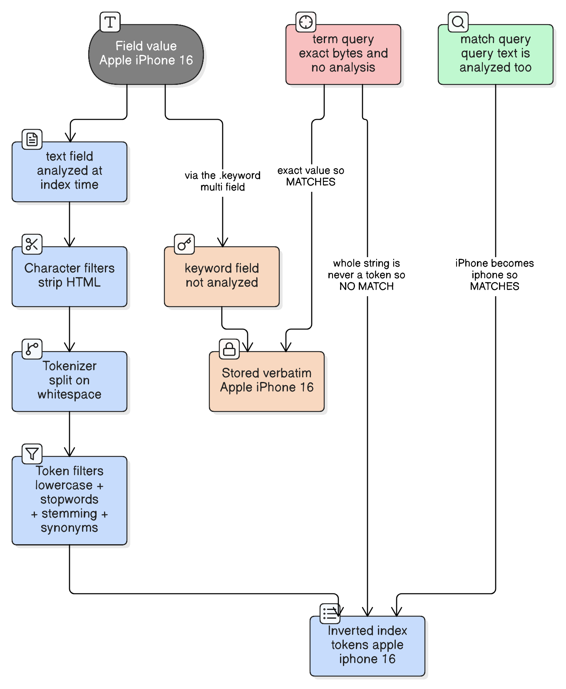
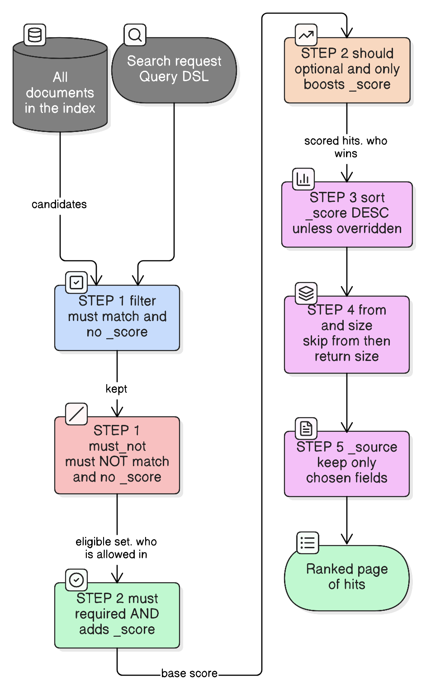
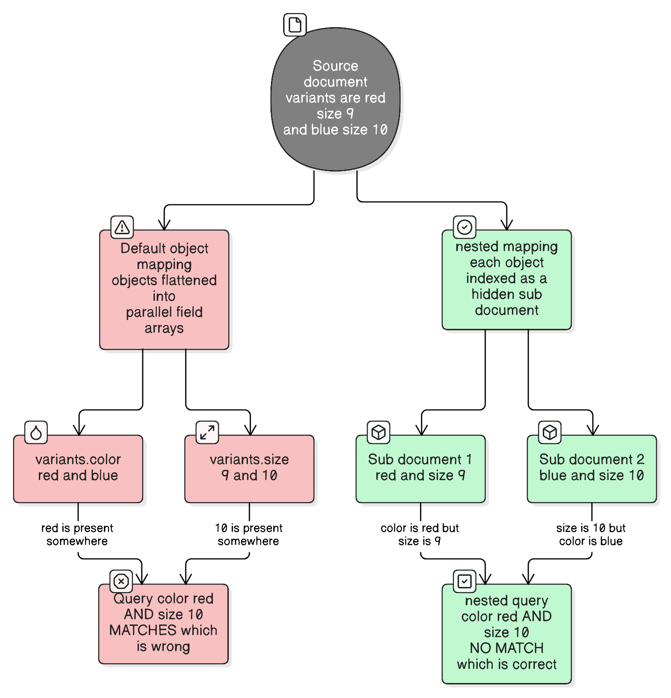

# Elasticsearch From Scratch: Fundamentals, Query DSL, Relevance and Aggregations

> "The best search engine is the one that reads your mind."
> — paraphrased search-engineering folklore
>
> *It can't. So relevance is a thing you deliberately engineer — with mappings, analyzers, bool clauses and boosts.*

These are my working notes, in the order I actually learned things: fundamentals → mappings → queries → relevance → aggregations → CRUD → debugging. Every section follows the same shape:

```
What is it?  →  Why do we need it?  →  Syntax  →  Example
             →  SQL analogy  →  Common mistake  →  Mental model
```

---

## Table of contents

**Part 1 — Foundations**
1. [Fundamentals: index, document, _id, _source, mapping, field](#1-fundamentals-index-document-_id-_source-mapping-field)
2. [Mappings and field types (text vs keyword)](#2-mappings-and-field-types)

**Part 2 — Querying**
3. [Basic queries: match, term, terms, range](#3-basic-queries)
4. [Bool queries: must, should, filter, must_not](#4-bool-queries)
5. [must vs filter](#5-must-vs-filter)
6. [should](#6-should)

**Part 3 — Relevance**
7. [Search relevance and _score](#7-search-relevance-and-_score)
8. [BM25, conceptually](#8-bm25-conceptually)
9. [multi_match](#9-multi_match)
10. [Fuzziness](#10-fuzziness)
11. [operator and minimum_should_match](#11-operator-and-minimum_should_match)
12. [match_phrase](#12-match_phrase)
13. [Boosting](#13-boosting)
14. [Analyzers](#14-analyzers)
15. [Nested fields](#15-nested-fields)

**Part 4 — Shaping results**
16. [Sorting](#16-sorting)
17. [Pagination](#17-pagination)
18. [_source filtering](#18-_source-filtering)
19. [Aggregations](#19-aggregations)

**Part 5 — Writing data**
20. [CRUD APIs](#20-crud-apis)
21. [Update vs replace](#21-update-vs-replace)
22. [Bulk API](#22-bulk-api)
23. [Update by query](#23-update-by-query)

**Part 6 — Applying it**
24. [Production query debugging checklist](#24-production-query-debugging-checklist)
25. [Complete real-world example](#25-complete-real-world-example)
26. [SQL → Elasticsearch cheat sheet](#26-sql--elasticsearch-cheat-sheet)
27. [Calling Elasticsearch from Kotlin](#27-calling-elasticsearch-from-kotlin)
28. [How to decide which option applies](#28-how-to-decide-which-option-applies)
29. [Interview quick revision](#29-interview-quick-revision)
30. [One-page Elasticsearch cheat sheet](#one-page-elasticsearch-cheat-sheet)

---

# Part 1 — Foundations

## 1. Fundamentals: index, document, _id, _source, mapping, field

### What is it?

Elasticsearch is a **document store with a search engine bolted onto every field**. You put JSON documents in; you ask questions about them and get back *ranked* answers.

| Term | What it is |
| --- | --- |
| **Index** | A named collection of documents that share a mapping. `products`, `orders`, `logs-2026-08`. |
| **Document** | One JSON object — one product, one order, one log line. The unit of indexing and retrieval. |
| **`_id`** | The document's unique identifier *within the index*. Either you supply it or Elasticsearch generates one. |
| **`_source`** | The original JSON you sent, stored verbatim and returned with every hit. Everything you see in `hits` comes from here. |
| **Mapping** | The index's schema: which fields exist and what type each one is. Decides *how a field is indexed*, which decides *how it can be searched*. |
| **Field** | One key inside the document — `title`, `price`, `brand`. |

### Why do we need it?

A relational database is optimised for "give me the rows where `status = 'ACTIVE'`". Elasticsearch is optimised for "give me the documents that best match *bluetooth headphones*, ordered by how well they match". To do that it doesn't store rows — it builds an **inverted index**: a dictionary from *term* → *list of documents containing that term*, which is why "find every doc containing `iphone`" is a dictionary lookup rather than a table scan.

### Example

```json
PUT /products/_doc/P100
{
  "productId": "P100",
  "title": "Apple iPhone 16",
  "brand": "Apple",
  "status": "ACTIVE",
  "price": 79999,
  "createdAt": "2026-08-01"
}
```

A search hit comes back looking like this:

```json
{
  "_index": "products",
  "_id": "P100",
  "_score": 4.213,
  "_source": {
    "productId": "P100",
    "title": "Apple iPhone 16",
    "...": "..."
  }
}
```

Three things worth noticing: `_id` is metadata (it lives *outside* `_source`), `_score` is computed per query (not stored), and `_source` is exactly the JSON you sent.

### SQL analogy

| SQL | Elasticsearch |
| --- | --- |
| Database / Table | Index |
| Row | Document |
| Column | Field |
| Schema | Mapping |
| Primary key | `_id` |
| `SELECT` | Search query |
| `WHERE` | Query / Filter |
| `GROUP BY` | Terms aggregation |
| `AVG` / `SUM` / `MIN` / `MAX` | Metric aggregations |
| `ORDER BY` | `sort` |
| `LIMIT` / `OFFSET` | `size` / `from` |
| `UPDATE` | Update API |
| `DELETE` | Delete API |

The analogy is a scaffold, not a truth. Two places it leaks, and both matter in practice:

- **SQL returns a set; Elasticsearch returns a ranked list.** `WHERE` is a yes/no test. An Elasticsearch query is a yes/no test *plus a relevance score*, and by default the score decides the order.
- **There are no joins.** SQL normalises and joins at read time; Elasticsearch expects you to denormalise and store the joined shape (see [nested fields](#15-nested-fields) for the one case that needs special handling).

### Mental model

> **An index is a table whose columns you had to declare *how to search*, not just what type they are.** In SQL, `VARCHAR` is `VARCHAR`. In Elasticsearch, choosing `text` versus `keyword` for the same string decides whether "Apple iPhone" is one value or three searchable words.

---

## 2. Mappings and field types

### What is it?

The mapping declares each field's type. The type controls how the value is **indexed** — and therefore which queries can find it.

| Type | Holds | Typically used for |
| --- | --- | --- |
| `text` | A string, **analyzed** into tokens | Full-text search: `title`, `description` |
| `keyword` | A string, **stored whole** | Exact values: `status`, `brand`, IDs, enum-like fields |
| `integer` | Whole number | Counts, quantities |
| `float` (or `scaled_float`) | Decimal number | Prices, ratings |
| `date` | ISO-8601 string or epoch millis | `createdAt`, `updatedAt` |
| `boolean` | `true` / `false` | Flags |

```json
PUT /products
{
  "mappings": {
    "properties": {
      "productId":   { "type": "keyword" },
      "title":       { "type": "text"    },
      "description": { "type": "text"    },
      "status":      { "type": "keyword" },
      "price":       { "type": "float"   },
      "createdAt":   { "type": "date"    },
      "inStock":     { "type": "boolean" }
    }
  }
}
```

**Note on money:** `float` is the type used throughout these notes because it's what the examples use, but for real currency prefer `scaled_float` with `scaling_factor: 100` (or store paise/cents in an `integer`) — binary floats can't represent `0.1` exactly, so sums and range boundaries drift.

### Why do we need it?

Because mapping is where **most "why doesn't my query work?" bugs are born**, and because a mapping is largely **immutable**: you can add a new field to an existing index, but you cannot change an existing field's type. Getting `brand` wrong means reindexing into a new index. Mapping is a decision you make once and live with.

If you don't declare a mapping, **dynamic mapping** guesses one from the first document it sees — and for strings its guess is the dual-purpose shape in the next section.

---

### 2.1 `text` vs `keyword` — the single most important distinction



#### Why `text` is analyzed

A `text` field is passed through an **analyzer** at index time: lowercased, split into tokens, and (depending on configuration) stemmed. The value `"Apple iPhone 16"` is *not* stored as a searchable unit. What lands in the inverted index is:

```
apple    →  [P100, P240, ...]
iphone   →  [P100, P311, ...]
16       →  [P100, ...]
```

That is exactly what makes full-text search work: a user typing `iphone` (lowercase, one word out of three) still finds the document.

#### Why `keyword` is not analyzed

A `keyword` field is indexed as **one single term, byte-for-byte**:

```
Apple iPhone 16  →  [P100]
```

No lowercasing, no splitting. That makes it useless for full-text search and perfect for everything where the *whole value* is the meaningful unit: filtering on `status`, grouping by `brand`, sorting alphabetically, and exact-value lookups.

#### When to use `match`, when to use `term`

| | `match` | `term` |
| --- | --- | --- |
| Analyzes the **query string**? | Yes | No |
| Intended for | `text` fields | `keyword` (and numbers/dates/booleans) |
| Question it asks | "does this field *talk about* this?" | "is this field *exactly* this?" |
| SQL analogy | `LIKE`-ish / full-text match | `=` |

The rule that follows from those two rows: **the query and the field must agree about analysis.** `match` analyzes your query text the same way the field was analyzed at index time, so both sides end up as comparable tokens. `term` skips analysis on the query side — so it only lines up with a field that also skipped analysis.

#### Common mistake: `term` on a `text` field

```json
{ "query": { "term": { "title": "Apple iPhone 16" } } }     ← returns nothing
```

The field contains the tokens `apple`, `iphone`, `16`. The term query looks for the literal single term `Apple iPhone 16`, which was never indexed. **No error, no warning, just zero hits** — which is what makes this bug so common.

The subtler variant bites even on a single word:

```json
{ "query": { "term": { "status_text_field": "ACTIVE" } } }  ← returns nothing
```

The analyzer lowercased the indexed value to `active`; `term` compares against `ACTIVE` verbatim. Case alone is enough to miss.

> **Rule of thumb:** if `term` on a string returns 0 hits, the field is almost certainly `text`. Either switch to `match`, or point at `field.keyword`.

#### Why `.keyword` multi-fields exist

Most real fields need *both* behaviours. `brand` should be searchable as text ("apple" finds it) **and** exactly filterable/groupable ("group all products by brand"). A **multi-field** indexes one source value two ways:

```json
{
  "brand": {
    "type": "text",
    "fields": {
      "keyword": {
        "type": "keyword",
        "ignore_above": 256
      }
    }
  }
}
```

One value in `_source`, two entries in the index. This is also exactly what dynamic mapping creates for any string field you didn't declare — which is why `brand.keyword` usually "just exists" even in an index you never mapped by hand.

`ignore_above: 256` means: if the string is longer than 256 characters, skip indexing the keyword version (it's still in `_source`). It stops a 10 KB description from bloating the keyword index — and it's a trap worth knowing, because such a document silently won't appear under `brand.keyword` filters or aggregations.

#### `brand` versus `brand.keyword`

| Use | Field | Query |
| --- | --- | --- |
| Full-text search ("apple" should match "Apple Inc.") | `brand` | `match` |
| Exact filter (`brand = "Apple"`) | `brand.keyword` | `term` |
| Aggregation / `GROUP BY` | `brand.keyword` | `terms` agg |
| Sorting alphabetically | `brand.keyword` | `sort` |

### Mental model

> **`text` is for *finding*; `keyword` is for *identifying*.**
> A `text` field is a bag of words you can search through — like the body of a book. A `keyword` field is a label printed on the spine (**the exact stored value**): you can shelve by it, count by it, and look it up exactly, but you can't search *inside* it.

---

# Part 2 — Querying

## 3. Basic queries

Every search goes to `GET /<index>/_search` with a `query` object:

```json
GET /products/_search
{
  "query": { ... }
}
```

### 3.1 `match`

**What:** full-text search on a `text` field. The query string is analyzed, then Elasticsearch looks for documents containing the resulting tokens.

```json
{ "query": { "match": { "title": "iphone" } } }
```

Multi-word queries are **OR by default** — `"wireless mouse"` becomes `wireless OR mouse`, and documents matching both simply score higher. (Section 11 covers how to tighten that.)

- **SQL analogy:** `WHERE title LIKE '%iphone%'`, except word-aware and ranked rather than a substring scan.
- **Common mistake:** using `match` on a `keyword` field when you wanted exact filtering. It often still works (the analyzed query text may equal the keyword value) but it's misleading and breaks the moment the value has mixed case or spaces.

### 3.2 `term`

**What:** exact-value lookup, no analysis on the query side.

```json
{ "query": { "term": { "status": "ACTIVE" } } }
```

- **SQL analogy:** `WHERE status = 'ACTIVE'`
- **Common mistake:** running it on a `text` field (see 2.1). Use `status` if it's mapped `keyword`, else `status.keyword`.

### 3.3 `terms`

**What:** exact-value lookup against a *list* — matches if the field equals **any** of them.

```json
{ "query": { "terms": { "brand.keyword": ["Apple", "Samsung"] } } }
```

- **SQL analogy:** `WHERE brand IN ('Apple', 'Samsung')`
- **Mental model:** `terms` is a built-in OR of `term` queries. Reaching for a `bool.should` of several `term` clauses to express "one of these values" is just a longer way to write it — and it drags scoring in, which `terms` inside a `filter` avoids.

### 3.4 `range`

**What:** numeric, date or string range.

| Operator | Meaning | SQL |
| --- | --- | --- |
| `gte` | greater than or equal | `>=` |
| `gt` | greater than | `>` |
| `lte` | less than or equal | `<=` |
| `lt` | less than | `<` |

```json
{
  "query": {
    "range": {
      "price": {
        "gte": 1000,
        "lte": 2000
      }
    }
  }
}
```

Dates support **date math**, which is worth knowing because it removes a whole class of client-side timestamp arithmetic:

```json
{ "query": { "range": { "createdAt": { "gte": "now-7d/d", "lte": "now" } } } }
```

(`now-7d/d` = seven days ago, rounded down to the start of that day.)

- **SQL analogy:** `WHERE price BETWEEN 1000 AND 2000`
- **Mental model:** `range` is nearly always a **filter**, not a scoring clause — "is this product in my budget?" is a yes/no eligibility question, not a measure of relevance.

---

## 4. Bool queries

### What is it?

`bool` is how you combine clauses. It has exactly four slots:

```
bool
├── must       → required     + contributes to _score
├── should     → optional     + contributes to _score
├── filter     → required     + NO score contribution
└── must_not   → excluded     + NO score contribution
```

Each slot takes a single query object or an array of them.

### Why do we need it?

Real queries are never one condition. "Products matching *iphone*, that are ACTIVE, priced 1000–2000, not discontinued, preferably Apple" is five conditions with three different *roles*: some decide eligibility, some decide ranking, one excludes. `bool` is where you assign each condition its role — and that assignment, not the condition itself, is what most tuning work consists of.

### The four clauses

| Clause | Must the doc match? | Affects `_score`? | Typical use | Logical operator |
| --- | --- | --- | --- | --- |
| `must` | Yes | **Yes** | The user's actual search intent | AND |
| `should` | No (see note) | **Yes** | Preferences, boosts, "nice to have" | OR |
| `filter` | Yes | No | Business constraints, permissions, ranges | AND |
| `must_not` | Must **not** match | No | Exclusions | NOT |

**The `should` note (a classic gotcha):** if a `bool` has **no** `must` and **no** `filter`, then at least one `should` clause must match — `minimum_should_match` implicitly becomes 1, and `should` behaves like a required OR. If there *is* a `must` or `filter`, `should` becomes purely optional (`minimum_should_match` defaults to 0) and only boosts. Same syntax, two different behaviours depending on its neighbours.

#### `must` — required and scored

```json
{ "query": { "bool": { "must": [ { "match": { "title": "iphone" } } ] } } }
```
Documents without `iphone` in the title are gone; those that have it are scored by *how well* they match.

#### `should` — optional and scored

```json
{
  "query": { "bool": {
      "must":   [ { "match": { "title": "iphone" } } ],
      "should": [ { "term": { "brand.keyword": "Apple" } } ]
  } }
}
```
Non-Apple iPhone accessories still come back; Apple ones rank higher.

#### `filter` — required, not scored

```json
{
  "query": { "bool": { "filter": [
      { "term":  { "status": "ACTIVE" } },
      { "range": { "price": { "gte": 1000, "lte": 2000 } } }
  ] } }
}
```
Both conditions are mandatory. Neither changes the ordering. Filters also run in **filter context**, which means Elasticsearch can cache the result set and skip scoring work entirely — they're the cheap clauses.

#### `must_not` — excluded

```json
{ "query": { "bool": { "must_not": [ { "term": { "discontinued": true } } ] } } }
```

### Nested bool queries

A `bool` clause can contain another `bool`. That's how you express bracketed logic — `A AND (B OR C)`:

```json
{
  "query": {
    "bool": {
      "must": [
        { "term": { "status": "ACTIVE" } },
        {
          "bool": {
            "should": [
              { "term": { "brand.keyword": "Apple"   } },
              { "term": { "brand.keyword": "Samsung" } }
            ],
            "minimum_should_match": 1
          }
        }
      ]
    }
  }
}
```

Reading it as a tree makes the logic obvious:

```
bool
├── must
│   ├── term status = ACTIVE                  ← required
│   └── bool                                  ← required, so the inner OR is required
│       └── should
│           ├── term brand.keyword = Apple
│           └── term brand.keyword = Samsung
```

**In SQL:** `WHERE status = 'ACTIVE' AND (brand = 'Apple' OR brand = 'Samsung')`

Two things to notice:

1. **The inner `bool` is inside `must`, so the whole OR is mandatory.** The inner `should` is optional *relative to its own bool*, but that bool as a unit is required. Nesting is how "optional" becomes "required as a group".
2. **I wrote `minimum_should_match: 1` explicitly.** The inner bool has no `must`/`filter` of its own, so it defaults to 1 anyway — but writing it down means the query keeps working if someone later adds a `must` to that inner bool. It's the cheapest bug-prevention in the DSL.

Also: because this brand condition is pure eligibility, in production it should be `filter` + `terms`, not `must` + `should`:

```json
{
  "query": { "bool": {
      "filter": [
        { "term":  { "status": "ACTIVE" } },
        { "terms": { "brand.keyword": ["Apple", "Samsung"] } }
      ]
  } }
}
```
Same result set, no wasted scoring, and cacheable.

### Translating logic into clauses

| Logic | Clause |
| --- | --- |
| `A AND B` | both in `must` (scored) or both in `filter` (not scored) |
| `A OR B` | both in `should`, with `minimum_should_match: 1` |
| `NOT A` | `must_not` |
| `A AND (B OR C)` | `A` in `must`/`filter`, plus a nested `bool.should` in the same `must`/`filter` |
| `A OR (B AND C)` | outer `bool.should` with `minimum_should_match: 1`, one branch being a nested `bool.must` |

### Mental model

> **`bool` is a hiring panel.** `filter` is HR checking you meet the mandatory criteria (**eligibility, unscored**), `must_not` is the blocklist (**exclusion**), `must` is the core interview you have to pass and are graded on (**required + scored**), and `should` is the bonus certification that doesn't disqualify you but moves you up the shortlist (**optional + scored**).

---

## 5. must vs filter

### What is the difference?

```
must    → the document must match, AND its match quality changes _score
filter  → the document must match, and _score is untouched
```

Both are mandatory. That's the trap — swapping them **never changes which documents come back**, only their order and the query's cost. So a `must`-instead-of-`filter` bug produces no error and the right result set, just subtly wrong ranking.

### Why it matters

**1. Ranking correctness.** Scoring a `status = ACTIVE` clause is not just wasteful, it's actively harmful. BM25 scores a term partly on **how rare it is** (see [section 8](#8-bm25-conceptually)). If 90% of your catalogue is ACTIVE, that term is common and contributes a tiny score; if only 3 products are ACTIVE, matching it contributes a lot. Either way the number is noise added to every document's relevance — a signal about your catalogue's composition, not about how well the product matches what the user typed.

**2. Performance.** Filter context lets Elasticsearch skip score computation and cache the matching document set for reuse across queries. `status = ACTIVE` is the same set for every user on every request — computing it once and reusing it is free money.

### Example — the same query written both ways

❌ **Everything in `must`:**
```json
{
  "query": { "bool": { "must": [
      { "match": { "title": "iphone" } },
      { "term":  { "status": "ACTIVE" } },
      { "range": { "price": { "gte": 1000 } } }
  ] } }
}
```
Every document's score is `title relevance + status noise + price-range noise`.

✅ **Intent in `must`, constraints in `filter`:**
```json
{
  "query": { "bool": {
      "must":   [ { "match": { "title": "iphone" } } ],
      "filter": [
        { "term":  { "status": "ACTIVE" } },
        { "range": { "price": { "gte": 1000 } } }
      ]
  } }
}
```
Score reflects only *how well the title matches "iphone"*. The constraints decide who's in the running.

### Which clause does a condition belong in?

Ask: **"if two documents both satisfy this condition, should the one that satisfies it *harder* rank higher?"**

- `status = ACTIVE` — you can't be more ACTIVE than ACTIVE. → **`filter`**
- `price >= 1000` — a ₹5000 product isn't *more in range* than a ₹1200 one. → **`filter`**
- `title matches "bluetooth headphones"` — a title that matches both words beats one matching only "bluetooth". → **`must`**

Anything binary is a filter. Anything with degrees is a scoring clause.

### Common mistake

Putting user-facing facet selections (brand checkbox, price slider, category, in-stock toggle) into `must`. They're all binary constraints, they're all shared across users, and they all belong in `filter`. Symptom: ranking shifts for no visible reason when a user ticks a filter box.

### Mental model

> **`filter` decides who is allowed into the competition. `_score` decides who wins it.**
> Being eligible doesn't make you a better contestant, so eligibility checks must not add points.

---

## 6. should

### What is it?

`should` = "match this if you can; you're not disqualified if you don't, but you get credit if you do."

### The two behaviours

| Context | Behaviour | Effective `minimum_should_match` |
| --- | --- | --- |
| `bool` **has** a `must` or `filter` | Purely optional; only boosts score | 0 |
| `bool` has **no** `must` and no `filter` | At least one `should` must match | 1 |

This is the same rule from section 4, and it's worth internalising: **`should` alone is an OR; `should` alongside `must`/`filter` is a boost.** One keyword, two jobs, decided by context.

### Example — preference, not requirement

```json
{
  "query": {
    "bool": {
      "must": [
        { "match": { "title": "iphone" } }
      ],
      "should": [
        { "term": { "brand.keyword": "Apple" } }
      ]
    }
  }
}
```

Suppose the index holds:

| Doc | title | brand |
| --- | --- | --- |
| A | iPhone 16 | Apple |
| B | iPhone 16 screen protector | Spigen |
| C | Galaxy S25 | Samsung |

- **C is gone** — `must` isn't satisfied, no `iphone` in the title.
- **A and B both return** — both satisfy `must`.
- **A ranks above B** — it also matched the `should`, adding to its score. (A would likely win on title relevance anyway; the `should` widens the gap and makes the preference explicit rather than accidental.)

That's the whole point: a Samsung phone case matching "iphone case" is still a legitimate result — it just shouldn't outrank the Apple one. `must_not` would have deleted it; `filter` would have deleted it; `should` demotes it.

### Explicit `minimum_should_match` with several `should` clauses

```json
{
  "query": {
    "bool": {
      "must":   [ { "match": { "title": "laptop" } } ],
      "should": [
        { "term":  { "brand.keyword": "Apple" } },
        { "term":  { "inStock": true } },
        { "range": { "rating": { "gte": 4 } } }
      ],
      "minimum_should_match": 1
    }
  }
}
```

Adding `minimum_should_match: 1` here flips these from "boosts" to "at least one of these three must hold" — the laptop must be Apple, or in stock, or well-rated. Without that line, a laptop matching none of the three still comes back, just last. Both are valid designs; the line makes which one you meant unambiguous.

### Common mistake

Writing a `bool` with only `should` clauses, expecting all of them to be required:

```json
{
  "query": { "bool": { "should": [
      { "term": { "brand.keyword": "Apple" } },
      { "term": { "status": "ACTIVE" } }
  ] } }
}
```
This is `brand = Apple **OR** status = ACTIVE` — it returns every ACTIVE product of every brand. If you meant AND, use `filter` (or `must`).

### Mental model

> **`should` is a recommendation letter, not an entry requirement.** It never keeps you out of the room (**doesn't filter**), it just moves you up the list (**adds to `_score`**) — unless it's the *only* thing in the room, in which case at least one letter is required (**implicit `minimum_should_match: 1`**).

---

# Part 3 — Relevance

## 7. Search relevance and `_score`



### What is `_score`?

A positive float returned with every hit, representing **how well this document matched this specific query**. It is computed at query time, not stored, and it is only comparable *within one result set* — a `_score` of 8.4 in one query says nothing about a `_score` of 8.4 in another.

### Default sorting behaviour

With no `sort` specified, results come back **`_score` descending** — best match first.

### What affects `_score`

- Clauses in `must` and `should` (and any top-level `match`/`multi_match`).
- The BM25 factors: term frequency, inverse document frequency, field length ([section 8](#8-bm25-conceptually)).
- Any `boost` you apply ([section 13](#13-boosting)).
- How many `should` clauses matched — more matched optional clauses, higher score.

### What does *not* affect `_score`

- `filter` clauses
- `must_not` clauses
- Anything in `sort`, `from`/`size`, or `_source`

### `_score` vs explicit `sort`

```
No explicit sort   →  ORDER BY _score DESC
Explicit sort      →  ORDER BY <your fields>   (relevance no longer decides order)
```

This is the single most surprising behaviour for people coming from SQL, so it's worth stating bluntly: **the moment you add `"sort": [{"price": "asc"}]`, all your relevance tuning stops affecting the order.** Boosts, `should` clauses, field weights — still computed (or skipped), but irrelevant to what the user sees. As an optimisation Elasticsearch may not even compute `_score` at all when you sort by a field, returning `"_score": null`.

**Worked example.** Query: `iphone`. Two documents:

| Doc | Title | Price | `_score` |
| --- | --- | --- | --- |
| A | iPhone 16 | ₹79,999 | 8.2 |
| B | Screen guard compatible with iPhone 16 and iPhone 15 | ₹299 | 3.1 |

- **Default (no `sort`):** A, then B. The phone the user probably meant comes first.
- **`sort: price asc`:** B, then A. A ₹299 screen guard is now the top result for the query "iphone", because relevance no longer participates.

Neither is wrong — they answer different questions ("what did you mean?" vs "what's cheapest?"). The bug is applying the second when you wanted the first.

### Keeping relevance while sorting

Put `_score` first in a multi-field sort, using the other field only as a tie-breaker:

```json
"sort": [
  { "_score":    { "order": "desc" } },
  { "createdAt": { "order": "desc" } }
]
```
"Best match first; among equally good matches, newest first."

The caveat: `_score` is a float and exact ties are rare, so a `_score` tie-break often does nothing. For a genuine "relevance-ish but freshness matters" ranking you want the recency folded *into* the score (a `function_score` decay) rather than tacked on as a second sort key — but that's beyond what these notes cover.

### Common mistake

Adding a default `sort: createdAt desc` to a *search* endpoint "so results are stable", then wondering why search quality collapsed. Sorted-by-date search is a list, not a search.

### Mental model

> **`_score` is the judge's score; `sort` is the organiser overruling the judge.** Once the organiser dictates the running order (**explicit `sort`**), it doesn't matter what the judge thought (**`_score`**).

---

## 8. BM25, conceptually

### What is it?

**BM25** is the default scoring formula. You don't need the maths; you need the four intuitions it encodes. Every one of them is a rule about *what makes a match convincing*.

### 1. Term Frequency (TF) — more occurrences, better match

A document mentioning `apple` five times is probably more about Apple than one mentioning it once.

### 2. Inverse Document Frequency (IDF) — rare terms are worth more

If `apple` appears in 40% of your catalogue, matching it says almost nothing. If `titanium` appears in 0.1%, matching it is a strong signal about what the user wants. BM25 weights each term by how rare it is across the index.

This is why stop words (`the`, `a`, `of`) barely influence scoring even when not removed — they appear everywhere, so their IDF is near zero.

### 3. Field length — shorter fields matter more

One occurrence of `iphone` in a 3-word title is a much stronger signal than one occurrence in a 500-word description. BM25 normalises by field length, so matches in short fields count more.

### 4. Diminishing returns — repetition saturates

This is the part that separates BM25 from naive TF counting. Going from 1 → 2 occurrences is a big jump; 10 → 11 is almost nothing. The curve flattens.

### The worked example

```
Doc A:  Apple iPhone 16
Doc B:  Apple Apple Apple iPhone 16
```

Query: `Apple`

**Does B score higher than A?** Yes — B has a higher term frequency for `apple`.

**Is B's score 3× A's?** No. Two forces push against it:

1. **Saturation** — the 2nd and 3rd `apple` each add less than the 1st.
2. **Field length** — B is a 5-token field vs A's 3-token field, and the length normalisation penalises the longer field. Some of B's TF gain is given straight back.

The result is that B edges ahead of A, not that it dominates. Which is the intended behaviour: **B looks like keyword stuffing, and BM25 is deliberately hard to game that way.** Without saturation, a spam document repeating "apple" 500 times would outrank Apple's actual product page.

### Why rare terms beat common terms

Query: `apple titanium case`

A document matching only `titanium` may well outrank one matching only `apple` — because `titanium` narrows the catalogue down to a handful of products while `apple` narrows it barely at all. The rare term carries the user's actual intent.

### Common mistake

Trying to reason about absolute score values ("why is this 7.3?"), or comparing scores across two different queries. Scores are **relative within one result set** and have no absolute meaning. To find out where a score came from, ask Elasticsearch:

```json
GET /products/_search
{
  "explain": true,
  "query": { "match": { "title": "iphone" } }
}
```
Or for one specific document: `GET /products/_explain/P100` with the same query body. Both return the score broken into its TF, IDF and field-length parts — this is the tool for "why did *this* document rank there?", and it beats any amount of guessing.

### Mental model

> **BM25 scores a match the way you'd judge a witness statement.** Repeating a detail makes it more convincing, but the tenth repetition adds nothing (**TF saturation**); an unusual, specific detail is worth far more than a generic one everybody mentions (**IDF**); and a detail in a two-line statement stands out more than the same detail buried in fifty pages (**field-length normalisation**).

---

## 9. multi_match

### What is it?

`match`, run against several fields at once, with the results combined into one score.

### Why do we need it?

A user typing `iphone` into one search box doesn't know your schema. The term might live in `title`, `brand`, or `description`, and you have to check all three — but you don't want a description mention to count as much as a title mention.

### Syntax

```json
{
  "query": {
    "multi_match": {
      "query": "iphone",
      "fields": ["title", "brand", "description"]
    }
  }
}
```

### Field boosting with `^`

`^N` multiplies that field's contribution to the score:

```json
{
  "query": {
    "multi_match": {
      "query": "iphone",
      "fields": ["title^5", "brand^3", "description"]
    }
  }
}
```

```
title^5        →  a title match is worth 5×
brand^3        →  a brand match is worth 3×
description    →  no suffix = ^1, the baseline
```

Encoding `title > brand > description` this way is the main lever you have on relevance, and the numbers are relative — `["title^10", "brand^6", "description^2"]` behaves identically to `["title^5", "brand^3", "description^1"]`.

### A caveat worth knowing: `best_fields`

The default `type` is `best_fields`, which scores a document by its **single best-matching field** rather than adding all field scores together. For most e-commerce search that's the behaviour you want (a strong title match shouldn't be diluted by a weak description match). Just don't expect the scores to be a sum. `"type": "most_fields"` is the variant that rewards matching in several fields at once.

### Combining with other options

**With `fuzziness`** — typo tolerance across all listed fields:
```json
{
  "query": {
    "multi_match": {
      "query": "iphnoe",
      "fields": ["title^5", "brand^3", "description"],
      "fuzziness": "AUTO"
    }
  }
}
```

**With `minimum_should_match`** — require most of the terms, not all:
```json
{
  "query": {
    "multi_match": {
      "query": "apple iphone 16 pro max",
      "fields": ["title^5", "description"],
      "minimum_should_match": "75%"
    }
  }
}
```

**With `operator`** — require every term:
```json
{
  "query": {
    "multi_match": {
      "query": "bluetooth headphones",
      "fields": ["title^5", "description"],
      "operator": "and"
    }
  }
}
```

### Common mistake

Listing a `keyword` field alongside `text` fields and expecting partial matches from it. In `["title", "brand.keyword"]`, the `brand.keyword` entry only matches if the query string equals the brand **exactly and entirely** — searching `appl` or `apple phone` will never hit it. List `brand` (the text version) for searching; keep `brand.keyword` for filters and aggregations.

### Mental model

> **`multi_match` is asking several colleagues the same question and trusting them unequally.** `^5` on `title` means the specialist's answer counts five times as much as the intern's (**`description`**), and by default (`best_fields`) you go with the most confident single answer rather than averaging the room.

---

## 10. Fuzziness

### What is it?

Typo tolerance. `fuzziness` lets a term match values within a small **edit distance** — the number of single-character insertions, deletions, substitutions or transpositions needed to turn one string into the other.

```json
{
  "query": {
    "match": {
      "title": {
        "query": "iphnoe",
        "fuzziness": "AUTO"
      }
    }
  }
}
```

`iphnoe` → `iphone` is one transposition, so it matches.

### `AUTO`, and why to prefer it

`AUTO` scales the allowance with term length:

| Term length | Edits allowed |
| --- | --- |
| 0–2 characters | 0 |
| 3–5 characters | 1 |
| 6+ characters | 2 |

That's exactly the behaviour you want. A fixed `"fuzziness": 2` would let `cat` match `dog`-length nonsense and `TV` match almost any two-letter token; `AUTO` keeps short terms strict, where a single edit is a much larger proportional change.

### The trade-off: recall up, precision down

- **Recall up:** `iphnoe`, `samsng`, `bluetoth` all still find the right products instead of returning an empty page.
- **Precision down:** short or similar words start colliding. `red` matches `bed`, `led`, `red`; `mouse` matches `house`; `sony` matches `pony`. Users see results they didn't ask for.

Two costs beyond noise: fuzzy queries are **slower** (Elasticsearch expands each term into all its variants before searching), and fuzzy matches also **score lower** than exact ones by design — an exact match should still beat a corrected typo.

### Applying fuzziness to only some fields

The problem: in a single `multi_match`, `fuzziness` applies to **every** listed field. That's usually wrong. You want typo tolerance on free-text `title`/`description`, but not on `brand` — fuzzy brand matching turns `Sony` into `Sonu` and `Nike` into `Bike`, mixing unrelated manufacturers into the results.

You can't set per-field fuzziness inside one `multi_match`. Split it into separate clauses under a `bool.should`, each with its own settings:

```json
{
  "query": {
    "bool": {
      "should": [
        {
          "multi_match": {
            "query": "iphnoe case",
            "fields": ["title^5", "description"],
            "fuzziness": "AUTO"
          }
        },
        {
          "match": {
            "brand": {
              "query": "iphnoe case",
              "boost": 3
            }
          }
        }
      ],
      "minimum_should_match": 1
    }
  }
}
```

Fuzzy on the descriptive fields, exact on `brand`, and `minimum_should_match: 1` keeps at least one of them mandatory. This "one clause per relevance rule" shape is the general escape hatch whenever a single `multi_match` can't express what you need.

### Common mistake

Turning on `fuzziness: AUTO` globally to "improve search", then finding that a search for `pro` returns `pri`, `pod` and `prs` products. Enable it deliberately, on long-ish free-text fields, and never on identifiers, SKUs, status values or enum-like fields.

### Mental model

> **Fuzziness is autocorrect for search.** It rescues the user who typed `recieve` (**a genuine typo, higher recall**), and it's the same mechanism that turns a correct word into a wrong one when the vocabulary is short (**lower precision**) — which is why you point it at prose, not at part numbers.

---

## 11. `operator` and `minimum_should_match`

### The problem both solve

A multi-word `match` is **OR by default**. Searching `wireless bluetooth headphones` returns every document containing *any* of those words — including a wired USB keyboard whose description happens to say "wireless". Better matches score higher, but the result *set* is far too broad, and page 1 can still be padded with weak hits.

### `operator: "and"`

```json
{
  "query": {
    "match": {
      "title": {
        "query": "bluetooth headphones",
        "operator": "and"
      }
    }
  }
}
```

Now **every** term must be present. `bluetooth headphones` no longer matches a document that only says `headphones`.

**Why this gets too strict:** it's all-or-nothing, and it fails badly as queries get longer. A user searching `apple iphone 16 pro max 256gb blue` needs a document containing all eight terms. Miss `blue` — because the product data says "Pacific Blue" and the analyzer didn't split it the way you hoped — and the user gets **zero results** for a query that describes exactly one real product. Empty result pages are the worst possible search outcome: the user has no idea which of their eight words was the problem.

### `minimum_should_match`

```json
{
  "query": {
    "match": {
      "title": {
        "query": "apple iphone 16 pro max",
        "minimum_should_match": "75%"
      }
    }
  }
}
```

Require a **proportion** of terms instead of all of them. With 5 terms, `75%` requires 3 (it rounds down). Miss one or two and you still get sensible results.

Accepted forms:

| Value | Meaning |
| --- | --- |
| `"75%"` | 75% of terms, rounded down |
| `3` | At least 3 terms |
| `"-1"` | All terms but one |
| `"2<75%"` | Up to 2 terms: all required. More than 2: 75% of them |

That last form is the sophisticated one and the best default for a real search box: short queries stay precise (both words of "bluetooth headphones" required), long queries stay forgiving (6 of 8 words is plenty).

### Comparison

| | `operator: "and"` | `minimum_should_match` |
| --- | --- | --- |
| Requirement | 100% of terms | A configurable proportion |
| Long queries | Frequently zero results | Degrades gracefully |
| Short queries | Good precision | Same, if you use `"2<75%"` |
| Best for | 1–3 term queries, or a "strict" toggle | A general-purpose search box |

Strictly, `operator: "and"` is just the extreme case — it's equivalent to `minimum_should_match: "100%"`.

### Practical e-commerce examples

| User types | OR (default) | `operator: and` | `minimum_should_match: "2<75%"` |
| --- | --- | --- | --- |
| `headphones` | Fine | Fine | Fine |
| `bluetooth headphones` | Anything with either word | Both words — correct | Both required (≤2 terms) — correct |
| `apple iphone 16 pro max 256gb blue` | Every Apple accessory in the catalogue | Likely **0 results** | 6 of 8 terms — finds the phone |

### Common mistake

Shipping `operator: "and"` because it "looked more accurate" on two-word test queries, then discovering in production that long queries — the ones from users who know exactly what they want, and are most likely to buy — return nothing. Watch your zero-result rate by query length; it's the metric that catches this.

### Mental model

> **`operator: and` is a checklist where every box must be ticked; `minimum_should_match` is a pass mark.** The checklist is fine for a 2-item list and unusable for a 10-item one, which is why real search boxes grade on a curve.

---

## 12. match_phrase

### What is it?

`match` that also requires the terms to appear **adjacent and in order**.

```json
{ "query": { "match_phrase": { "title": "bluetooth headphones" } } }
```

### How it differs from `match`

`match` checks *which* tokens are present. `match_phrase` additionally checks **positions** — the inverted index records each token's position in the field, and the phrase query verifies they're consecutive and in the given order.

| Title | `match` | `match_phrase` |
| --- | --- | --- |
| `Bluetooth Headphones Pro` | ✅ | ✅ (adjacent, in order) |
| `Headphones with Bluetooth` | ✅ | ❌ (wrong order) |
| `Bluetooth Speaker and Wired Headphones` | ✅ | ❌ (not adjacent) |
| `Bluetooth Earbuds` | ✅ (partial) | ❌ (missing `headphones`) |

### Proximity with `slop`

`slop` allows terms to be a few positions apart — it's the number of moves permitted to bring them into the queried arrangement:

```json
{
  "query": {
    "match_phrase": {
      "title": {
        "query": "bluetooth headphones",
        "slop": 2
      }
    }
  }
}
```
Now `Bluetooth Noise Cancelling Headphones` matches. Closer matches still score higher than loose ones.

### Where it's genuinely useful

- **Exact model names:** `"iPhone 16 Pro"` shouldn't match a title containing `iPhone 15` and `Pro` separately.
- **A precision boost inside a bigger query** — the common production pattern. Keep a normal `match` as the requirement so you never return zero results, and add a `match_phrase` in `should` so exact-phrase matches float to the top:

```json
{
  "query": {
    "bool": {
      "must": [
        { "match": { "title": "bluetooth headphones" } }
      ],
      "should": [
        { "match_phrase": { "title": { "query": "bluetooth headphones", "boost": 3 } } }
      ]
    }
  }
}
```

### Common mistake

Using `match_phrase` as the *only* query clause in a search box. Users don't type phrases in your word order — they type `headphones bluetooth` and get nothing.

### Mental model

> **`match` asks "are these words in here?"; `match_phrase` asks "is this exact expression in here?"** Searching a book's index versus searching for a quotation.

---

## 13. Boosting

### What is it?

A multiplier on a clause's contribution to `_score`. It changes ranking, never eligibility.

### Two places you'll write it

**On a query clause** — `"boost": N`:
```json
{
  "query": {
    "match": {
      "title": {
        "query": "iphone",
        "boost": 5
      }
    }
  }
}
```

**On a field inside `multi_match`** — `field^N`:
```json
{
  "query": {
    "multi_match": {
      "query": "iphone",
      "fields": ["title^5", "brand^3", "description"]
    }
  }
}
```
These two are the same idea applied at different granularity: boost a whole clause, or boost one field within a clause.

### How boosting influences `_score`

The clause computes its BM25 score as usual, then that score is multiplied by the boost before being combined with the other clauses. So:

- `boost: 5` on `title` doesn't make every title match score 5 — it makes a title match worth 5× *whatever it was worth*.
- **Only relative values matter.** `title^10, brand^2` and `title^5, brand^1` produce identical orderings.
- `boost` below 1 **demotes**: `"boost": 0.2` on a `description` match is how you say "count this, but barely".

### A typical boosted query

```json
{
  "query": {
    "bool": {
      "must": [
        { "multi_match": { "query": "iphone", "fields": ["title^5", "brand^3", "description"] } }
      ],
      "should": [
        { "match_phrase": { "title": { "query": "iphone", "boost": 4 } } },
        { "term":  { "brand.keyword": { "value": "Apple", "boost": 2 } } },
        { "range": { "rating": { "gte": 4, "boost": 1.5 } } }
      ],
      "filter": [
        { "term": { "status": "ACTIVE" } }
      ]
    }
  }
}
```
Read top to bottom: field weights set the baseline, exact phrases and preferred brands get nudged up, and `status` stays out of scoring entirely.

### Common mistake

Escalating boost values to fix a ranking problem — `title^50`, then `^100`. Because boosts are relative, huge numbers just mean **one field decides everything** and all the others become decoration. When ranking is wrong, the fix is usually a *different* clause (a phrase boost, a filter, better mapping) rather than a bigger multiplier. Keep boosts in a small range (roughly 1–10) and change one at a time.

### Mental model

> **Boosting is weighting exam subjects.** Marking the maths paper out of 500 and the drawing paper out of 100 (**`title^5`, `description^1`**) doesn't let anyone skip a paper (**eligibility is unchanged**) — it decides how much each contributes to the final rank. And weighting one subject at 5000 just means the others stopped mattering.

---

## 14. Analyzers

### What is it?

The pipeline that turns a `text` field's string into the tokens actually stored in the inverted index.

```
Text
 ↓
Character filters   (optional: strip HTML, normalise characters)
 ↓
Tokenizer           (split into tokens)
 ↓
Token filters       (lowercase, remove stop words, stem, add synonyms)
 ↓
Tokens  →  inverted index
```

### Example

```
"The Quick Brown Fox"
```
through the standard analyzer becomes:

```
the    quick    brown    fox
```

(The standard analyzer lowercases but does **not** remove stop words by default — `the` survives. The `english` analyzer would drop it and stem the rest. This distinction matters: people often assume stop-word removal is on when it isn't.)

### Index-time vs search-time analysis

**Both sides get analyzed, and they must agree.**

```
Index time:   "Apple iPhone 16"  →  [apple, iphone, 16]     stored in the index
Search time:  "IPHONE"           →  [iphone]                compared against stored tokens
                                          ↓
                                       MATCH
```

By default the same analyzer runs on both sides, which is what makes case- and form-insensitive matching work. Using different analyzers for index and search is possible and occasionally correct (edge n-grams for autocomplete are the classic case: index aggressively, search plainly) — but a *mismatch* you didn't intend produces silent zero-hit bugs.

### The pipeline stages

| Stage | Does | Example |
| --- | --- | --- |
| **Character filters** | Rewrite raw characters before tokenizing | `<b>Apple</b>` → `Apple` |
| **Tokenizer** | Split text into tokens | `Apple iPhone 16` → `[Apple, iPhone, 16]` |
| **Lowercase filter** | Normalise case | `[apple, iphone, 16]` |
| **Stop-word filter** | Drop very common words | `[quick, brown, fox]` (drops `the`) |
| **Stemmer** | Reduce words to a root form | `running`, `runs` → `run` |
| **Synonym filter** | Add equivalent terms | `mobile` → `[mobile, phone, cellphone]` |

### Why `Running` does not match `run`

With the **standard** analyzer, `Running` is indexed as the token `running`. A search for `run` is analyzed to `run`. `running ≠ run`, so **no match** — Elasticsearch does no stemming out of the box.

Only when a **stemmer** is configured (via the `english` analyzer or an explicit custom analyzer) do both sides reduce to `run` and meet:

```json
PUT /products
{
  "mappings": {
    "properties": {
      "description": { "type": "text", "analyzer": "english" }
    }
  }
}
```

Two consequences worth remembering:

1. **Analysis is applied at index time**, so changing the analyzer on an existing field requires **reindexing** — already-stored tokens don't retroactively change.
2. **Stemming is per-language.** The `english` analyzer knows nothing about Hindi or German compound words.

### Inspecting what an analyzer actually produces

The `_analyze` API removes all the guesswork, and it's the first thing to reach for when a query mysteriously returns nothing:

```json
POST /products/_analyze
{
  "field": "title",
  "text": "The Quick Brown Fox running"
}
```
It returns the exact token list for that field's analyzer. Compare it to the tokens your query produces and the mismatch is usually obvious.

### The `text` vs `keyword` rule restated

```
text field
  → analyzed at index time
  → match-style queries analyze the search string the same way
  → tokens are compared to tokens

keyword field
  → not analyzed at all
  → the whole value is one term
  → exact value comparison
```

### Common mistake

Configuring a synonym or stemming filter and testing it against documents indexed *before* the change. Old documents keep their old tokens. Reindex, then test.

### Mental model

> **An analyzer is how a librarian files a book.** Character filters throw away the dust jacket, the tokenizer splits the title into words, the lowercase filter ignores capitals, the stemmer files *Running* and *Runs* on the same card (**`run`**), and synonyms cross-reference *mobile* to *phone*. A `keyword` field is the book filed under its full title, exactly as printed — findable only if you know it word-for-word.

---

## 15. Nested fields



### What is it?

A field type for **arrays of objects** whose internal field relationships must be preserved.

### Array of primitives vs array of objects

**Array of primitives** — no special handling needed. Elasticsearch treats any field as potentially multi-valued:

```json
{ "tags": ["wireless", "bluetooth", "audio"] }
```
There's nothing to get wrong: three values, one field.

**Array of objects** — this is where the trap is:

```json
{
  "variants": [
    { "color": "red",  "size": 9  },
    { "color": "blue", "size": 10 }
  ]
}
```

### Why the default mapping is wrong here

With the default `object` mapping, Elasticsearch **flattens** the array into parallel lists, because a Lucene document is flat — it has no way to represent "object number 2":

```
variants.color:  [red, blue]
variants.size:   [9, 10]
```

The pairing is destroyed. `red` and `9` were together in the source; the index only knows both values exist somewhere in the field.

### The concrete bug

```json
{
  "query": {
    "bool": {
      "must": [
        { "term": { "variants.color": "red" } },
        { "term": { "variants.size":  10    } }
      ]
    }
  }
}
```

Intent: "a red shoe available in size 10." This product has **red in size 9** and **blue in size 10** — it should not match.

It matches anyway. `variants.color` contains `red` ✅ and `variants.size` contains `10` ✅, so both clauses pass. The customer orders a red size 10 that doesn't exist.

### The fix: `nested`

```json
PUT /products
{
  "mappings": {
    "properties": {
      "variants": {
        "type": "nested",
        "properties": {
          "color": { "type": "keyword" },
          "size":  { "type": "integer" }
        }
      }
    }
  }
}
```

Each object in the array is indexed as its **own hidden Lucene document**, so the field pairings survive.

Querying then requires a `nested` query naming the path — this is what scopes the conditions to *one* sub-document:

```json
{
  "query": {
    "nested": {
      "path": "variants",
      "query": {
        "bool": {
          "must": [
            { "term": { "variants.color": "red" } },
            { "term": { "variants.size":  10    } }
          ]
        }
      }
    }
  }
}
```
Now the answer is correctly **no match**: no single variant is both red and size 10.

### When you need `nested`

You need it when **two or more fields inside the same array element must be true together**. You don't need it if you only ever query one field of the object at a time, or if the array holds primitives.

| Data | Query you'll run | Mapping |
| --- | --- | --- |
| `tags: ["a","b"]` | "has tag a" | plain array |
| `variants: [{color, size}]` | "has a red variant" (one field only) | plain object is fine |
| `variants: [{color, size}]` | "has a **red** variant in **size 10**" | **`nested`** |
| `reviews: [{author, rating}]` | "has a 5-star review **by this author**" | **`nested`** |

### The cost

`nested` isn't free, which is why it isn't the default:

- Indexing a document with 50 variants writes **51** Lucene documents. Update one variant and the parent plus all its children are reindexed.
- Nested queries are slower than flat ones, and results need a `nested` aggregation to aggregate over.
- Nested fields don't appear in `_source` any differently, so the mapping is the *only* signal that this is happening — worth a comment in your schema.

### Common mistake

Discovering the flattening bug in production and "fixing" it by adding `"type": "nested"` to the existing mapping. **You cannot change a field's type in place.** It requires a new index with the corrected mapping plus a `_reindex`. Decide `nested` when you design the index.

### Mental model

> **Default object mapping is emptying every variant into one bag.** The bag honestly reports "there's red in here, and there's a size 10 in here" (**parallel flattened arrays**) — it just can't tell you they came from the same shoe. `nested` keeps each shoe in its own box (**one hidden sub-document per array element**), so "red **and** size 10" is a question about one box, not about the bag.

---

# Part 4 — Shaping results

## 16. Sorting

### Syntax

```json
GET /products/_search
{
  "query": { "match_all": {} },
  "sort": [
    { "price": { "order": "desc" } }
  ]
}
```

`"order"` is `"asc"` or `"desc"`. Shorthand `{"price": "desc"}` works too.

### What you can sort on

- Numbers, dates, booleans — always.
- `keyword` fields — always (alphabetical, byte order, so uppercase sorts before lowercase).
- `_score` — the implicit default.
- **`text` fields — no.** Sorting needs a single value per document with `doc_values`, and an analyzed field is a token list. Use `title.keyword`. Attempting to sort on `text` returns an error telling you to enable `fielddata`, which you should almost never do — it loads the whole field into heap memory.

### Default vs explicit — the rule again

```
No explicit sort   →  _score DESC
Explicit sort      →  your fields, in the order given; relevance drops out
```

### Multiple sort criteria

Applied left to right, each one breaking ties in the previous:

```json
"sort": [
  { "_score":    { "order": "desc" } },
  { "createdAt": { "order": "desc" } }
]
```
"Most relevant first; among equally relevant, newest first." (As noted in [section 7](#7-search-relevance-and-_score), exact `_score` ties are rare, so treat this as a safety net rather than a real ranking strategy.)

The reverse order says something completely different:

```json
"sort": [
  { "createdAt": { "order": "desc" } },
  { "_score":    { "order": "desc" } }
]
```
"Newest first; relevance only breaks ties between documents created at the same instant." Effectively a date-sorted list — almost never what a search box should do.

### Missing values

```json
"sort": [ { "price": { "order": "asc", "missing": "_last" } } ]
```
By default missing values sort last on `asc` and first on `desc`. Being explicit prevents the "why are all the unpriced items at the top?" surprise.

### Common mistake

Sorting by a `text` field's base name (`"sort": [{"brand": "asc"}]`) instead of `brand.keyword`. This one at least fails loudly.

### Mental model

> **`sort` is the final arbiter.** Everything before it decides *which* documents and *how good* they are; `sort` decides the order they're printed in — and it will happily ignore all that quality information if you tell it to.

---

## 17. Pagination

### Syntax

```json
{
  "from": 20,
  "size": 10
}
```

```
from = how many hits to skip
size = how many hits to return
```

So `from: 20, size: 10` means "skip the first 20, return the next 10" — page 3 with a 10-per-page layout.

### The formula

With **0-based** page numbers:
```
from = pageNo * size
```

| pageNo (0-based) | size | from |
| --- | --- | --- |
| 0 | 10 | 0 |
| 1 | 10 | 10 |
| 2 | 10 | 20 |

With **1-based** page numbers: `from = (pageNo - 1) * size`. Pick one convention and put it in one place in your code — off-by-one page bugs come from doing this arithmetic in three different classes.

Defaults if you omit them: `from: 0`, `size: 10`.

### Why deep pagination is a problem

To return hits 10,000–10,010, **each shard** must produce its top 10,010 hits and send them to the coordinating node, which merges and sorts them all just to discard 10,000. Cost grows with `from + size`, not with `size`. Memory and CPU climb with page depth, on every shard.

Elasticsearch enforces this with `index.max_result_window`, default **10,000**:

```
from + size > 10000  →  error
```

Raising the limit is possible and almost always the wrong fix — it converts an error into a slow query that can destabilise the cluster.

**In practice this rarely matters for search**, because nobody clicks to page 500 — relevance ranking means the answer is on page 1 or it isn't there. It matters for *export/scroll* use cases: "iterate over all 2 million matching documents."

### `search_after` — the alternative (briefly)

Instead of an offset, you pass the **sort values of the last hit you saw**, and Elasticsearch resumes from there:

```json
{
  "size": 10,
  "sort": [ { "createdAt": "desc" }, { "_id": "asc" } ],
  "search_after": ["2026-08-01T10:00:00Z", "P100"]
}
```
Constant cost per page regardless of depth, because there's nothing to skip. The trade-offs: it requires a **deterministic sort with a unique tie-breaker** (hence `_id`), and it only does next-page — no jumping to page 47. That makes it right for infinite scroll and batch export, and unusable for a numbered pager. (Depth as such is a separate concern I've not gone into here.)

### Common mistake

Building an admin screen with a numbered pager over a large index, then hitting the 10,000 window when someone jumps to the last page. Either cap the reachable pages, or switch that screen to `search_after`-style cursoring.

### Mental model

> **`from`/`size` is counting pages from the front of the book every time.** Page 3 is instant; page 900 means counting past 899 pages first. `search_after` is a bookmark (**the last hit's sort values**) — you resume where you stopped, but you can't flip straight to an arbitrary page.

---

## 18. `_source` filtering

### What is it?

Restricting which fields come back in each hit.

```json
GET /products/_search
{
  "_source": ["productId", "title"],
  "query": { "match": { "title": "iphone" } }
}
```

Each hit's `_source` now contains only those two fields.

### Why it's useful

- **Network payload.** A product document with a 5 KB description, spec sheet and image list, × 50 hits per page = 250 KB per search request. Returning `productId` + `title` + `price` might be 5 KB. On a search-as-you-type endpoint that difference is the whole latency budget.
- **Serialisation cost.** Elasticsearch parses the stored `_source` and your client deserialises it — both scale with the size of what's returned.
- **Not leaking fields.** `internalCostPrice`, `supplierMargin`, `moderationNotes` shouldn't reach a public API just because they're in the document. (A convenience, not a security control — the fields are still queryable and aggregatable. Real access control belongs in your service layer or a separate index.)

### Variants

```json
"_source": false                                  // metadata only, no body
"_source": "product*"                             // wildcard
"_source": { "includes": ["title", "price"],      // include / exclude
             "excludes": ["*.internal"] }
```

### What it does *not* do

It doesn't make the *search* faster in any meaningful way. Matching, scoring and sorting all happen before `_source` is read — filtering only trims what's fetched and shipped back. It's a transfer-cost optimisation, not a query optimisation.

### Mental model

> **`_source` filtering is `SELECT title, price` instead of `SELECT *`.** Same rows found by the same work; you just stop carrying home what you won't read.

---

## 19. Aggregations

### What is it?

Aggregations compute **summaries over the matching documents** — counts, averages, groupings — instead of (or alongside) returning the documents themselves.

### SQL translation

| SQL | Aggregation |
| --- | --- |
| `GROUP BY brand` | `terms` aggregation on `brand.keyword` |
| `AVG(price)` | `avg` |
| `SUM(price)` | `sum` |
| `MIN(price)` | `min` |
| `MAX(price)` | `max` |
| `COUNT(price)` | `value_count` |
| `COUNT(DISTINCT brand)` | `cardinality` (approximate) |
| `COUNT(*)` per group | the `doc_count` every bucket already includes |

There are two families, and the whole model follows from the distinction:

- **Bucket** aggregations split documents into groups (`terms`, `range`, `date_histogram`) — the `GROUP BY`.
- **Metric** aggregations compute a number over a set of documents (`avg`, `sum`, `min`, `max`) — the aggregate functions.

Nesting a metric inside a bucket is how you get `SELECT brand, AVG(price) ... GROUP BY brand`.

### Basic terms aggregation

```json
GET /products/_search
{
  "size": 0,
  "aggs": {
    "brands": {
      "terms": { "field": "brand.keyword" }
    }
  }
}
```

Response:
```json
{
  "hits": { "total": { "value": 1500 }, "hits": [] },
  "aggregations": {
    "brands": {
      "buckets": [
        { "key": "Apple",   "doc_count": 420 },
        { "key": "Samsung", "doc_count": 380 }
      ]
    }
  }
}
```

### Why `size: 0`

`size` controls how many **hits** come back — not how many buckets. Setting it to 0 says "I only want the aggregation; don't ship me any documents." The aggregation still runs over **all matching documents**, not just a page of them. For a pure analytics query this is a big saving; for a search page you'd leave `size: 10` and get hits *and* facets in one round trip.

### Nested aggregations

```
terms(brand)
└── avg(price)
```

```json
GET /products/_search
{
  "size": 0,
  "aggs": {
    "brands": {
      "terms": { "field": "brand.keyword" },
      "aggs": {
        "avg_price": {
          "avg": { "field": "price" }
        }
      }
    }
  }
}
```

```sql
SELECT brand, AVG(price) FROM products GROUP BY brand;
```

Response:
```json
"brands": {
  "buckets": [
    { "key": "Apple",   "doc_count": 420, "avg_price": { "value": 68450.5 } },
    { "key": "Samsung", "doc_count": 380, "avg_price": { "value": 42300.0 } }
  ]
}
```

The `aggs` inside a bucket aggregation is a **sub-aggregation**: it runs once per bucket, over that bucket's documents. Nest as deep as you like (`brand → category → avg price`), remembering that buckets multiply.

### Query + aggregation together

```
query
└── filters
     ↓
aggs
└── terms(brand)
     └── avg(price)
```

**Aggregations run over the documents matching the query** — this is the single most important fact about them.

```json
GET /products/_search
{
  "size": 0,
  "query": {
    "bool": {
      "filter": [
        { "term":  { "status": "ACTIVE" } },
        { "range": { "price": { "gte": 1000 } } }
      ]
    }
  },
  "aggs": {
    "brands": {
      "terms": { "field": "brand.keyword", "size": 20 },
      "aggs": {
        "avg_price": { "avg": { "field": "price" } }
      }
    }
  }
}
```

```sql
SELECT brand, AVG(price), COUNT(*)
FROM products
WHERE status = 'ACTIVE' AND price >= 1000
GROUP BY brand
LIMIT 20;
```

This is exactly how e-commerce facets work: one request returns the page of products *and* the sidebar counts, both consistent with the filters already applied.

### `size` on a terms aggregation

```json
"terms": { "field": "brand.keyword", "size": 20 }
```
Default is **10 buckets**, ordered by `doc_count` descending. A different `size` here has nothing to do with the top-level `size` (which counts hits).

Worth knowing: in a multi-shard index, `terms` counts are **approximate** — each shard reports its own top-N and the coordinating node merges them, so a term that's 11th on every shard can be under-counted or missed. The response includes `sum_other_doc_count` and `doc_count_error_upper_bound` so you can tell how much was left out. For exact counts on a high-cardinality field, raise `size` or use a composite aggregation.

### Common mistakes

1. **Aggregating on a `text` field:**
   ```json
   "terms": { "field": "brand" }     ← error, or requires fielddata
   ```
   Aggregations need `doc_values`, which analyzed fields don't have. Use `brand.keyword`. This is the most frequent aggregation error by a wide margin.
2. **Forgetting `size: 0`** on a pure analytics query and shipping 10 unwanted documents per request.
3. **Expecting the default 10 buckets to be everything** — check `sum_other_doc_count` before reporting numbers as complete.
4. **Assuming aggregations respect `from`/`size` pagination.** They don't; they see the full matching set. That's usually what you want (facet counts should reflect all results, not page 3) but it surprises people.

### Mental model

> **A query picks the rows; an aggregation is the pivot table built on top of them.** Change the query and every number in the pivot table changes with it — which is exactly why facet counts stay consistent with the filters the user has applied.

---

# Part 5 — Writing data

## 20. CRUD APIs

| Operation | Request |
| --- | --- |
| Create index + mapping | `PUT /products` |
| Insert (auto `_id`) | `POST /products/_doc` |
| Insert / full replace (explicit `_id`) | `PUT /products/_doc/P100` |
| Search | `GET /products/_search` |
| Get by `_id` | `GET /products/_doc/P100` |
| Partial update | `POST /products/_update/P100` |
| Delete | `DELETE /products/_doc/P100` |

### Create the index and mapping

```json
PUT /products
{
  "mappings": {
    "properties": {
      "productId": { "type": "keyword" },
      "title":     { "type": "text"    },
      "price":     { "type": "float"   },
      "status":    { "type": "keyword" }
    }
  }
}
```
Do this **before** indexing any documents. Indexing first triggers dynamic mapping, which will guess — and a wrong guess means reindexing.

### Insert a document

```json
POST /products/_doc
{ "productId": "P100", "title": "Apple iPhone 16", "price": 79999, "status": "ACTIVE" }
```
Auto-generated `_id` such as `x7Kd9ZUB...`.

```json
PUT /products/_doc/P100
{ "productId": "P100", "title": "Apple iPhone 16", "price": 79999, "status": "ACTIVE" }
```
`_id` is `P100`, chosen by you. **This is the form you almost always want** — it makes indexing idempotent (re-sending the same document overwrites rather than duplicating), which matters the first time a retry or a replayed message hits your indexer.

### Get by `_id`

```
GET /products/_doc/P100
```
A direct key lookup — no query, no scoring, and it can read a document that was just written but not yet refreshed for search.

### Delete

```
DELETE /products/_doc/P100
```

---

### `_id` vs a business field like `productId`

This distinction causes more confusion than anything else in the CRUD API.

| | `_id` | `productId` |
| --- | --- | --- |
| Where it lives | Document **metadata** | A regular field in `_source` |
| Who owns it | Elasticsearch | Your domain model |
| Uniqueness | Guaranteed unique per index | Only if you make it so |
| Retrieved by | `GET /products/_doc/<id>` | A search query |
| Searchable / aggregatable | Yes, but limited | Yes, like any field |

**Why `GET /products/_doc/P100` only sometimes works:**

```
_id == "P100"      →  GET /products/_doc/P100     ✅  direct lookup
_id is auto-generated, productId == "P100"
                   →  GET /products/_doc/P100     ❌  404
```

In the second case `P100` is just a value inside a field, and Elasticsearch has no idea it's meant to be an identifier. You have to search for it:

```json
GET /products/_search
{
  "query": { "term": { "productId": "P100" } }
}
```
(`term`, not `match` — `productId` should be mapped `keyword`.)

**The practical recommendation:** set `_id = productId` at index time. You get direct O(1) lookups, updates and deletes by business ID, and free deduplication. The only reason not to is when documents have no natural unique key (log lines, events) — and then you also lose the ability to update them by business identity.

### Common mistake

Indexing with auto-generated IDs, then trying to update a product by its `productId`. `POST /products/_update/P100` returns 404 because no document has that `_id`. You end up needing `_update_by_query` ([section 23](#23-update-by-query)) for what should have been a single-document update — slower, asynchronous-ish, and harder to reason about.

### Mental model

> **`_id` is the shelf number; `productId` is the ISBN printed in the book.** If you shelve books by ISBN (**`_id = productId`**) you can walk straight to one. If you shelve them in arrival order, finding a specific ISBN means searching the catalogue first.

---

## 21. Update vs replace

### Partial update — `POST /_update/{id}`

```json
POST /products/_update/P100
{
  "doc": {
    "price": 1500
  }
}
```
Merges `price` into the existing document. Every other field is untouched.

### Full replacement — `PUT /_doc/{id}`

```json
PUT /products/_doc/P100
{
  "price": 1500
}
```
The document is now **only** `{"price": 1500}`. `title`, `brand`, `status`, `createdAt` — **gone**. Not blanked: absent from `_source`, and no longer searchable or aggregatable.

### Why replacement removes fields

`PUT /_doc/{id}` doesn't mean "update the document", it means **"let the document at this `_id` be exactly this JSON."** There is no merge step. Whatever you send is the whole document.

(Under the hood *both* operations rewrite the entire document — Lucene documents are immutable, so an update is internally a read-modify-reindex, marking the old version deleted. The difference is that `_update` does the read-and-merge for you, on the server, in one round trip.)

### Comparison

| | `POST /_update/{id}` | `PUT /_doc/{id}` |
| --- | --- | --- |
| Semantics | Merge the given fields | Replace the whole document |
| Omitted fields | Preserved | **Deleted** |
| Needs the full document? | No | Yes |
| Use for | Changing a price, a status, a stock count | Full re-index from the source of truth |
| Risk | Low | Silent data loss |

### Scripted updates

`_update` also takes a script, for changes that depend on the current value:

```json
POST /products/_update/P100
{
  "script": {
    "source": "ctx._source.stock -= params.qty",
    "params": { "qty": 1 }
  }
}
```
This avoids the read-modify-write race you'd get by fetching, decrementing and re-indexing from the client. (Elasticsearch has no transactions; scripted updates are atomic per document, which is as far as it goes.)

### Common mistake

An "update price" endpoint implemented as `PUT /products/_doc/{id}` with a body built from only the changed field. It works in testing (the test document has three fields, all of them sent) and silently destroys production documents that have twenty. **If you're not sending the complete document, use `_update`.**

### Mental model

> **`_update` is editing one line of a form; `PUT /_doc` is submitting a blank form with one line filled in.** The blank form is still a valid submission — it just erases everything you didn't retype.

---

## 22. Bulk API

### What is it?

One request carrying many index/update/delete operations.

```
POST /_bulk
```

### NDJSON — newline-delimited JSON

The body isn't a JSON array. It's **one JSON object per line**, alternating:

```
Action line      ← what to do, and to which document
Document line    ← the data (omitted for delete)
```

```json
{ "index":  { "_index": "products", "_id": "P100" } }
{ "title": "iPhone", "price": 79999, "status": "ACTIVE" }
{ "update": { "_index": "products", "_id": "P101" } }
{ "doc": { "price": 1500 } }
{ "delete": { "_index": "products", "_id": "P102" } }
```

Rules that trip everyone up the first time:

1. **No pretty-printing.** Each JSON object must be on exactly one line — a newline inside an object breaks the parse.
2. **The body must end with a newline character.**
3. **`delete` has no document line** — it's a single line.
4. Content type is `application/x-ndjson`.

### The action types

| Action | Document line | Behaviour |
| --- | --- | --- |
| `index` | Full document | Create or **fully replace** (same semantics as `PUT /_doc/{id}`) |
| `create` | Full document | Create only; fails if `_id` exists |
| `update` | `{"doc": {...}}` or `{"script": {...}}` | Partial merge (same semantics as `_update`) |
| `delete` | *(none)* | Delete by `_id` |

Note the trap carried over from section 21: **`index` in a bulk body replaces the whole document.** If you meant to change one field, the action is `update`.

### Why bulk is so much faster

1,000 documents as 1,000 requests means 1,000 × (TCP/HTTP overhead + request parsing + coordination + response). As one bulk request it's a single round trip, parsed once, with operations grouped per shard and applied in batch. The saving is dominated by **per-request overhead**, not by the indexing work itself — which is why it's usually a 10×+ improvement, not 10%.

Practical sizing: batch by **payload size** (roughly 5–15 MB) rather than a fixed document count, and keep an eye on the shape of your documents rather than just their number.

### Partial failures — the thing people miss

**A bulk request returns HTTP 200 even when individual operations fail.** The response has a top-level `"errors": true/false` and a per-item status:

```json
{
  "took": 30,
  "errors": true,
  "items": [
    { "index":  { "_id": "P100", "status": 201 } },
    { "update": { "_id": "P101", "status": 404, "error": { "type": "document_missing_exception" } } }
  ]
}
```

Checking only the HTTP status means silently dropping documents. **Always inspect `errors`, and when it's true, walk `items`** to find and handle the failures.

### Mental model

> **Bulk is one trip to the warehouse with a list, instead of one trip per item.** The saving is the travel (**per-request overhead**), not the picking. And the delivery note can say "delivered" while three items on the list are marked out of stock (**`errors: true`, per-item statuses**) — so you have to read the note.

---

## 23. Update by query

### What is it?

Find documents with a query, then modify each one with a script — server-side, no fetch-and-resend from the client.

```
POST /products/_update_by_query
```

### Mental model of the two halves

```
query   →  which documents to change    (SELECT ... WHERE)
script  →  how to change each one       (SET ...)
```

### Example

```json
POST /products/_update_by_query
{
  "query": {
    "range": { "price": { "lt": 100 } }
  },
  "script": {
    "source": "ctx._source.status = 'INACTIVE'"
  }
}
```

```sql
UPDATE products SET status = 'INACTIVE' WHERE price < 100;
```

`ctx._source` is the document being updated. Use `params` rather than inlining values, so the script compiles once and is reused (Elasticsearch caches compiled scripts, and a script with a baked-in literal is a new script every call):

```json
{
  "query": { "term": { "brand.keyword": "Apple" } },
  "script": {
    "source": "ctx._source.price = ctx._source.price * params.factor",
    "params": { "factor": 1.1 }
  }
}
```

### `_update` vs `_update_by_query`

| | `POST /_update/{id}` | `POST /_update_by_query` |
| --- | --- | --- |
| Targets | Exactly one document, by `_id` | Every document matching a query |
| Needs | The `_id` | A query |
| Speed | Immediate, single operation | Batched; can run for minutes |
| SQL | `UPDATE ... WHERE id = ?` | `UPDATE ... WHERE <condition>` |
| Use for | Application writes | Backfills, migrations, bulk corrections |

### Things to know before running one in production

- **It's not atomic.** It processes documents in batches; there's no transaction and no rollback. Half-applied is a state you can end up in.
- **Version conflicts.** A document modified between the initial snapshot and the update aborts the operation. `"conflicts": "proceed"` skips those and continues instead of failing.
- **Long runs.** Add `?wait_for_completion=false` to get a task ID back and poll `GET /_tasks/<taskId>` rather than holding an HTTP connection open for ten minutes.
- **Dry-run first.** Run the same `query` through `_search` (or `_count`) and confirm the document count before attaching a script. There's no undo.
- **Reindexing side effect.** Every matched document is rewritten, so a query matching your whole index is an expensive operation, not a metadata tweak.

```json
POST /products/_update_by_query?conflicts=proceed&wait_for_completion=false
```

### Common mistake

Running `_update_by_query` with no `query` at all — which matches **every document in the index** and rewrites all of them. Always include a query, and always count it first.

### Mental model

> **`_update` is correcting one row; `_update_by_query` is a migration script.** Same care applies: check the `WHERE` clause first, expect it to take a while, and know it can stop halfway.

---

# Part 6 — Applying it

## 24. Production query debugging checklist

When a query returns the wrong thing, walk these in order. The order matters — it's roughly "how often this is the cause", and steps 1–3 account for most bugs.

| # | Check | Ask | Tool |
| --- | --- | --- | --- |
| 1 | **Mapping** | Is the field `text` or `keyword`? Does `.keyword` exist? | `GET /products/_mapping` |
| 2 | **Query type** | `match` on `text`, `term` on `keyword`? | Read the query |
| 3 | **Analyzer** | What tokens does this text actually produce? | `POST /_analyze` |
| 4 | **Bool logic** | Is that clause in the slot you meant? Any accidental OR? | Draw the bool as a tree |
| 5 | **Filters** | Is a filter silently excluding everything? | Remove filters one at a time |
| 6 | **`_score`** | Where did this score come from? | `"explain": true` |
| 7 | **Sorting** | Is an explicit `sort` overriding relevance? | Check for a `sort` key |
| 8 | **Pagination** | Right `from`? Past `max_result_window`? | Check `from`/`size` |
| 9 | **Aggregations** | Aggregating on `.keyword`? Enough bucket `size`? | Check `sum_other_doc_count` |
| 10 | **Returned `_source`** | Is the field missing, or just filtered out of the response? | Temporarily drop `_source` filtering |

### The fastest debugging technique

**Delete clauses until it works.** Strip the query down to a single `match`, confirm it returns something, then add clauses back one at a time. The clause that empties the result set is the bug. This beats staring at a 60-line query every time.

### Common mistakes, with their symptoms

| Mistake | Symptom |
| --- | --- |
| `term` on a `text` field | **Zero hits, no error** — the most common bug in Elasticsearch |
| `match` on a `keyword` when exact filtering was intended | Works by accident, breaks on mixed case or multi-word values |
| Wrong `.keyword` field (`brand` vs `brand.keyword`) | Aggregation error, sort error, or a `term` filter matching nothing |
| Using `must` where `filter` belongs | Correct documents, subtly wrong ranking; slower and uncacheable |
| Explicit `sort` overriding relevance | Cheap/old irrelevant items on page 1 of a search |
| `operator: "and"` on long queries | Zero results for detailed queries; the more specific the user, the worse it gets |
| `should` with no `must`/`filter` | Result set far wider than intended (implicit OR) |
| Object array instead of `nested` | Cross-object false matches (red size 9 + blue size 10 matches "red size 10") |
| `PUT /_doc/{id}` for a partial update | Fields silently disappear |
| Bulk response not inspected | Documents missing from the index with no error anywhere |
| `ignore_above: 256` on a long value | That document vanishes from `.keyword` filters and aggregations only |

---

## 25. Complete real-world example

Everything above, assembled into one product-search endpoint.

### Requirements

```
Search text in title, brand, description
Title most important, then brand, then description
Typo tolerance
Require most search terms but not all
Only ACTIVE products
Optional brand filter
Price range filter
Sort primarily by relevance
Pagination
Return only required fields
```

### 1. Mapping

```json
PUT /products
{
  "mappings": {
    "properties": {
      "productId":   { "type": "keyword" },
      "title": {
        "type": "text",
        "fields": { "keyword": { "type": "keyword", "ignore_above": 256 } }
      },
      "description": { "type": "text" },
      "brand": {
        "type": "text",
        "fields": { "keyword": { "type": "keyword", "ignore_above": 256 } }
      },
      "status":      { "type": "keyword" },
      "price":       { "type": "float"   },
      "createdAt":   { "type": "date"    }
    }
  }
}
```

Why each choice:
- `productId`, `status` → pure `keyword`; never searched as prose, always filtered exactly.
- `title`, `brand` → `text` **with** a `.keyword` sub-field: searchable *and* filterable/aggregatable/sortable.
- `description` → `text` only; nobody filters or groups by a full description.
- `price` → `float` for range filters and `avg` aggregations. (`scaled_float` would be the better production choice for money.)
- `createdAt` → `date` for range filters and sorting.

### 2. Example documents

```json
POST /products/_bulk
{ "index": { "_id": "P100" } }
{ "productId": "P100", "title": "Apple iPhone 16 Pro", "description": "Titanium body, A18 Pro chip, 48MP camera", "brand": "Apple", "status": "ACTIVE", "price": 119999, "createdAt": "2026-08-01" }
{ "index": { "_id": "P101" } }
{ "productId": "P101", "title": "Samsung Galaxy S25 Ultra", "description": "Snapdragon 8 Gen 4, 200MP camera", "brand": "Samsung", "status": "ACTIVE", "price": 109999, "createdAt": "2026-07-15" }
{ "index": { "_id": "P102" } }
{ "productId": "P102", "title": "iPhone 16 Pro Silicone Case", "description": "Protective case compatible with Apple iPhone 16 Pro", "brand": "Spigen", "status": "ACTIVE", "price": 1499, "createdAt": "2026-08-10" }
{ "index": { "_id": "P103" } }
{ "productId": "P103", "title": "Apple iPhone 14", "description": "Previous generation model", "brand": "Apple", "status": "INACTIVE", "price": 55999, "createdAt": "2025-09-01" }
```

Note `_id` = `productId`, so direct lookups work ([section 20](#20-crud-apis)).

### 3. Request parameters (what the API layer receives)

```
searchText  = "apple iphnoe 16 pro"      (note the typo)
brands      = ["Apple"]                   (optional)
minPrice    = 50000
maxPrice    = 150000
pageNo      = 0
pageSize    = 10
```

### 4. Final Query DSL

```json
GET /products/_search
{
  "from": 0,
  "size": 10,
  "_source": ["productId", "title", "brand", "price"],
  "query": {
    "bool": {
      "must": [
        {
          "multi_match": {
            "query": "apple iphnoe 16 pro",
            "fields": ["title^5", "brand^3", "description"],
            "fuzziness": "AUTO",
            "minimum_should_match": "2<75%"
          }
        }
      ],
      "filter": [
        { "term":  { "status": "ACTIVE" } },
        { "terms": { "brand.keyword": ["Apple"] } },
        { "range": { "price": { "gte": 50000, "lte": 150000 } } }
      ],
      "should": [
        {
          "match_phrase": {
            "title": { "query": "apple iphnoe 16 pro", "boost": 3 }
          }
        }
      ]
    }
  },
  "sort": [
    { "_score":    { "order": "desc" } },
    { "createdAt": { "order": "desc" } }
  ]
}
```

### 5. Every part explained

| Part | Why it's there |
| --- | --- |
| `from: 0, size: 10` | Page 1, ten per page. `from = pageNo * pageSize`. |
| `_source: [...]` | The list page renders four fields; don't ship descriptions. |
| `must` → `multi_match` | The user's actual intent. In `must` because match quality **should** drive ranking. |
| `title^5, brand^3, description` | Title beats brand beats description. |
| `fuzziness: "AUTO"` | Survives `iphnoe`. Length-scaled, so short terms stay strict. |
| `minimum_should_match: "2<75%"` | 1–2 terms → all required; 4 terms → 3 required. No empty pages for long queries. |
| `filter` → `status` | Binary eligibility. Unscored and cacheable. |
| `filter` → `terms brand.keyword` | User's brand facet. `terms` = `IN`. `.keyword` because it's an exact value. Omit this clause entirely when no brand is selected. |
| `filter` → `range price` | Budget constraint. Being expensive isn't relevance. |
| `should` → `match_phrase` | Pure ranking bonus: a title containing the exact phrase floats up. Optional, so nothing is excluded. |
| `sort` → `_score` then `createdAt` | Relevance first; newest breaks ties. |

**What is deliberately *not* here:** `status`, `brand` and `price` are not in `must`. If they were, the result set would be identical but the ranking would be polluted by three binary conditions ([section 5](#5-must-vs-filter)).

### 6. Equivalent SQL-like interpretation

```sql
SELECT productId, title, brand, price
FROM products
WHERE status = 'ACTIVE'
  AND brand IN ('Apple')
  AND price BETWEEN 50000 AND 150000
  AND MATCH(title, brand, description) AGAINST ('apple iphnoe 16 pro' WITH TYPO TOLERANCE, 75% OF TERMS)
ORDER BY relevance DESC, createdAt DESC
LIMIT 10 OFFSET 0;
```

The `MATCH ... AGAINST` line is the part SQL can't really express — and it's the reason to use Elasticsearch at all.

### 7. How `_score` shapes the ranking

Against those four documents:

| Doc | Passes filters? | Why | `_score` |
| --- | --- | --- | --- |
| **P100** iPhone 16 Pro | ✅ | Apple, ACTIVE, ₹119,999 in range | **Highest** — matches `apple`, `iphone` (fuzzy-corrected), `16`, `pro` in the `title^5` field, and the `should` phrase boost fires |
| **P101** Galaxy S25 | ❌ | Brand filter excludes it | — |
| **P102** iPhone case | ❌ | ₹1,499 is below `minPrice` | — |
| **P103** iPhone 14 | ❌ | `status = INACTIVE` | — |

Only P100 survives. Now drop the brand filter and the price floor to see scoring actually do work:

| Doc | `_score` | Why |
| --- | --- | --- |
| **P100** Apple iPhone 16 Pro | ~24.6 | All four terms in a **short title** (field-length normalisation) with `^5`, plus brand `Apple` at `^3`, plus the phrase boost |
| **P102** iPhone 16 Pro Silicone Case | ~11.2 | Matches `iphone`, `16`, `pro` in a **longer title**, misses `apple` there (it's only in the `description`, weight 1), brand is `Spigen` so no `brand^3` contribution, and no exact phrase |
| **P101** Samsung Galaxy S25 | — | Matches none of the terms; not in the result set at all |

(Scores are illustrative — the ratio is the point, not the digits.)

The phone outranks the phone case for the query "apple iphone 16 pro", which is what a user means. Note this is a *ranking* decision, not a filtering one: the case is still a legitimate result on page 1, just below the phone. Had `sort: price asc` been applied, the ₹1,499 case would be first — [section 7](#7-search-relevance-and-_score)'s trap, in this exact query.

---

## 26. SQL → Elasticsearch cheat sheet

| SQL | Elasticsearch |
| --- | --- |
| `WHERE status = 'ACTIVE'` | `{ "term": { "status": "ACTIVE" } }` |
| `WHERE price >= 1000` | `{ "range": { "price": { "gte": 1000 } } }` |
| `WHERE price BETWEEN 1000 AND 2000` | `{ "range": { "price": { "gte": 1000, "lte": 2000 } } }` |
| `WHERE brand IN ('Apple','Samsung')` | `{ "terms": { "brand.keyword": ["Apple","Samsung"] } }` |
| `WHERE title LIKE '%iphone%'` | `{ "match": { "title": "iphone" } }` *(word-aware, not substring)* |
| `WHERE A AND B` | `bool.filter: [A, B]` (unscored) or `bool.must: [A, B]` (scored) |
| `WHERE A OR B` | `bool.should: [A, B]` + `minimum_should_match: 1` |
| `WHERE NOT A` | `bool.must_not: [A]` |
| `WHERE A AND (B OR C)` | `bool.filter: [A, { bool: { should: [B, C], minimum_should_match: 1 } }]` |
| `WHERE col IS NULL` | `bool.must_not: [{ "exists": { "field": "col" } }]` |
| `WHERE col IS NOT NULL` | `{ "exists": { "field": "col" } }` |
| `ORDER BY price DESC` | `"sort": [{ "price": "desc" }]` |
| `LIMIT 10 OFFSET 20` | `"from": 20, "size": 10` |
| `SELECT title, price` | `"_source": ["title", "price"]` |
| `SELECT COUNT(*)` | `GET /products/_count`, or `"size": 0` and read `hits.total` |
| `GROUP BY brand` | `"aggs": { "b": { "terms": { "field": "brand.keyword" } } }` |
| `AVG(price)` | `"aggs": { "p": { "avg": { "field": "price" } } }` |
| `SUM` / `MIN` / `MAX` / `COUNT(col)` | `sum` / `min` / `max` / `value_count` |
| `COUNT(DISTINCT brand)` | `cardinality` *(approximate)* |
| `GROUP BY brand` + `AVG(price)` | `terms` agg with a nested `avg` sub-aggregation |
| `HAVING count > 10` | `bucket_selector` pipeline aggregation |
| `INSERT` | `PUT /products/_doc/{id}` |
| `UPDATE ... WHERE id = ?` | `POST /products/_update/{id}` |
| `UPDATE ... WHERE <condition>` | `POST /products/_update_by_query` |
| `DELETE ... WHERE id = ?` | `DELETE /products/_doc/{id}` |
| `DELETE ... WHERE <condition>` | `POST /products/_delete_by_query` |
| `JOIN` | *No equivalent* — denormalise at index time, or use `nested` |

---

## 27. Calling Elasticsearch from Kotlin

The Query DSL above is what goes over the wire. From a Spring Boot service you build it with the official Elasticsearch **Java API client** (`co.elastic.clients:elasticsearch-java`), which is builder-based and reads reasonably well from Kotlin.

These snippets show the *shape* of the call — how the DSL concepts map onto client code — rather than a complete, compiling service.

### The request parameters

```kotlin
data class ProductSearchRequest(
    val searchText: String,
    val brands: List<String> = emptyList(),
    val minPrice: Double? = null,
    val maxPrice: Double? = null,
    val pageNo: Int = 0,
    val pageSize: Int = 10,
)
```

### Building the query

The interesting part is that **the bool clauses are just conditional list building** — an optional brand facet is an `if`, not a special DSL feature:

```kotlin
private fun buildFilters(request: ProductSearchRequest): List<Query> = buildList {
    // Always: only ACTIVE products. Binary eligibility, so filter, not must.
    add(Query.of { q -> q.term { t -> t.field("status").value("ACTIVE") } })

    // Optional brand facet: omit the clause entirely when nothing is selected.
    if (request.brands.isNotEmpty()) {
        add(Query.of { q ->
            q.terms { t ->
                t.field("brand.keyword")
                    .terms { v -> v.value(request.brands.map(FieldValue::of)) }
            }
        })
    }

    // Price range: add only the bounds that were supplied.
    if (request.minPrice != null || request.maxPrice != null) {
        add(Query.of { q ->
            q.range { r ->
                r.number { n ->
                    n.field("price")
                        .apply { request.minPrice?.let { gte(it) } }
                        .apply { request.maxPrice?.let { lte(it) } }
                }
            }
        })
    }
}
```

An empty `brands` list must produce **no clause at all**. Adding `terms(brand.keyword, [])` instead matches nothing and returns an empty page — a common bug when the filter list is built unconditionally.

### Issuing the search

```kotlin
fun search(request: ProductSearchRequest): SearchResult {
    val response = esClient.search({ s ->
        s.index("products")
            .from(request.pageNo * request.pageSize)
            .size(request.pageSize)
            .source { src -> src.filter { f -> f.includes("productId", "title", "brand", "price") } }
            .query { q ->
                q.bool { b ->
                    b.must { m ->
                        m.multiMatch { mm ->
                            mm.query(request.searchText)
                                .fields("title^5", "brand^3", "description")
                                .fuzziness("AUTO")
                                .minimumShouldMatch("2<75%")
                        }
                    }
                    b.filter(buildFilters(request))
                    b.should { sh ->
                        sh.matchPhrase { mp ->
                            mp.field("title").query(request.searchText).boost(3.0f)
                        }
                    }
                }
            }
    }, ProductDocument::class.java)

    val products = response.hits().hits().mapNotNull { hit ->
        hit.source()?.let { doc -> ProductSummary(doc, score = hit.score()) }
    }

    return SearchResult(
        products = products,
        totalHits = response.hits().total()?.value() ?: 0L,
    )
}
```

Two Kotlin-specific things worth noting:

- `hit.source()` is **nullable** (a hit can come back with no `_source`, e.g. when `_source` is disabled), so `mapNotNull` rather than `!!`.
- `hit.score()` is nullable too — it is `null` whenever an explicit `sort` made Elasticsearch skip scoring, which is [section 7](#7-search-relevance-and-_score)'s rule showing up in the type system.

### Bulk indexing

```kotlin
fun indexAll(products: List<ProductDocument>) {
    val response = esClient.bulk { bulk ->
        bulk.index("products")
        products.forEach { product ->
            bulk.operations { op ->
                // _id = productId, so re-indexing the same product overwrites
                // instead of creating a duplicate.
                op.index { idx -> idx.id(product.productId).document(product) }
            }
        }
        bulk
    }

    // A bulk call returns HTTP 200 even when individual items failed.
    if (response.errors()) {
        val failures = response.items().filter { it.error() != null }
        logger.error("Bulk indexing: {} of {} items failed", failures.size, response.items().size)
        failures.forEach { item -> logger.error("  {} -> {}", item.id(), item.error()?.reason()) }
    }
}
```

That `if (response.errors())` block is not optional defensiveness — it's the only place a partial bulk failure surfaces ([section 22](#22-bulk-api)).

### Spring Data Elasticsearch

If the project uses `spring-data-elasticsearch` repositories instead, the same rules apply — derived query methods and `@Query` annotations both compile down to this DSL. Knowing what the DSL does is what lets you tell whether a derived method generated a `match` or a `term`, and whether your constraints landed in `filter` or `must`.

See also: [spring-data-jpa-derived-query-methods](../spring-boot/spring-data-jpa-derived-query-methods.md) for the equivalent derived-method idea on the JPA side.

---

## 28. How to decide which option applies

Each of these is a fork you hit while designing a real index. The question to ask, and a concrete case for each answer:

### `text` vs `keyword`

| Question to ask | → `text` | Real-life example (`text`) | → `keyword` | Real-life example (`keyword`) |
| --- | --- | --- | --- | --- |
| Will a user type *part* of this value into a search box? | Yes | `title`: "iphone" must find "Apple iPhone 16 Pro" | No | `status`: nobody searches for "ACTI" |
| Do you need to `GROUP BY` or sort on it? | No | You never group by `description` | Yes | Brand facet counts in the sidebar |
| Is the whole value one atomic identity? | No — it's prose | A product description | Yes | `productId`, `orderStatus`, a country code |
| Both? | | | | Multi-field: `brand` + `brand.keyword` |

### `must` vs `filter`

| Question to ask | → `must` | Real-life example (`must`) | → `filter` | Real-life example (`filter`) |
| --- | --- | --- | --- | --- |
| If two docs both match, should the better match rank higher? | Yes | `title` matches "bluetooth headphones" — matching both words beats one | No | `status = ACTIVE`; you can't be more active |
| Is the condition binary? | No, it has degrees | Text relevance | Yes | `inStock = true` |
| Is it identical for every user on every request? | No, it's the user's query | Search text | Yes | Tenant ID, permission scope, `status` — cacheable |
| Did it come from a checkbox or slider rather than the search box? | No | The search box | Yes | Brand facet, price slider, category |

### `operator: "and"` vs `minimum_should_match`

| Question to ask | → `operator: "and"` | Real-life example | → `minimum_should_match` | Real-life example |
| --- | --- | --- | --- | --- |
| How long are typical queries? | 1–3 terms | Barcode-ish lookups, `"red dress"` | 4+ terms | `"apple iphone 16 pro max 256gb blue"` |
| Is an empty result page acceptable? | Yes, precision matters more | An internal admin lookup where a wrong hit is worse than none | No | A storefront search box — zero results is a lost sale |
| Is your product data phrasing consistent with user phrasing? | Yes | Curated catalogue with controlled titles | No | Supplier-provided titles ("Pacific Blue" vs "blue") |

### Object array vs `nested`

| Question to ask | → plain object | Real-life example | → `nested` | Real-life example |
| --- | --- | --- | --- | --- |
| Do two fields of the same array element need to be true *together*? | No | "has any variant in red" | Yes | "has a **red** variant in **size 10**" |
| Is a false cross-object match harmful? | No | Tag-style filtering | Yes | Stock availability — customer orders a combination that doesn't exist |
| How often does one element change? | Often | Frequently-updated counters | Rarely | Product variants, reviews — the reindex-the-whole-family cost is acceptable |

### `_update` vs `_update_by_query`

| Question to ask | → `_update` | Real-life example | → `_update_by_query` | Real-life example |
| --- | --- | --- | --- | --- |
| Do you know the `_id`? | Yes | User edits one product in the admin UI | No, you have a condition | "Deactivate everything under ₹100" |
| How many documents? | One | Stock decrement on checkout | Many | A one-off price correction across a brand |
| Is it on the request path? | Yes, must be fast | Any user-facing write | No, it's a batch job | Backfilling a new field after a mapping change |

### `from`/`size` vs `search_after`

| Question to ask | → `from`/`size` | Real-life example | → `search_after` | Real-life example |
| --- | --- | --- | --- | --- |
| Does the user need to jump to page N? | Yes | A numbered admin pager | No | Infinite scroll on a mobile app |
| How deep can pagination go? | Under 10,000 results | Search results — nobody visits page 900 | Unbounded | Exporting 2M orders to a CSV |

---

## 29. Interview quick revision

**`text` vs `keyword`?**
`text` is analyzed into tokens at index time and used for full-text search with `match`. `keyword` is stored as one exact term and used for filtering, sorting and aggregations with `term`. Most string fields are mapped as both, via a `.keyword` multi-field.

**`match` vs `term`?**
`match` analyzes the query string before searching, so it lines up with an analyzed `text` field. `term` does not analyze, so it only lines up with a non-analyzed `keyword` field. `term` on a `text` field silently returns zero hits.

**`term` vs `terms`?**
`term` matches one exact value (`=`); `terms` matches any value in a list (`IN`).

**`must` vs `filter`?**
Both are mandatory. `must` contributes to `_score`; `filter` doesn't, and runs in a cacheable filter context. Business constraints (`status`, price range, permissions) belong in `filter`; the user's search intent belongs in `must`.

**`must` vs `should`?**
`must` is required and scored (AND). `should` is optional and scored (OR) — it boosts documents that match without excluding those that don't.

**Do filters affect `_score`?**
No. `filter` and `must_not` run without scoring. That's why the same query moved from `must` to `filter` returns identical documents in a different order.

**What's the default sort?**
`_score` descending.

**What happens when you add an explicit `sort`?**
Relevance stops deciding order. Elasticsearch may skip computing `_score` entirely and return `null` for it. To keep relevance primary, put `_score` first in a multi-field sort.

**What is `multi_match`?**
A `match` across several fields, combined into one score, with per-field boosts via `field^N`. Default type is `best_fields` — the score comes from the single best-matching field, not the sum.

**What is `fuzziness`?**
Typo tolerance based on edit distance. `AUTO` allows 0 edits for terms of 1–2 characters, 1 for 3–5, 2 for 6+. It raises recall and lowers precision, and it can't be set per-field inside one `multi_match` — split into separate clauses for that.

**What is `minimum_should_match`?**
The proportion or count of query terms that must match. `"75%"` on 4 terms requires 3. `"2<75%"` requires all terms for short queries and 75% for longer ones. It's the graceful alternative to `operator: "and"`, which returns nothing when a long query has one unmatched word.

**What is `match_phrase`?**
`match` plus position checking — terms must be adjacent and in order. `slop` allows a configurable distance. Best used as a `should` boost on top of a normal `match`, not as the only clause.

**How does boosting work?**
`boost: N` (or `field^N`) multiplies a clause's score contribution. Only relative values matter, boosts below 1 demote, and boosting never changes which documents match.

**What is an analyzer?**
The index-time pipeline `character filters → tokenizer → token filters` that turns text into indexed tokens. `match`-style queries analyze the search string with the same analyzer, so both sides are comparable. The standard analyzer lowercases but doesn't stem — `Running` won't match `run` unless a stemmer is configured.

**`_id` vs a business ID?**
`_id` is Elasticsearch metadata and the only key `GET /index/_doc/{id}` accepts. `productId` is a normal field, reachable only via a search query. Setting `_id = productId` at index time gives you direct lookups, updates by business ID, and idempotent re-indexing.

**Update vs replacement?**
`POST /_update/{id}` merges the fields you send. `PUT /_doc/{id}` replaces the whole document — omitted fields are deleted. Never use `PUT /_doc` unless you're sending the complete document.

**Why is the Bulk API faster?**
It collapses N requests' worth of network round trips, request parsing and coordination into one, and groups operations per shard. The win is per-request overhead, not indexing work. Caveat: it returns HTTP 200 even with per-item failures, so you must check `errors` and walk `items`.

**What is `_update_by_query`?**
`query` selects documents, `script` modifies each one — `UPDATE ... WHERE` for Elasticsearch. It's batched, not atomic, can hit version conflicts (`conflicts=proceed`), and should be counted with `_search` before it's run with a script.

**When do you need `nested`?**
For arrays of objects where two fields of the *same element* must match together. Default object mapping flattens the array into parallel value lists, so "red AND size 10" matches a product with red size 9 and blue size 10. `nested` indexes each element as a hidden sub-document. It can't be added to an existing field — it needs a reindex.

**What is a terms aggregation?**
`GROUP BY`. It buckets documents by a field's value and returns each bucket's `doc_count`. It requires `doc_values`, so it runs on `.keyword`, not on `text`. Default is the top 10 buckets by count, and counts are approximate across shards — check `sum_other_doc_count`.

---

## One-page Elasticsearch cheat sheet

### Mental models, in one line each

```
index : table          document : row          field : column          mapping : schema
text     → analyzed  → search with match  → "find"
keyword  → verbatim  → search with term   → "identify"

filter → who is allowed into the competition   (no _score)
_score → who wins the competition

must     = required + scored         should   = optional + scored
filter   = required + NOT scored     must_not = excluded

No sort → _score DESC.  Explicit sort → relevance stops mattering.
```

### The `bool` skeleton

```
bool
├── must      [ user intent, scored          ]
├── should    [ preferences, boosts          ]
├── filter    [ constraints, unscored/cached ]
└── must_not  [ exclusions                   ]
```

### Query quick reference

```json
{ "query": { "match":        { "title": "iphone" } } }                     // full text
{ "query": { "match_phrase": { "title": "bluetooth headphones" } } }       // exact phrase, in order
{ "query": { "multi_match":  { "query": "iphone",
                               "fields": ["title^5", "brand^3"] } } }      // many fields, weighted
{ "query": { "term":         { "status": "ACTIVE" } } }                    // exact value
{ "query": { "terms":        { "brand.keyword": ["Apple", "Samsung"] } } } // IN (...)
{ "query": { "range":        { "price": { "gte": 1000, "lte": 2000 } } } } // gte gt lte lt
{ "query": { "exists":       { "field": "price" } } }                      // IS NOT NULL
{ "query": { "nested":       { "path": "variants", "query": { } } } }      // per-array-element
```

### Relevance knobs

```json
"fuzziness": "AUTO"                 // 0 edits ≤2 chars, 1 for 3–5, 2 for 6+
"operator": "and"                   // every term required (= 100%)
"minimum_should_match": "2<75%"     // ≤2 terms: all; more: 75%
"boost": 5                          // or  "title^5"  inside multi_match
```

### Result shaping

```json
"from": 20, "size": 10                        // page 3; from = pageNo * size
"sort": [ { "_score": "desc" },
          { "createdAt": "desc" } ]           // relevance first, recency breaks ties
"_source": ["productId", "title"]             // SELECT only these
"size": 0                                     // aggregations only, no hits
```

### Aggregations

```json
"aggs": {
  "brands": {
    "terms": { "field": "brand.keyword", "size": 20 },   // GROUP BY (needs .keyword)
    "aggs": { "avg_price": { "avg": { "field": "price" } } }   // AVG per group
  }
}
```

### CRUD

```
PUT    /products                 create index + mapping   (do this first)
PUT    /products/_doc/P100       insert or FULL REPLACE   (omitted fields vanish)
POST   /products/_doc            insert with auto _id
GET    /products/_doc/P100       get by _id only
GET    /products/_search         search
POST   /products/_update/P100    partial merge  { "doc": { ... } }
DELETE /products/_doc/P100       delete by _id
POST   /_bulk                    NDJSON: action line + document line, trailing newline
POST   /products/_update_by_query    query selects, script modifies
```

### Debugging, in order

```
1 mapping (text or keyword?)      GET /products/_mapping
2 query type (match vs term?)
3 analyzer (what tokens?)         POST /products/_analyze
4 bool logic (right slot?)
5 filters (excluding everything?)
6 _score (why this order?)        "explain": true
7 sort (overriding relevance?)
8 pagination (from, 10k window)
9 aggs (.keyword? bucket size?)
10 _source (filtered out?)

Fastest method: delete clauses until it works; the last one you removed is the bug.
```

### The five bugs that cause most incidents

```
term on a text field                  → zero hits, no error
constraints in must instead of filter → correct docs, wrong ranking
explicit sort on a search endpoint    → relevance silently discarded
PUT /_doc for a partial update        → fields silently deleted
bulk response not checked for errors  → documents silently missing
```
