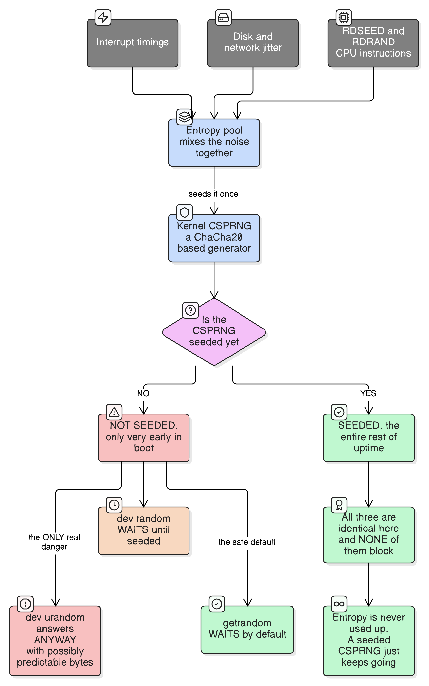
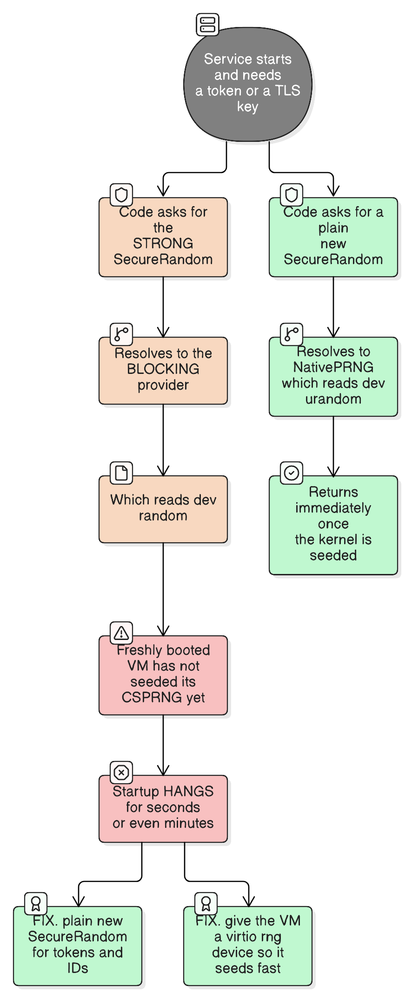

# /dev/random, /dev/urandom and Entropy

> "The generation of random numbers is too important to be left to chance."
> — Robert Coveyou
>
> *And on a modern kernel, the choice between the two device files is far less important than almost everyone thinks.*

## What it is

`/dev/random` is not a file. It's a **character special device** — a filesystem entry that, when you read from it, calls into the kernel and gets back random bytes:

```bash
head -c 32 /dev/urandom | base64      # 32 cryptographically strong random bytes
```

Alongside it sit `/dev/urandom` and the `getrandom(2)` syscall. All three are front doors to **one** kernel random number generator.

## Why the kernel does this at all

Software is deterministic. A program cannot manufacture unpredictability from its own logic — the same instructions on the same inputs produce the same outputs. So the kernel harvests **physical unpredictability** from the hardware and hands it out through one well-audited generator, rather than every program inventing its own.

That matters because these bytes become session tokens, TLS session keys, SSH host keys, password salts, CSRF tokens and UUIDs. If they're guessable, everything built on them is forgeable.

## How it works



**1. Harvest entropy.** The kernel samples genuinely unpredictable physical events:

| Source | Why it's unpredictable |
| --- | --- |
| Interrupt timings | The exact nanosecond a device raises an IRQ |
| Disk and network jitter | Mechanical and scheduling variance |
| Keyboard and mouse timing | Human input intervals (absent on servers) |
| `RDSEED` / `RDRAND` | An on-die hardware noise source on modern CPUs |

**2. Mix it into a pool**, then use that pool to **seed a CSPRNG** — a cryptographically secure pseudo-random generator, currently a ChaCha20 construction.

**3. Serve reads from the CSPRNG.** This is the step people misunderstand: you are not being handed raw hardware noise. You are handed the output of a cipher whose key came from that noise.

**Real-life analogy:** a bakery that needs an endless supply of unrepeatable patterns. It can't invent them from its recipe book (**software is deterministic**), so it collects genuinely random physical measurements — the exact temperature drift in the oven, the delay before the next customer walks in (**entropy from hardware timing**). Crucially it doesn't hand *those measurements* to customers. It mixes them once into a starter culture (**seeding the CSPRNG**), and from that starter it can bake unlimited unique loaves forever (**stream cipher output**). Once the starter exists, asking "have we run out of temperature measurements?" is the wrong question (**entropy is not consumed per read**) — but a bakery that opened this morning and hasn't collected *any* measurements yet has a starter that isn't really random, and that is the one genuine danger (**an unseeded CSPRNG at early boot**).

## The advice you've probably heard, and why it's obsolete

The classic rule was:

> *"Use `/dev/random` for long-lived keys because it's 'more random'; use `/dev/urandom` for everything else."*

This was based on an "entropy depletion" model: each read supposedly consumed entropy, and `/dev/random` blocked until more accumulated. **That model does not apply to a properly seeded CSPRNG.** Once you have 256 bits of real entropy, a stream cipher can produce effectively unlimited output that no one can distinguish from random. Nothing gets "used up".

Since **Linux 5.6 (2020)**, the kernel reflects this: `/dev/random` blocks *only* until the CSPRNG is initialised, and never again. The 5.17/5.18 rework went further and made the two paths essentially the same generator.

| | Old belief | Reality on a modern kernel |
| --- | --- | --- |
| `/dev/random` | "True randomness", blocks when entropy is low | Blocks only before the CSPRNG is seeded at boot |
| `/dev/urandom` | "Weaker, pseudo-random" | Identical output once seeded; its **only** flaw is answering *before* seeding |
| Entropy | Consumed by each read | Needed once, to seed. Not consumed afterwards |

**So what is the real danger?** Not depletion — it's reading **too early**. `/dev/urandom` will happily return bytes before the CSPRNG is seeded, and those bytes may be predictable. This is not hypothetical: the 2012 *Mining Your Ps and Qs* study found thousands of internet-facing devices with factorable RSA keys, because embedded devices generated SSH/TLS keys on first boot before any entropy existed.

## What to actually use

| API | Behaviour | Use it when |
| --- | --- | --- |
| **`getrandom(2)`** | Blocks until seeded, then never. No file descriptor needed | **The modern default** — it is the correct behaviour by construction |
| **`/dev/urandom`** | Never blocks — including before seeding | Fine for anything running after boot; risky in early-boot/embedded code |
| **`/dev/random`** | Blocks until seeded, then behaves like urandom | No longer meaningfully different; kept for compatibility |

`getrandom()` exists precisely because a syscall can express "wait until safe, then never wait again", which a file read cannot. It also can't fail because the process ran out of file descriptors or is in a chroot without `/dev`.

**Other platforms:**

- **macOS / BSD** — `/dev/random` and `/dev/urandom` are the *same device*, and **neither ever blocks**. The historic advice was never relevant here. Prefer `arc4random_buf()`.
- **Windows** — `BCryptGenRandom`; the device-file question doesn't arise.

## From the JVM



This is where the topic stops being trivia. On Linux the JDK maps its RNG providers onto these devices:

| Java API | Provider | Reads |
| --- | --- | --- |
| `SecureRandom()` | `NativePRNG` | `/dev/urandom` for output — **never blocks** |
| `SecureRandom.getInstanceStrong()` | `NativePRNGBlocking` (typical Linux config) | `/dev/random` — **can block** |

Hence the classic incident: **a service hangs for seconds or minutes at startup** on a freshly-booted VM, because something called `getInstanceStrong()` (directly, or inside a TLS or session-ID library) before the kernel finished seeding.

You may have seen the workaround `-Djava.security.egd=file:/dev/./urandom`. The odd `/./` exists because the JDK special-cases the literal strings `file:/dev/random` and `file:/dev/urandom`; inserting `/./` defeats that string match so it's treated as a plain file path. **Treat it as a legacy patch, not the fix** — on current kernels and JDKs the better answers are to use a plain `SecureRandom` for tokens and to give VMs a `virtio-rng` device so they seed quickly.

**A container is *not* separately entropy-starved.** Containers share the host kernel and therefore the host's CSPRNG — if the host is seeded, the container is. The problem belongs to freshly-booted VMs and bare-metal embedded devices, and to cloned VM images that resume with identical RNG state.

### The Kotlin trap

```kotlin
import kotlin.random.Random
import java.security.SecureRandom
import java.util.Base64

// ✗ kotlin.random.Random is a fast, seedable PRNG — NOT cryptographically secure.
//   Predictable from a handful of outputs. Never use it for anything a user must not guess.
val insecure = Random.nextBytes(32)

// ✓ SecureRandom is seeded from the kernel CSPRNG. Thread-safe, so share one instance.
private val secureRandom = SecureRandom()

/** A 256-bit URL-safe token suitable for session IDs, password-reset links and API keys. */
fun newToken(): String {
    val bytes = ByteArray(32)
    secureRandom.nextBytes(bytes)
    return Base64.getUrlEncoder().withoutPadding().encodeToString(bytes)
}
```

`kotlin.random.Random` and `java.util.Random` are for simulations, shuffling and jitter. The moment a value is a **secret or an identifier an attacker benefits from guessing**, it must come from `SecureRandom`. The two are one import apart and look identical at the call site, which is exactly why this ships.

`UUID.randomUUID()` *is* backed by `SecureRandom`, so it's safe for identifiers — though at 122 random bits it's fine as an unguessable ID but conventionally not used as a bearer token.

## Inspecting it

```bash
cat /proc/sys/kernel/random/entropy_avail    # bits of estimated entropy
head -c 32 /dev/urandom | xxd                # 32 raw random bytes
head -c 32 /dev/urandom | base64             # ...as a token
```

On kernels since 5.18 `entropy_avail` sits at 256 once initialised and stays there — because that's all a seeded CSPRNG needs. **A low or static number is not a problem to fix.** Alerting on `entropy_avail` is a common piece of obsolete monitoring folklore.

## How to decide which source to use

| Question to ask | → `SecureRandom` / `getrandom` / urandom | Real-life example | → A plain PRNG (`kotlin.random.Random`) | Real-life example |
|---|---|---|---|---|
| Would an attacker gain anything by predicting this value? | Yes | A session token, password-reset link, API key, CSRF token, IV | No | Retry jitter, a shuffled carousel, a sampled trace |
| Does it need to be reproducible from a seed? | No — never seed a CSPRNG yourself | Key material | Yes | A simulation or test that must replay identically |
| Is it generated at high volume in a hot loop? | Yes, still — CSPRNG output is fast | Millions of request IDs | Only if unpredictability is irrelevant | Load-test payload padding |
| Is this code running in very early boot or on an embedded device? | Yes — and use blocking `getrandom`, not urandom | A router generating its first SSH host key | — | — |

**The short version: default to `SecureRandom` (or `getrandom`) for everything, and only drop to a plain PRNG when you specifically need reproducibility or you're certain predictability is harmless.** The performance difference almost never justifies the risk.

## Common mistakes

| Mistake | Consequence |
| --- | --- |
| Using `/dev/random` "because it's more secure" | Needless blocking on a freshly-booted VM; identical output to urandom once seeded |
| Alerting on low `entropy_avail` | Chasing a metric that is meaningless on modern kernels |
| Using `kotlin.random.Random` or `java.util.Random` for tokens | Predictable session IDs and reset links — a real, exploitable vulnerability |
| Calling `SecureRandom.getInstanceStrong()` for ordinary tokens | Startup hangs; it's meant for long-lived key *seeds*, not general use |
| Seeding a `SecureRandom` with `System.currentTimeMillis()` | Destroys its unpredictability — the seed space becomes tiny and guessable |
| Constructing a `new SecureRandom()` per request | Wasteful; it's thread-safe, so share one instance |
| Generating keys on an embedded device's first boot | The *Ps and Qs* failure — no entropy exists yet |
| Cloning a VM image after first boot | Clones can resume with identical RNG state and produce identical "random" values |
| Assuming containers need their own entropy | They share the host kernel's CSPRNG |

## Key takeaways

1. **`/dev/random` is a device file, not a file** — reading it invokes the kernel's CSPRNG.
2. **Entropy seeds the generator once; it is not consumed per read.** The depletion model behind the old advice was wrong.
3. **Since Linux 5.6, `/dev/random` blocks only until seeded** — after that it and `/dev/urandom` are the same thing.
4. **The only real danger is reading before the CSPRNG is seeded** — early boot and embedded first-boot key generation.
5. **`getrandom(2)` is the modern correct API**: waits when it must, never afterwards.
6. **On macOS/BSD the two devices are identical and never block.**
7. **On the JVM, `new SecureRandom()` is the right default**; `getInstanceStrong()` can block at startup.
8. **`kotlin.random.Random` is not secure.** One import separates a safe token from a guessable one.

## See also

- [totp](totp.md) — the shared secret a TOTP setup depends on must come from a CSPRNG; a guessable secret defeats the whole scheme.
- [passkeys](passkeys.md) — keypair generation is exactly the long-lived key material this note is about, and the reason first-boot entropy matters.
