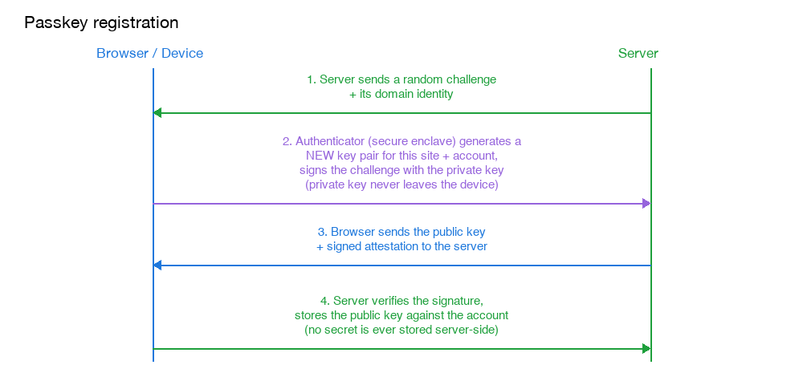
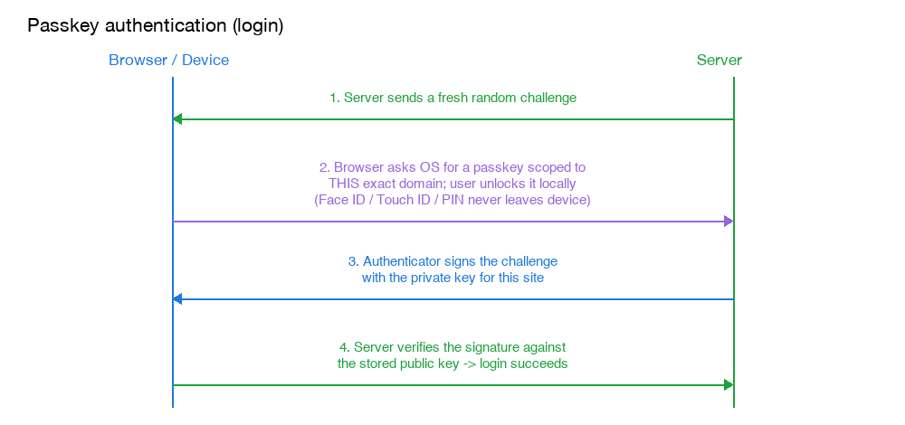

# Passkeys

## What problem they solve

Passwords have a structural flaw: they're a **shared secret** — the same string has to exist in your head and on the server, and that string alone is the entire proof of identity. That one fact creates several attack surfaces at once:

- **Phishing**: since a password is "just a string," you can be tricked into typing it into a fake site that looks real. The password itself carries no information about which site it was meant for.
- **Credential reuse**: people reuse passwords across sites; one site's breach lets attackers try the same password everywhere else ("credential stuffing").
- **Server-side breaches**: even hashed, a stolen password database is a target for offline cracking, especially for weak/common passwords.
- **Brute force / guessing**: a password is a fixed secret that can simply be guessed or tried repeatedly.
- **OTP/SMS-based MFA weaknesses**: the common fix (a second factor like an SMS code, or [an authenticator app's TOTP code](totp.md)) is itself phishable (an attacker's fake site can relay the OTP in real time) and, for SMS specifically, vulnerable to SIM-swap attacks.

Passkeys eliminate the shared secret entirely. There is no string that both sides know — so there's nothing to phish, reuse, leak from a breach, or brute-force.

## How they work (WebAuthn / FIDO2)

Instead of a shared secret, a passkey is a **key pair**: a private key that never leaves your device (usually generated inside a hardware-backed secure enclave) and a public key handed to the website. Logging in means proving you hold the private key by signing a server-issued challenge — the private key itself is never transmitted.

### Registration (creating a passkey)

1. The site ("relying party") sends the browser a random challenge plus its own domain identity.
2. The browser calls the WebAuthn API, which hands off to an authenticator — the device's secure enclave (Face ID/Touch ID/Windows Hello) or an external key.
3. The authenticator generates a brand-new key pair specific to this site and this account, signs the challenge with the new private key, and returns the public key to the browser.
4. The browser sends the public key to the server, which stores it against the account. Nothing secret was ever sent over the network — a public key is safe to store in plaintext, since it can verify signatures but can't create them.

### Authentication (logging in)

1. The server sends a fresh random challenge.
2. The browser asks the OS for a passkey matching this exact domain; the OS prompts you to unlock it locally (fingerprint, face, or PIN) — this unlock never leaves the device either.
3. The authenticator signs the challenge with the private key tied to that site.
4. The server verifies the signature against the public key it stored at registration. A valid signature proves the request came from whoever holds the matching private key.

## Why this resists phishing specifically

The browser, not the website's own code, fills in the true origin (domain) into the data being signed, and the OS's passkey lookup is itself scoped to that origin. A fake site at `evil-bank.com` mimicking `realbank.com` can't even get the browser to offer up your `realbank.com` passkey — the mechanism that finds "which key applies here" is bound to the real domain, not to anything the page can influence. This is a structural difference from a password, which you can always be tricked into typing anywhere.

## Synced vs. device-bound passkeys

A hardware security key keeps the private key on one physical chip forever — most secure, but losing it means losing that credential (you need a backup authenticator registered too). Most consumer passkeys today are "synced" — encrypted and synced across your own devices via your platform account (iCloud Keychain, Google Password Manager), so losing one device doesn't lock you out, while the sync itself stays end-to-end encrypted so even the cloud provider can't read the key.

## Real-life analogy

A password is like a secret word you whisper to a bouncer — the venue has to remember that same word too, so if their guest list leaks, or you say it to the wrong doorman by mistake, anyone who has that word can get in as you. A passkey is like a custom lock cut specifically for one building's door, paired with a key that only that lock will ever accept — the building never needs to store a copy of your key, just its own lock design (the public key), and your key doesn't even physically fit a fake lookalike door next door, so there's no way to trick you into using it in the wrong place. And your keychain itself only opens for your fingerprint, so even a stolen keychain doesn't work in someone else's hand.
