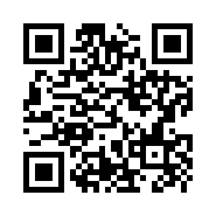
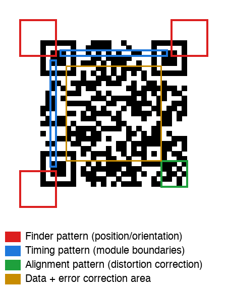

# How a QR Code Works

A QR (Quick Response) code is a black-and-white grid that encodes data as bits — black square = 1, white square = 0. A scanner photographs the grid, converts it to binary, then decodes that binary into text (a URL, a string, contact info, etc.).

Analogy: it's Morse code laid out in space instead of time — dots and dashes become black and white squares on a grid.

## Anatomy of the grid

- **Finder patterns** — the three identical nested-square bullseyes in three corners (top-left, top-right, bottom-left). They let a scanner instantly determine the code's position, size, and rotation regardless of the angle it's photographed from. Like the three legs of a tripod giving fixed reference points to triangulate position and tilt.
- **Alignment patterns** — smaller squares inside larger codes that correct for perspective distortion when the surface is curved or the photo is angled.
- **Timing patterns** — an alternating black/white strip near the finder patterns marking where one module (grid cell) ends and the next begins, like tick marks on a ruler.
- **Data area** — the actual payload, encoded in binary according to a chosen mode (numeric, alphanumeric, byte/text, or Kanji), each packing bits at different efficiency.
- **Error correction bits** — redundant data encoded using Reed-Solomon error correction, the same math used on CDs and DVDs to tolerate scratches. This is why a QR code still scans when dirty, torn, or partially covered by a logo — missing modules can be reconstructed from the redundant data. Four levels (L/M/Q/H) trade data capacity for damage tolerance, from ~7% to ~30% of the code recoverable.

## Analogy for the whole thing

A QR code is a jigsaw-puzzle photo of a sentence, printed with spare puzzle pieces baked in. The three corner bullseyes are landmark pieces telling you which way is "up" and how big the picture is. Even if part of the puzzle is missing or smudged, the spare pieces (error correction) let the scanner reconstruct the full sentence anyway.
