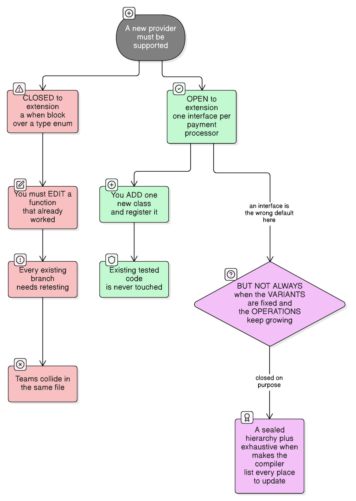
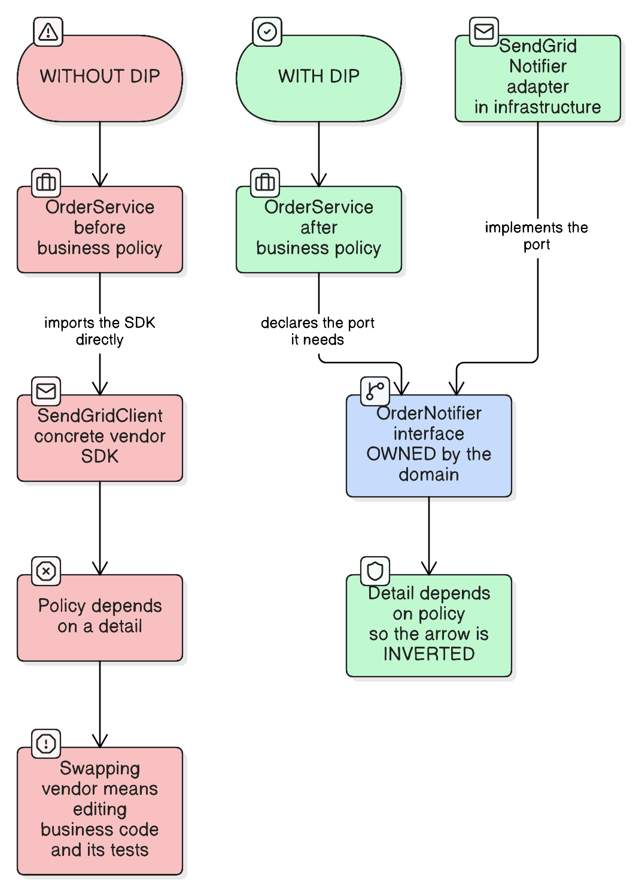

# SOLID Principles

> "The only way to go fast is to go well."
> — Robert C. Martin
>
> *All five principles are answers to one question: when the requirements change, how many places do I have to edit?*

## The one idea behind all five

SOLID is not five unrelated rules. It's five tactics for **isolating change** so that a modification touches one place instead of ten:

| Principle | The change it protects you from |
| --- | --- |
| **S**ingle Responsibility | Two unrelated reasons to change colliding in one class |
| **O**pen/Closed | Having to edit working, tested code to add a variant |
| **L**iskov Substitution | A subtype quietly breaking code written against its parent |
| **I**nterface Segregation | A client forced to know about methods it never calls |
| **D**ependency Inversion | Business policy having to change because a vendor did |

Read that column and the point becomes clear: **if your code never changed, SOLID would be worthless.** That's also the honest test for applying any of them — *is this thing actually likely to change?* If not, the abstraction is speculative cost.

---

## S — Single Responsibility Principle

> **A class should have one reason to change.**

The popular phrasing "a class should do only one thing" is the **wrong** version, and it produces codebases full of single-method classes named `OrderTotalCalculatorFactoryHelper`. Martin's own refinement is much more usable:

> *Gather together the things that change for the same reason. Separate those that change for different reasons.* — or: **a module should be answerable to one actor.**

"Actor" means *who asks for the change*. That's the test.

### The example

```kotlin
// ✗ Three different actors demand changes to this one class.
class OrderService(private val repository: OrderRepository) {

    fun place(order: Order): Order = repository.save(order)          // Finance owns tax/discount rules

    fun renderInvoicePdf(order: Order): ByteArray = TODO()           // Design owns the invoice layout

    fun emailInvoice(order: Order) = TODO()                          // Marketing owns the email copy
}
```

Nothing here is *badly written*. The problem is organisational: a finance rule change, a rebrand, and a copy tweak all land in the same file, so three teams collide in it, and a design change forces a redeploy of order placement.

```kotlin
// ✓ One actor each.
class OrderService(private val repository: OrderRepository) {
    fun place(order: Order): Order = repository.save(order)
}

class InvoiceRenderer {
    fun renderPdf(order: Order): ByteArray = TODO()
}

class InvoiceMailer(private val notifier: OrderNotifier) {
    fun send(order: Order, pdf: ByteArray) = TODO()
}
```

**Real-life analogy:** a restaurant where one person cooks, waits tables and does the books (**one class, three actors**). Nothing is *wrong* until the tax rules change and the kitchen closes while they're at the accountant (**a change for one actor blocks the others**). Splitting the roles isn't about doing "one thing" — the chef does dozens of things — it's that **only one person's boss can hand the chef new instructions** (**one reason to change**).

### Common mistake

Splitting by *noun* instead of by *reason*. `Order`, `OrderValidator`, `OrderIdGenerator`, `OrderStateHolder` isn't SRP — it's an anemic model with the same actors still spread across all four. If two classes always change together, SRP says they should probably be one.

---

## O — Open/Closed Principle

> **Open for extension, closed for modification** — add behaviour by adding code, not by editing code that already works.



### The example

```kotlin
// ✗ Every new provider means editing a function that already worked,
//   retesting every existing branch, and colliding with other teams in one file.
fun feeFor(type: PaymentType, amount: BigDecimal): BigDecimal = when (type) {
    PaymentType.CARD -> amount * BigDecimal("0.02")
    PaymentType.UPI -> BigDecimal.ZERO
    PaymentType.NETBANKING -> BigDecimal("5.00")
}
```

```kotlin
// ✓ A new provider is a new class. Nothing existing is touched.
interface PaymentProcessor {
    val type: PaymentType
    fun feeFor(amount: BigDecimal): BigDecimal
}

class CardProcessor : PaymentProcessor {
    override val type = PaymentType.CARD
    override fun feeFor(amount: BigDecimal): BigDecimal = amount * BigDecimal("0.02")
}

class PaymentFees(processors: List<PaymentProcessor>) {
    private val byType: Map<PaymentType, PaymentProcessor> = processors.associateBy { it.type }

    fun feeFor(type: PaymentType, amount: BigDecimal): BigDecimal =
        requireNotNull(byType[type]) { "No processor registered for $type" }.feeFor(amount)
}
```

With Spring, injecting `List<PaymentProcessor>` means adding a `@Component` is the *entire* change.

### The Kotlin twist worth knowing

OCP is usually taught as "polymorphism good, `when` bad". That's too simple, and Kotlin makes the real trade-off explicit. It's the **expression problem**: you can have easy new *variants* or easy new *operations*, not both.

| Your variants (types) are… | Your operations are… | Use |
| --- | --- | --- |
| Growing (new providers, new plugins) | Stable | **Interface** — open for extension |
| Fixed and known (`Success`, `Failure`, `Pending`) | Growing | **`sealed` + exhaustive `when`** — deliberately *closed*, and the compiler lists every site to update |

```kotlin
// A sealed hierarchy is CLOSED on purpose: adding a state breaks compilation
// at every `when`, which is exactly the reminder you want.
sealed interface PaymentResult {
    data class Captured(val transactionId: String) : PaymentResult
    data class Declined(val reason: String) : PaymentResult
    data object Pending : PaymentResult
}

fun message(result: PaymentResult): String = when (result) {
    is PaymentResult.Captured -> "Paid, reference ${result.transactionId}"
    is PaymentResult.Declined -> "Declined: ${result.reason}"
    PaymentResult.Pending -> "Awaiting confirmation"
}   // no `else` — the compiler enforces completeness
```

"Add an interface so I never edit a `when`" is wrong when your variant set genuinely doesn't grow. A `when` over three payment *states* is not a design flaw.

### Common mistake

**Speculative abstraction.** An interface with exactly one implementation, added because a second one might appear, is pure cost: an extra indirection, a harder-to-read call graph, and a wrong guess about the axis of variation. OCP applies to the axes you have *evidence* vary. Wait for the second implementation — that's when you learn what the interface should actually be.

---

## L — Liskov Substitution Principle

> **If `S` is a subtype of `T`, code written against `T` must keep working when handed an `S`** — without knowing the difference.

This is about **behavioural contracts**, not method signatures. The compiler checks signatures; LSP is about what the compiler can't see.

The four rules a subtype must respect:

1. **Don't strengthen preconditions** — don't demand more than the parent did.
2. **Don't weaken postconditions** — don't promise less than the parent did.
3. **Preserve invariants.**
4. **Don't throw new exception types** the caller wasn't told about.

### The example

Forget squares and rectangles — here's the version people actually ship:

```kotlin
interface OrderRepository {
    /** Persists the order and returns the stored instance. */
    fun save(order: Order): Order
}

// ✗ Strengthens the precondition: now there must ALSO be an authenticated user.
class AuditedOrderRepository(private val delegate: OrderRepository) : OrderRepository {
    override fun save(order: Order): Order {
        val actor = checkNotNull(SecurityContext.currentUser) { "No authenticated user" }
        return delegate.save(order.withAuditor(actor))
    }
}
```

The signature is identical, so it compiles and the tests (which run inside a request) pass. Then a nightly batch job — written against `OrderRepository`, correct against the base contract, unchanged for two years — starts throwing `IllegalStateException`, because there's no logged-in user in a scheduler thread. **The subtype demanded something its parent never required.**

The fix is to make the requirement part of the contract instead of a hidden precondition:

```kotlin
// ✓ The dependency is explicit in the type, so a caller can't get it wrong.
interface OrderRepository {
    fun save(order: Order, auditor: Auditor): Order
}
```

### The JDK violates this famously

```kotlin
val fixed = java.util.Arrays.asList(1, 2, 3)
fixed.add(4)     // compiles fine — throws UnsupportedOperationException at runtime
```

`Arrays.asList` returns something typed `List` that isn't fully a `List`. Same for `Collections.unmodifiableList`. **Kotlin's `List` / `MutableList` split exists precisely to fix this** — the *type* tells you whether mutation is part of the contract, so the violation becomes a compile error instead of a runtime surprise. It's a language-level LSP fix, and a good illustration that the principle is about contracts rather than syntax.

### Common mistake

Using inheritance for **code reuse** rather than for substitutability. If `PremiumCustomer` extends `Customer` only to share fields, you've committed to "a `PremiumCustomer` is usable anywhere a `Customer` is" — a promise you'll eventually break. Prefer composition; inherit only when you mean the substitution guarantee.

---

## I — Interface Segregation Principle

> **No client should be forced to depend on methods it does not use.**

### The example

```kotlin
// ✗ A fat interface. Every implementation must handle everything.
interface PaymentGateway {
    fun charge(amount: BigDecimal, token: String): PaymentResult
    fun refund(transactionId: String, amount: BigDecimal): PaymentResult
    fun tokenize(cardNumber: String): String
    fun startSubscription(planId: String, token: String): String
    fun cancelSubscription(subscriptionId: String)
    fun payout(vendorId: String, amount: BigDecimal): PaymentResult
}

// A payout-only provider is now forced to lie about four capabilities.
class VendorPayoutGateway : PaymentGateway {
    override fun payout(vendorId: String, amount: BigDecimal): PaymentResult = TODO()

    override fun charge(amount: BigDecimal, token: String) = throw UnsupportedOperationException()
    override fun refund(transactionId: String, amount: BigDecimal) = throw UnsupportedOperationException()
    // ...and so on
}
```

**Notice what just happened: the ISP violation *caused* an LSP violation.** A fat interface forces implementations to throw on methods they can't support, which breaks substitutability for anyone holding a `PaymentGateway`. That's the practical reason ISP matters — the two failures arrive together.

```kotlin
// ✓ Role interfaces: each client depends only on what it uses.
interface Charging {
    fun charge(amount: BigDecimal, token: String): PaymentResult
}

interface Refunding {
    fun refund(transactionId: String, amount: BigDecimal): PaymentResult
}

interface Payouts {
    fun payout(vendorId: String, amount: BigDecimal): PaymentResult
}

// A provider implements exactly what it can do — and composes when it does more.
class VendorPayoutGateway : Payouts { /* ... */ }
class StripeGateway : Charging, Refunding { /* ... */ }
```

Now `CheckoutService` takes a `Charging`, so it *cannot* accidentally call `payout`, and a test double for it is a one-method lambda instead of a 6-method stub.

**Real-life analogy:** a job description listing "must be able to fly a plane, perform surgery, and audit accounts" (**a fat interface**). Every candidate is forced to claim all three and will fail at two (**implementations throwing on methods they can't support**). Splitting it into three job descriptions lets each person apply for what they actually do (**role interfaces**), and lets you hire one person who genuinely does two of them (**a class implementing several small interfaces**).

### Common mistake

Splitting an interface **per implementation** rather than per **client need**. The goal isn't "small interfaces", it's *interfaces shaped by what a caller uses*. If every caller uses all six methods, the six-method interface is correct.

---

## D — Dependency Inversion Principle

> **High-level modules should not depend on low-level modules. Both should depend on abstractions.**
> And: **abstractions should not depend on details.**



### The example

```kotlin
// ✗ Business policy depends on a vendor SDK.
class OrderService(private val sendGrid: SendGridClient) {
    fun place(order: Order) {
        // ...
        sendGrid.sendTemplate(templateId = "order-confirm", to = order.email)
    }
}
```

Three consequences: swapping vendor edits business code; a unit test needs the real SDK or heavy mocking; and the vendor's concepts ("template ID") leak into your domain language.

```kotlin
// ✓ The domain declares the port it needs, in its own vocabulary.
interface OrderNotifier {
    fun orderConfirmed(order: Order)
}

class OrderService(private val notifier: OrderNotifier) {
    fun place(order: Order) {
        // ...
        notifier.orderConfirmed(order)
    }
}

// The adapter lives in infrastructure and depends INWARD on the domain's interface.
class SendGridOrderNotifier(private val sendGrid: SendGridClient) : OrderNotifier {
    override fun orderConfirmed(order: Order) =
        sendGrid.sendTemplate(templateId = "order-confirm", to = order.email)
}
```

### The part that's actually the "inversion"

Most explanations stop at "depend on an interface", which misses the point. **The interface must be owned by the consumer, not the provider.**

```
Not inverted:  OrderService → EmailSender (interface defined in the email package)
Inverted:      OrderService → OrderNotifier (interface defined in the DOMAIN)
                                    ↑
                              SendGridOrderNotifier implements it
```

If the interface ships with the vendor adapter, the dependency arrow still points from policy to detail — you've just added indirection. When the *domain* owns it, the arrow from infrastructure points **inward**, which is what "inversion" names. This is exactly the ports-and-adapters / hexagonal architecture rule.

**Real-life analogy:** hiring a cleaner. Depending on a detail is writing your house rules around one specific person's habits (**importing the vendor SDK**) — when they leave, you rewrite the rules. Inverting it is writing the *job spec* yourself — "kitchen cleaned nightly, recycling out on Tuesdays" (**an interface the household owns**) — and having each cleaner conform to your spec (**the adapter implements the domain's port**). The spec is written in your vocabulary, not theirs, and replacing the cleaner changes nothing about the household.

### DIP is not dependency injection

A distinction worth being firm about:

| | What it is |
| --- | --- |
| **Dependency injection** | A *mechanism* — passing a collaborator in rather than constructing it |
| **DIP** | A *direction* — which module owns the abstraction, and which way the arrow points |

You can inject a concrete `SendGridClient` through a constructor: that's DI with no DIP. You can hand-wire an inverted design with `new`: that's DIP with no DI framework. They're commonly used together and routinely confused.

---

## When SOLID misleads

Applied without judgement, these principles produce the over-engineered enterprise codebases they were meant to prevent. Honest caveats:

| Trap | Reality |
| --- | --- |
| An interface for every class | Indirection with no benefit. Add the interface when a second implementation or a test seam genuinely needs it |
| SRP read as "one method per class" | Produces anemic classes and pushes the real logic into services. SRP is about *actors*, not method counts |
| OCP read as "never edit code" | Editing a `when` over a fixed variant set is fine — often better |
| DIP read as "always inject an interface" | If the dependency is stable and owned by you (a value object, a pure function), depending on it directly is correct |
| Layers added for symmetry | A DTO that maps 1:1 to an entity, wrapped in a service that only delegates to a repository, is three files doing one file's work |

These principles come from 1990s–2000s C++/Java, where many of the mechanics were expensive. **Kotlin removes some of the need entirely:**

- Top-level and extension functions mean you don't need a class to hold behaviour (much of the "helper class" pattern disappears).
- `data class` gives you value semantics without ceremony.
- `sealed` hierarchies make "closed on purpose" a first-class, compiler-enforced choice.
- Function types (`(Order) -> Unit`) are often the right one-method interface — no `interface` declaration needed.

```kotlin
// A one-method port often doesn't need to be an interface at all.
class OrderService(private val onConfirmed: (Order) -> Unit)
```

---

## How to decide

### Should I extract an interface here?

| Question to ask | → Yes, extract | Real-life example (extract) | → No, depend directly | Real-life example (don't) |
|---|---|---|---|---|
| Is there a second implementation *today*? | Yes | Card and UPI processors both exist | No, and none is planned | A single `PriceCalculator` used everywhere |
| Does it cross a boundary you don't control? | Yes | A payment vendor, an email provider, a queue | No — it's your own domain code | A value object, a pure calculation |
| Does testing need to replace it? | Yes | Anything doing I/O, time, or randomness | No — it's deterministic and fast | A formatter |
| Would you have to *guess* the interface? | No, usage is known | Two providers already show the shape | Yes, you'd be inventing it | Speculative "future flexibility" |

### Which OCP tool: interface or sealed?

| Question to ask | → Interface | Real-life example | → `sealed` + `when` | Real-life example |
|---|---|---|---|---|
| Do new *variants* get added over time? | Yes | Payment providers, export formats, notification channels | No, the set is fixed by the domain | Payment result states; HTTP method |
| Do new *operations* get added over time? | No, the operation set is stable | `feeFor`, `charge` | Yes, frequently | Rendering, serialising, logging, metrics for each state |
| Do you want the compiler to find every call site when the set changes? | No | Plugins added independently | **Yes** | Adding a `Refunded` state and needing every `when` to fail loudly |
| Are variants defined outside your module? | Yes | A plugin SPI | No | Your own domain states |

### Is this SRP split worth it?

| Question to ask | → Split | Real-life example (split) | → Leave it | Real-life example (leave) |
|---|---|---|---|---|
| Do different teams/actors request changes to different parts? | Yes | Finance owns tax rules, design owns the PDF | No, one owner | A cohesive validator |
| Do the parts change at different times? | Yes | Email copy weekly, order rules yearly | No, they always change together | Parsing plus validating one format |
| Does the class need unrelated dependencies? | Yes — a PDF library *and* an SMTP client | A "do everything" service | No | A single-purpose mapper |
| Is the file hard to navigate or a merge-conflict hotspot? | Yes | A 2,000-line service | No | A 60-line class |

---

## Common mistakes

| Mistake | Consequence |
| --- | --- |
| SRP as "one thing per class" | A blizzard of tiny classes; logic scattered and harder to follow than before |
| Splitting by noun instead of by reason to change | Anemic model; the same actors still touch every class |
| Interfaces with one implementation, added "for flexibility" | Indirection cost, and usually the wrong abstraction because it was guessed |
| Inheriting to reuse code | Eventual LSP break when the subtype isn't really substitutable |
| Subclass throwing `UnsupportedOperationException` | An LSP violation, usually caused by an ISP violation upstream |
| Fat interfaces | Implementations forced to fake capabilities; test doubles bloat |
| Splitting interfaces per implementation | Misses the point — split by what *callers* use |
| Defining the port in the provider's package | Not inversion, just indirection: the arrow still points at the detail |
| Confusing DI with DIP | Injecting a concrete class through a constructor and calling it "inverted" |
| Applying all five up front | The abstractions encode guesses. Let the second use case teach you the shape |

## Key takeaways

1. **All five principles are about isolating change.** If something won't change, don't pay to abstract it.
2. **SRP is about actors** — who asks for the change — not about counting methods.
3. **OCP means "add code, don't edit code"**, but a `sealed` hierarchy is deliberately closed and often better: pick based on whether *variants* or *operations* grow.
4. **LSP is a contract, not a signature** — don't strengthen preconditions, weaken postconditions, or add surprise exceptions.
5. **ISP violations cause LSP violations** — fat interfaces force implementations to throw.
6. **DIP's "inversion" is about interface ownership.** The consumer defines the port; the adapter implements it inward.
7. **DIP ≠ DI.** One is a direction, the other a mechanism.
8. **Wait for the second use case.** A guessed abstraction is usually the wrong one, and it's harder to remove than to add.

## See also

- [kotlin-contracts](../kotlin/kotlin-contracts.md) — how contracts let the compiler verify some of the behavioural promises LSP is concerned with.
- [monolith-vs-microservices](../system-design/monolith-vs-microservices.md) — the same isolate-what-changes reasoning applied at service boundaries rather than class boundaries.
- [saga-pattern-compensating-transactions](../system-design/saga-pattern-compensating-transactions.md) — what happens to dependency direction once the collaborators are separate services.
