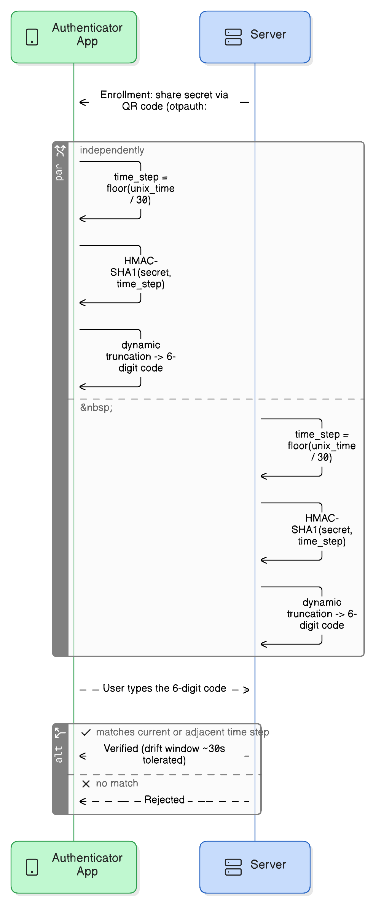

# TOTP (Time-based One-Time Password)

See also: [passkeys.md](passkeys.md) for a contrasting authentication mechanism — passkeys use an asymmetric key pair with no shared secret; TOTP, covered here, still relies on one.

TOTP (RFC 6238) is the algorithm behind the rotating 6-digit codes from apps like Google Authenticator, Authy, or 1Password. Unlike a passkey, it's still built on a shared secret — both your phone and the server hold the exact same secret key. What makes the code useful as a one-time credential is combining that secret with the current time.

## How it works

Editable version (Eraser.io): [TOTP: Independent Computation from a Shared Secret](https://app.eraser.io/workspace/JLgRjFjapzOnrAqixpQO?diagram=uf5TlLTiAW7_44fIoVnF&layout=canvas).

1. **Enrollment**: when you turn on 2FA, the server generates a random secret and shows it to you as a QR code (encoding a URI like `otpauth://totp/Example:alice@example.com?secret=BASE32SECRET&issuer=Example`). Your authenticator app scans it and stores that same secret. From this point on, server and app both hold an identical copy.
2. **Time steps**: time is divided into fixed 30-second intervals. The current "time step" is just `floor(current_unix_time / 30)` — an integer that both sides can compute independently, with no network call, as long as their clocks are roughly in sync.
3. **The algorithm (it's HOTP underneath)**: TOTP is literally HOTP (HMAC-based OTP, RFC 4226) with the usual incrementing counter replaced by that time step. Compute `HMAC-SHA1(secret, time_step)` to get a 20-byte hash, then "dynamic truncation" pulls out a 4-byte chunk (at an offset determined by the hash's own last nibble), interprets it as a number, and takes it mod 10⁶ to get a 6-digit code.
4. **Both sides compute independently**: because the secret and the time step are the only inputs, and both sides already have both, the server and your phone each compute the same 6-digit code entirely on their own — that's exactly why the app works with no internet connection.
5. **Verification with a small drift window**: since device clocks can be slightly out of sync, the server usually checks the code against the current time step and the one immediately before/after it, tolerating roughly ±30 seconds of drift without widening the window much further.

## Real-life analogy

Think of two people who each own an identical combination-lock dial, mechanically linked to a clock and a shared secret gear ratio. Every 30 seconds, the dial's combination changes — but because both dials use the same clock and the same gearing, they always land on the same combination at the same moment, without either person ever communicating with the other.

## Why TOTP is not phishing-resistant (the key contrast with passkeys)

A TOTP code is just a string of digits — exactly like a password. A phishing site can prompt you for it and relay it to the real site within its 30-second validity window ("real-time OTP relay phishing," commonly automated with tools like Evilginx). Passkeys are immune to exactly this: the browser cryptographically binds the signature to the real origin, so a phishing site can't obtain a usable signature at all, whereas a TOTP code carries no such binding — it's valid wherever it's typed.

There's also a breach-blast-radius difference: TOTP's secret is symmetric, so if the server's secret database leaks, an attacker can generate valid codes for every affected account indefinitely. A passkey server only ever stores a public key, which is useless for producing a valid signature even if leaked.

## Why it's still worth using

TOTP sits in a useful middle tier: far better than SMS-based OTP (no carrier in the loop at all, so it's immune to SIM-swap attacks and cellular interception, and it works fully offline), even though it's weaker than passkeys against real-time phishing.
