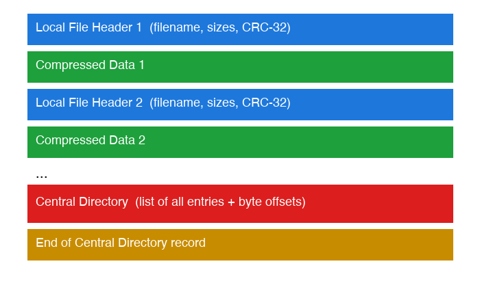

# How a ZIP File Works

A ZIP file bundles two separate ideas: a **compression algorithm** that shrinks each file's data, and a **container format** that packs multiple compressed files into one archive with a lookup table for finding them again.

## Compression — DEFLATE (LZ77 + Huffman coding)

- **LZ77 (duplicate elimination)** — scans the data for repeated sequences and replaces later occurrences with a short "go back N bytes, copy M bytes" pointer instead of repeating the text. Analogy: instead of rewriting a paragraph you already wrote, you scribble "same as 3 lines up, copy 12 words" — much shorter than the original.
- **Huffman coding (frequency-based recoding)** — after duplicates are removed, remaining symbols are re-encoded so common ones get short binary codes and rare ones get longer codes. Analogy: Morse code gives "E" (the most common English letter) a single dot, while "Q" gets four symbols — frequent things are cheap, rare things are expensive, and the average message gets shorter.

Together, LZ77 (finds repetition) and Huffman coding (exploits symbol frequency) make up DEFLATE, the algorithm ZIP normally uses to compress each file.

## Container format — packing many files into one archive

A ZIP archive isn't compressed as one giant blob. Each file is compressed independently and stored as its own entry, followed by a table of contents at the end:

- Each **local file header** carries that entry's filename, compressed/uncompressed size, and a **CRC-32 checksum** — a fingerprint used to verify the data wasn't corrupted after decompression.
- The **central directory**, appended at the very end, lists every entry along with its byte offset in the file. A ZIP reader jumps straight to the central directory, reads the table of contents, then seeks directly to just the file it wants — without decompressing everything else first. That's why extracting a single file from a large ZIP is nearly instant instead of requiring a full pass through the archive.

## Real-life analogy

A ZIP file is like a moving box where each item of clothing is vacuum-sealed separately (independent per-file compression), with a packing list taped inside the lid (the central directory) telling you exactly which sealed bag holds the blue shirt and where to find it — so you don't have to unpack the whole box just to grab one item.
