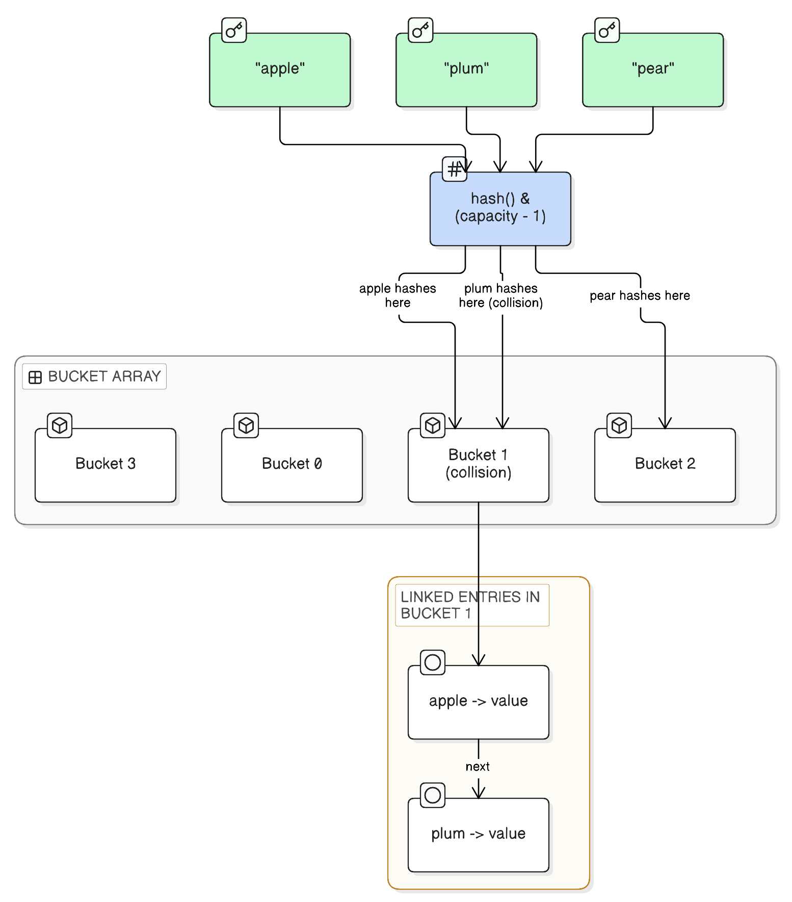

# How a HashMap Works

The core trick: instead of searching through every entry to find a key (O(n)), a HashMap computes a number directly from the key that tells it exactly which slot to look in — turning lookup into, on average, a single array access, O(1).



Editable version (Eraser.io): [HashMap Bucket Array and Collisions](https://app.eraser.io/workspace/JLgRjFjapzOnrAqixpQO?diagram=tlibI-xY7Wq4OXmsR6QI&layout=canvas).

## The mechanism

1. **A backing array of "buckets"**: internally, a HashMap holds a fixed-size array. Each slot ("bucket") can hold one or more key-value pairs.
2. **The hash function picks a bucket**: when a key is inserted, its `hashCode()` — a deterministic integer derived from its contents — gets computed, then mixed/reduced down to an index within the array's current size (`hash & (capacity - 1)`, since capacity is kept a power of two). That index is the bucket this key-value pair lives in.
3. **Collisions — different keys, same bucket**: two different keys can hash to the same bucket. When that happens, the bucket holds more than one entry, historically as a small linked list. Java 8+ upgrades a bucket to a balanced red-black tree once it holds enough entries (8+) in a big enough table, bounding the worst case at O(log n) instead of O(n) — this specifically defends against maliciously crafted keys that all hash to the same bucket.
4. **Lookup walks the (usually tiny) bucket**: to fetch a value, hash the key, jump to that bucket, then compare each entry's key with `.equals()` until a match is found. Hash equality alone isn't sufficient proof of a match — since collisions are possible — `.equals()` is the actual tie-breaker.
5. **Resizing keeps buckets short**: the map tracks `size / capacity` (the load factor). Once that ratio passes a threshold (0.75 by default in Java), the backing array doubles in size, and every existing entry gets rehashed into the new array — bucket assignment depends on capacity, so old bucket indices aren't valid in the bigger array. This is the one relatively expensive operation, but it happens rarely enough that average-case performance stays close to O(1).
6. **The hashCode/equals contract**: two keys that are `.equals()` must produce the same `hashCode()` — otherwise the map would send them to different buckets and never realize they're "the same" key. The reverse isn't required: two unequal keys can share a hash (that's just a collision), which is exactly why `.equals()` still has to run inside the matching bucket.

## Why 16, and why doubling?

**Why start at 16 (not 1, not 10)?** The bucket index is computed as `hash & (capacity - 1)` — a bitmask, not `hash % capacity` — because a bitwise AND is far cheaper than a modulo. That trick only distributes hashes evenly across every bucket when `capacity` is a power of two (so `capacity - 1` is all 1-bits in binary, e.g. 16 → `1111`). This is why capacity is always a power of two, never an arbitrary number. 16 itself is just the JDK's chosen default trade-off: too small (e.g. 1 or 4) and almost every map pays for several resizes even at modest size; too large (e.g. 256) wastes memory on the huge number of maps that only ever hold a handful of entries. It's an empirically "good enough" default, not derived from a formula, and it's fully overridable via `new HashMap<>(initialCapacity)` if you know your map will hold many (or very few) entries upfront.

**Why double (not +50%, or some other growth factor)?** Any growth factor greater than 1 gives the same amortized O(1) insertion guarantee — the standard dynamic-array argument: resizes get exponentially rarer as the map grows, so their total cost across n insertions stays O(n), not O(n²) as it would with a fixed increment (e.g. +1 or +16 each time). Doubling specifically also preserves the power-of-two invariant above — a 1.5× factor wouldn't reliably land on a power of two, but capacity × 2 always does. The deeper, HashMap-specific reason: because capacity always doubles, resizing gets a shortcut. Each entry's new bucket index depends on exactly one additional bit of its hash beyond what the old (smaller) capacity was already masking — so every old bucket's entries split into exactly two groups: those that stay at the same index, and those that move to `oldIndex + oldCapacity`, decided with a single `hash & oldCapacity` check per entry, no full hash/index recomputation needed. Java's actual `resize()` (Java 8+) exploits exactly this. A non-doubling growth factor would break this shortcut and force a full rehash of every entry from scratch.

```
capacity 16 (mask 0b01111) → resize to 32 (mask 0b11111)
for each entry: check hash & 16 (the newly-relevant bit)
  0 → stays at the same index
  1 → moves to index + 16
```

## Real-life analogy

Think of a hotel's wall of numbered mail pigeonholes. Instead of a receptionist checking every pigeonhole for your name, they do quick math on your name (the hash function) and know instantly which numbered hole to check. Usually that's exact — one guest, one hole. Occasionally two different guests' names produce the same number (a collision), so that hole has a small stack of letters, and the receptionist flips through that short stack checking names properly to find yours. If the hotel gets too full (too many letters per hole on average), management gets a bigger wall of pigeonholes and re-sorts all the mail into it using the same math against the new, bigger count — that's a resize. They specifically double the wall's size each time (16 holes → 32 → 64) rather than adding a few holes at a time, because doubling lets them re-sort by asking just one new yes/no question per stack of letters ("does your number have this one extra digit lit up?") instead of redoing the math on every single letter from scratch.
