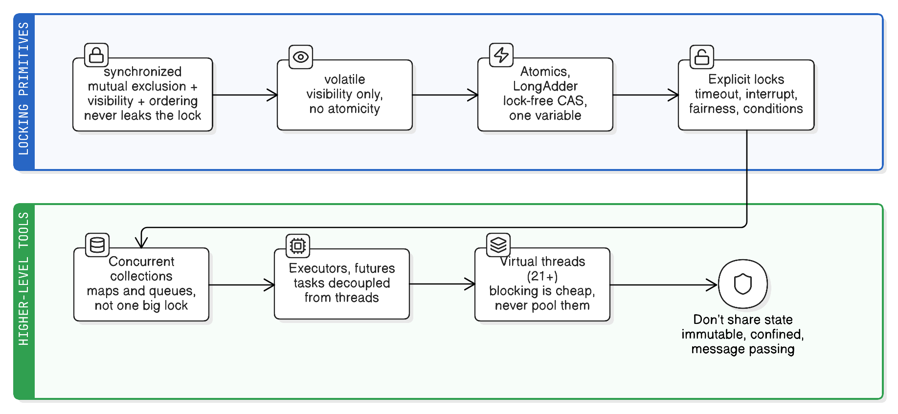
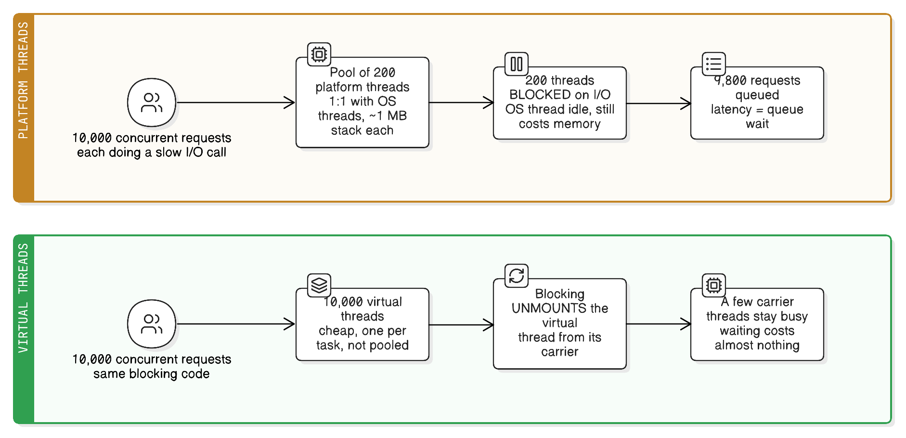

# Java Concurrency: From `synchronized` to Virtual Threads

> "If multiple threads access the same mutable state variable without appropriate synchronization, your program is broken."
> — Brian Goetz, *Java Concurrency in Practice*

Concurrency in Java is one long story: **`synchronized` was the original answer, and almost everything added since exists to fix one of its specific weaknesses.** This note follows that thread — what `synchronized` actually guarantees, what it costs, and what replaced each shortcoming, ending at virtual threads.



See [java-memory-management.md](java-memory-management.md) for where thread stacks and the shared heap live — the physical reason shared mutable state is a problem at all.

## Part 0: The three problems concurrency creates

Before any keyword, be clear about *what* can go wrong. Every tool below is an answer to one or more of these:

| Problem | What it means | Example |
|---|---|---|
| **Atomicity** | An operation that looks like one step is actually several, so threads interleave halfway through | `count++` is *read, add, write* — two threads can both read `5` and both write `6` |
| **Visibility** | A thread can read a **stale** value, because writes may sit in a CPU cache or register and not be published to other threads | A `while (!stopped)` loop that never sees `stopped = true` and spins forever |
| **Ordering** | The compiler, JIT, and CPU may **reorder** instructions; other threads can observe those effects out of order | A thread sees a non-null object reference before the object's fields are initialized |

The rules for what one thread is guaranteed to see of another are the **Java Memory Model (JMM)**, expressed as **happens-before** relationships — the full treatment (why reordering is legal, the complete rule list, safe publication, and how to reason about racy code) is in [java-memory-model-happens-before.md](java-memory-model-happens-before.md):

- Everything earlier in the *same* thread happens-before what follows it (program order).
- Releasing a monitor (exiting `synchronized`) happens-before any later acquisition of that same monitor.
- A write to a `volatile` field happens-before every later read of it.
- `Thread.start()` happens-before anything the new thread does; everything a thread does happens-before another thread's `join()` returns.
- A `final` field's value set in a constructor is visible to any thread that safely receives the reference.

**Race condition** = correctness depends on timing. **Data race** = unsynchronized concurrent access to a shared mutable field — the JMM gives you *no* guarantees at all, which is why "it worked on my laptop" means nothing.

## Part 1: `synchronized` — the original tool

Every Java object has an invisible **monitor** (intrinsic lock). `synchronized` acquires it, and only one thread can hold it at a time.

```java
class Counter {
    private int count = 0;

    // 1. synchronized method → locks `this`
    public synchronized void increment() { count++; }

    // 2. synchronized block → locks whatever you name (preferred: a private lock object)
    private final Object lock = new Object();
    public void incrementBlock() {
        synchronized (lock) { count++; }
    }

    // 3. static synchronized → locks Counter.class, not an instance
    public static synchronized void resetAll() { /* ... */ }
}
```

**What it gives you — both guarantees at once, which is the part people forget:**

1. **Mutual exclusion** — one thread inside the block at a time, so `count++` becomes atomic.
2. **Visibility + ordering** — on exiting a `synchronized` block, everything the thread wrote is flushed and published; on entering, the thread sees everything published by the previous holder. A lock is *not just* mutual exclusion; it's a memory barrier.

**Other properties:**

- **Reentrant** — the thread already holding a monitor can re-enter it (a `synchronized` method calling another `synchronized` method on the same object doesn't self-deadlock).
- Compiles to `monitorenter`/`monitorexit` bytecode (or an `ACC_SYNCHRONIZED` method flag), and the JVM **releases the lock automatically** — even if the block throws. That's its single biggest safety advantage.
- Coordination between threads uses `wait()`/`notify()`/`notifyAll()`, which may only be called while holding that object's monitor.

### Real-life analogy: the single bathroom key

One key hangs by the door (**the object's monitor** — every object has exactly one). To go in, you take the key (**`monitorenter`**); if someone else has it, you wait in the corridor (**blocked**, not spinning — the JVM parks your thread). Whoever leaves hangs the key back automatically, even if they storm out mid-shave (**the JVM releases the lock even when the block throws** — the guarantee `ReentrantLock` makes you write by hand). Already inside and need the inner cubicle? The same key works (**reentrancy**).

The inflexibility is the same list, item for item:

- You can't ask for the key "for 5 minutes only" (**no `tryLock(timeout)`** — you wait indefinitely).
- Once you're in the corridor you can't change your mind and leave (**not interruptible** — a blocked thread ignores `interrupt()`).
- The corridor has no orderly line, so someone who just arrived can get in before you (**no fairness policy**).
- There's one key for the whole room even if you only wanted the mirror (**coarse granularity** — readers block readers; a `ReadWriteLock` would hand out mirror-only passes).
- There's a single waiting crowd even though people want different things — a free sink versus a free shower — so when the key is handed over, everyone surges forward and most discover they still can't proceed (**one condition queue per monitor**: `notifyAll()` wakes threads whose predicate is still false, which is what `ReentrantLock`'s multiple `Condition`s fix).

## Part 2: The pros and cons of `synchronized`

| Pros | Cons |
|---|---|
| **Simple** — one keyword, no imports, no boilerplate | **Blocking only** — no `tryLock()`, no timeout, no "give up if busy" |
| **Impossible to leak** — the JVM always releases the lock, even on exception | **Uninterruptible** — a thread blocked on a monitor ignores `interrupt()`; it can wait forever |
| Gives **atomicity + visibility + ordering** together | **No fairness option** — a starved thread can wait indefinitely |
| **Reentrant** by default | **One condition queue per lock** — `wait()`/`notify()` can't distinguish "queue not empty" from "queue not full", so you wake threads that can't proceed |
| Deeply optimized by the JVM (adaptive spinning, lock coarsening, **lock elision** when escape analysis proves an object is thread-local) | **Coarse-grained** — locking a whole method/object where only one field needed protection; readers block other readers |
| No risk of forgetting to unlock | **Can't be scoped flexibly** — the lock must be released in the same block it was acquired (no hand-over-hand locking) |
| Well understood by every Java developer and tool | **Easy to misuse**: `synchronized(this)` in a public class lets outside code lock you out; synchronizing on a `String` literal or boxed `Integer` accidentally shares a global lock; synchronizing on a mutable field means the lock identity can change |
| | **Deadlock-prone** — no way to detect or back out once you're in |
| | **Contention doesn't scale** — every thread funnels through one queue |

Two more historical notes: **biased locking** (an optimization for uncontended locks) was disabled in JDK 15 and later removed, and until JDK 24 a `synchronized` block would **pin a virtual thread** to its carrier (see Part 8).

## Part 3: Fixing visibility only — `volatile`

If the problem is *only* visibility, a lock is overkill.

```java
private volatile boolean stopped = false;   // writer's change is seen by readers immediately
while (!stopped) { /* work */ }
```

`volatile` guarantees visibility and prevents reordering around the access — but **not atomicity**. `volatileCount++` is still a broken read-modify-write. Use it for flags, for the "safe publication" reference in double-checked locking, and nothing more.

```java
class Holder {                                  // classic double-checked locking
    private volatile Config config;             // volatile is MANDATORY here —
    Config get() {                              // without it, another thread can see
        if (config == null) {                    // a non-null reference to a
            synchronized (this) {                // half-constructed object
                if (config == null) config = new Config();
            }
        }
        return config;
    }
}
```

## Part 4: Fixing "blocking is too expensive" — atomics and CAS

`java.util.concurrent.atomic` replaces locking with a hardware instruction: **compare-and-swap (CAS)** — "if the value is still `x`, set it to `y`, atomically; otherwise tell me you failed and I'll retry."

```java
AtomicInteger count = new AtomicInteger();
count.incrementAndGet();                        // atomic, no lock, no blocking
count.compareAndSet(5, 6);                      // succeeds only if it's still 5
count.updateAndGet(v -> v * 2);                 // retry loop, done for you

AtomicReference<State> state = new AtomicReference<>(INITIAL);
LongAdder hits = new LongAdder();               // striped counters for HIGH contention
hits.increment();                               // faster than AtomicLong under many writers
```

- **Non-blocking / lock-free** — a thread never sleeps; it retries. No deadlock, no priority inversion.
- Good for a *single* variable. Multiple related variables still need a lock (or an immutable object swapped atomically via `AtomicReference`).
- Under heavy contention, CAS retries burn CPU — that's what `LongAdder`/`LongAccumulator` fix by striping across cells and summing on read.
- The **ABA problem**: a value can change `A → B → A` between your read and your CAS. `AtomicStampedReference` adds a version stamp when that matters.

## Part 5: Fixing "the lock is too rigid" — explicit locks

`ReentrantLock` is `synchronized` with all the missing knobs.

```java
private final ReentrantLock lock = new ReentrantLock();      // new ReentrantLock(true) = fair (FIFO)

if (lock.tryLock(200, TimeUnit.MILLISECONDS)) {              // timeout instead of waiting forever
    try { /* critical section */ } finally { lock.unlock(); } // finally is MANDATORY
} else {
    // couldn't get the lock — degrade, retry, or report instead of hanging
}

lock.lockInterruptibly();                                     // responds to Thread.interrupt()
```

| Capability | `synchronized` | `ReentrantLock` |
|---|---|---|
| `tryLock()` / timed acquisition | ✗ | ✓ |
| Interruptible while waiting | ✗ | ✓ |
| Fairness policy | ✗ | ✓ (at a throughput cost) |
| Multiple condition queues | ✗ (one per object) | ✓ (`newCondition()` per predicate) |
| Lock across method boundaries / hand-over-hand | ✗ | ✓ |
| Query state (`isLocked`, `getQueueLength`) | ✗ | ✓ |
| Auto-release on exception | **✓** | ✗ — you must `unlock()` in `finally` |

**Multiple conditions** is the big correctness win — a bounded buffer can wake *only* the threads that can actually proceed:

```java
private final Condition notFull  = lock.newCondition();
private final Condition notEmpty = lock.newCondition();
// put(): while (full) notFull.await();  ... notEmpty.signal();
// take(): while (empty) notEmpty.await(); ... notFull.signal();
```

Related locks:

- **`ReentrantReadWriteLock`** — many concurrent readers, one exclusive writer. A win only when reads dominate and are non-trivial; write-heavy use makes it slower than a plain lock, and readers can starve writers.
- **`StampedLock`** — adds **optimistic reads**: read without locking, then `validate()` the stamp and retry if a writer intervened. Fastest of the three for read-mostly data, but **not reentrant** and easy to misuse.

**Rule of thumb:** use `synchronized` by default (it can't leak), and reach for `ReentrantLock` only when you specifically need a timeout, interruptibility, fairness, or multiple conditions.

### Interruption: what "interruptible while waiting" actually means

Java has **no safe way to kill a thread** (`Thread.stop()` was deprecated for decades and is now removed — it could abort a thread mid-update and leave objects broken). What it has instead is **cooperative cancellation**: `t.interrupt()` sets a flag on the thread and asks it to stop. Whether anything happens depends entirely on what that thread is doing at the time.

A thread notices an interrupt in one of two ways:

1. **It's parked at a blocking call that participates in the protocol** → that call throws `InterruptedException` immediately.
2. **It's running code** → nothing happens automatically; the code must poll `Thread.currentThread().isInterrupted()` and decide to stop.

And that's where `synchronized` differs from `ReentrantLock`:

```java
// synchronized — the wait to ENTER cannot be interrupted
synchronized (lock) { ... }        // if another thread holds it, this thread sits in
                                   // state BLOCKED. interrupt() sets the flag and
                                   // NOTHING happens until the lock is finally acquired.
                                   // If the holder never releases it, this thread is
                                   // stuck for the life of the JVM.

// ReentrantLock — the wait can be abandoned
try {
    lock.lockInterruptibly();      // parks in state WAITING, watching the flag
    try { ... } finally { lock.unlock(); }
} catch (InterruptedException e) {
    // interrupt arrived while queueing → we never got the lock, and we can give up
    Thread.currentThread().interrupt();   // restore the flag for callers above us
}
```

The distinction is **acquiring** versus **waiting inside**. A nuance people miss: `Object.wait()` *is* interruptible — once you're inside a `synchronized` block and you call `wait()`, an interrupt throws. It's only the *entry* to the monitor that ignores interrupts (and note that an interrupted `wait()` must still re-acquire the monitor before it can throw). Also note `lock.lock()` is just as uninterruptible as `synchronized` — you have to call `lockInterruptibly()` (or `tryLock(timeout)`) to get the behaviour.

| Responds to `interrupt()` | Ignores it |
|---|---|
| `Thread.sleep`, `Thread.join`, `Object.wait` | **Entering a `synchronized` block** (state `BLOCKED`) |
| `BlockingQueue.put`/`take`, `Condition.await` | `ReentrantLock.lock()` (use `lockInterruptibly()`) |
| `Lock.lockInterruptibly`, `Lock.tryLock(timeout)` | `Semaphore.acquireUninterruptibly()` |
| `Future.get`, `CountDownLatch.await`, `Semaphore.acquire` | Classic `InputStream`/`Socket` reads — you must **close the socket** to break them |
| `InterruptibleChannel` ops, `Selector.select` | A long CPU-bound loop that never polls the flag |

**The contract that gets broken constantly:** when a method throws `InterruptedException`, the flag is **cleared**. So swallowing it destroys the information that cancellation was requested:

```java
try { queue.take(); }
catch (InterruptedException e) { /* ignored */ }      // BUG: cancellation silently lost

// Do one of these instead:
catch (InterruptedException e) { Thread.currentThread().interrupt(); return; }  // restore + bail out
// or just declare `throws InterruptedException` and let the caller decide.
```

The canonical worker loop combines both detection mechanisms:

```java
while (!Thread.currentThread().isInterrupted()) {     // (2) polling, for CPU-bound stretches
    try {
        Task t = queue.take();                        // (1) blocking point that throws
        process(t);
    } catch (InterruptedException e) {
        Thread.currentThread().interrupt();            // restore the flag → loop condition ends
    }
}
```

**Why this matters in practice:** `ExecutorService.shutdownNow()` works by interrupting its workers, and `future.cancel(true)` does the same to one task. If your tasks block in a way that ignores interrupts, both are silently useless — the pool won't stop, the app won't shut down cleanly, and a container/orchestrator eventually SIGKILLs it. And an uninterruptible wait plus a deadlock is permanent: the thread cannot be recovered without restarting the JVM.

**Diagnosing it:** a thread dump (`jstack`) distinguishes the two cases directly — `BLOCKED (on object monitor)` means it's stuck entering a `synchronized` block (uninterruptible), while `WAITING (parking)` on an `AbstractQueuedSynchronizer` means it's in a lock/queue that can be interrupted.

**Analogy, extending the bathroom key:** waiting in the corridor for the key (**`BLOCKED` on monitor entry**) with your phone switched off — your boss calls to say "forget it, come back" (**`interrupt()`**), and the message just sits in your voicemail (**the interrupt flag is set but nobody checks it**) until you finally get the key and finish. `lockInterruptibly()` is waiting in that same corridor with the phone **on** (**parked in `WAITING`, watching the flag**): the call reaches you and you walk away without ever entering (**`InterruptedException` is thrown at the wait point, and you never acquire the lock**). Either way, nobody can drag you out of the bathroom once you're inside (**an interrupt never aborts code that's already running — it's a request, not a kill**).

## Part 6: Fixing "I'm locking a whole collection" — concurrent collections

The old approach wrapped a collection in one big lock (`Hashtable`, `Vector`, `Collections.synchronizedMap`). Every operation was then **serialized** — forced to run strictly one at a time, so ten threads calling `get()` queue up behind each other and you gain no parallelism at all. (This is "serialize" in the *sequence operations in time* sense — the same sense as a database's `SERIALIZABLE` isolation level or Amdahl's law's serial fraction — not the object-to-bytes sense of `Serializable`/JSON serialization, which is [java-serialization.md](java-serialization.md).) And *compound* operations were still broken:

```java
Map<String, Integer> m = Collections.synchronizedMap(new HashMap<>());
if (!m.containsKey(k)) m.put(k, 1);        // BROKEN: check-then-act, not atomic as a pair
```

`java.util.concurrent` replaces the single lock with finer-grained coordination:

| Collection | Mechanism | Use it for |
|---|---|---|
| **`ConcurrentHashMap`** | Lock-free reads; CAS to insert; per-bin `synchronized` only on collision. (Java 7 used 16 segment locks; Java 8+ locks a single bin) | The default concurrent map. Atomic compound ops: `putIfAbsent`, `computeIfAbsent`, `merge` |
| **`CopyOnWriteArrayList`** | Every write copies the whole array; reads never lock or throw `ConcurrentModificationException` | Listener/observer lists — many reads, near-zero writes |
| **`ConcurrentLinkedQueue`** | Lock-free (CAS) unbounded queue | High-throughput non-blocking handoff |
| **`ArrayBlockingQueue` / `LinkedBlockingQueue`** | `put`/`take` block when full/empty | **Producer–consumer** — this *is* the wait/notify pattern, already written correctly |
| **`SynchronousQueue`** | Zero capacity — a handoff that pairs one producer with one consumer | Direct handoff in thread pools |
| **`ConcurrentSkipListMap`** | Lock-free sorted map | Concurrent ordered/range queries |
| **`DelayQueue` / `PriorityBlockingQueue`** | Time- or priority-ordered blocking | Scheduling and retry queues |

Two caveats: `ConcurrentHashMap.size()` is an estimate (there's no global lock to give an exact answer), and its iterators are **weakly consistent** — they reflect *some* state, never throw, but aren't a snapshot.

## Part 7: Fixing "I'm managing threads by hand" — executors and futures

Creating a `new Thread()` per task is expensive (~1 MB of stack each, plus OS scheduling) and unbounded — one traffic spike and you're out of memory. The **executor framework** separates *what to run* from *the thread that runs it*.

```java
ExecutorService pool = Executors.newFixedThreadPool(8);
Future<Integer> f = pool.submit(() -> compute());
Integer result = f.get();                       // blocks until done
pool.shutdown();                                 // stop accepting; finish queued work
```

**Pool sizing** — CPU-bound work wants roughly `cores` threads (more just adds context switching); I/O-bound work wants more, since threads sit blocked. The classic formula is `threads = cores × target utilization × (1 + wait/compute)`.

**The trap:** `Executors.newFixedThreadPool()` uses an **unbounded** queue, so overload becomes silent memory growth instead of pushback. In production, construct a `ThreadPoolExecutor` with a **bounded** queue and an explicit rejection policy (`AbortPolicy`, `CallerRunsPolicy` for natural backpressure, …).

`Future.get()` blocks, which throws away the point of asynchrony. **`CompletableFuture`** composes instead:

```java
CompletableFuture.supplyAsync(this::fetchUser, pool)          // pass YOUR pool, not the default
    .thenApply(this::toDto)                                    // transform
    .thenCompose(dto -> CompletableFuture.supplyAsync(() -> enrich(dto), pool))  // chain another async call
    .exceptionally(ex -> fallback())                           // recover
    .thenAccept(this::send);

CompletableFuture.allOf(a, b, c).join();                       // fan-out / fan-in
```

Without an explicit executor, `*Async` methods run on **`ForkJoinPool.commonPool()`** — shared process-wide and sized to `cores - 1`. Blocking I/O there (or inside a **parallel stream**, which uses the same pool) starves everything else in the JVM. `ForkJoinPool` itself is built for **work-stealing** divide-and-conquer CPU work (`RecursiveTask`), not for blocking calls.

**Coordination helpers** (all in `java.util.concurrent`, all built on `AbstractQueuedSynchronizer`):

| Class | Meaning | Typical use |
|---|---|---|
| `CountDownLatch` | Wait for N events — **one-shot** | "Start serving once all 3 caches are warm" |
| `CyclicBarrier` | N threads wait for each other — **reusable** | Simulation rounds; wait for all workers each iteration |
| `Semaphore` | N permits | Cap concurrent calls to a fragile downstream API at 10 |
| `Phaser` | Barrier with dynamic party count | Phased pipelines where workers join/leave |
| `Exchanger` | Two threads swap objects | Buffer swapping between a producer and consumer |

## Part 8: Fixing "threads are too expensive" — virtual threads (Java 21+)

Platform threads map 1:1 to OS threads, so "thread per request" caps out in the low thousands — which is why the industry moved to thread pools, then to callback/reactive styles that are fast but hard to read and debug.

**Virtual threads** (Project Loom, final in **Java 21**) are scheduled by the JVM onto a small pool of **carrier** platform threads. When a virtual thread blocks on I/O, the JVM **unmounts** it from its carrier, which then runs something else. Blocking becomes cheap, so simple sequential code scales.

```java
// One virtual thread per task — creating a million of these is fine
try (var executor = Executors.newVirtualThreadPerTaskExecutor()) {
    for (Request r : requests) {
        executor.submit(() -> handle(r));     // blocking calls inside are OK now
    }
}
```



What changes in how you write code:

- **Don't pool virtual threads.** They're cheap and disposable; pooling them reinstates the limit you were escaping. Use a semaphore if you need to *limit concurrency* to a resource.
- **Blocking is fine again** — plain `InputStream`/JDBC/`HttpClient` calls, sequential and debuggable, instead of reactive chains. Stack traces make sense again.
- **`ThreadLocal` becomes a liability** at a million threads; **`ScopedValue`** (finalized in JDK 25) is the replacement for passing context down a call chain.
- **Pinning:** in JDK 21–23, blocking inside a `synchronized` block pinned the carrier thread and could starve the scheduler — the reason "prefer `ReentrantLock` over `synchronized` in virtual threads" was standard advice. **JDK 24 (JEP 491) removed that limitation**, so `synchronized` no longer pins. Still avoid blocking while holding *any* lock.
- Virtual threads don't make CPU-bound work faster — they solve *waiting*, not computing.
- **Structured concurrency** (`StructuredTaskScope`, still preview as of JDK 25) makes a group of subtasks a single unit: fork children, join them, and cancellation/errors propagate as a scope rather than leaking orphan tasks.

## Part 9: The safest tool of all — don't share mutable state

Every mechanism above manages shared mutable state. Removing the sharing removes the problem:

- **Immutability** — `final` fields, `record`s, `List.of()`/`Map.of()`, defensive copies. An immutable object needs no synchronization at all, ever.
- **Confinement** — keep state inside one thread (`ThreadLocal`, or just a local variable). Locals live on the thread's own stack and are unreachable by other threads by construction.
- **Message passing** — hand work between threads through a `BlockingQueue` instead of sharing a field.
- **Stateless components** — a Spring `@Service` singleton with no mutable fields is automatically thread-safe, which is why the pattern is so common.

## The classic failure modes

| Failure | What happens | Prevention |
|---|---|---|
| **Deadlock** | Two threads each hold a lock the other needs | Acquire locks in a **global order**; use `tryLock` with timeout; shrink critical sections. Detect with `jstack`/thread dumps |
| **Livelock** | Threads keep reacting to each other and make no progress | Randomized backoff |
| **Starvation** | One thread never gets the lock | Fair locks; avoid holding locks during long work |
| **Check-then-act** | `if (!map.containsKey(k)) map.put(k, v)` | Atomic compound ops (`putIfAbsent`, `computeIfAbsent`) |
| **Lost update** | `count++` from two threads yields one increment | `AtomicInteger`, or lock the read-modify-write together |
| **Publishing a half-built object** | Another thread sees a non-null reference with uninitialized fields | `volatile`/`final` fields; don't leak `this` from a constructor |
| **False sharing** | Two unrelated fields on one cache line → invisible contention | Padding, `@Contended`, or per-thread stripes (`LongAdder`) |
| **`ThreadLocal` leak in a pool** | Pooled thread keeps the value forever | `remove()` in a `finally`, or `ScopedValue` |
| **Blocking the common pool** | Parallel streams / `CompletableFuture` starve the whole JVM | Always pass your own executor |

## Decision checklist: which tool for which problem?

| Question | Option A | Real-life example (A) | Option B | Real-life example (B) |
|---|---|---|---|---|
| Is the state **shared and mutable** at all? | No — make it immutable or thread-confined; nothing else needed | A `record OrderDto` passed between threads; a stateless `@Service` | Yes — continue down this table | A counter, cache, or connection registry shared by request threads |
| Is it a **single flag** whose value must just be *seen*? | `volatile` | A `shuttingDown` flag polled by a worker loop | A lock (needed the moment you also read-modify-write it) | `if (!shuttingDown) { shuttingDown = true; cleanup(); }` |
| Is it a **single value** updated by many threads? | `AtomicInteger`/`AtomicReference` (lock-free CAS) | A request-ID generator; a lock-free state machine | `LongAdder` when write contention is extreme | A hit counter on a hot endpoint under thousands of writers |
| Do **several fields** have to change together? | `synchronized` — simplest, can't leak the lock | Moving money between two balance fields in one object | `ReentrantLock` when you need a timeout/interruptibility/multiple conditions | A bounded buffer with separate "not full"/"not empty" queues |
| Is it a **collection**? | A `java.util.concurrent` collection | `ConcurrentHashMap` for a cache; `CopyOnWriteArrayList` for listeners | Never `Hashtable`/`synchronizedMap` for new code | Legacy code you're migrating away from |
| Is it **producer–consumer handoff**? | `BlockingQueue` — the pattern, pre-written | A work queue feeding N worker threads | Hand-rolled `wait()`/`notifyAll()` only if you must | Legacy code predating `java.util.concurrent` |
| Are reads **overwhelmingly** more common than writes? | `ReentrantReadWriteLock` / `StampedLock` | An in-memory config/reference-data map read on every request | A plain lock when writes are frequent | A queue mutated as often as it's read |
| Do you need to **run many tasks**? | `ExecutorService` with a bounded queue | A fixed pool of 8 threads doing CPU-bound report generation | Never `new Thread()` per task | Unbounded thread creation under a traffic spike |
| Is the work **I/O-bound with high concurrency**? | Virtual threads, one per task, blocking code | 50,000 concurrent HTTP calls to downstream services | A small platform-thread pool for CPU-bound work | Image resizing across `cores` threads |
| Do you need to **compose async steps**? | `CompletableFuture` with your own executor | Fetch user → enrich → notify, fanning in with `allOf` | Sequential blocking code on a virtual thread (simpler, debuggable) | The same pipeline on Java 21+ where blocking is cheap |
| Do you need to **cap concurrent access** to a scarce resource? | `Semaphore` | Allow at most 10 in-flight calls to a fragile third-party API | A fixed pool (when the threads *are* the limit) | A pool of 10 platform threads for a legacy driver |

## Key takeaways

- Concurrency has exactly three failure modes — **atomicity, visibility, ordering** — and the JMM's happens-before rules define what you're guaranteed to see.
- `synchronized` gives all three guarantees at once, is reentrant, and **can never leak a lock** — that's why it's still the default. Its weaknesses are rigidity: no timeout, no interruption, no fairness, one condition queue, coarse granularity.
- `volatile` fixes visibility **only** — never atomicity.
- Atomics replace blocking with CAS retries for a single variable; `LongAdder` handles extreme contention.
- `ReentrantLock` is `synchronized` plus timeouts, interruptibility, fairness, and multiple conditions — at the price of a mandatory `finally { unlock(); }`.
- Concurrent collections replaced "wrap it in one big lock": prefer `ConcurrentHashMap` with its atomic `computeIfAbsent`/`merge` over `Collections.synchronizedMap` plus check-then-act.
- Executors decouple tasks from threads; use a **bounded** queue and pass your own executor to `CompletableFuture` so you never block the common pool.
- Virtual threads (Java 21+) make blocking cheap, so simple sequential code scales to hundreds of thousands of concurrent tasks — don't pool them, and note that `synchronized` pinning was fixed in JDK 24.
- The tool that beats all of them is **not sharing mutable state**: immutability, confinement, and message passing.

## See also

- [java-serialization.md](java-serialization.md) — the other meaning of "serialize": objects to bytes, `Serializable`, and why it's a legacy mechanism.
- [java-memory-model-happens-before.md](java-memory-model-happens-before.md) — the rules underneath every tool in this note: what creates a happens-before edge, and what the JMM guarantees when nothing does.
- [java-memory-management.md](java-memory-management.md) — per-thread stacks vs the shared heap, which is why visibility is a problem in the first place.
- [../spring-boot/http-connections-and-tomcat-threading.md](../spring-boot/http-connections-and-tomcat-threading.md) — where these threads come from in a real server: poller threads, a worker pool, and why idle connections cost none.
- [../spring-boot/spring-execution-contexts-and-hooks.md](../spring-boot/spring-execution-contexts-and-hooks.md) — `@Async`, `@Scheduled`, and how exceptions behave on threads outside a request.
- [../system-design/redis-single-threaded.md](../system-design/redis-single-threaded.md) — the opposite design: avoid all of this by having exactly one thread.
- [hashmap.md](hashmap.md) — the structure `ConcurrentHashMap` makes thread-safe, and why its bins matter.
