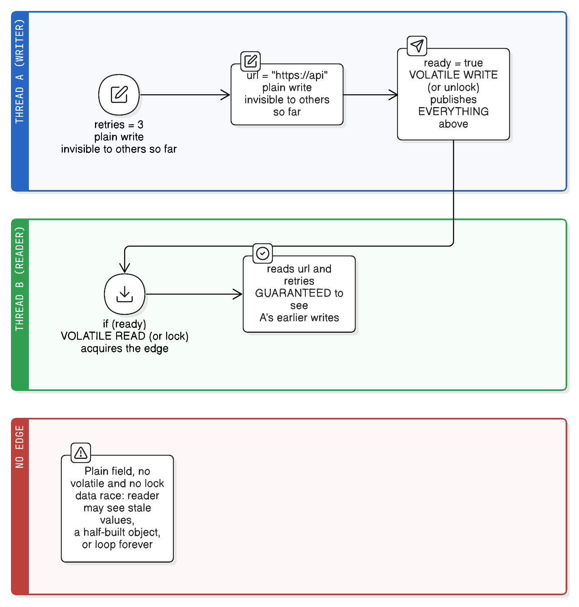

# The Java Memory Model and Happens-Before

> "Threads cannot be implemented as a library."
> — Hans-J. Boehm (2005 paper title)
>
> *Which is exactly why happens-before lives in the Java Language Specification: only the language can define what one thread is allowed to see of another.*

This is the deep version of the happens-before summary in [java-concurrency.md](java-concurrency.md), which covers the practical tools (`synchronized`, `volatile`, atomics, locks, virtual threads). Read this one when you want to know *why* those tools work and how to reason about code that has neither.

## Why a memory model has to exist

You write this:

```java
a = 1;
b = 2;
```

Between your source and the CPU actually storing those values, four separate layers are free to rearrange things:

1. **The compiler** (`javac`) — minor reordering.
2. **The JIT** — aggressive: hoisting loads out of loops, caching fields in registers, eliminating "redundant" reads, reordering independent statements.
3. **The CPU** — out-of-order and speculative execution.
4. **The memory hierarchy** — store buffers and per-core caches, so a write can be *visible to the writing core* long before any other core can see it.

Every one of those is allowed, because they preserve the results of a **single-threaded** program (the "as-if-serial" rule). Nothing about them preserves what *another* thread observes. And because the guarantees differ wildly per CPU architecture — x86 is strongly ordered (TSO), ARM and POWER are weakly ordered — Java can't just say "whatever the hardware does." A portable language needs its own rules.

Those rules are the **Java Memory Model (JMM)**, rewritten in Java 5 by JSR-133, and its central relation is **happens-before**.

### The example that shows the problem

```java
// shared: int x = 0, y = 0;

// Thread 1          // Thread 2
x = 1;               y = 1;
r1 = y;              r2 = x;
```

Intuitively `r1 == 0 && r2 == 0` looks impossible — one of the writes must come first. **It's legal and it happens on real hardware.** Each thread's two statements are independent, so either layer may reorder them, and neither write is required to be visible to the other thread. There is no happens-before edge anywhere in this code, so the JMM offers no guarantee at all.

## Visibility and ordering: two different failures

These get lumped together as "memory issues," but they're distinct, they have different causes, and it's worth being able to name which one you're looking at.

### Visibility — *whether* another thread ever sees your write

A write can be complete, finished, and permanent from the writing thread's point of view while remaining **invisible to every other thread indefinitely**. Three independent layers cause it:

1. **Register/JIT caching** — the compiler may keep a field in a CPU register for the duration of a loop and never re-read memory. This is the dominant cause in practice, and it's why the bug appears only after the JIT compiles the method (often thousands of iterations in).
2. **Store buffers** — a core's write goes into its own store buffer first. It's visible to that core immediately, and to other cores only when it drains.
3. **Per-core caches** — the line holding your field may be exclusive to one core's cache.

```java
private boolean stopped;                  // NOT volatile

// Thread 1
while (!stopped) { work(); }               // may spin forever

// Thread 2
stopped = true;                            // "finished" — but thread 1 may never see it
```

The critical nuance: the JMM does **not** promise "the write becomes visible eventually." Without an edge there is **no bound at all** — not one nanosecond, not one hour. Reasoning about a *duration* here is the mistake; the question is only whether an edge exists.

> **The cache-coherence trap.** "Modern CPUs have coherent caches, so writes must become visible." Coherence does guarantee cores agree on a *single value per cache line* eventually — but it says nothing about store buffers, and nothing at all about the compiler keeping your field in a register. Hardware coherence does not give you Java-level visibility.

**Analogy:** your private notepad (**register/store buffer/cache**) versus the shared filing cabinet (**memory as other threads see it**). You've genuinely written the note (**the assignment completed, and your own thread reads the new value**); nobody else can read it until it's filed *and* they go and fetch it (**until a `volatile`/lock write publishes it and the other thread performs the matching read**).

### Ordering — *in what sequence* another thread sees your writes

Even when writes do become visible, the order in which another thread observes them may differ from your program order. Causes:

1. **Compiler/JIT reordering** of independent statements.
2. **Out-of-order and speculative execution** in the CPU.
3. **Store buffers draining out of order**, and loads being satisfied early.

```java
// Thread 1                    // Thread 2
config = new Config();         if (config != null) {
                               //  may see a NON-NULL reference whose
                               //  fields are still uninitialized
                               }
```

Here `new Config()` is really *allocate → run constructor → publish reference*, and the publish can be observed before the constructor's writes. That's the ordering failure behind broken double-checked locking — nothing is stale or invisible; the writes simply arrive in the wrong order.

**Analogy:** you post two letters, A then B (**two field writes in program order** — say the constructor's field writes, then the reference assignment). The recipient may open B first (**the other thread sees the reference before the fields**). Nothing about the order you posted them constrains the order they arrive, because the postal system reroutes freely (**the JIT and CPU may reorder independent writes, and store buffers drain out of order**) — the only fix is to send them in one registered package the recipient must sign for (**a happens-before edge, whose barrier forbids the reordering across it**).

### Why they're usually solved together

| | Visibility | Ordering |
|---|---|---|
| The question | *Does* the other thread see it? | In *what order* does it see it? |
| Typical symptom | A loop that never exits; a stale counter | A half-built object; two threads both reading 0 |
| Caused by | Register caching, store buffers, per-core caches | Compiler/JIT reordering, out-of-order execution |
| Fixed by | `volatile`, lock, `final`, atomics | The same mechanisms — they also insert memory barriers |

One happens-before edge gives you **both**, which is why the JMM defines one relation instead of two. A `volatile` write is simultaneously "flush what I wrote" *and* "don't move these writes past this point"; acquiring a monitor is both "fetch what the last holder published" and "don't hoist my later reads above this point." That is also the reason `synchronized` is *not just* mutual exclusion — the barrier is half of what you're buying.

**Atomicity is the third, separate problem** and needs saying here because it's the one `volatile` does *not* solve: `count++` is read-modify-write, so two threads can interleave inside it even with perfect visibility and ordering. That one needs a lock or a CAS.

## What "happens-before" actually means

This is the part almost everyone gets wrong on first contact:

> **Happens-before is not about time.** It is not "A executed earlier than B."

`A happens-before B` means: **if** A and B are ordered by this relation, then

1. everything A wrote to memory is **visible** to B, and
2. B cannot observe an ordering of events that contradicts it.

Consequences worth stating explicitly:

- It's a **partial order** — many pairs of actions are simply *unordered*, and for those the JMM promises nothing.
- It's **transitive**: A hb B and B hb C ⟹ A hb C. Almost all real reasoning is chains of transitivity.
- **Reordering is still allowed** — the JMM constrains what you can *observe*, not what the machine does. If a reordering is undetectable within the happens-before order, it's legal.
- Two actions can be "later in wall-clock time" and still have no happens-before edge — which is exactly how a thread reads a stale value written an hour ago.

### Real-life analogy: two offices and a filing cabinet

Two people work in separate offices, each with a private notepad (**a core's store buffer and cache, plus fields the JIT is holding in registers**), and there's one shared filing cabinet in the corridor (**main memory, as other threads can observe it**).

Writing on your own notepad (**a plain, non-`volatile` field write**) is fast — but nobody else can see it, and there's no rule about *when* (or whether) it reaches the cabinet. A **happens-before edge** is the protocol: *I* file my pages in the cabinet (**a `volatile` write, or releasing a monitor**), and *then you* go and fetch them (**a `volatile` read of that same field, or acquiring that same monitor**). Both halves are required (**both the writer and the reader must synchronize** — a synchronized setter with a plain getter is still a data race). If I file and you never fetch, or you fetch before I filed, you learn nothing (**no edge exists between the two actions, so the JMM guarantees nothing**).

And crucially, the edge covers **everything on my notepad** (**all writes I made before the release**), not just the one page I happened to file (**the `volatile` field itself**) — which is what makes the piggybacking pattern below work.

## The rules that create an edge

These are the only ways to get a happens-before relationship. Everything else in `java.util.concurrent` is built on them.

| Rule | The edge |
|---|---|
| **Program order** | Within a single thread, each action happens-before every action later in program order |
| **Monitor lock** | Releasing a monitor (exiting `synchronized`) happens-before any *subsequent* acquisition of that **same** monitor |
| **Volatile** | A write to a `volatile` field happens-before every subsequent read of that same field |
| **Thread start** | `t.start()` happens-before every action in thread `t` |
| **Thread termination** | Every action in `t` happens-before another thread returning from `t.join()` (or seeing `t.isAlive() == false`) |
| **Interruption** | `t.interrupt()` happens-before `t` detecting the interrupt (`InterruptedException` or `isInterrupted()`) |
| **Class initialization** | A class's static initializer completes before any thread can use the class — the JVM holds an internal init lock |
| **Finalizer** | The end of an object's constructor happens-before the start of its finalizer (finalizers are deprecated — this is trivia) |
| **Transitivity** | A hb B and B hb C ⟹ A hb C |

Plus one special mechanism that isn't quite an edge:

- **`final` field semantics** — there's a "freeze" at the end of the constructor. Any thread that receives a reference to a **properly constructed** object is guaranteed to see its `final` fields fully initialized, with no synchronization at all. "Properly constructed" means **`this` never escaped the constructor** (no registering listeners, no starting threads, no assigning to a static field from inside it).



### Piggybacking: the pattern all of `java.util.concurrent` uses

Because the edge publishes *everything*, you can write plain non-volatile fields and then publish them all with **one** synchronization action:

```java
class Config {
    private int retries;                  // plain fields — no volatile
    private String url;
    private volatile boolean ready;       // the ONE synchronization point

    void init() {
        retries = 3;                      // (1)
        url = "https://api";              // (2)
        ready = true;                     // (3) volatile write — publishes (1) and (2)
    }

    void use() {
        if (ready) {                      // (4) volatile read
            System.out.println(url);      // guaranteed to see (2), by transitivity:
        }                                 // (1),(2) hb (3) hb (4) hb this read
    }
}
```

This is exactly why library calls give you visibility "for free" — each of these carries an edge:

- `Lock.unlock()` → a later `lock()`
- `queue.put()` → a later `take()` on the same `BlockingQueue`
- `latch.countDown()` → a returning `latch.await()`
- `semaphore.release()` → a later `acquire()`
- `executor.submit(task)` → the task starting; the task finishing → `future.get()` returning
- Any `Atomic*`/`VarHandle` volatile-mode write → a later read
- `CompletableFuture` completion → its dependent stages

## The promise: data-race-free ⟹ sequentially consistent

Two terms that get used interchangeably and shouldn't be:

- A **race condition** is a *correctness* bug: the result depends on timing (e.g. check-then-act).
- A **data race** is a *formal* condition: two threads access the same non-`volatile` field, at least one writes, and there's no happens-before edge between them.

The JMM's central guarantee: **if your program has no data races, it behaves as if it were sequentially consistent** — as if all actions from all threads happened in one simple global order, each seeing the latest value. All the reordering weirdness above becomes unobservable.

If you *do* have a data race, you get no bounds at all. Not "you might read a stale value" — the code is simply outside the spec, and the JIT is entitled to do things like hoist your field read out of the loop entirely:

```java
private boolean stopped;                  // NOT volatile
public void run() {
    while (!stopped) { work(); }           // JIT may legally hoist to: if (!stopped) while(true) work();
}
```

That's not a theoretical concern — it's the classic "my thread won't stop" bug, and it reproduces reliably in C2-compiled code.

Two things the JMM does still guarantee even for racy code: no **out-of-thin-air** values (you'll read some value that was actually written, not a random one), and no **word tearing** for fields — with one explicit exception: non-`volatile` `long` and `double` reads/writes may be split into two 32-bit halves, so a racy 64-bit read can see one half of each of two different writes. Declaring them `volatile` makes them atomic.

## Safe publication: the four correct idioms

"Publication" = making a newly built object visible to other threads. There are exactly four safe ways:

```java
// 1. Static initializer — the class-init lock does the work. Simplest correct lazy init.
class Holder {
    private static class Lazy { static final Config INSTANCE = new Config(); }
    static Config get() { return Lazy.INSTANCE; }   // initialized on first use, thread-safe, no locking
}

// 2. volatile field (or AtomicReference)
private volatile Config config;

// 3. final field, set in a constructor whose `this` never escapes
private final Map<String, String> data;          // immutable object → publish anywhere freely

// 4. Guarded by a lock — write and read both inside the same monitor
synchronized void set(Config c) { this.config = c; }
synchronized Config get()      { return config; }
```

And the classic broken version, plus why:

```java
// BROKEN without volatile
private Config config;
Config get() {
    if (config == null) {
        synchronized (this) {
            if (config == null) config = new Config();   // (a) allocate  (b) run ctor  (c) assign ref
        }
    }
    return config;   // another thread can see the ref from (c) before (b) finished →
}                    // a non-null reference to a half-initialized object
```

The `synchronized` block is not enough because the *reader* on the fast path never acquires the monitor, so there's no edge. Marking `config` `volatile` supplies one.

## Common misconceptions

| ❌ Belief | ✔ Reality |
|---|---|
| "Happens-before means it happened earlier in time" | It's a visibility/ordering guarantee. Unordered actions can be far apart in time and still invisible to each other |
| "`volatile` makes `count++` thread-safe" | It's a read-modify-write; `volatile` gives visibility, not atomicity |
| "`synchronized` is just mutual exclusion" | It's also a memory barrier — that's half its value |
| "Only the writer needs to synchronize" | **Both** sides need the edge. A synchronized setter with an unsynchronized getter is still a data race |
| "It works on my machine, so it's correct" | x86 is strongly ordered and hides most of these bugs; the same code breaks on ARM (Apple Silicon, Graviton) |
| "`Thread.sleep()`/`yield()` flush memory" | Neither creates any happens-before edge |
| "A single write and many reads is safe" | Only with `volatile`, `final`, or a lock — otherwise readers may never see it |
| "All fields `final` means immutable" | Also requires no escaping `this` and deep immutability (a `final List` field can still be mutated) |
| "Testing proved there's no race" | A data race can stay hidden for years and appear after a JIT/hardware change. Absence of failures proves nothing |

## Decision checklist: how do I get the edge I need?

| What you're doing | Option A | Real-life example (A) | Option B | Real-life example (B) |
|---|---|---|---|---|
| Publishing a **single flag** one thread sets and others poll | `volatile` — cheapest correct edge | A `shuttingDown` flag read by worker loops | A lock, once you also read-modify-write it | `if (!draining) { draining = true; flush(); }` |
| Publishing a **fully built object once** | `final` field / static holder idiom — no synchronization needed at all | An immutable `record` of loaded reference data | `volatile`/`AtomicReference` when it's replaced later | A config object hot-reloaded at runtime |
| Protecting **several mutable fields** | `synchronized` — one edge covers all of them | Debiting one balance and crediting another | `ReentrantLock` if you need timeout/conditions | A bounded buffer with not-full/not-empty conditions |
| **Handing work** to another thread | A `BlockingQueue` or executor `submit` — the edge is built in | A producer thread feeding N consumers | Manual `wait`/`notify` + shared field | Legacy code predating `java.util.concurrent` |
| **Waiting for completion** | `Future.get()` / `join()` / `CountDownLatch.await()` — all carry edges | Warm 3 caches, then start serving | Polling a `volatile` "done" flag | A progress flag on a long-running import |
| Publishing **many plain fields** cheaply | Piggyback: write fields, then one `volatile` write; reader reads volatile first | An immutable-after-init parser table | Make every field `volatile` (needless cost, easy to get wrong) | Rarely the right answer |
| Reading a **64-bit** counter written by another thread | `volatile long` / `AtomicLong` — atomic and visible | A byte-count metric read by a monitoring thread | Plain `long` — may tear into two halves | Never, in concurrent code |

## Verifying, since testing barely helps

- **`jcstress`** (OpenJDK's concurrency stress harness) exists specifically to expose JMM violations by running billions of interleavings and recording observed outcomes.
- **Run on weakly-ordered hardware** (ARM: Apple Silicon, AWS Graviton). Bugs invisible on x86 surface there.
- **Read the JIT's assumptions**, not just the source — a field read in a loop is the classic hoisting candidate.
- **`VarHandle`** (Java 9+) exposes the intermediate access modes — plain, opaque, acquire/release, volatile — for when full `volatile` is more ordering than you need. Powerful and very easy to get wrong; the JDK itself is the main audience.

## Key takeaways

- The compiler, JIT, CPU, and caches all reorder freely; they only promise to preserve *single-threaded* results. The JMM exists to define what threads see of each other, portably across x86 and ARM.
- Happens-before is a **visibility and ordering guarantee, not a statement about time**, it's a **partial order**, and nearly all reasoning with it is **transitivity**.
- The edges come from a short, closed list: program order, monitor release→acquire, volatile write→read, `start()`, `join()`, interruption, class init — plus `final`-field freeze for safe publication.
- A synchronization action publishes **everything** written before it, which is why "piggybacking" plain fields behind one `volatile` write works, and why every `java.util.concurrent` handoff gives visibility for free.
- **Both** sides need the edge — a synchronized writer with an unsynchronized reader is still a data race.
- Data-race-free programs behave as if sequentially consistent; racy programs have *no* guarantees, and the classic symptom is a hoisted flag check that loops forever.
- Non-`volatile` `long`/`double` may be read as two halves — the one place Java allows tearing.
- Safe publication has exactly four correct forms: static-holder/class-init, `volatile`/`AtomicReference`, `final` with no escaping `this`, or a lock on both sides.

## See also

- [java-concurrency.md](java-concurrency.md) — the practical toolbox built on these rules: `synchronized`, `volatile`, atomics, locks, concurrent collections, executors, virtual threads.
- [java-memory-management.md](java-memory-management.md) — per-thread stacks vs the shared heap, the physical reason visibility is a problem.
- [java-program-execution.md](java-program-execution.md) — the JIT (C1/C2) whose optimizations these rules constrain, and the class loading/initialization that provides one of the edges.
- [../system-design/redis-single-threaded.md](../system-design/redis-single-threaded.md) — sidestepping all of it by having exactly one thread.
