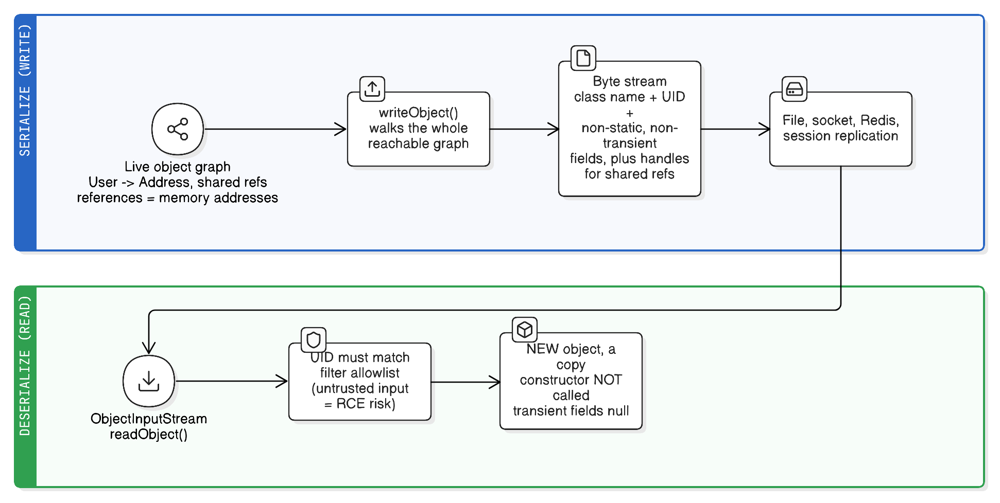

# Java Serialization (Objects to Bytes and Back)

> "Java serialization was a horrible mistake."
> — Mark Reinhold, chief architect of the Java Platform (2018), noting that a large share of Java's security vulnerabilities have involved it
>
> *Which is the summary of this whole note: know how it works, know where you'll still meet it, and use something else for anything new.*

**Serialization** is converting a live object into a **byte sequence** you can store or transmit, and **deserialization** is rebuilding an object from those bytes. Note this is the *object-to-bytes* meaning of the word, unrelated to "serialized execution" in [java-concurrency.md](java-concurrency.md) (forcing operations to run one at a time).

The problem it solves: an object on the heap is a graph of **references** — memory addresses that mean nothing to a file, a socket, or another JVM. You can't write a pointer to disk and expect it to work tomorrow. Serialization flattens the graph into something self-contained.

Why you'd want it:

- **Persistence** — write state to a file or a database blob (see [../system-design/blobs-and-large-object-storage.md](../system-design/blobs-and-large-object-storage.md)).
- **Transport** — send an object over a network to another process or machine.
- **Caching** — store values in Redis/Memcached/Hazelcast, which speak bytes.
- **Session replication** — Tomcat copying `HttpSession` contents to another node.
- **Deep copy** — serialize then deserialize to clone an entire object graph.

## Real-life analogy: flat-pack furniture

An assembled chair (**a live object graph on the heap**) can't go through the letterbox — so the factory ships it disassembled: flat panels plus a parts list saying which panel bolts to which (**the byte stream: field values plus reference handles linking objects in the graph**). You post that box (**write to a file or socket**) and the recipient rebuilds it (**deserialization**).

Each part of the analogy maps to a real consequence:

- What arrives is a **different physical chair**, identical in shape (**deserialization produces a new object with `==` inequality to the original — a copy, not the same identity**).
- The instructions only work if the model number matches (**`serialVersionUID`**); if the factory quietly redesigned the frame, the parts won't fit (**a changed class throws `InvalidClassException`**).
- The cushion isn't in the box because it's sold separately (**`transient` fields are skipped and come back as `null`/`0`**).
- The rebuilt chair **never went down the factory assembly line** with its quality checks (**deserialization does not call your constructor, so constructor validation and invariants are bypassed** — the root of the security problem below).
- Anything bolted to the chair comes along whether you wanted it or not (**the whole reachable graph is serialized; one non-serializable field anywhere throws `NotSerializableException`**).



## Why a pointer can't be written to disk (the deep version)

The opening claim — "references are memory addresses that mean nothing outside this JVM" — is worth unpacking, because it explains every design choice in the rest of this note.

### What an object physically is

A Java object in the heap is a **header plus fields**:

```
0x7f3a2c001a40:  [ mark word ][ klass pointer ]     ← the header
                 [ age: 42 ]                        ← a primitive field, inline
                 [ name:    0x7f3a2c0019c0 ]        ← a REFERENCE field: an address
                 [ address: 0x7f3a2c001b80 ]        ← another address
```

- The **mark word** holds runtime bookkeeping: identity hash code (once computed), lock/monitor state, GC age bits.
- The **klass pointer** points into JVM metaspace, at the runtime representation of `User`.
- A **reference field** holds an address (or, with compressed oops on heaps under ~32 GB, a 32-bit offset from the heap base).

So `user.name` doesn't *contain* the string — it contains a number saying where the string lives. And that `String` in turn contains a reference to a `byte[]` somewhere else. Your one "object" is a **graph** spread across the heap.

### Four independent reasons that number is useless elsewhere

1. **Address spaces are per-process.** Every process has its own virtual address space, so `0x7f3a2c001a40` in your JVM refers to something completely different — or nothing at all — in another process. ASLR re-randomizes the layout on every launch, so it isn't even stable across two runs of the *same* program.
2. **The garbage collector moves objects.** This is the one people miss: even *within* one running JVM, addresses aren't stable. Compacting and evacuating collectors (Serial, Parallel, G1) copy live objects to new locations and rewrite every reference to them; ZGC and Shenandoah relocate objects *concurrently* with your code. An address you recorded a few milliseconds ago may already be stale.
3. **Layout is JVM-, version-, and platform-specific.** Header size, field ordering and padding, compressed-oops on/off, and endianness all differ. Bytes written by one JVM would be misread by another.
4. **Most of the header isn't your data.** Lock state, GC age, and identity hash describe this object's life *in this JVM*. Saving them is meaningless; restoring them would be wrong.

A raw memory dump would therefore be non-portable *and* semantically wrong: it records **where things are**, not **what they are**.

### What serialization actually substitutes: handles

Serialization is a **graph traversal that replaces addresses with stream-local identifiers**. The writer keeps an identity-based table of everything it has already written:

- First time an object is encountered → write its class descriptor and field values, and assign it the next **handle** (the JDK protocol numbers them from `0x7E0000`).
- Every later encounter of that same object → write just the handle, not the contents again.

The reader keeps the mirror table: handle → the new object it created. That single mechanism buys three things:

- **Sharing survives.** If two `User`s reference one `Address`, the address is written once; after reading, both users point at *one* object again.
- **Cycles terminate.** `a.b = b; b.a = a` writes `a`, starts `b`, hits the back-reference to `a`'s handle, and stops — no infinite recursion.
- **The result is topologically equivalent, physically unrelated.** Same who-points-to-whom, entirely different addresses, and `deserialized != original`.

#### What a "handle" concretely is

A handle is just a **sequential integer ID that the stream assigns to each thing it writes**, so later occurrences can refer back to it by number. Nothing more exotic than a footnote marker.

- The writer keeps a counter starting at `baseWireHandle = 0x7E0000` and an **identity-based** map (keyed by `==`, not `equals`) of object → handle. Handles are handed out in order of first appearance: `0x7E0000`, `0x7E0001`, `0x7E0002`, …
- Handles are assigned not only to objects but to **class descriptors, strings, arrays, and enum constants** too. That's why a list of 10,000 `User`s carries the `User` class descriptor exactly once — every later object references it by handle.
- On a repeat encounter of the same instance, the writer emits `TC_REFERENCE` (`0x71`) plus the 4-byte handle — **5 bytes instead of the whole object**.
- The reader keeps the mirror structure: a growable array indexed by handle, holding the object it created for each one. Hitting a `TC_REFERENCE` is a lookup that returns *the same instance* it already built.

```
0xAC 0xED 0x00 0x05        stream magic + version
TC_OBJECT ... User ...     first User    → handle 0x7E0002 (say)
  TC_OBJECT ... Address    its address   → handle 0x7E0003
TC_OBJECT ... User ...     second User   → handle 0x7E0004
  TC_REFERENCE 0x007E0003  same address  → 5 bytes, no contents repeated
```

Handles are **per-stream and cumulative**, which produces two consequences that surprise people:

- **A long-lived `ObjectOutputStream` never forgets.** The handle table holds a strong reference to every object ever written, so a stream kept open for hours is a memory leak by design. `reset()` clears both tables (writing `TC_RESET`) and starts handle numbering over.
- **Re-writing a mutated object sends only the handle, not the new state.** This one bites hard in socket protocols:

```java
out.writeObject(order);      // full contents
order.setStatus(SHIPPED);    // mutate
out.writeObject(order);      // just TC_REFERENCE — the receiver still sees PENDING!

out.reset();                 // fix: forget the handle table, so the object is written fresh
// or: out.writeUnshared(order);  // write without participating in handle sharing
```

The one-line summary: **serialization converts pointer identity into positional identity.** Every serialization format solves the same problem the same way — relational databases use foreign keys instead of pointers, protobuf uses field numbers, and JSON uses nesting, which is exactly why JSON *loses* sharing (a tree can't express "these two branches are the same object") unless you bolt identity back on with `@JsonIdentityInfo`.

### Two consequences that look arbitrary until you see this

- **`transient` exists because some state is genuinely process-bound.** An open `Socket`, a `FileChannel`, a thread, a JDBC `Connection`, a held lock — the field holds a number that indexes into *this* OS process's resources. Copying that number to another machine produces a dangling reference to a resource that doesn't exist there. There's nothing to serialize, so you mark it `transient` and re-establish it after reading.
- **The class itself is re-resolved, not transported.** The stream carries the class *name* and `serialVersionUID`; the reader looks that name up through its **own** classloader (see [java-program-execution.md](java-program-execution.md) — a class's identity is the `(name, loader)` pair, not just the name). If it's absent you get `ClassNotFoundException`; if it's a different version, `InvalidClassException`. One notable exception: **enum constants** are written by name and resolved back to the existing singleton constant, so enum identity *is* preserved — which is why an enum is the most robust way to implement a serializable singleton.

### Analogy: plot numbers versus a description

Your address book says "the Smiths live at plot #47" (**a reference field holding a heap address**). Post that book to another city (**another JVM or process**) and plot #47 there is an unrelated building (**the same numeric address maps to different memory**). Worse, even in your own city the council renumbers plots during redevelopment (**the GC relocating objects and rewriting references**), so the number can go stale where you're standing.

What travels usefully is not the numbers but a description with **internal** references: "the Smiths, whose neighbour is person #2 named later in this same letter" (**stream handles — identity by position within the payload**). The recipient lays out their own street with their own numbering (**new objects at new addresses**) while preserving exactly who lives next to whom (**graph topology preserved; addresses discarded**).

## How Java's built-in mechanism works

`Serializable` is a **marker interface** — no methods at all. It just flags "the JVM may write my fields out."

```java
class User implements Serializable {
    private static final long serialVersionUID = 1L;   // always declare this explicitly

    private String name;              // written
    private int age;                  // written
    private Address address;          // written — Address must also be Serializable
    private transient String password;// SKIPPED — comes back null
    private static String appName;    // SKIPPED — static state belongs to the class, not the instance
}

// write
try (var out = new ObjectOutputStream(new FileOutputStream("user.ser"))) {
    out.writeObject(user);
}

// read
try (var in = new ObjectInputStream(new FileInputStream("user.ser"))) {
    User u = (User) in.readObject();   // throws ClassNotFoundException if the class is missing
}
```

**What actually goes into the stream:** a magic header and version, then for each object its class name, `serialVersionUID`, field descriptors, and the values of all **non-`static`, non-`transient`** fields — recursively for every object reachable from the root. Shared and cyclic references are handled with **handles**: the second time the same object appears, the stream writes a back-reference instead of duplicating it, so `a.b == b.a` cycles serialize fine and object identity *within one stream* is preserved.

### How deserialization creates an object without your constructor

This surprises everyone, so it's worth seeing the mechanism. `readObject` does **not** do `new User(...)`. It:

1. Asks `ReflectionFactory.newConstructorForSerialization(User.class)` for a synthetic constructor. That constructor runs the **no-arg constructor of the nearest non-`Serializable` superclass** — for most classes that's just `Object()`.
2. Allocates the object with that, so it exists but is entirely blank.
3. Sets each serializable field **directly** — reflectively, bypassing access checks, and including `final` fields.
4. Then calls your `readObject` (if you wrote one), per class in the hierarchy, superclass-first.

Three things therefore never run: **your constructors**, your **field initializers**, and your **instance initializer blocks**.

```java
class User implements Serializable {
    private List<String> tags = new ArrayList<>();   // NEVER runs during deserialization
    private final int version;
    { audit("constructed"); }                        // NEVER runs
    User(String name) { validate(name); this.version = 1; }   // NEVER runs
}
```

The consequences are all the same consequence:

- **A field absent from the stream is `null`/`0`, not its initializer value.** This is the sharpest practical edge: add `private List<String> tags = new ArrayList<>();` in v2 and read data written by v1 — `tags` is **`null`**, not an empty list, and you get an NPE far from the cause. The fix is to normalise in `readObject` (`if (tags == null) tags = new ArrayList<>();`).
- **`final` fields aren't what the constructor promised.** They're assigned from the stream, so "this can't be null, the constructor checks it" stops being true.
- **Validation is skipped**, which is why `readObject` is best thought of as *another public constructor accepting arbitrary bytes* — hence explicit re-validation and defensive copies (see below).
- **Injected/derived state is missing** — a `transient` logger, Spring-injected collaborator, or cached total is blank until you rebuild it.
- **Singletons get duplicated**, which is what `readResolve()` and enums fix.

**Why the JVM works this way:** the goal is to restore *state that already existed*, and a constructor is the wrong tool for that. It may require arguments the stream can't supply, may reject values that were legitimately valid in an older version, and may have side effects (registering listeners, opening resources, writing audit rows) that must not happen again on a restore. So the design allocates memory and installs state, treating construction and restoration as different operations.

The mechanism isn't unique to serialization: `Unsafe.allocateInstance`, Objenesis, Kryo, and Hibernate's lazy proxies all create objects without running constructors. Serialization is just the one that ships in the JDK.

**The exceptions worth remembering:** `Externalizable` requires a **public no-arg constructor and does call it** before `readExternal`; a **record**'s deserialization goes through its **canonical constructor**, so validation runs; and the **serialization-proxy pattern** deliberately routes reconstruction through a real constructor for the same reason.

### What order are the fields written in?

Not declaration order — the specification imposes a **canonical order**, because it can't rely on anything else. `Class.getDeclaredFields()` has an explicitly *unspecified* order in the JVM spec, and a compiler is free to emit fields in any order, so if the stream followed either one, bytes written by one compiler could be unreadable by another build of the same class.

The rules, in order of application:

1. **Superclass data first.** The stream is a sequence of per-class blocks, walked from the topmost `Serializable` superclass down to the concrete class. Each class contributes its own descriptor, its own field block, and its own `writeObject`/`readObject` if it has one. (This mirrors constructor order, which is why superclass state is always present before a subclass's `readObject` runs.)
2. **Within one class: primitives first, then object references.** All primitive fields are written as a packed block, then reference fields.
3. **Within each of those two groups: alphabetically by field name.**

```java
class User implements Serializable {
    private String name;      // declared 1st
    private int age;          // declared 2nd
    private boolean active;   // declared 3rd
    private Address address;  // declared 4th
}
// Written as: active, age  (primitives, alphabetical)
//         then address, name  (references, alphabetical)
```

Two important things follow.

**Reading matches by name and type, not by position.** The stream is self-describing — each class block carries field descriptors — so `ObjectInputStream` maps stream fields onto the local class's fields **by name+type**. That's exactly what makes evolution tolerable: a field in the stream but not in your class is skipped, and a field in your class but not in the stream gets its default value (`null`/`0` — *not* its initializer, as above). Order is a property of the bytes, not of the matching.

**Declaration order doesn't affect the default `serialVersionUID` either.** The auto-computed UID hashes a canonical description in which fields are sorted by name and methods by name and signature — so shuffling your field declarations is safe, while *renaming* one is not. (Another reason to just declare the UID explicitly.)

### When you take over the ordering

The moment you write a custom `writeObject`, the extra values you emit are a **positional protocol you own**, and `readObject` must mirror it exactly:

```java
private void writeObject(ObjectOutputStream out) throws IOException {
    out.defaultWriteObject();     // the canonical block, in spec order
    out.writeInt(checksum);       // then YOUR data, in YOUR order
    out.writeUTF(region);
}
private void readObject(ObjectInputStream in) throws IOException, ClassNotFoundException {
    in.defaultReadObject();
    this.checksum = in.readInt(); // must read in the SAME order
    this.region   = in.readUTF(); // swap these two lines and you get garbage
}                                 // or StreamCorruptedException / EOFException
```

If you want the robustness of name-based access for your own fields too, use the `PutField`/`GetField` API instead of positional reads — it looks fields up **by name** and supplies a default when they're absent, which makes adding a field later a non-event:

```java
ObjectInputStream.GetField f = in.readFields();
this.checksum = f.get("checksum", 0);      // name-based, with a default
```

Finally, this ordering has **nothing to do with the object's layout in memory** — HotSpot arranges fields for alignment and padding, reorders them freely, and never exposes that layout. Serialization defines its own order precisely so it doesn't inherit any of that variability.

### `serialVersionUID`, the model number

If you don't declare it, the JVM computes one from the class's structure — name, fields, methods, modifiers. Add a field or rename a method and the number silently changes, so old bytes stop loading with `InvalidClassException`. Worse, it can differ between compilers. **Always declare it explicitly**, and keep it stable while changes remain compatible.

Roughly what's compatible: adding a field (comes back as default), removing a field (value in the stream is ignored), adding a class to the hierarchy. What breaks: changing a field's type, renaming a field or class, changing the class's place in the hierarchy, making a class non-serializable.

### The customization hooks

```java
// 1. Custom read/write — must be private with these exact signatures
private void writeObject(ObjectOutputStream out) throws IOException {
    out.defaultWriteObject();               // write the normal fields first
    out.writeUTF(encrypt(password));        // then handle the transient one yourself
}
private void readObject(ObjectInputStream in) throws IOException, ClassNotFoundException {
    in.defaultReadObject();
    this.password = decrypt(in.readUTF());
    if (age < 0) throw new InvalidObjectException("age");   // validate — the ctor did NOT run
}

// 2. readResolve — swap the deserialized instance for another (protects singletons)
private Object readResolve() { return INSTANCE; }

// 3. writeReplace — serialize a stand-in object instead of this one (the "serialization proxy" pattern)
private Object writeReplace() { return new UserProxy(this); }
```

- **`Externalizable`** goes further: you implement `writeExternal`/`readExternal` and control every byte. It requires a **public no-arg constructor** (which *is* called on read, unlike `Serializable`), and you're responsible for the superclass state too.
- **The serialization proxy pattern** (Effective Java, Item 90) is the safest form: serialize a small private static nested class holding the logical state, and rebuild the real object through its normal constructor in `readResolve()`. Invariants get enforced because the constructor actually runs.
- **Records** (Java 16+) are the modern good news: a record's serialized form is its state components, and deserialization goes **through the canonical constructor** — so validation runs, and the customization hooks are deliberately ignored. Records can't be attacked the way ordinary `Serializable` classes can.

## Why classes override the default form

Default serialization is convenient — implement a marker interface and you're done — but it makes **your private field layout the wire format**. That's rarely what you want, for four reasons.

### 1. It's inefficient, because fields aren't the same as content

Default serialization writes fields, including everything that's merely *representation*:

- **Unused capacity.** An `ArrayList` with `size == 3` and capacity 1000 would write an `Object[1000]` — 997 `TC_NULL` markers of pure waste. A `HashMap` would write its whole `Node[]` table, mostly empty buckets.
- **Per-node framing.** Serializing a `LinkedList`'s internals means each element gets wrapped in a `Node` object in the stream: object marker, class descriptor reference, a handle, and three fields (`item`, `next`, `prev`) instead of just the element. Easily 2–3× the bytes for the same information.
- **Derived and cached state.** Memoized hash codes, `modCount`, cached `keySet`/`values` views, computed totals — all recomputable, none worth persisting, and some actively wrong to restore (a cached view pointing at the old instance).

So the fix isn't just "smaller": writing `size` plus the elements is the *correct* description of a list. The array is an implementation choice.

### 2. Recursive internal structures blow the stack

This one is a mechanical trap, not a style preference. `ObjectOutputStream.writeObject` walks the graph **depth-first using the Java call stack**. For a linked structure where each node references the next, serializing node 1 recurses into node 2 while node 1's frames are still live — so an N-element chain needs **N nested levels** of frames (several JVM frames each).

With a typical 512 KB–1 MB thread stack, that means a `StackOverflowError` at a few thousand elements — and it happens *mid-write*, leaving a truncated, unreadable stream. `readObject` recurses symmetrically, so even a stream that was written successfully on a big-stack thread can fail to load elsewhere.

```java
// Default form: depth = number of elements → StackOverflowError on long chains
private void writeObject(...) { /* default: writes first, which writes next, which writes next... */ }

// Custom form: depth = 1 per element, iterative → no stack growth at all
for (Node<E> x = first; x != null; x = x.next) s.writeObject(x.item);
```

This is exactly why `LinkedList` marks `first`/`last` `transient`. It bites user code too: hand-rolled linked lists, parent/child trees serialized through their links, long `Exception.cause` chains, and JPA entity graphs.

### 3. It freezes your internals into a permanent public contract

The stream carries **field descriptors** — your private field names and types, literally. So the serialized form is an API you publish without meaning to:

- Rename `elementData` to `items` → old data no longer loads.
- Change a field's type, move it to a superclass, or restructure the hierarchy → incompatible.
- Replace an array with chunked segments → impossible without breaking every stored byte.

Compare with what actually happened in the JDK: `HashMap` gained treeified bins in Java 8, `ArrayList` gained lazy empty-array allocation, `List.of` introduced whole new immutable classes — and data written by Java 6 still reads today, **because none of those classes ever serialized their representation.** Choosing `transient` + `writeObject` is choosing which promises you're willing to keep forever.

### 4. It bypasses your constructor, so invariants aren't enforced

Because deserialization doesn't call a constructor, `readObject` is effectively **another public constructor that accepts arbitrary bytes** — an attacker can hand-edit a stream to produce a state your class believes impossible (a negative balance, an empty required list, a date range that runs backwards). Two defences belong in every custom `readObject`:

```java
private void readObject(ObjectInputStream in) throws IOException, ClassNotFoundException {
    in.defaultReadObject();
    this.items = new ArrayList<>(items);          // defensive COPY of mutable components:
                                                   // the stream may hold an extra reference to
                                                   // the original ("stolen reference" attack),
                                                   // letting the attacker mutate it afterwards
    if (start.isAfter(end)) throw new InvalidObjectException("start after end");  // re-validate
}
```

### The advanced escape hatch: declare the form explicitly

Beyond `transient`, you can decouple the serialized form from your actual fields entirely:

```java
private static final ObjectStreamField[] serialPersistentFields = {
    new ObjectStreamField("size", int.class),     // the wire contract, independent of real fields
};
private void writeObject(ObjectOutputStream out) throws IOException {
    ObjectOutputStream.PutField f = out.putFields();
    f.put("size", computeSize());                 // fill the declared form however you like
    out.writeFields();
}
```

Now the class's internals can change freely; only the declared names are promised. In practice, the **serialization proxy** pattern achieves the same decoupling more readably, and is the recommended route.

### Summary

| Problem with the default form | Symptom | Fix |
|---|---|---|
| Writes representation, not content | Bloated streams (null slots, wrapper nodes, caches) | `transient` internals + write logical state in `writeObject` |
| Depth-first recursion over links | `StackOverflowError` mid-write on long chains | Iterate in `writeObject`; rebuild in a loop in `readObject` |
| Private fields become the contract | Renaming a field breaks old data forever | Design the serialized form deliberately: `transient`, `serialPersistentFields`, or a proxy |
| Constructor never runs | Invalid or maliciously crafted objects | Validate + defensively copy in `readObject`, or use a proxy so the real constructor runs |

## Why it's discouraged

**1. Security — this is the big one.** Deserializing untrusted data is remote code execution waiting to happen. Because `readObject` runs *before* you can inspect anything, and because it constructs arbitrary classes found on the classpath, an attacker can craft a stream that chains together existing library classes ("**gadget chains**") into arbitrary command execution. Apache Commons Collections was the famous carrier; `ysoserial` turns this into a point-and-click exercise. The rule is absolute: **never deserialize data you don't control.** If you must, use an allowlist filter:

```java
// JEP 290 (Java 9+): reject everything except known-safe classes
var filter = ObjectInputFilter.Config.createFilter("com.myapp.dto.*;java.base/*;!*");
in.setObjectInputFilter(filter);        // or the -Djdk.serialFilter system property
```

**2. It breaks encapsulation.** Your private fields *are* the wire format. Rename a field and you break compatibility with data written by the old version — the serialized form becomes a permanent public API you never intended to publish.

**3. It bypasses constructors.** No constructor, no validation, no final-field guarantees during construction. An object can exist in a state your class considers impossible.

**4. It's Java-only.** No Python, Go, or JavaScript consumer can read it, and the bytes are opaque to every debugging tool.

**5. It's neither compact nor fast** compared with purpose-built formats, because it writes class metadata alongside the data.

## What to use instead

| Format | Shape | Good for | Trade-offs |
|---|---|---|---|
| **JSON** (Jackson, Gson) | Text, self-describing | REST APIs, config, logs, anything a human may read | Verbose; no schema by default; dates/precision need care |
| **Protocol Buffers / Thrift** | Binary, schema-first (`.proto`) | Service-to-service RPC (gRPC), strict versioned contracts | Requires a schema and codegen; not human-readable |
| **Avro** | Binary, schema travels with or beside data | Kafka topics, data lakes, schema-registry setups | Schema management overhead |
| **MessagePack / CBOR** | Binary JSON-ish | Compact wire format keeping JSON's flexibility | Less tooling than JSON or protobuf |
| **Kryo / FST** | Binary, JVM-only | Fast internal caching, Spark-style shuffles | Java-only; version-fragile; same untrusted-data caveats |
| **Java `Serializable`** | Binary, JVM-only, class-coupled | Legacy interop only | Security, versioning, and coupling problems above |

Practical default: **JSON for anything external or human-facing, protobuf/Avro when you need compactness and a strict schema, and records + Jackson for DTOs inside a Spring app.**

## How this differs from JSON (Jackson's `ObjectMapper`)

Both are "serialization" in the same object-to-bytes sense, so the reasonable question is whether `objectMapper.writeValueAsString(user)` is just the same thing in a nicer format. It isn't — they serialize **different things**.

- **JDK serialization encodes the object.** Exact class identity, private fields regardless of access, and the shape of the graph. Its goal is to reconstruct *that class* with *that internal state*.
- **Jackson encodes the data.** It walks properties (getters, or fields if configured) and emits a document. Its goal is to describe the *logical content*, which is why reading it back requires you to name the target type: `mapper.readValue(json, User.class)`.

```java
// JDK: no type argument needed — the class name is inside the bytes
User u = (User) in.readObject();

// Jackson: YOU supply the type; the JSON is just a document
User u = mapper.readValue(json, User.class);
```

That difference cascades into everything else:

| | JDK serialization | Jackson JSON |
|---|---|---|
| **What's in the payload** | Class name, `serialVersionUID`, all non-`static`/non-`transient` fields | Whatever properties are visible (public getters by default) |
| **How the object is rebuilt** | Memory allocated directly (via `ReflectionFactory`), **your constructor never runs**, private fields set reflectively | A **normal constructor** (no-arg + setters, `@JsonCreator`, or a record's canonical constructor) — so validation runs |
| **Class must opt in** | Every class in the graph must `implement Serializable` | Nothing required; plain POJOs and records work |
| **Object graph** | True graph — **handles** preserve shared references and cycles | A **tree** — shared objects are duplicated; cycles blow up unless you add `@JsonIdentityInfo`/`@JsonBackReference` |
| **Type fidelity** | Exact: a `LinkedList` returns a `LinkedList`, `Integer` stays `Integer`, subclass identity preserved | Lossy: JSON has one number type, `Object`-typed fields land as `LinkedHashMap`/`Integer`/`Double`, dates need configuration, subclasses need `@JsonTypeInfo` |
| **Hiding a field** | `transient` | `@JsonIgnore` — **`transient` is not reliably honoured**; a `transient` field with a public getter still gets serialized |
| **Readable / debuggable** | Opaque binary | Text you can `curl`, grep, diff, and paste into a bug report |
| **Cross-language** | Java only | Any language |
| **Schema evolution** | `serialVersionUID` + strict field-compatibility rules | Tolerant: unknown fields can be ignored (`FAIL_ON_UNKNOWN_PROPERTIES=false`), missing ones default |
| **Untrusted input** | Instantiates arbitrary classpath classes → gadget-chain RCE | Instantiates only the type you asked for — **unless** you enable polymorphic default typing, which has produced a long line of CVEs |
| **Size / speed** | Compact-ish but carries class metadata | Larger (text), compresses well, and Jackson is fast; binary variants (Smile, CBOR) drop the size gap |

The security line is the one worth internalising: Jackson is safer **not** because JSON is text, but because deserializing into a *known target type* means an attacker can't choose which classes get constructed. The moment you switch that off — `activateDefaultTyping`, or `@JsonTypeInfo` over an unconstrained base type — you're back to the same class of vulnerability, which is why Jackson ships a `PolymorphicTypeValidator` and why the old `enableDefaultTyping()` is deprecated.

Two practical consequences of the graph-vs-tree row, since they're the bugs people actually hit:

```java
class Order { List<Item> items; }
class Item  { Order order; }        // bidirectional JPA-style relationship

// JDK serialization: fine — the cycle becomes a back-reference handle
// Jackson: StackOverflowError / JsonMappingException until you annotate:
//   @JsonManagedReference on items, @JsonBackReference on order (or @JsonIdentityInfo)
```

And if the same `Address` instance is referenced by two `User`s, JDK serialization writes it once and both users point at one object after reading; Jackson writes it twice and you get **two distinct `Address` objects** — same values, different identity.

**Bottom line:** JSON via Jackson is the right default for APIs, config, logs, and cross-service messages, and it's safer by construction. JDK serialization's only real advantage is that it faithfully restores an exact Java object graph — which is precisely why frameworks still use it for session replication and JVM-to-JVM caching, and precisely why it's dangerous on untrusted input.

## Do different collections serialize differently? (`ArrayList` vs `LinkedList`)

Both implement `Serializable`, and both **deliberately refuse to serialize their internal representation**. Each declares its guts `transient` and supplies a custom `writeObject`/`readObject` that writes only the *logical* content: the element count, then the elements in order.

```java
// java.util.ArrayList
private transient Object[] elementData;          // the backing array is NOT serialized
private int size;
private void writeObject(ObjectOutputStream s) {
    s.defaultWriteObject();                      // writes `size`
    s.writeInt(size);
    for (int i = 0; i < size; i++) s.writeObject(elementData[i]);
}

// java.util.LinkedList
transient int size;
transient Node<E> first, last;                    // the Node chain is NOT serialized
private void writeObject(ObjectOutputStream s) {
    s.defaultWriteObject();
    s.writeInt(size);
    for (Node<E> x = first; x != null; x = x.next) s.writeObject(x.item);
}
```

So the two byte streams have **nearly identical shape** — class descriptor, then a count, then the elements. What differs is only the class name and `serialVersionUID` in the header, and how each rebuilds itself on read (`ArrayList` allocates one array and fills it; `LinkedList` allocates a `Node` per element and links them).

**Why the JDK bothers**, since this is the lesson worth taking away:

- A naive `LinkedList` would serialize its `Node` graph — three objects' worth of overhead per element, *and* `writeObject` would recurse through `node.next`, so a long list would overflow the stack. Writing elements in an **iterative loop** avoids both.
- A naive `ArrayList` would serialize the whole backing array including its unused null slots — a list with 3 elements and capacity 1000 would write 997 nulls.

This is the same principle as the serialization-proxy pattern earlier in this note: **serialize logical state, not representation.** It also means the JDK collections are free to change their internals without breaking data written by older versions.

Practical differences that do show up:

| | `ArrayList` | `LinkedList` |
|---|---|---|
| Stream size for the same elements | Essentially identical — count + elements | Essentially identical (its much larger *heap* footprint doesn't reach the wire) |
| What's lost | **Capacity** — the deserialized list has capacity == size, effectively `trimToSize()` | Nothing; there's no capacity concept |
| Read cost | One array allocation, then fill | One `Node` allocation **per element** → slower, more GC pressure |
| Class that comes back | `ArrayList` | `LinkedList` — the concrete class is baked into the stream, so you can't read one as the other |

That last row is a real difference from JSON: JDK serialization preserves the concrete implementation, while Jackson reading into a `List<T>` field gives you an `ArrayList` regardless of what was written.

**Related collection gotchas:**

- **`HashMap`/`HashSet`** follow the same pattern — `table` is `transient`, and the stream carries capacity, load factor, size, and the entries; the map **re-inserts and rehashes on read**, so iteration order can differ after a round trip if any key's `hashCode` isn't stable across JVMs (e.g. anything relying on identity hash).
- **`subList()` views are not serializable** — `NotSerializableException` on `java.util.AbstractList$SubList`. Wrap in `new ArrayList<>(view)` first. The same applies to most view types (`keySet()`, `values()`, `entrySet()` of some maps).
- **`List.of(...)`** is serializable but goes through a `writeReplace` proxy (`ImmutableCollections.CollSer`) and comes back immutable — a live example of the proxy pattern in the JDK.
- **Elements must be serializable too.** The collection being `Serializable` says nothing about its contents; one bad element throws `NotSerializableException` naming that element's class, not the list.

## Where you'll still meet Java serialization

Even if you never call `writeObject` yourself:

- **Session replication / clustering** — Tomcat, Spring Session (with JDK serialization configured), and many caches (Hazelcast, Ignite, Infinispan) require `Serializable` values by default.
- **RMI, JMX, and older EJB remoting** are built on it.
- **`HttpSession` attributes** must be serializable the moment you enable session persistence across restarts.
- **Serializable lambdas** — casting a lambda to a `Serializable` functional interface (used by query DSLs like QueryDSL and jOOQ's method references) uses this machinery.
- **`Exception` and most JDK value types** implement `Serializable`, which is why exceptions cross RMI boundaries.

## Gotchas

| Gotcha | Symptom | Fix |
|---|---|---|
| Missing `serialVersionUID` | `InvalidClassException` after an unrelated code change | Declare it explicitly from day one |
| `transient` field needed at runtime | NPE on a field that was populated before | Restore it in `readObject`, or recompute lazily |
| A field's class isn't serializable | `NotSerializableException` naming a nested type | Make it serializable, mark it `transient`, or use a DTO |
| Singleton broken by deserialization | Two "singleton" instances exist | `readResolve()`, or make it an `enum` |
| Non-serializable superclass | `InvalidClassException` | The superclass needs an accessible no-arg constructor |
| Long-lived `ObjectOutputStream` | Memory grows — the handle table retains every object written | `reset()` periodically |
| Re-writing a mutated object on the same stream | Receiver keeps seeing the **old** state (only a 5-byte back-reference was sent) | `reset()` before re-writing, or `writeUnshared` |
| Deserializing untrusted input | Remote code execution | Don't. Otherwise: `ObjectInputFilter` allowlist |
| Assuming identity survives | `deserialized != original`, and `equals` may fail | Implement `equals`/`hashCode` by value |
| Sensitive data in fields | Passwords/keys land in a file or cache in near-plaintext | `transient` + explicit encryption in `writeObject` |

## Decision checklist: how should this object cross a boundary?

| Question | Option A | Real-life example (A) | Option B | Real-life example (B) |
|---|---|---|---|---|
| Does a **non-Java** consumer read it? | JSON or protobuf | A React app or a Python job consuming your API | Java serialization is a dead end | N/A |
| Is the data from an **untrusted source**? | JSON/protobuf into a DTO — parsers don't instantiate arbitrary classes | A public webhook payload | Java serialization only behind a strict `ObjectInputFilter` | An internal RMI call between two services you own |
| Do you need a **strict, versioned contract**? | Protobuf/Avro with a schema registry | Kafka events shared across teams | JSON with tolerant readers | An internal API where fields are added often |
| Is it a **short-lived internal cache** where speed dominates? | Kryo or protobuf | Spark shuffle data; a hot Redis cache of computed values | JSON, when debuggability matters more | Cached API responses you want to `GET` and eyeball in Redis |
| Must it survive **class evolution over years**? | A schema-based format with explicit field numbers | Event-sourced data replayed from 2019 | Java serialization — brittle by construction | Never, for long-lived data |
| Are you **forced** into `Serializable` by a framework? | Implement it, but keep the class a thin DTO with an explicit `serialVersionUID` | Session attributes in a clustered Tomcat | Use the serialization-proxy pattern for anything with invariants | A value object with validation rules to preserve |
| Is it a **record / immutable value**? | Records serialize via the canonical constructor — validation still runs | A `record Money(BigDecimal amount, Currency ccy)` | A mutable class needs `readObject` validation by hand | A legacy JavaBean with setters |

## Key takeaways

- Serialization turns an object *graph* into a self-contained byte sequence, because references are meaningless outside the running JVM; deserialization rebuilds a **copy**, never the same instance.
- `Serializable` is a marker interface; the stream carries class metadata plus every **non-`static`, non-`transient`** field of the whole reachable graph, with handles for shared and cyclic references.
- Always declare `serialVersionUID` explicitly — the auto-computed value changes when the class does, and old data stops loading.
- Deserialization **does not call your constructor**, so validate in `readObject`, use `readResolve` for singletons, or better, the serialization-proxy pattern. Records fix this properly by rebuilding through the canonical constructor.
- Never deserialize untrusted data: gadget chains turn it into remote code execution. If unavoidable, apply an `ObjectInputFilter` allowlist (JEP 290).
- The serialized form becomes a permanent public API coupled to your private fields — the deep reason it's considered a design mistake.
- For anything new: JSON for external/human-facing, protobuf/Avro for compact versioned contracts, Kryo for JVM-internal speed. Java serialization is for legacy interop only.

## See also

- [java-concurrency.md](java-concurrency.md) — the *other* meaning of "serialize": forcing operations to run one at a time.
- [java-memory-management.md](java-memory-management.md) — why an in-memory object graph of references can't simply be written to disk.
- [../general/zip-file-format.md](../general/zip-file-format.md) — another binary container format, read end to end.
- [../system-design/message-queue-vs-pubsub.md](../system-design/message-queue-vs-pubsub.md) — where the wire-format choice actually bites: events shared between services.
- [../spring-boot/spring-request-lifecycle.md](../spring-boot/spring-request-lifecycle.md) — `HttpMessageConverter`/Jackson doing JSON serialization on every request.
