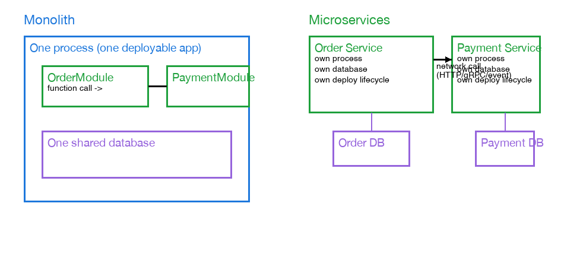

# What "Service" Means: Monolith vs Microservices

When notes here talk about "Order Service" or "Payment Service," that means a separate running process — its own codebase, its own database, its own deploy lifecycle — that other services only talk to over the network (HTTP, gRPC, or a message broker), never by calling its functions directly in memory. It's not necessarily two different physical servers, but it is two independent deployable units.

## Monolith vs microservices

In a monolith, "OrderService" and "PaymentService" might just be two classes/modules living inside the *same* running program, sharing the same process memory and the same database. Calling from one to the other is a normal in-process function call — instant, no network involved, and if the process crashes, everything goes down together.

In microservices, they're split into genuinely separate deployable units:

- Each has its own process (often a container/pod), started, stopped, scaled, or redeployed independently of the others.
- Each typically owns its own database — no other service reaches directly into it; everyone else goes through its API.
- They might run on the same physical machine, different machines, or different data centers — that detail doesn't matter to the definition. What matters is the independent deployable unit and the network boundary, not physical machine separation.
- "Order Service" is usually not even one single instance — it's often several identical copies running behind a load balancer for redundancy/scaling, all collectively called "the Order Service."

## Real-life analogy

Think of a company's departments — Sales, Warehouse, Finance. Each has its own office and its own filing cabinets that only that department can open directly. If Sales needs shipping status, they don't walk into the Warehouse and pull a file themselves — they send a memo (an API call) and wait for a reply. Each department can hire more staff or move offices without the others caring, as long as the memo format (the API contract) stays the same. That's a microservice.

A monolith is more like one big open-plan office where everyone shares the same filing cabinet and just shouts across the room to ask each other things directly.

## How to decide which one to build

| Question | Lean Monolith | Lean Microservices |
|---|---|---|
| Team size | Small (~1 team, <10-15 engineers) — coordination is easy, splitting adds overhead without benefit | Large / many teams that need to ship on independent schedules without blocking each other |
| Do different parts have very different scaling needs? | No — everything scales together roughly evenly | Yes — e.g. image processing needs 50x the compute of the auth service |
| Do most operations need strict cross-entity transactions? | Yes — a single DB + ACID transactions is far simpler than sagas (see [saga-pattern-compensating-transactions.md](saga-pattern-compensating-transactions.md)) | No — entities are naturally separate, eventual consistency is acceptable |
| Do you need one part's crash to not take down everything else? | Less critical | Yes — fault isolation matters |
| Is the domain/product still being figured out? | Yes — service boundaries drawn too early around a poorly-understood domain are expensive to redraw later | No — boundaries between subdomains are already well understood and stable |
| Do you already have the operational infra (CI/CD per service, distributed tracing, centralized logging, service discovery)? | Not yet — that overhead alone can dominate over the coding | Yes — the tooling to make many independent services manageable already exists |

**The industry rule of thumb: "you earn microservices, you don't start with them."** Most teams are better off starting with a monolith — ideally a *modular* monolith, where code is still organized into clean, well-bounded modules (an `OrderModule`, a `PaymentModule`) even though they run in one process and share one database. You extract a module into a real separate service later, once you actually feel a specific pain: that module needs to scale far beyond the rest, its team's deploys keep colliding with everyone else's, or its failures are taking down unrelated parts of the app. Drawing service boundaries (which fix themselves as separate databases, hard to undo) before the domain is well understood tends to cost more than it saves — several well-known post-mortems (Segment's, Basecamp's) describe going back to a monolith after adopting microservices too early.

**Analogy**: it's like choosing between one shared kitchen and a food-court model. A small restaurant with three chefs does fine sharing one kitchen and one fridge — coordination happens face-to-face, and splitting into separate stalls would just add walls between people who talk constantly anyway. A large catering operation running dozens of independently-scaling stations (one for drinks, one for desserts, one for the main course, each with wildly different volume) benefits from giving each its own stall, its own fridge, and its own staff — they can move fast without stepping on each other, at the cost of now needing more coordination (a shared ordering system) to make it feel like one meal.

## Why this matters for sagas and async confirmation

This is why [saga-pattern-compensating-transactions.md](saga-pattern-compensating-transactions.md) can't just wrap "create order + reserve inventory + charge payment" in one database transaction — those steps live in separate databases owned by separate services, so there's no single transaction to roll back. It's also why [async-transaction-confirmation.md](async-transaction-confirmation.md) needs an explicit notification mechanism (polling, WebSocket, push) at all — the services genuinely aren't in the same process, so the result of a downstream service's work doesn't just "come back" the way a function's return value would.