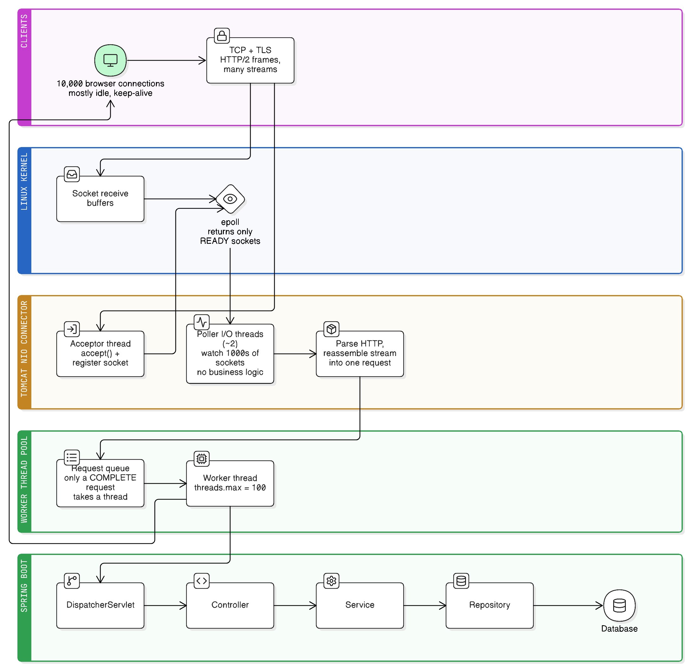

# HTTP/HTTPS Connections and Tomcat's Threading Model

When a browser talks to a Spring Boot app over HTTPS, several independent layers are involved, each with its own responsibility:

```
Browser
  │
TCP            ← reliable byte stream between two machines
  │
TLS            ← encryption on top of that stream
  │
HTTP/1.1 or HTTP/2   ← request/response semantics
  │
Tomcat / Netty ← reads bytes, parses HTTP, hands off a request
  │
Spring Boot    ← your controllers, services, repositories
```

The single most useful idea in this whole note: **connections and threads are separate resources.** A server can hold tens of thousands of open connections while only a hundred threads run application code.

This note covers everything *below* the first step of [spring-request-lifecycle.md](spring-request-lifecycle.md) ("Client → Tomcat") — how the bytes get to Tomcat and which thread ends up running your controller.



## 1. Does every HTTPS request do a TCP + TLS handshake?

No. Browsers reuse connections — this is **keep-alive** (persistent connections).

**First request on a new connection:**

```
TCP handshake (SYN / SYN-ACK / ACK)
  → TLS handshake (certificate, key exchange)
    → GET /summary
```

**Every subsequent request on that same connection:**

```
GET /list
GET /profile
GET /notifications
```

No handshake at all. The handshakes are paid **once per connection**, not once per request — which matters, because a TLS handshake costs an extra network round trip (or two) plus asymmetric crypto.

The connection stays open until either side closes it (idle timeout, `Connection: close`, or the server sending `FIN`). If the server closed an idle connection, the *next* request pays for a fresh TCP + TLS handshake.

## 2. HTTP/1.1 vs HTTP/2

### HTTP/1.1: one request at a time per connection

A single HTTP/1.1 connection processes one request/response at a time. The next request can't start until the previous response has been written (**head-of-line blocking**):

```
GET /summary → (wait for full response) → GET /list → (wait) → GET /profile
```

Browsers work around this by opening **6 or so parallel TCP connections** per host — each with its own handshake, its own congestion window, its own memory on the server.

### HTTP/2: many streams on one connection

HTTP/2 needs only **one** TCP connection. Inside it, each request/response pair is a logically independent **stream**:

```
TCP connection
 ├── Stream 1  → GET /summary
 ├── Stream 3  → GET /list
 ├── Stream 5  → GET /profile
 └── Stream 7  → GET /notifications
```

### What multiplexing actually is

HTTP/2 chops every request and response into small **frames**, each tagged with its stream ID. Frames from different streams are interleaved on the wire:

```
Frame(stream 1) Frame(stream 3) Frame(stream 1) Frame(stream 5) Frame(stream 3) …
```

The receiver demultiplexes them back into per-stream buffers and reassembles each one:

```
Stream 1 buffer → GET /summary   (complete)
Stream 3 buffer → GET /list      (complete)
Stream 5 buffer → GET /filter    (still arriving)
```

So multiple requests are genuinely in flight over one connection at the same time, and a slow response no longer blocks the ones behind it.

### Real-life analogy

HTTP/1.1 is a single-lane road where a slow truck holds up everyone behind it, so you build six parallel roads. HTTP/2 is one road with lane markings and numbered packages: many deliveries share the road, each package labelled with which order it belongs to, and the sorting happens at the destination.

### Decision checklist: HTTP/1.1 or HTTP/2 (and where to terminate it)?

| Question | HTTP/1.1 | Real-life example (HTTP/1.1) | HTTP/2 | Real-life example (HTTP/2) |
|---|---|---|---|---|
| Does one page issue **many small requests** to the same host? | Poor fit — head-of-line blocking, 6-connection ceiling | A legacy internal admin page loading 80 icons over HTTP/1.1 is visibly slow to finish | Strong fit — multiplexed over one connection | A modern SPA dashboard firing 30 parallel API calls on load |
| Is this a **server-to-server** call with low concurrency per peer? | Fine — a plain keep-alive pool is simpler to reason about and debug | A backend service calling a payment gateway a few times per second over a JDBC-style connection pool | Little benefit, extra complexity | N/A |
| Do you need to **read the traffic with basic tooling** (curl/tcpdump/proxies)? | Yes — plaintext, line-based, trivially readable | Debugging a webhook by `tcpdump`-ing the raw HTTP/1.1 request | Harder — binary framing, needs HTTP/2-aware tooling | Inspecting gRPC traffic requires Wireshark's HTTP/2 dissector |
| Is the client a **browser over the public internet**? | Extra handshakes and connections per user | An older site on HTTP/1.1 pays 6 TLS handshakes per visitor | Yes — one connection, one handshake, header compression | Google, Cloudflare-fronted sites serve browsers over HTTP/2/HTTP/3 |
| Is there a **reverse proxy / load balancer** in front? | N/A | N/A | Terminate HTTP/2 at the proxy, speak HTTP/1.1 to the app | NGINX serves HTTP/2 to browsers and proxies HTTP/1.1 to Spring Boot — the default production setup |
| Are you using **gRPC**? | Not supported | N/A | Required — gRPC is defined on top of HTTP/2 | Any gRPC service, by specification |

The practical default: **let a reverse proxy or load balancer handle HTTP/2 with browsers, and let Spring Boot speak HTTP/1.1 keep-alive behind it.** Enabling HTTP/2 directly in Spring Boot (`server.http2.enabled=true`) is mainly worth it when clients hit the app directly.

## 3. Does one socket own one thread?

**No.** This is the most common misconception. Sockets do not own threads.

Tomcat's NIO connector has three distinct roles:

| Role | Count | Job |
|---|---|---|
| **Acceptor** | 1 per connector | Calls `accept()` — turns an incoming connection into a socket and registers it |
| **Poller (I/O) threads** | A handful (often ~2, scaled to CPUs) | Watch *thousands* of registered sockets via `epoll`; read bytes, parse HTTP, assemble requests |
| **Worker threads** | `server.tomcat.threads.max` (default 200) | Run the servlet — `DispatcherServlet` → controller → service → repository |

```
Poller thread ──watches──> Socket A, Socket B, Socket C, … Socket N
```

One poller thread monitoring 10,000 sockets is completely normal.

### How `epoll` makes that possible

The poller doesn't loop over every socket asking "any data yet?". It does **not** do this:

```java
for (Socket s : allSockets) { if (s.hasData()) read(s); }   // NOT what happens
```

Instead it registers interest with the kernel — conceptually *"notify me when socket #57 has data"* — and then blocks:

```
epoll_wait()   ← consumes zero CPU while nothing is happening
```

When packets arrive, the kernel wakes the thread and returns **only the sockets that are ready**. Cost scales with *active* sockets, not *registered* ones. That's the whole trick behind "a few threads, thousands of connections."

### Real-life analogy: the call centre

- **Phone lines** = TCP connections. You can have 10,000 lines installed.
- **The switchboard light panel** = `epoll`. Nobody stares at each line; a light comes on when someone actually speaks.
- **The receptionist watching the panel** = poller thread. One person can watch a huge panel, because they only react to lit lights.
- **The agents who handle the call** = worker threads. Only these do the real work, and you have far fewer of them than lines.

10,000 installed phone lines don't require 10,000 agents — only the ones with someone actually talking do.

## 4. What each thread type does

**Poller (I/O) threads — plumbing only:**

```
epoll_wait() → read socket bytes → parse HTTP (or demultiplex HTTP/2 frames)
             → build HttpServletRequest → hand off to a worker thread
```

They never run business logic. For HTTP/2, this is also where frames get reassembled per stream — and importantly, **HTTP/2 does not create a thread per stream**. A stream becomes a worker-thread task only once it forms a complete request.

**Worker threads — your code:**

```
Worker thread → DispatcherServlet → Controller → Service → Repository → response
```

Then the worker returns to the pool, while the connection stays open (keep-alive).

## 5. Idle connections consume no worker threads

```
10,000 open connections, all idle   →   worker threads in use: 0
```

An idle connection costs a file descriptor, kernel socket buffers, and a little Tomcat bookkeeping — **not** a thread from `server.tomcat.threads.max`. A worker thread is allocated only when a complete request is ready to process, and released as soon as the response is written.

Conversely:

```
100 idle connections   →  0 worker threads
100 of them send a request at once  →  up to 100 worker threads busy
```

## 6. Overload: why latency explodes

```properties
server.tomcat.threads.max=100      # worker threads — NOT poller threads
server.tomcat.max-connections=10000 # sockets Tomcat will keep open
server.tomcat.accept-count=100      # OS-level backlog once max-connections is hit
```

Now suppose 10,000 clients all send a request at the same moment, and each request takes 100 ms:

```
100 requests running   ·   9,900 queued
```

They drain in batches of 100, each batch taking ~100 ms. The last request waits ~99 batches ≈ **9.9 seconds** before it even starts.

```
Total response time = queue wait + processing time
```

Under overload, almost all of the latency is **queue wait**, not processing. This is why p99 latency collapses long before CPU saturates — and why the fix is usually "make requests shorter / add capacity / shed load", not "raise the thread count", since more threads on the same CPU just means more context switching.

### Two independent limits

| Resource | Bounded by |
|---|---|
| Connections (sockets) | OS file descriptor limit (`ulimit -n`), kernel memory, `server.tomcat.max-connections` |
| Concurrent application work | `server.tomcat.threads.max` |

`10,000 open connections` + `100 active worker threads` is a perfectly healthy state, not a misconfiguration.

## 7. Where a reverse proxy fits

```
Browser ──HTTPS/HTTP2──> NGINX ──HTTP/1.1 keep-alive──> Spring Boot
```

NGINX (or an ALB, Envoy, Cloudflare) takes over: TLS termination, HTTP/2 and HTTP/3, keep-alive and idle-connection management, connection pooling to the backend, slow-client buffering. Spring Boot is left to do mostly business logic.

And the connection counts on the two sides are unrelated:

```
10,000 browser connections  →  NGINX  →  ~50 pooled backend connections  →  Spring Boot
```

Because backend connections are reused, Spring Boot never needs one socket per browser. This is also why a slow-client attack (Slowloris) is best absorbed at the proxy.

## 8. Complete flow, end to end

```
Client
 → TCP → TLS → HTTP/2 frames
 → network card → Linux kernel → socket receive buffer
 → epoll marks socket ready
 → poller thread reads frames, reassembles the stream, builds HttpServletRequest
 → handed to a worker thread
 → DispatcherServlet → Controller → Service → Repository
 → response written back through the socket
 → worker thread returned to pool
 → connection stays open (keep-alive)
```

## Vocabulary that's easy to conflate

| Term | What it actually is |
|---|---|
| **TCP connection** | A reliable byte-stream channel between client and server |
| **Socket** | The endpoint representing one end of that connection — one TCP connection = one socket per side |
| **Stream** (HTTP/2) | One logical request/response inside a connection; many per connection |
| **Frame** (HTTP/2) | The smallest unit on the wire; many frames make one request or response |
| **Poller / I/O thread** | Watches sockets, reads bytes, parses HTTP, dispatches. No business logic |
| **Worker thread** | Runs Spring MVC and your application code |

## Common misconceptions

| ❌ Misconception | ✔ Reality |
|---|---|
| One socket owns one thread | One poller thread manages thousands of sockets via `epoll` |
| An idle connection occupies a Spring thread | Idle connections consume socket resources only |
| HTTP/2 creates one thread per stream | Streams are reassembled by poller threads; a worker is taken only when a request is complete |
| More connections require more threads | Connections and worker threads are independent resources |
| Every HTTPS request does a TLS handshake | Handshakes happen per *connection*, and connections are reused |
| Raising `threads.max` fixes overload | It mostly shifts the bottleneck to CPU/DB and adds context switching |

## Key takeaways

- TCP and TLS handshakes are paid **once per connection**, not per request — keep-alive reuses the connection.
- HTTP/2 multiplexes many independent streams over one TCP connection using interleaved frames, removing HTTP/1.1's head-of-line blocking and the 6-connections-per-host workaround.
- Sockets don't own threads. A few poller threads watch thousands of sockets via `epoll`, which returns only the *ready* ones.
- Worker threads are allocated only when a request is fully parsed, and returned immediately after the response.
- Idle connections cost file descriptors and buffers, never worker threads.
- Under overload, most latency is queue wait, not processing time.
- A reverse proxy absorbs connection management (TLS, HTTP/2, idle clients) and fans thousands of client connections into a small reused backend pool.

## See also

- [spring-request-lifecycle.md](spring-request-lifecycle.md) — what happens *after* a worker thread picks up the request: filters, `DispatcherServlet`, interceptors, controller, message converters.
- [spring-execution-contexts-and-hooks.md](spring-execution-contexts-and-hooks.md) — how `@Async`/`@Scheduled` work on threads outside the Tomcat worker pool.
- [../system-design/redis-single-threaded.md](../system-design/redis-single-threaded.md) — the same event-loop-over-many-sockets idea, taken to its extreme with a single thread.
