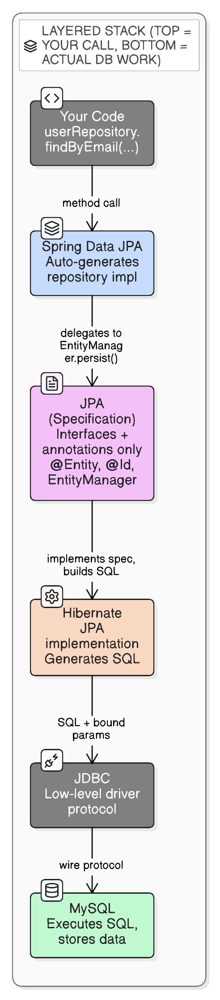

# Spring Data JPA, JPA, Hibernate, and MySQL — How They Fit Together

> "The purpose of abstraction is not to be vague, but to create a new semantic level in which one can be absolutely precise."
> — Edsger W. Dijkstra
>
> *Each layer below is one such semantic level — and each is precise about a different thing.*

## The confusion

These four names get thrown around interchangeably, but they aren't four competing ways to talk to a database — they're **four layers stacked on top of each other**, each one wrapping the layer below it.

```
Your code:        userRepository.findByEmail("a@b.com")
                            │
Spring Data JPA:  auto-generates a repository implementation for you
                            │
JPA:              a SPECIFICATION (just annotations + interfaces — @Entity, @Id, EntityManager)
                            │
Hibernate:        the actual ENGINE that implements the JPA spec, generates real SQL
                            │
JDBC:             the low-level Java-to-database wire protocol
                            │
MySQL:            the actual database — executes SQL, stores the bytes
```

The key thing that trips people up: **JPA is a spec, not a library that does work.** `@Entity`, `@Id`, `@Column`, `EntityManager` are all defined by the JPA specification itself. Hibernate is *an implementation* of that spec (EclipseLink and OpenJPA are others, rarely used in practice). Spring Data JPA doesn't replace Hibernate — it sits *on top of* JPA/Hibernate and removes repository boilerplate.



## Real-life analogy: a restaurant

| Layer | Restaurant equivalent | Role |
|---|---|---|
| **MySQL** | The kitchen & pantry | Where the actual food (data) is stored and prepared. Doesn't care who's asking — just executes. |
| **JDBC** | The universal order-ticket format | A standard way *any* waiter can write an order that *any* kitchen understands — low-level, no intelligence, just a protocol. |
| **JPA** | The menu specification/rulebook | Defines *what* a "dish," "order," "table" should look like (`@Entity`, `@Id`, `EntityManager`). It's a contract — it doesn't cook anything itself. |
| **Hibernate** | The actual chef | Reads the menu rulebook (JPA spec) and does the real work: turns "Order: 1 Burger" into actual kitchen steps (SQL), and hands it to the kitchen via a ticket (JDBC). |
| **Spring Data JPA** | The waiter who takes shorthand orders | You just say `findByEmail(...)`, and the waiter — following standard restaurant naming patterns — already knows how to write the full ticket. You never write the ticket by hand. |

## What actually happens when you call `save()`

```kotlin
@Entity
class User(
    @Column(nullable = false) var email: String
) {
    @Id @GeneratedValue(strategy = GenerationType.IDENTITY)
    var id: Long? = null
        protected set
}

interface UserRepository : JpaRepository<User, Long> {
    fun findByEmail(email: String): User?   // Spring Data JPA derives the query from the method name
}

userRepository.save(user)
```

See [spring-boot/spring-data-jpa-derived-query-methods.md](spring-data-jpa-derived-query-methods.md) for exactly how `findByEmail(...)` turns into a real query — Spring Data JPA parses the method name itself, then hands the resulting JPQL to Hibernate; Hibernate never sees the method name.

Call chain for that one line:

1. **Spring Data JPA** generated a proxy class implementing `UserRepository` at application startup — you never wrote `save()`'s body yourself.
2. That proxy delegates to **Hibernate's** `EntityManager.persist(user)` (Hibernate is the JPA implementation Spring Boot auto-configures by default).
3. **Hibernate** reads the `@Entity`/`@Column` annotations (JPA *spec* annotations, not Hibernate-specific) and generates the actual SQL: `INSERT INTO user (email) VALUES (?)`.
4. Hibernate hands that SQL + bound params to the **JDBC** driver (`mysql-connector-j`), which speaks MySQL's wire protocol.
5. **MySQL** executes it and returns the generated ID, which flows back up and gets set on `user.id`.

Hibernate also sits in front of MySQL with its own first-level (session) and second-level (`@Cacheable`) entity caches — a specific instance of the "application-level cache" layer described in [system-design/caching-fundamentals.md](../system-design/caching-fundamentals.md).

## Why each layer is independently swappable

- **MySQL → PostgreSQL**: change the JDBC driver + Hibernate dialect. `@Entity` classes and repositories stay identical.
- **Hibernate → EclipseLink**: change one dependency. `@Entity`/`@Id` annotations (JPA spec) stay identical — this is the entire point of JPA being a spec rather than a concrete library.
- **Spring Data JPA → plain JPA**: you'd write `entityManager.find(User::class.java, id)` yourself instead of `userRepository.findById(id)`. Same underlying Hibernate/JPA machinery, just more boilerplate at the call site.
- You **cannot** swap out JPA itself while keeping Hibernate or Spring Data JPA — both are built as an implementation of/extension to it, not alternatives.

## Where this model is needed most

The mental model above is the foundation for three things that trip people up once code actually runs against real data:

- **Lazy loading / `LazyInitializationException`** — happens when Hibernate (layer 4) tries to fetch a relation after the session that started it has already closed.
- **N+1 queries** — happens when Hibernate silently issues one query per row instead of a single join, usually from iterating a lazy collection.
- **`@Transactional`** — a Spring-level boundary that controls how long Hibernate's session/`EntityManager` stays open, which is *why* the two problems above happen where they do.

See [spring-boot/sql-injection-protection.md](sql-injection-protection.md) for how this same JPA/Hibernate/JDBC layering is what makes Spring Data JPA queries parameterized (and therefore SQL-injection-safe) by default.
