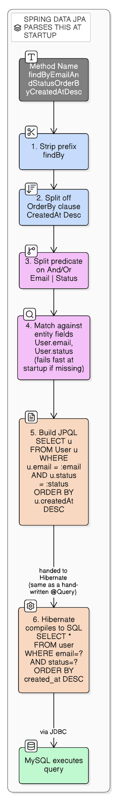

# How Spring Data JPA Turns a Method Name Into a Query

See [spring-boot/jpa-hibernate-spring-data-stack.md](jpa-hibernate-spring-data-stack.md) for how Spring Data JPA, JPA, Hibernate, and MySQL layer on top of each other — this file zooms into one specific mechanism inside that Spring Data JPA layer: how a bare repository method like `findByEmail(...)` becomes a real SQL query with no method body written.

## Correcting the common misconception

**It's not Hibernate that parses the method name — it's Spring Data JPA.** Hibernate never sees a method name at all. By the time Hibernate gets involved, Spring Data JPA has already turned that name into a JPQL query and handed it over — Hibernate's job is only to compile *that* JPQL into SQL, exactly as it would for a hand-written `@Query`.

## The naming grammar

```
[Prefix][Distinct][First<N>/Top<N>]By[Property][Operator][And/Or][Property][Operator]...[OrderBy[Property][Asc/Desc]]
```

- **Prefix** — declares what kind of result comes back:
  - `findBy` / `getBy` / `readBy` / `queryBy` / `streamBy` — returns matching entities
  - `existsBy` — returns `boolean`
  - `countBy` — returns `long`
  - `deleteBy` / `removeBy` — deletes matches, returns `void` or the deleted count
- **Modifiers** — `Distinct`, `First3` / `Top10` (limit the result set)
- **Properties** — must be real field names on the entity (camelCase), chained with `And` / `Or`
- **Operators** — a suffix on a property that changes the comparison: `LessThan`, `GreaterThanEqual`, `Between`, `Like`, `Containing`, `StartingWith`, `In`, `IsNull`, `True`/`False`, `IgnoreCase`, `Not`, etc.
- **`OrderBy...Asc/Desc`** — inline sort, appended at the end

## How the parsing actually works, step by step

Example: `findByEmailAndStatusOrderByCreatedAtDesc` on a `User` entity.

1. **Strip the prefix** — `findBy` recognized; remainder is `EmailAndStatusOrderByCreatedAtDesc`.
2. **Split off the `OrderBy...` clause** — sort spec `CreatedAt Desc` separated from the predicate.
3. **Split the predicate on `And` / `Or`** — yields `Email`, `Status`.
4. **Match each part against the entity's real properties.** This is an actual reflection-based lookup against `User`'s fields, not string guessing. `Email` → `User.email`. Nested paths work too: `findByAddress_City` (explicit underscore) or `findByAddressCity` (implicit — Spring Data tries progressively shorter greedy matches until one resolves) both walk `User.address.city`.
5. **Fail fast if a property doesn't exist.** If `User` had no `email` field, the application **fails to start immediately** with a clear error — this validation happens at startup, not on the first call. That's one of the real payoffs of the convention over a raw string query.
6. **Build the JPQL query**: `SELECT u FROM User u WHERE u.email = :email AND u.status = :status ORDER BY u.createdAt DESC`
7. **Hand that JPQL to Hibernate**, which compiles it to SQL: `SELECT * FROM user WHERE email = ? AND status = ? ORDER BY created_at DESC`, then executes it via JDBC.



## Real-life analogy: ordering at a fast-food counter with a fixed script

Picture a counter where orders must follow a fixed template: *"Large Cheeseburger, No Pickles, Extra Cheese."* The cashier (Spring Data JPA) doesn't understand free-form English — they recognize a small, fixed vocabulary of slots (`Large`, `No <item>`, `Extra <item>`) and mechanically translate the sentence into a structured kitchen ticket. If you say "No Anchovies" and anchovies aren't even on the menu, the cashier stops you right there rather than sending a broken ticket through — that's the startup validation. The kitchen (Hibernate) never sees your sentence at all, only the finished ticket (JPQL, later SQL).

## Common keyword reference

| Keyword | Example method | Roughly generates |
|---|---|---|
| `And` / `Or` | `findByLastnameAndFirstname` | `WHERE lastname = ?1 AND firstname = ?2` |
| (none) / `Is` / `Equals` | `findByFirstname` | `WHERE firstname = ?1` |
| `Between` | `findByCreatedAtBetween` | `WHERE createdAt BETWEEN ?1 AND ?2` |
| `LessThan(Equal)` / `GreaterThan(Equal)` | `findByAgeLessThan` | `WHERE age < ?1` |
| `After` / `Before` | `findByCreatedAtAfter` | `WHERE createdAt > ?1` |
| `IsNull` / `IsNotNull` | `findByDeletedAtIsNull` | `WHERE deletedAt IS NULL` |
| `Like` / `Containing` / `StartingWith` / `EndingWith` | `findByNameContaining` | `WHERE name LIKE %?1%` |
| `In` / `NotIn` | `findByStatusIn(Collection)` | `WHERE status IN ?1` |
| `True` / `False` | `findByActiveTrue` | `WHERE active = true` |
| `IgnoreCase` | `findByEmailIgnoreCase` | `WHERE UPPER(email) = UPPER(?1)` |
| `OrderBy...Asc/Desc` | `findByStatusOrderByCreatedAtDesc` | adds `ORDER BY createdAt DESC` |
| `Not` | `findByStatusNot` | `WHERE status <> ?1` |

## Return type conventions

- `List<T>`, `T` (single result, throws if more than one match), `Optional<T>`, `Streamable<T>`
- `Page<T>` / `Slice<T>` when the method takes a `Pageable` parameter
- `existsBy...` → `boolean`; `countBy...` → `long`; `deleteBy...`/`removeBy...` → `void` or the deleted row count

## When to stop using the naming convention

Once a predicate needs 3+ chained conditions, a join across unrelated entities, or an aggregation, the method name becomes unreadable — e.g. `findByStatusAndCreatedAtBetweenAndUser_DepartmentNameIgnoreCaseOrderByCreatedAtDesc`. At that point, switch to `@Query` with JPQL or native SQL, or the Criteria API. The naming convention is a shorthand for simple predicates, not a full query language.
