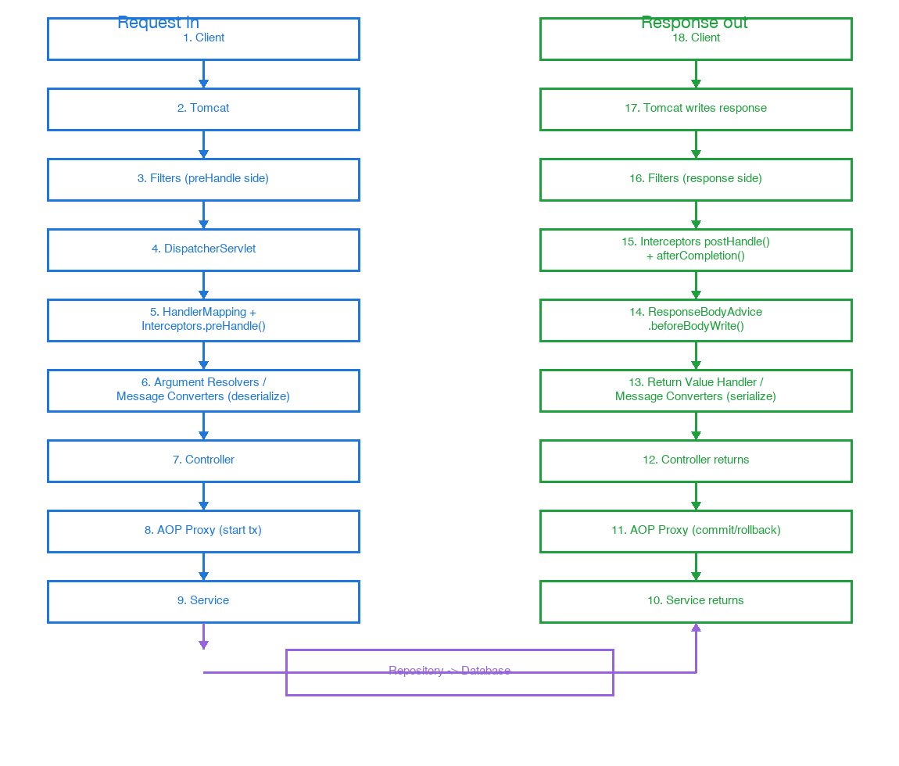
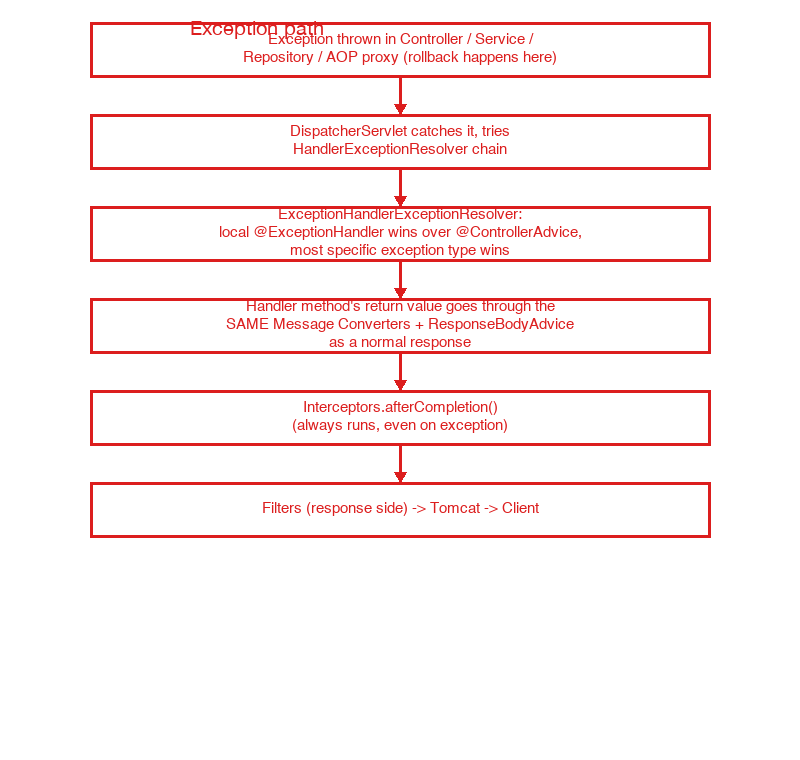

# Spring Boot Request Lifecycle: Client to Database and Back

How a single HTTP request travels through a Spring Boot app: Tomcat, filters, `DispatcherServlet`, interceptors, the controller, AOP, the service and repository layers — and back out, both on the happy path and when something throws.

## The forward path (request coming in)



1. **Client → Tomcat**: the embedded servlet container accepts the raw HTTP connection and hands the request into the servlet pipeline. Tomcat doesn't know anything about Spring yet — it only knows "servlets" and "filters."
2. **Filters** (`jakarta.servlet.Filter`): a chain of filters runs before Spring MVC gets involved at all. Filters are part of the servlet spec, not Spring-specific — the same mechanism exists in any Java EE app. Typical uses: CORS headers, request logging, auth token extraction, wrapping request/response streams for later re-reading.
3. **DispatcherServlet**: itself just a `Servlet`, registered as the last stop in that filter chain. This is Spring MVC's *front controller* — the single entry point every request funnels through.
4. **HandlerMapping**: `DispatcherServlet` asks a `HandlerMapping` (usually `RequestMappingHandlerMapping`) which controller method matches this URL + HTTP method, and which `HandlerInterceptor`s apply to this specific route.
5. **Interceptors — `preHandle()`**: unlike filters, interceptors are Spring MVC-specific and only run for requests that matched a handler. Common use: authorization checks that need to know *which controller* is being called.
6. **Argument resolution + message converters (deserialize)**: before the controller method runs, Spring builds its arguments. `@RequestBody` is resolved by asking an `HttpMessageConverter` (e.g. Jackson's `MappingJackson2HttpMessageConverter`) to turn raw JSON bytes into your DTO class. `@PathVariable`/`@RequestParam` are resolved separately.
7. **Controller**: your method runs, with all arguments already resolved.
8. **AOP proxy**: if the controller calls a `@Transactional` service (or anything else AOP-advised — `@Cacheable`, a custom `@Aspect`), it isn't calling the real object directly — it's calling a Spring-generated proxy wrapping the real bean. The proxy runs "before" logic (start a transaction) before your actual code runs.
9. **Service**: business logic executes, inside that proxy's wrapper.
10. **Repository → DB**: Spring Data JPA (or whatever's in use) issues the actual query.

```java
// 2. Filter — servlet-spec level, runs for every request regardless of routing
public class RequestLoggingFilter implements Filter {
    public void doFilter(ServletRequest req, ServletResponse res, FilterChain chain) {
        log.info("incoming: {}", req);
        chain.doFilter(req, res);   // -> next filter, then eventually DispatcherServlet
        log.info("outgoing: {}", res); // runs on the way back out
    }
}

// 5. Interceptor — Spring MVC-specific, only for requests that matched a handler
public class AuthInterceptor implements HandlerInterceptor {
    public boolean preHandle(HttpServletRequest req, HttpServletResponse res, Object handler) {
        return isAuthorized(req, handler); // false short-circuits the request here
    }
}

// 7-9. Controller calling a @Transactional service through an AOP proxy
@RestController
class OrderController {
    OrderResponse placeOrder(OrderRequest request) {
        return orderService.placeOrder(request); // orderService is a proxy, not the raw bean
    }
}

@Service
class OrderService {
    @Transactional
    OrderResponse placeOrder(OrderRequest request) { ... } // proxy starts tx before this runs
}
```

## The return path (happy path, response going out)

11. **DB → Repository → Service**: the result bubbles back up as a normal Java return value.
12. **AOP proxy (commit)**: control returns to the proxy, which runs its "after" logic — commits the transaction (or rolls back on exception, see below).
13. **Controller returns**: your method returns a Java object (a DTO, or `ResponseEntity<T>`).
14. **Return value handling + message converters (serialize)**: a `HandlerMethodReturnValueHandler` recognizes the return type and, for `@ResponseBody`/`@RestController`, hands the object to an `HttpMessageConverter` to serialize it to JSON bytes.
15. **`ResponseBodyAdvice`**: right before those bytes are written, every registered `ResponseBodyAdvice` bean gets a `beforeBodyWrite()` callback with the object about to be serialized. This is the hook for globally wrapping every response in a standard envelope or adding metadata, without touching every controller.
16. **Interceptors — `postHandle()` then `afterCompletion()`**: `postHandle` runs after the controller succeeds; `afterCompletion` always runs afterward — even if an exception occurred, unlike `postHandle`, which is skipped on exception.
17. **Filters (response side)**: control unwinds back through the same filter chain in reverse — filters get a chance to touch the outgoing response too (add a header, log the final status).
18. **Tomcat → Client**: bytes go out over the socket.

```java
// 15. ResponseBodyAdvice — global hook over every @ResponseBody / ResponseEntity result
@RestControllerAdvice
class EnvelopeAdvice implements ResponseBodyAdvice<Object> {
    public boolean supports(MethodParameter returnType, Class<? extends HttpMessageConverter<?>> converterType) {
        return true; // apply to every response
    }
    public Object beforeBodyWrite(Object body, ...) {
        return new Envelope(body); // wrap every response the same way
    }
}
```

## The exception path



An exception can be thrown from the controller, the service, the repository, or the AOP proxy itself (e.g. a `@Transactional` rollback). Wherever it happens, it propagates up as a normal Java exception through the AOP proxy — which sees it and rolls back the transaction instead of committing — and out of the controller method. It never reaches steps 13-16 through the normal path.

Instead, `DispatcherServlet` catches it and hands it to its ordered chain of `HandlerExceptionResolver`s:

- **`ExceptionHandlerExceptionResolver`** — looks for a matching `@ExceptionHandler` method. It checks the *current controller* first (a local `@ExceptionHandler` inside that same class), then falls back to any `@ControllerAdvice`/`@RestControllerAdvice` beans. If multiple candidates match, the most specific matching type in the exception's class hierarchy wins.
- **`ResponseStatusExceptionResolver`** — handles exceptions annotated with `@ResponseStatus`, or thrown as `ResponseStatusException`.
- **`DefaultHandlerExceptionResolver`** — handles Spring's own built-in exceptions (unsupported HTTP method, no handler found), mapping them to sensible status codes.

```java
@RestControllerAdvice
class GlobalExceptionHandler {
    @ExceptionHandler(EntityNotFoundException.class)
    ResponseEntity<ErrorResponse> handleNotFound(EntityNotFoundException ex) {
        return ResponseEntity.status(404).body(new ErrorResponse(ex.getMessage()));
    }
}
```

The detail that's easy to miss: **whatever the `@ExceptionHandler` method returns still goes through the exact same message-converter and `ResponseBodyAdvice` pipeline as a normal response** (steps 14-15 above) — an error DTO gets serialized to JSON and can still be globally rewrapped by the `EnvelopeAdvice` above, same as any success response. After that, it flows through interceptors' `afterCompletion` (not `postHandle`, which is skipped on exception) and back through the filter chain exactly like the happy path.

## Real-life analogy

Think of an airport terminal. Tomcat is the terminal building itself — it lets any traveler in. Filters are the terminal-wide security checkpoint (ID check, metal detector) — every traveler passes through it, regardless of which airline they're flying; the checkpoint doesn't know or care about your specific flight. `DispatcherServlet` is the central information desk that reads your ticket and figures out which gate you belong to. Interceptors are that specific airline's check-in staff — they only see travelers on their flights, and can do things like verify your boarding pass before letting you toward the gate. The controller is the gate agent. AOP is a supervisor quietly wrapping every gate agent's shift with "open the log book, then close the log book" (a transaction) without the gate agent ever being aware of it. The service is the airline's operations desk doing the real work; the repository is the baggage/reservation system talking to the actual database of flights.

On the way back, the message converter is the automatic boarding-pass printer turning your reservation record into a physical slip; `ResponseBodyAdvice` is a customs stamp applied to every outgoing passenger's paperwork, regardless of airline, right before they leave. If something goes wrong — your booking can't be found — you don't just get stuck; you get redirected to a customer service desk (the exception resolver) that hands you a *replacement* slip of paper (the error response), which still gets stamped by customs and passes back through the same terminal checkpoint on the way out.

## Common gotchas

- **AOP self-invocation**: `@Transactional` (and other AOP advice) only takes effect when the method is called *through the proxy* — i.e., from another bean. Calling `this.placeOrder(...)` from another method inside the *same* class bypasses the proxy entirely, silently skipping the transaction.
- **Filters vs. interceptors**: filters run for every request Tomcat receives, whether or not it matches a Spring handler (they run even for 404s); interceptors only run for requests that resolved to an actual controller method.
- **`postHandle` vs. `afterCompletion`**: `postHandle` is skipped whenever an exception occurred; `afterCompletion` always runs, making it the right place for cleanup logic that must happen unconditionally (e.g. closing a resource opened in `preHandle`).
