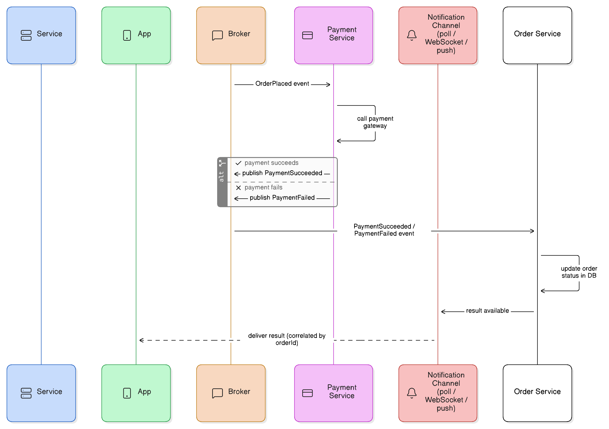

# How a Mobile App Confirms an Async Transaction Succeeded or Failed

See also: [message-queue-vs-pubsub.md](message-queue-vs-pubsub.md) for the broker mechanics between services — this file covers the layer above that: how the *client* eventually learns the outcome.

## The core issue

In an event-driven backend, placing an order usually isn't processed end-to-end synchronously. The initial request only triggers the start of a pipeline (see [monolith-vs-microservices.md](monolith-vs-microservices.md) for what "service" means in the steps below):

1. The app calls `POST /orders`.
2. The order service does the minimum synchronous work — validates the request, creates an order record with status `PENDING`, publishes an `OrderPlaced` event to a message broker — and returns immediately, often a `202 Accepted` with an `orderId`, not a final result.
3. A payment service, subscribed to that event, picks it up later and independently, calls the payment gateway, and eventually publishes `PaymentSucceeded` or `PaymentFailed`.
4. The order service consumes that event and updates the order's status in the database.

Editable version (Eraser.io): [Async Order/Payment Confirmation Flow](https://app.eraser.io/workspace/JLgRjFjapzOnrAqixpQO?diagram=0M_y7ELs2iDnWT_fmCFS&layout=canvas).

The original HTTP request only ever got an acknowledgment ("received, here's your order ID"), not the outcome — the outcome is decided downstream, on its own timeline. That's the trade-off of event-driven systems: scalability and resilience, in exchange for the caller no longer knowing the result synchronously.

(What if `PaymentFailed` happens after the order was already created? See [saga-pattern-compensating-transactions.md](saga-pattern-compensating-transactions.md) for how the backend stays consistent when a later step fails after an earlier one already committed.)

## How the loading screen actually resolves

The app has to actively find out the result. Real apps typically combine more than one of these:

- **Polling** — after getting `orderId`, the app calls `GET /orders/{id}` every couple of seconds until `status` flips from `PENDING` to `SUCCESS`/`FAILED`. Simple, but wastes requests and has visible latency bounded by the poll interval.
- **Long polling** — same idea, but the server holds the `GET` request open until the status changes or a timeout hits. Fewer round trips than plain polling.
- **WebSocket / Server-Sent Events (SSE)** — the app opens a persistent connection right after submitting the order. A notification service subscribes to `PaymentSucceeded`/`PaymentFailed` events on the broker and pushes the result down that open connection the instant it happens — near-instant, no polling.
- **Push notification (FCM/APNs)** — the backend sends an OS-level push notification when the event resolves. This is the fallback that matters most: if the user backgrounds the app or the connection drops, polling and WebSockets stop working, but a push notification is delivered by the OS regardless.

## Real-life analogy

It's exactly like ordering food at a counter-service restaurant. You pay and get a receipt with an order number immediately — that's the `202 Accepted`. The kitchen (payment/fulfillment service) then cooks the order on its own schedule. You find out it's ready one of three ways: you keep glancing at the pickup counter (polling), a buzzer lights up and vibrates the moment it's ready while you're standing right there (WebSocket/SSE push), or if you wandered off to sit down, a staff member calls your name over the speaker so you hear it even without watching the counter (push notification).

## The pending state is a first-class UI state

Since there's no guaranteed upper bound on how long the async pipeline takes, a well-built app doesn't just spin forever — it shows `PENDING` with a client-side timeout (e.g., "still processing — we'll notify you") rather than blocking the UI indefinitely. The `orderId` is used as a correlation key so that whichever channel (poll response, WebSocket message, or push notification) delivers the result, the app knows exactly which in-flight order it belongs to.
