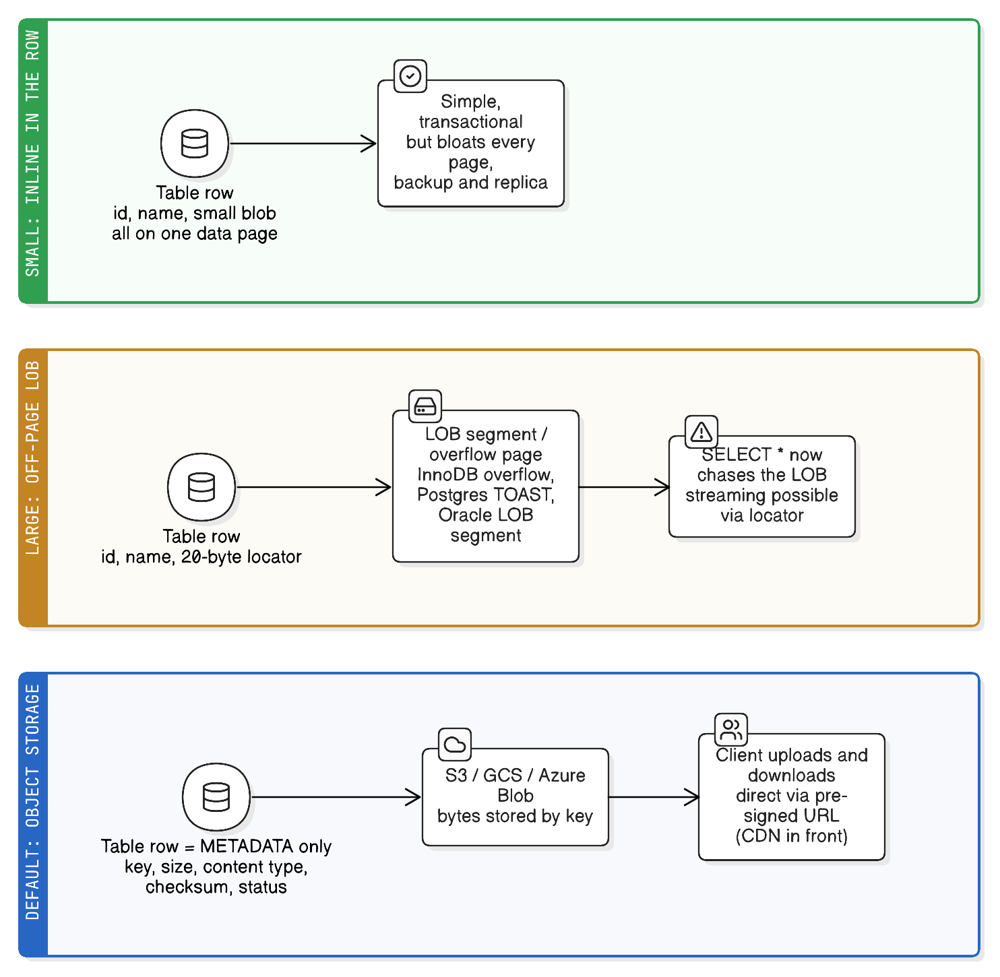

# BLOBs and Storing Large Objects

> "Data is a precious thing and will last longer than the systems themselves."
> — Tim Berners-Lee
>
> *The reason the "where do the bytes live" decision outlives the app that made it: a URL in a column, a LOB segment, or an S3 key is a commitment you'll still be honouring years later.*

**BLOB** stands for **Binary Large OBject**: a database column holding **raw bytes that the database itself does not interpret**. No character set, no structure, no ability to index or query the contents — the database stores it, replicates it, backs it up, and hands it back byte-for-byte.

Its sibling is **CLOB** (Character Large OBject): the same idea for *text*, so it does carry a character set and collation, and can participate in text search. Rule of thumb: **BLOB for bytes** (images, PDFs, encrypted payloads, a serialized Java object), **CLOB/TEXT for characters** (long descriptions, HTML, JSON as text).

## Real-life analogy: the sealed envelope in a filing cabinet

A BLOB column is a **sealed envelope filed inside a customer's folder** (**the table row**). The cabinet's index cards let you find the folder instantly by name or account number (**the row's ordinary indexable columns**), but the clerk never opens the envelope (**the database cannot index, filter, or search inside BLOB bytes**) — they just hand it over whole (**your application reads the stream and interprets it**).

And when envelopes get bulky, the drawer doesn't hold them at all: it holds a slip saying "shelf 12, box 4" (**a LOB locator / off-page pointer stored in the row, with the bytes living in a separate LOB segment or overflow page**). Take the analogy one step further and the envelope isn't in the building at all — the folder holds a courier tracking number (**an object-storage key or URL, with the bytes in S3/GCS/Azure Blob Storage**).

## The same word means three different things

Like "serialize," "blob" is overloaded — worth disambiguating before a confusing conversation:

| Usage | What it is |
|---|---|
| **SQL `BLOB` column** | A database type for uninterpreted bytes (this note's main subject) |
| **Azure Blob Storage / "blob storage"** | An **object storage service** — the S3 equivalent, where "blob" means "a stored object with a key" |
| **JavaScript `Blob`** | A browser File-API object representing immutable raw data, used with `File`, `fetch`, and `URL.createObjectURL` |
| **Git blob** | Git's internal object type holding a file's *contents* (as opposed to trees and commits) |

All four share the same core idea: **an opaque bag of bytes identified from outside, never interpreted by the thing storing it.**

## How databases actually store them

The important mechanic: large values are usually **not stored inline in the row**, because rows live in fixed-size pages and a multi-megabyte value would destroy page density.



| Database | Types | Storage behaviour |
|---|---|---|
| **MySQL/InnoDB** | `TINYBLOB` (255 B), `BLOB` (64 KB), `MEDIUMBLOB` (16 MB), `LONGBLOB` (4 GB); `TEXT` family for characters | Values beyond what fits inline are moved to **overflow pages**, leaving a 20-byte pointer in the row. `max_allowed_packet` limits how big a single value can be sent/received |
| **PostgreSQL** | `bytea` (up to 1 GB), plus separate **Large Objects** (`lo_*`, up to 4 TB) | `bytea` is subject to **TOAST**: values are compressed and/or moved to a side table automatically. Large Objects are chunked in `pg_largeobject` and support true streaming/seeking |
| **Oracle** | `BLOB`, `CLOB` (up to 4 GB × block size) | Row holds a **LOB locator**; bytes live in a LOB segment. `SecureFiles` adds dedup, compression, encryption |
| **SQL Server** | `VARBINARY(MAX)`, `NVARCHAR(MAX)` | Off-row storage above 8 KB; `FILESTREAM`/`FileTable` keep bytes on NTFS while remaining transactional |

Two consequences fall out of "the bytes live elsewhere, with a pointer in the row":

- **`SELECT *` gets expensive.** Fetching the row now means chasing the LOB, so a query that never needed the payload pays for it anyway. Select explicit columns.
- **Reads and writes can stream.** Because the value is chunked, you can read/write it progressively (`getBinaryStream`, Postgres large-object API, `FILESTREAM`) instead of materialising megabytes in heap.

## Reading and writing one from Java

```java
// JDBC — stream, don't materialise, when the value may be large
try (var ps = conn.prepareStatement("INSERT INTO doc(id, body) VALUES (?, ?)")) {
    ps.setLong(1, id);
    ps.setBinaryStream(2, inputStream, length);     // streams to the DB
    ps.executeUpdate();
}

try (var rs = ps.executeQuery()) {
    if (rs.next()) {
        try (InputStream in = rs.getBinaryStream("body")) { copyTo(out, in); }
        // or: Blob b = rs.getBlob("body"); long n = b.length(); b.free();
    }
}
```

```java
// JPA — @Lob maps the field to the dialect's BLOB/CLOB type
@Entity class Document {
    @Lob @Basic(fetch = FetchType.LAZY)   // LAZY on a basic field needs bytecode enhancement
    private byte[] body;                   // byte[] → BLOB;  String → CLOB/TEXT

    @Lob private java.sql.Blob streamed;   // locator-based, for true streaming
}
```

Gotchas that bite in practice: `byte[]` loads the **entire** value into heap (a 200 MB document in a 512 MB container is an OOM); `@Basic(fetch = LAZY)` is only a hint without bytecode enhancement, so entities silently drag their blobs into memory; a `Blob` **locator is only valid while the transaction/connection is open**, so reading it after the transaction closes throws; and Hibernate's default `byte[]` mapping can differ per dialect (`bytea` vs `oid` on Postgres has caused many migrations).

## Storing a serialized object in a BLOB — and why to think twice

This is the historical reason Java developers meet BLOBs at all: take an object, run it through `ObjectOutputStream`, store the bytes in a column (see [../java/java-serialization.md](../java/java-serialization.md)).

It works, and it's almost always the wrong long-term choice:

- The column is **opaque to SQL** — you cannot filter, aggregate, or index anything inside it. Every question about that data requires loading rows into Java and deserializing them.
- It **couples stored data to Java class definitions**. Rename a field and years-old rows become unreadable; the class becomes undeletable.
- It's **unreadable to every other tool** — no BI query, no `psql` inspection, no other language.
- Deserializing rows written by someone else is a **remote-code-execution surface**.

Modern alternative for structured data: a **`JSON`/`JSONB` column** (Postgres `jsonb`, MySQL `JSON`). You keep the schema flexibility that made a blob attractive, but the database can now index and query inside the value (`jsonb` GIN indexes, MySQL functional indexes on `JSON_EXTRACT`). Reserve BLOBs for data that genuinely *is* opaque bytes: images, PDFs, archives, ciphertext.

## Decision checklist: where should the bytes live?

| Question | In-database BLOB | Real-life example (BLOB) | External object storage | Real-life example (object storage) |
|---|---|---|---|---|
| How **big** are the values? | Small — up to tens/low hundreds of KB | A user's signature image, a generated PDF receipt, a QR code | Large or unbounded | Video uploads, MRI scans, ML training data |
| Must the bytes commit **atomically with the row**? | Yes — one transaction, one rollback | A signed consent document that must never exist without its record | No — eventual consistency is acceptable, with an orphan-cleanup job | A profile photo upload; a stray object is harmless |
| Does the client need to **download it directly at scale**? | No — traffic flows through your app and DB | An internal admin tool serving a few files a day | Yes — pre-signed URLs and CDN offload | Public product images served worldwide |
| How important are **backup size and restore time**? | Blobs inflate every dump, replica, and PITR archive | A small dataset where simplicity wins | Object storage is backed up independently and cheaply | A 4 TB media library that would make DB backups unusable |
| Do you need **streaming/range reads** (seek, resume, partial)? | Awkward — possible via locators, but not what DBs optimise for | Reading a 50 KB thumbnail whole | Native — HTTP `Range`, multipart upload, resumable | Video seeking; resuming a failed 2 GB upload |
| Do you need to **query inside** the content? | Only if it's really text/JSON — then use `TEXT`/`JSONB`, not `BLOB` | Searching a description field | Not applicable — content is opaque | N/A |
| What are your **ops constraints**? | Fewer moving parts: one system to secure, back up, and monitor | A small internal app with no cloud storage available | Requires bucket policies, lifecycle rules, credentials, cleanup | Anything already running in AWS/GCP/Azure |

**Practical default:** keep **metadata in the database** (owner, filename, content type, size, checksum, upload time, status) and the **bytes in object storage**, referenced by key. Store bytes in the database only when they're small and must be transactionally inseparable from the row.

Two patterns worth knowing for the default:

- **Pre-signed URLs** — the client uploads/downloads directly to storage; your app only issues a time-limited signed URL. Bytes never touch your servers.
- **Two-phase upload** — insert the metadata row as `PENDING`, upload the object, then flip to `READY`. A background job sweeps stale `PENDING` rows and orphaned objects, which is how you get "close enough" atomicity across two systems (see [idempotency.md](idempotency.md) and [saga-pattern-compensating-transactions.md](saga-pattern-compensating-transactions.md) — this is a small saga).

## Key takeaways

- A BLOB is bytes the database stores but never interprets: no charset, no structure, no indexing or querying inside it. CLOB/TEXT is the character equivalent, and does have a charset.
- "Blob" is overloaded: a SQL column type, Azure's object-storage service, the browser File API type, and Git's content object — all meaning "opaque bag of bytes."
- Large values are stored **off-row** (InnoDB overflow pages, Postgres TOAST, Oracle LOB segments) with a pointer in the row, which is why `SELECT *` quietly gets expensive and why streaming APIs exist.
- In Java, `byte[]` pulls the whole value into heap; stream via `getBinaryStream`/`setBinaryStream` for anything large, and remember a `Blob` locator dies with its transaction.
- Storing a serialized Java object in a BLOB couples your database to your class definitions and blinds SQL to the content — prefer `JSON`/`JSONB` for structured data, and keep BLOBs for genuinely opaque bytes.
- Default architecture: **metadata rows in the database, bytes in object storage**, with pre-signed URLs for transfer and a two-phase upload plus cleanup sweep for consistency.

## See also

- [../java/java-serialization.md](../java/java-serialization.md) — what those opaque bytes usually are when a Java app writes them, and why serialized objects make poor stored data.
- [choosing-sql-vs-nosql.md](choosing-sql-vs-nosql.md) — the neighbouring decision about where structured data belongs.
- [mysql-table-vs-mongo-document.md](mysql-table-vs-mongo-document.md) — row vs document shape, including where large fields hurt.
- [caching-fundamentals.md](caching-fundamentals.md) — why a CDN in front of object storage removes most read traffic.
- [database-sharding-partitioning-replication](database-sharding-partitioning-replication.md) — moving large columns off the primary is a step on the scaling ladder, and often removes the pressure that looked like a sharding problem.
