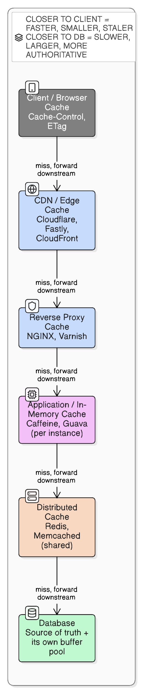

# Caching Fundamentals

> "There are only two hard things in Computer Science: cache invalidation and naming things."
> — Phil Karlton

## What a cache actually is

A cache is a smaller, faster store sitting in front of a slower, authoritative source of truth, holding copies of frequently-accessed data so most requests never reach the slow source. It trades a small staleness/memory cost for a large latency win.

**Analogy**: keeping frequently-used tools in your desk drawer instead of walking to the supply room every time. The supply room (database) has everything and is authoritative, but it's slow to reach. Your drawer (cache) only holds your most-used items — if something isn't there, you walk to the supply room and (usually) bring a copy back to your drawer for next time.

## Where caching sits — the layers, client to database

Caching isn't one thing in one place — it exists at every hop of a request path:

1. **Client/browser cache** — `Cache-Control`/`ETag` HTTP headers, local storage
2. **CDN / edge cache** — Cloudflare, Fastly, CloudFront — geographically close to the user
3. **Reverse proxy cache** — NGINX, Varnish, sitting in front of app servers
4. **Application/in-memory cache** — Caffeine, Guava — local to *one* server instance
5. **Distributed cache** — Redis, Memcached — shared across all app instances
6. **Database's own buffer pool** — e.g. MySQL's InnoDB buffer pool caches pages in its own memory

Each layer that hits (returns data without going further) short-circuits everything below it. Closer to the client = faster but smaller/more likely stale; closer to the DB = slower but more authoritative.



## The core patterns: how reads and writes flow through a cache

| Pattern | How it works | Trade-off |
|---|---|---|
| **Cache-aside** (lazy loading) | App checks cache → miss → reads DB → app populates cache | Simplest, most common. First request for any key is always a slow miss; concurrent misses on the same key risk a [thundering herd](thundering-herd-problem.md) |
| **Read-through** | Same idea, but the cache *itself* owns the DB fallback — app just asks the cache | Centralizes the loading logic (e.g. Guava `LoadingCache`, Spring `@Cacheable` + a loader) |
| **Write-through** | Every write updates cache **and** DB synchronously before returning | Cache and DB never diverge, but every write pays the cost of two systems |
| **Write-behind** (write-back) | Write hits the cache immediately; DB write is deferred/batched async | Great write latency, but a crash before the deferred write flushes loses data |
| **Write-around** | Writes go straight to the DB, bypassing the cache entirely; cache only fills on a later read | Avoids polluting the cache with data that's rarely re-read soon after writing |

### Decision checklist

| Question | Pattern | Real-life example |
|---|---|---|
| Is read latency the priority, and is an occasional DB-hit miss acceptable? | Cache-aside | Product catalog pages |
| Want the caching logic centralized out of app code? | Read-through | Guava `LoadingCache`, Spring `@Cacheable` with a `CacheLoader` |
| Must cache and DB *never* diverge, even briefly? | Write-through | A wallet/ledger balance shown right after a transaction |
| Is write throughput critical, and is losing the very latest write on crash tolerable? | Write-behind | View counts, high-volume metrics |
| Is written data rarely read again right away? | Write-around | Bulk imports, audit logs |

## Which pattern does Spring's caching abstraction use?

Spring's `org.springframework.cache` abstraction (`@Cacheable`, `@CachePut`, `@CacheEvict`) doesn't pick one pattern — it's a generic AOP proxy wrapped around your method, and which pattern you get depends on which annotation you apply where.

| Annotation | Pattern | How the proxy actually behaves |
|---|---|---|
| `@Cacheable` | Read-through | Checks the cache first. On a **hit**, your method body never runs. On a **miss**, it invokes your method, then stores the result in the cache before returning it. |
| `@CachePut` | Write-through | Always invokes your method (e.g. `repository.save(...)`), then synchronously writes the result into the cache — DB write and cache write both complete before the call returns. |
| `@CacheEvict` | Explicit invalidation | Invokes your method (typically a delete/update), then removes the entry (or clears the whole region with `allEntries=true`). It doesn't repopulate — the next `@Cacheable` read lazily reloads it. |

Being read-through, `@Cacheable` has no built-in protection against a [thundering herd](thundering-herd-problem.md#does-springs-cacheable-protect-against-this) on expiry unless you opt into `sync = true`, which only collapses the herd within a single JVM instance — not across replicas.

```kotlin
@Cacheable(value = "users", key = "#id")       // read-through
fun getUser(id: Long): User = userRepository.findById(id)...

@CachePut(value = "users", key = "#user.id")   // write-through
fun updateUser(user: User): User = userRepository.save(user)

@CacheEvict(value = "users", key = "#id")      // explicit invalidation
fun deleteUser(id: Long) = userRepository.deleteById(id)
```

The most common real-world combo is `@Cacheable` on reads + `@CacheEvict` on writes — read-through reads, with writes just invalidating rather than repopulating (closer to cache-aside's write behavior). `@CachePut` is used instead when you already have the fresh value in hand and want to skip the extra evict-then-reload round trip.

Two things it doesn't give out of the box:
- **No write-behind** — no built-in async/deferred-write pattern; you'd have to build it yourself (e.g. `@Async` + `@CachePut`, or a provider-specific write-behind cache).
- **No eviction policy by default** — the default `ConcurrentMapCacheManager` never expires or evicts anything; entries live forever unless explicitly `@CacheEvict`'d. LRU/LFU/TTL only appear once a real provider (Caffeine, EhCache, Redis) backs the `CacheManager`.

## Implementing each pattern with Spring's caching library

Shared setup for every example below:

```kotlin
@Configuration
@EnableCaching
class CacheConfig {
    @Bean
    fun cacheManager(): CacheManager = ConcurrentMapCacheManager("users")
}
```

### Read-through — `@Cacheable`

```kotlin
@Service
class UserReadThroughService(private val userRepository: UserRepository) {
    @Cacheable(value = "users", key = "#id")
    fun getUser(id: Long): User =
        userRepository.findById(id).orElseThrow { EntityNotFoundException("User $id not found") }
}
```
The caller never manages the cache — the AOP proxy owns the check-then-load-then-populate sequence entirely.

### Cache-aside (lazy loading) — manual `Cache` API

Spring has no annotation for this, because `@Cacheable` already gives you the transparent version. To make the *app* own the check-then-populate logic instead of the proxy, go through `CacheManager` directly:

```kotlin
@Service
class UserCacheAsideService(
    private val cacheManager: CacheManager,
    private val userRepository: UserRepository
) {
    fun getUser(id: Long): User {
        val cache = cacheManager.getCache("users")!!
        cache.get(id, User::class.java)?.let { return it }          // 1. app checks cache itself

        val user = userRepository.findById(id)                       // 2. app reads DB itself
            .orElseThrow { EntityNotFoundException("User $id not found") }

        cache.put(id, user)                                           // 3. app populates cache itself
        return user
    }
}
```
Functionally near-identical to `@Cacheable` for this simple case — the real difference shows up when populating the cache needs extra logic (e.g. only caching under some condition, or loading from a fallback source on miss) that doesn't fit cleanly into an annotation.

### Write-through — `@CachePut`

```kotlin
@Service
class UserWriteThroughService(private val userRepository: UserRepository) {
    @CachePut(value = "users", key = "#user.id")
    fun updateUser(user: User): User = userRepository.save(user)
}
```
Every call updates the DB (inside the method) and the cache (via the annotation) synchronously, before returning.

### Write-behind (write-back) — not built in, hand-rolled with `@Async`

```kotlin
@Configuration
@EnableAsync
class AsyncConfig

@Service
class UserWriteBehindService(
    private val cacheManager: CacheManager,
    private val userRepository: UserRepository
) {
    fun updateUser(user: User) {
        cacheManager.getCache("users")!!.put(user.id, user)   // 1. cache updated immediately — fast return
        persistAsync(user)                                     // 2. DB write deferred to a background thread
    }

    @Async
    fun persistAsync(user: User) {
        userRepository.save(user)                              // 3. actual DB write happens later
    }
}
```
If the process crashes between steps 1 and 3, that write is lost — this is the write-behind trade-off from the earlier table; Spring gives you no protection against it here, you're building the risk yourself.

### Write-around — bypass the cache on write entirely

```kotlin
@Service
class UserWriteAroundService(private val userRepository: UserRepository) {

    fun bulkImportUsers(users: List<User>) {
        userRepository.saveAll(users)                          // straight to DB, cache untouched
    }

    @Cacheable(value = "users", key = "#id")                   // reads still populate lazily
    fun getUser(id: Long): User =
        userRepository.findById(id).orElseThrow { EntityNotFoundException("User $id not found") }
}
```

### Quick reference

| Pattern | Spring mechanism |
|---|---|
| Cache-aside | Manual `CacheManager`/`Cache.get()` + `.put()` — you write the check-then-populate logic |
| Read-through | `@Cacheable` — the AOP proxy owns check-then-populate |
| Write-through | `@CachePut` — always runs the method, then syncs the cache |
| Write-behind | Not built in — `@Async` + manual `Cache.put()`, DB write deferred |
| Write-around | Plain repository call for writes, no cache annotation at all; reads still use `@Cacheable`/cache-aside |

## Eviction policies — what gets thrown out when the cache is full

**Analogy**: a fridge with limited shelf space.

- **LRU (Least Recently Used)** — evict what hasn't been touched in the longest time. The default in Redis, Memcached, Caffeine.
- **LFU (Least Frequently Used)** — evict what's used least often *overall*, even if touched recently once.
- **FIFO** — evict whatever was inserted longest ago, regardless of usage.
- **TTL expiration** — evict on a fixed time budget regardless of usage, bounding staleness. Usually combined with LRU/LFU rather than used alone.

## Invalidation — the actually-hard part

- **TTL expiration** — simplest; accept staleness up to the TTL window.
- **Explicit/event-driven invalidation** — on every write to the source, also delete/update the matching cache entry. Precise, but requires remembering to do it at every write site.
- **Versioned keys** — change the key itself when data changes (`user:5:v3`, `app.a1b2c3.js`) so old entries just go stale/unreferenced rather than needing active deletion. Standard for CDN/static-asset caching.
- Write-through sidesteps invalidation entirely by keeping cache and DB in lockstep on every write.

## Where this connects to earlier notes

- **Hibernate's first-level (session) and second-level (`@Cacheable`) caches** are a specific instance of the "application-level cache" layer above — same core ideas (eviction, staleness, invalidation), just scoped to entity objects. See [spring-boot/jpa-hibernate-spring-data-stack.md](../spring-boot/jpa-hibernate-spring-data-stack.md).
- A hot cache key expiring under heavy concurrent traffic is exactly the [thundering herd / cache stampede problem](thundering-herd-problem.md).
- [Redis](redis-single-threaded.md) and Memcached are the most common distributed-cache technologies; see [redis-persistence-rdb-vs-aof.md](redis-persistence-rdb-vs-aof.md) for how a cache that also needs to survive a restart persists data.
- Rate limiters ([rate-limiters.md](rate-limiters.md)) often store their own counters/tokens in a cache like Redis.
- [database-sharding-partitioning-replication](database-sharding-partitioning-replication.md) — caching is step 3 of the database scaling ladder, and usually the cheapest way to avoid ever needing to shard.

## Just for fun

A database query walks into a bar. The bartender says, "Cash only."
- [consistent-hashing](consistent-hashing.md) — how a distributed cache tier decides which node holds a key, and why naive `hash mod serverCount` routing dumps most of the cache on the floor whenever you add a server.
