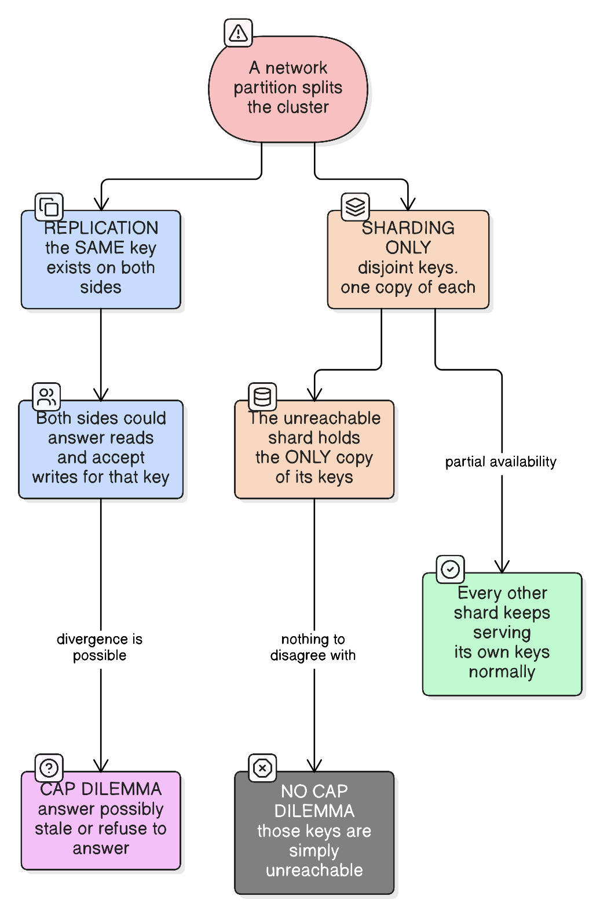
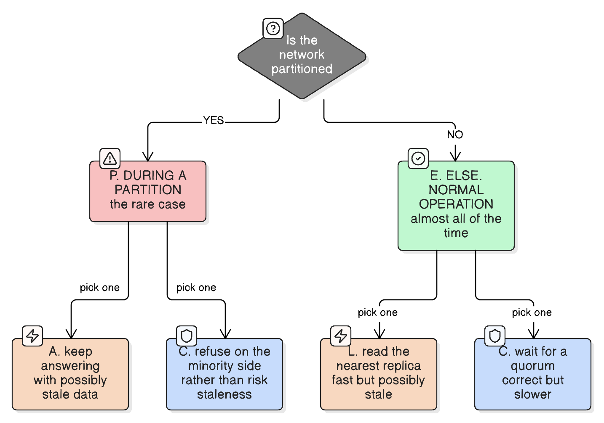

# CAP Theorem

> "The '2 of 3' formulation was always misleading because it tended to oversimplify the tensions among properties."
> — Eric Brewer, *CAP Twelve Years Later* (2012)
>
> *From the author of the theorem itself — which is why the useful question is "what happens during a partition?", not "pick two".*

CAP theorem says a distributed data system can only guarantee **two out of three** properties at the same time, whenever a network partition occurs:

- **C — Consistency**: every read gets the most recent write (or an error). All nodes see the same data at the same time.
- **A — Availability**: every request gets a (non-error) response, even if it's not the latest data.
- **P — Partition tolerance**: the system keeps working even when network failures split nodes into groups that can't talk to each other.

The catch: **partitions will happen** (cables get cut, switches fail, cross-region links drop). So P isn't really optional in a real distributed system — the actual choice you're making is **C vs A when a partition occurs**.

## What "a network partition occurs" means

A **network partition** is when nodes in a distributed system can't communicate with each other due to a network failure, even though each node is individually still up and running. Nothing crashed — the nodes are alive, just cut off from each other.

This is different from a node failure: a partition specifically means the machines are healthy but isolated, not that one of them went down.

**Real-life example**: a company runs a database cluster with one node in a US data center and a replica node in a Europe data center, kept in sync over the internet link between them. One day the undersea fiber link between the US and Europe goes down (or gets congested enough to time out) — both data centers are still fully powered on and serving traffic locally, but they can no longer talk to each other. That's a network partition: two healthy groups of nodes, split apart by a broken link between them, each left to decide on its own whether to keep answering requests with what it has, or to stop and wait until the link is restored.

Other common causes: a switch or router failing between racks in the same data center, a firewall/routing misconfiguration isolating one server, or a cross-region VPN peering connection dropping.

## Real-life analogy

Imagine two bank branches (Node A and Node B) that sync your balance with each other over a phone line. You walk into Branch A and withdraw $100.

- Normally, Branch A calls Branch B, updates the balance everywhere, then confirms your withdrawal.
- Now the phone line goes down (a **partition**). You ask Branch A for your balance.
  - **Choose Consistency**: Branch A refuses to tell you anything ("can't reach Branch B, so I can't guarantee this is correct") until the line is back. Correct, but unavailable.
  - **Choose Availability**: Branch A tells you its last known balance anyway. You get an answer immediately, but it might be stale — Branch B could have processed a withdrawal it doesn't know about yet.

You can't have both "always answer" and "always correct" while the phone line is down. That's the whole theorem in one scenario.

## Why P is the odd one out, and why you don't get to choose it

"Pick 2 of 3" invites you to treat C, A and P as three items on one menu. They aren't the same kind of thing:

| | What it describes | Who decides it |
|---|---|---|
| **C** — Consistency | How your system **behaves** | You, in code and config |
| **A** — Availability | How your system **behaves** | You, in code and config |
| **P** — Partition tolerance | What the **network** does to you | Physics, cables, switches and bad luck |

C and A are policies. P is weather. The formal statement (Gilbert & Lynch, 2002, who turned Brewer's conjecture into a proof) is that *the network is allowed to lose arbitrarily many messages sent from one node to another* — a description of the environment, not a feature you build. No amount of code prevents an undersea fibre being cut, a top-of-rack switch dying, a firewall rule being fat-fingered, or a 4-second GC pause making a healthy node indistinguishable from a gone one.

So CAP is not a menu, it's a **conditional**:

```
IF a partition occurs  →  you must give up C or A
IF no partition        →  you can have both
```

### "Tolerance" means handling a partition, not avoiding one

Both CP and AP systems **are** partition tolerant. Neither gives up P — they tolerate partitions differently:

- **CP** tolerates it by refusing service on the minority side, preserving correctness.
- **AP** tolerates it by serving on both sides, sacrificing correctness.

A system that genuinely lacks partition tolerance is one that corrupts data or falls over when the network splits. That isn't a design choice — it's an unhandled case.

### Which makes "CA" a category error

"We're a CA system" decodes to *"we have decided partitions will not happen"* — not a decision, a forecast, and the first of the classic fallacies of distributed computing ("the network is reliable"). The only honest CA system is one with **no network between nodes**: a single machine, which cannot partition from itself. Add a second node that must coordinate and P is imposed on you whether or not you planned for it.

**Extending the branch analogy:** whether staff hand you an unverified balance or refuse until they reach the other branch is **policy the manager sets** (**C vs A — your system's behaviour**). Whether a storm takes the phone line down is **weather** (**P — the network**). You don't get to choose whether storms exist, only what staff do when one hits. Declaring yourself "a CA business" declares that storms won't happen; the only genuinely storm-proof shop is the one with a single branch and no phone line at all (**a single node**).

## CP vs AP in practice

| Choice | Behavior during a partition | Example systems |
|---|---|---|
| **CP** (Consistency + Partition tolerance) | Rejects/blocks requests on the minority side rather than risk stale data | ZooKeeper, etcd, HBase, MongoDB (default config) |
| **AP** (Availability + Partition tolerance) | Keeps answering on both sides, reconciles/merges data later (eventual consistency) | Cassandra, DynamoDB, Riak |
| **CA** | Only possible without partitions — i.e. a single-node or non-distributed system. Not a real option once you're distributed. | Traditional single-node RDBMS |

## How to decide: CP or AP for your system?

| Question | Lean CP | Real-life example (CP) | Lean AP | Real-life example (AP) |
|---|---|---|---|---|
| Is stale/conflicting data actually unsafe (money, inventory, locks/leader election)? | Yes | A bank rejects a withdrawal it can't confirm against the latest balance, rather than risk overdrawing the account. | No — a slightly outdated read is tolerable | An e-commerce product page shows a "4.8★, 1,203 reviews" count that's a few minutes stale — nobody is harmed by that. |
| Can the operation be corrected later if it turns out to be wrong (e.g. reconciled, refunded, merged)? | No — must be right the first time | A flight seat assignment can't be double-booked and then "fixed later" — the seat is a single physical resource. | Yes | Two edits to the same shopping cart from two devices can be merged (union of items) once both sides reconnect — no harm done by the temporary conflict. |
| Is it acceptable for the system to refuse requests during a network issue rather than answer with possibly-stale data? | Yes | A stock trading system halts order placement during an exchange outage rather than accept trades against a price it can't verify. | No — uptime matters more than perfect freshness | A social media app keeps showing your feed (even a slightly stale one) during a partial outage rather than showing an error page. |
| Do you need coordination guarantees (e.g. only one leader, no double-booking the same seat)? | Yes | A movie ticketing system uses a lock so only one buyer can grab the last seat in a showing. | No | A "likes" counter on a post doesn't need a lock — two regions incrementing it concurrently and reconciling later is fine. |
| Is the workload read-heavy with tolerance for eventual convergence (e.g. social feed likes, product view counts)? | No | N/A — this scenario is specifically what AP is good at. | Yes | A video platform's "view count" is allowed to be approximate and catch up over time; blocking video playback to keep it perfectly accurate would be a bad trade. |

**Worked examples**

- **Bank ledger / payments** → CP. Two branches must never show different balances after a confirmed transfer — better to reject a request during a partition than let both sides process conflicting withdrawals.
- **Distributed lock / leader election (ZooKeeper, etcd)** → CP. Two nodes both believing they're "the leader" during a partition causes split-brain, which is worse than one side being briefly unavailable.
- **Shopping cart / product catalog (DynamoDB, Cassandra)** → AP. If a cart shows an item that's one second stale, that's fine — the store staying up and responsive matters more than instant consistency, and conflicts get merged on reconnect.
- **Social media like counts / view counts** → AP. Nobody notices if a like count is briefly a few seconds behind across regions; refusing to serve the page during a partition would be a worse user experience than a stale number.

## Does CAP apply to replication or to sharding?

**Replication.** CAP's dilemma exists only when **the same data item lives on more than one node**. That is the definition of replication, and Gilbert & Lynch's proof is stated over a single replicated register.



| | Replication | Sharding (on its own) |
|---|---|---|
| Copies of one key | Many | Exactly one |
| A partition means | Both sides can serve and mutate **the same key** | The cut-off shard holds the **only** copy of its keys |
| The question it forces | Answer possibly-stale, or refuse? | None — those keys are simply unreachable |
| Is divergence possible? | **Yes** — that's the whole risk | No — there's no second copy to disagree with |
| Effect on the rest of the data | — | Every other shard keeps serving normally |

With sharding alone there is no C-vs-A *choice* to make. You don't get to "pick availability", because there is no second copy that could answer. A partition just removes a slice of the keyspace: **partial unavailability, not inconsistency.**

### But real systems are both, so CAP applies per replica group

Production clusters shard *and* replicate — each shard is its own replicated group with its own leader and failover ([database-sharding-partitioning-replication](database-sharding-partitioning-replication.md)). So the CAP choice is made **independently, per shard**:

```
Shard A (replicas a1 a2 a3)   ← partition here → CP stall, keys of shard A refuse writes
Shard B (replicas b1 b2 b3)   ← unaffected     → serving normally
Shard C (replicas c1 c2 c3)   ← unaffected     → serving normally
```

Two practical consequences that "is the database CP or AP?" hides:

- **Availability is per-key, not global.** A CP system in a partition isn't "down" — it's refusing writes for the affected key ranges while the rest of the cluster is fine. Your error rate goes to a few percent, not 100%.
- **Sharding narrows the blast radius but widens the exposure.** Each incident touches a smaller fraction of the data, yet more nodes and links mean a higher chance that *some* shard is affected at any moment.

### What sharding's own consistency problem actually is

Sharding does create a correctness problem — but it is **not** CAP. It's **atomicity across shards**: a transaction touching shard A and shard C can't be made atomic by either shard alone. That's the **A of ACID**, not the A of CAP, and CAP's single-item model has nothing to say about it. The tools there are two-phase commit or [saga-pattern-compensating-transactions](saga-pattern-compensating-transactions.md).

(Two-phase commit *does* have a CAP-flavoured failure — a partition between the coordinator and participants leaves locks held while everyone waits, trading availability for correctness. But that's multi-object atomicity, not the single-register question CAP models.)

### One more place CAP hides in a sharded system

The routing layer — the map of which shard owns which keys — is itself **replicated state**, so CAP applies to *it*. That's usually where a sharded system makes its most deliberate CP choice: MongoDB's config servers, Vitess's topology in etcd, Kafka's controller metadata. If clients disagreed about which shard owned a key during a partition, they'd write the same key to two different shards, which is exactly the divergence sharding was supposed to make impossible.

**Summary:** CAP is a replication theorem. Sharding decides *how much* of your data a partition can affect; replication decides *what happens* to the affected part.

## What if there is no partition? PACELC

CAP is a statement about **one specific moment**: a partition. Partitions are rare — most systems spend well over 99.9% of their life with a healthy network. So what governs the other 99.9%?

CAP's answer is "nothing" — with no partition you may have both C and A. But that is not the same as "no trade-off exists". There is still one, and it's the one you pay for on **every single request**:

```
Consistency requires coordination.
Coordination requires network round trips.
Round trips cost latency.
```

**PACELC** (Daniel Abadi, 2010) extends CAP to say this explicitly:

> **if P**artition, then **A**vailability vs **C**onsistency; **E**lse, **L**atency vs **C**onsistency.



### Why consistency costs latency on a perfectly healthy network

To guarantee a read sees the latest write, the system must confirm with other nodes before answering — a quorum acknowledgement, or a round trip to the leader. That confirmation is a network hop, and hops have a floor set by physics:

| Path | Typical round trip |
| --- | --- |
| Same availability zone | ~0.5 ms |
| Cross-AZ, same region | ~1–2 ms |
| Mumbai ↔ Singapore | ~60 ms |
| Mumbai ↔ Virginia | ~200 ms |

So a globally-replicated database configured for strong consistency makes **every write wait for a distant region to answer**, even when nothing is wrong. Relax it — acknowledge locally, replicate asynchronously, read the nearest replica — and the same write completes in a millisecond, at the cost of a staleness window. Nothing failed; you simply chose L over C.

### The four PACELC classes

| Class | During a partition | Normally | Example systems |
| --- | --- | --- | --- |
| **PC/EC** | Consistency | Consistency | HBase, VoltDB, BigTable — consistent always, latency is the price |
| **PA/EL** | Availability | Latency | Cassandra, Riak, DynamoDB in its default mode — fast and available, eventually consistent |
| **PA/EC** | Availability | Consistency | MongoDB in its default configuration — normally waits for consistency, favours availability when split |
| **PC/EL** | Consistency | Latency | Rare. PNUTS (Yahoo) is the classic example |

Note that CP/AP is only half a description. Two databases can both be "CP" and behave completely differently day to day, because one waits for a global quorum on every write and the other doesn't.

### Why the E branch matters more in practice

The P branch governs an event that might happen twice a year. The E branch governs **every request your system will ever serve**. Teams routinely spend a design review arguing CP vs AP and then ship a system whose actual problem is that each write waits 200 ms for a cross-ocean acknowledgement.

If you only remember one thing: **CAP decides how you fail; PACELC's E decides how you feel.**

### The boundary is fuzzier than the diagram suggests

There is no signal that announces a partition. A node cannot distinguish "the other side is unreachable" from "the other side is slow" — so in practice a partition is *defined* as **"didn't respond within timeout T"**.

That has a consequence worth sitting with: **your timeout configuration is where the CAP choice is actually made.** Set it aggressively and ordinary slowness (a long GC pause, a congested link, a noisy neighbour) is classified as a partition, and your CP system starts refusing perfectly serviceable requests. Set it generously and genuine partitions go undetected for longer, so an AP system serves stale data for longer than intended. The theory presents a clean binary; operations gets a dial with no correct setting.

### While we're clearing up definitions

Two things CAP is routinely misread as saying:

- **CAP's "C" is linearizability**, not the C in ACID. A single-node Postgres enforcing foreign keys is "consistent" in the ACID sense and the CAP theorem has nothing to say about it.
- **CAP's "A" is absolute** — *every* non-failing node answers *every* request. Real-world availability is a percentage in an SLA. This is why "CP" does not mean "often down": etcd and ZooKeeper are CP and still run at four or five nines, because the partitions that would make them refuse requests are rare.

### How to decide: EL or EC when the network is healthy?

| Question | Lean EC (consistency) | Real-life example (EC) | Lean EL (latency) | Real-life example (EL) |
|---|---|---|---|---|
| Would a stale read cause a wrong *action*, not just a wrong display? | Yes | An ATM checking the balance before dispensing cash — reading a replica that missed the last withdrawal dispenses money that isn't there. | No, it only affects what's displayed | A product page showing a view count that's 30 seconds behind. |
| Does the user immediately re-read what they just wrote? | Yes, and it must be their own value | A user edits their delivery address at checkout and the confirmation screen must show the new one, not the old. | No, or a short delay is understood | Posting a comment that takes a second to appear in a global feed. |
| Are replicas far apart geographically? | Latency cost is real but accepted | A payments ledger replicated across two regions, where every write pays ~60 ms rather than risk divergence. | Yes, and users are worldwide | A social app serving feeds from the region nearest each user rather than a single home region. |
| Is the operation a read-modify-write on a contended value? | Yes | Decrementing the last unit of stock — two concurrent local reads both see "1 available" and both sell it. | No, writes are independent | Appending an event to a per-user activity log, where no two writers touch the same value. |
| What does the business actually measure you on? | Correctness | A trading system where a mispriced fill is a financial loss and a compliance incident. | Page-load and conversion | A retail site where 100 ms of added latency measurably reduces purchases. |

**The useful reframing:** consistency is rarely a system-wide setting. Most real applications are EC on a small number of paths (payment, inventory, auth) and EL everywhere else (feeds, search, recommendations, counters) — which is exactly why databases expose per-query consistency levels rather than one global switch.

## Eventual consistency: what giving up "C" actually leaves you

**Eventual consistency**: if no new writes are made to a data item, all replicas eventually converge on the same value.

Its relationship to CAP is direct — **it is the consistency model of the AP branch.** When an AP system keeps answering on both sides of a partition, the two sides diverge; eventual consistency is the promise that they will reconcile once the partition heals. Choosing A doesn't discard consistency, it *downgrades* it.

Read the definition closely and notice how little it promises:

- **"Eventually"** has **no bound**. In practice convergence takes milliseconds; the guarantee permits hours.
- **"If no new writes"** — on a continuously-written key, the precondition never holds.
- It says **nothing about what you read in the meantime**. Plain eventual consistency permits a read to return a value older than one you already saw.

That last point is why raw eventual consistency is rarely what a product actually ships.

### CAP's "C" is a binary; reality is a ladder

CAP models consistency as one thing (linearizability) that you either have or don't. Real systems pick a rung:

```
STRONGEST  ┌─ Linearizable ────── every read sees the latest committed write; one global order
           │  Sequential ──────── one global order, not necessarily real-time
           │  Causal ──────────── causally-related operations are seen in order by everyone
           │  Session guarantees ─ per-client promises (see below)
WEAKEST    └─ Eventual ────────── replicas converge, with no bound and no ordering promise
```

Two rungs matter more than the rest:

**Causal consistency** is the interesting theoretical ceiling: a well-known result (Mahajan, Alvisi & Dahlin, 2011) is that **causal consistency is essentially the strongest model achievable by a system that stays available during a partition.** If you want to remain available, causal is as good as it gets — you cannot have linearizability *and* availability, which is CAP restated.

**Session guarantees** are what users actually perceive, and they're the same three anomalies that show up under replication lag ([database-sharding-partitioning-replication](database-sharding-partitioning-replication.md)):

| Guarantee | Prevents |
|---|---|
| **Read-your-writes** | Saving your profile and being shown the old value |
| **Monotonic reads** | A refresh where a comment you just saw disappears |
| **Consistent prefix** | Seeing a reply before the message it answers |

An "eventually consistent" store plus session guarantees feels correct to a single user even while replicas disagree globally. That combination — not raw eventual consistency — is what most large systems run.

### Convergence isn't automatic: something must resolve conflicts

"Eventually converge" begs the question *converge on what?* Two replicas took different writes for the same key; someone must decide the winner:

- **Last write wins** — simple, and **silent data loss** decided by clock skew.
- **CRDTs** — data types that merge deterministically (counters, sets, text).
- **Application-level merge** — you write the rule (Dynamo's shopping-cart union is the classic).

Eventual consistency without a stated conflict-resolution rule isn't a design; it's a hope.

### It isn't only about partitions

Eventual consistency shows up just as often in PACELC's **E** branch: a system that acks locally and replicates asynchronously is eventually consistent on a perfectly healthy network, purely to save latency. Most "eventually consistent" behaviour users hit has nothing to do with a partition — it's async replication doing its normal job.

### Which level should this operation use?

| Question | Lean strong | Real-life example (strong) | Lean session/causal | Real-life example (session) | Lean eventual | Real-life example (eventual) |
|---|---|---|---|---|---|---|
| Does a stale read let something **wrong happen**, not just look wrong? | Yes | Debiting an account, or selling the last seat | No, but the user must see their own effect | A user edits their address and the confirmation page must show it | No | A "1,203 people liked this" counter |
| Who notices the staleness? | Anyone; the value is globally authoritative | Current inventory count shared by all buyers | The writer themselves | Your own comment appearing in your own feed | Nobody in particular | Aggregate view counts |
| Is there a conflict-resolution rule you're happy with? | Not needed — one order exists | A ledger where every entry is serialised | Merge is possible per session | Draft autosave from one device at a time | Yes, and it's lossless | Adding items to a cart (union) |
| Cost you're willing to pay | Cross-region round trips on every write | A payments API at 60 ms | Sticky routing or a leader read for that user | Reading the leader for 5 s after a write | None | A globally-cached feed |

**The practical shape:** consistency is chosen per operation, not per database. DynamoDB makes it a per-read flag (eventually vs strongly consistent); Cassandra makes it a per-query level (`ONE`, `QUORUM`, `ALL`); Azure Cosmos DB exposes five named levels (strong, bounded staleness, session, consistent prefix, eventual). That per-request granularity exists precisely because one application contains both a payment path and a like counter.

### Three different "C"s worth keeping apart

| Term | Means |
|---|---|
| **ACID's C** | Transactions preserve your declared invariants (constraints, foreign keys) |
| **CAP's C** | Linearizability — every read sees the latest write, in one global order |
| **Eventual consistency** | Replicas converge given enough quiet time |

A single-node Postgres is ACID-consistent and CAP has nothing to say about it. A Cassandra cluster can be eventually consistent while enforcing no invariants at all. Same word, three unrelated claims.

## Why it matters

This is the theoretical backbone behind the tradeoffs discussed in [choosing-sql-vs-nosql.md](choosing-sql-vs-nosql.md) — a distributed database's claim of "always consistent and always available" only holds as long as nothing ever partitions, which isn't realistic at scale.

It is also the theory underneath the replication choices in [database-sharding-partitioning-replication](database-sharding-partitioning-replication.md) — synchronous vs asynchronous replication, and what a minority-side node does during failover, are exactly the CP-vs-AP decision made concrete.

For the durability side of the same trade-off, see [write-ahead-log](write-ahead-log.md) — how many nodes must have the log record before a commit is acknowledged is the knob that turns a CP choice into a latency cost.

For the canonical CP system in practice, see [zookeeper-distributed-coordination](zookeeper-distributed-coordination.md) — majority quorum is what makes split brain impossible, and the minority side of a partition refusing writes is this theorem's trade-off in code.
