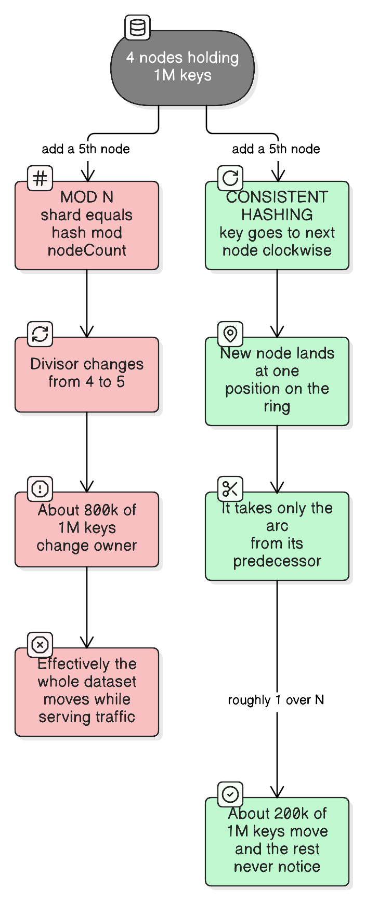
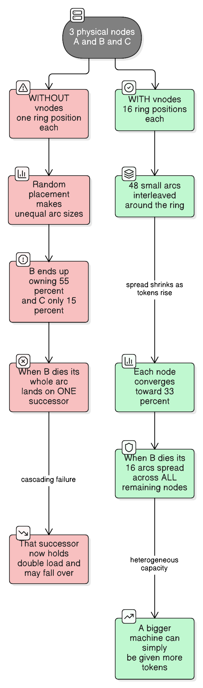

# Consistent Hashing

> "There are only two hard things in distributed systems: exactly-once delivery, and deciding which machine owns your data."
> — adapted from an old joke
>
> *Consistent hashing is the standard answer to the second one, and its whole value is what happens when the machine list changes.*

See also: [database-sharding-partitioning-replication](database-sharding-partitioning-replication.md) — consistent hashing is one of the six sharding techniques listed there; this file is the deep dive on it.

## The problem: `mod N` rehashing

You have 4 cache servers and 1,000,000 keys, routed the obvious way:

```
server = hash(key) mod 4
```

Traffic grows, so you add a fifth server. Now:

```
server = hash(key) mod 5
```



**Roughly 800,000 of the 1,000,000 keys now belong to a different server.** A key stays put only when `hash(key) mod 4 == hash(key) mod 5`, which is about one key in five.

The consequences depend on what you're routing, and both are bad:

- **A cache** — 80% of it is instantly invalid. Every one of those keys misses, and all of that traffic lands on your database at once. That's a [thundering-herd-problem](thundering-herd-problem.md) triggered by a capacity increase, which is a spectacularly annoying way to cause an outage.
- **A database** — 80% of the dataset must physically move between machines, while serving live traffic.

The nasty part is that this is worst *precisely when you're growing*. The operation meant to add capacity is the one that melts the system.

## What we actually want

First, one term used throughout: a key's **owner** is the node responsible for it — the cache server that stores that entry, the shard that holds that row, the backend instance that handles that session. "Routing" means working out the owner. (With replication, "owner" means the *first* node responsible; the extra copies are its replicas — see [Replication on the ring](#replication-on-the-ring).)

| Requirement | Why |
| --- | --- |
| **Minimal disruption** — adding or removing one node moves as few keys as possible | So scaling is a non-event |
| **No central directory** — any client can compute the owner alone | So routing needs no extra lookup or shared state on the hot path |
| **Deterministic** — every client agrees on the owner | Otherwise client A writes `user:8471` to N3 while client B reads it from N5 and finds nothing — a permanent cache miss, or two divergent copies of a row |
| **Balanced** — nodes get roughly equal shares | Otherwise one node is the bottleneck |

Determinism needs **two** things to agree, and only the first is easy: the **hash function** (code, so it matches as long as everyone runs the same build — which is why a non-portable hash like `String.hashCode()` breaks it across languages) and the **node list** (state, which can be stale). A client that hasn't yet learned a node joined will compute a different owner, which is why the ring removes the per-key directory but not the need for membership agreement.

`mod N` satisfies three of four and fails the first one catastrophically. Consistent hashing fixes that one while keeping the others.

---

## The ring

Hash both **keys and nodes** into the same space — say a 32-bit integer, `0 … 2³²−1` — and treat that space as a circle, where the maximum value wraps back to 0.

**Rule: a key belongs to the first node found walking clockwise from the key's position.**

Laid out linearly (easier to read than ASCII circle art, and the same thing — just remember the right edge wraps to the left):

```
hash space   0 ─────────────────────────────────────────────────────► 2³²−1 ⟲ wraps to 0

node tokens       ▲N1              ▲N2            ▲N3                ▲N4
                 0x1A             0x62           0x8F               0xD4

keys          k9    k1   k4     k7          k2      k5   k8
              │     │    │      │           │       │    │
owner        N2    N2   N2     N3          N4      N4   N1 ⟲
                                                        └── k8 is past N4, so it
                                                            wraps around to N1
```

Only two operations exist, and they're both cheap:

**Adding a node** — the new node hashes to one position and takes over *only the arc between its predecessor and itself*. Nothing else in the ring is affected:

```
before:   … ── N1 ────────────────────── N2 ── …      N2 owns this whole arc
after:    … ── N1 ────── N5 ──────────── N2 ── …      N5 took the first part
                         ↑
                  only keys in this sub-arc moved, and only from N2
```

**Removing a node** — its arc merges into its successor. Every other key stays where it is.

That's the entire mechanism. Average keys moved when going from N to N+1 nodes: **about `1/(N+1)` of the total**, versus `mod N`'s "nearly all of it".

## Real-life analogy

A night bus route running in a loop, with a fixed set of stops (**the hash space**). Each conductor is assigned one stop (**the node's token**), and the rule is: **a passenger is served by the first conductor at or after where they boarded, going the direction the bus travels** (**walk clockwise to the next node**).

Put a new conductor on board at a stop between two existing ones (**adding a node**) and exactly one thing changes — some passengers who used to be served by the *next* conductor along are now served by the newcomer (**only the predecessor's arc is split**). Every other passenger's conductor is unaffected, and nobody needs to consult a central roster to know who serves them — they just look ahead (**no directory, computed locally**). Compare that with renumbering every conductor whenever one joins (**`mod N`**), which changes almost everyone's assignment.

## Lookup, in code

The ring is just a sorted map of token → node, and lookup is a binary search with one wrap-around case:

```kotlin
class ConsistentHashRing(
    private val vnodesPerNode: Int = 160,
    private val hash: (String) -> Long = ::murmur3_64,   // NOT String.hashCode() — see below
) {
    private val ring = TreeMap<Long, String>()           // ring position -> physical node id

    fun addNode(nodeId: String) {
        repeat(vnodesPerNode) { i -> ring[hash("$nodeId#$i")] = nodeId }
    }

    fun removeNode(nodeId: String) {
        repeat(vnodesPerNode) { i -> ring.remove(hash("$nodeId#$i")) }
    }

    /** First token clockwise from the key; falling back to the first entry IS the wrap-around. */
    fun nodeFor(key: String): String? {
        if (ring.isEmpty()) return null
        val position = hash(key)
        return (ring.ceilingEntry(position) ?: ring.firstEntry()).value
    }
}
```

`ceilingEntry(position) ?: firstEntry()` is the only line that makes this a *ring* rather than a line. Lookup is `O(log(nodes × vnodes))`.

---

## Virtual nodes: the part that makes it usable



Plain consistent hashing has a serious flaw: **with one token per node, the arcs are random and therefore unequal.** Three nodes placed at random on a ring do not produce three 33% arcs — one node can easily own 55% and another 15%. Worse, when a node dies, its **entire** arc lands on a single successor, which now carries double load and may itself fall over. That's a cascading failure caused by the mechanism meant to provide resilience.

**Fix: give each physical node many positions on the ring** — "virtual nodes" or "tokens". Three machines with 16 tokens each means 48 small interleaved arcs.

Three distinct benefits, and each one matters independently:

| Benefit | Why it follows |
| --- | --- |
| **Even distribution** | Averaging many small random arcs converges on the mean. Relative imbalance shrinks roughly as `1/√V` for `V` tokens per node |
| **Graceful failure** | A dead node's 16 arcs are scattered, so its load spreads across **all** survivors — each absorbing ~1/(N−1) extra, not 100% |
| **Heterogeneous capacity** | A machine with twice the RAM simply gets twice the tokens. Plain consistent hashing has no way to express "this box is bigger" |

Real values: **libketama** (the memcached client standard) uses 160 points per server. **Cassandra** used 256 tokens per node by default, and lowered it to **16** in 4.0 alongside a smarter allocation algorithm — because very high token counts hurt elsewhere.

**The trade-off in picking V:** higher V means better balance but a bigger ring to store and search, slower gossip/topology exchange, and — in a database — more, smaller ranges to stream during repair or rebuild. Balance is not the only cost function.

## What consistent hashing does *not* solve

Worth being blunt, because this is where expectations break:

- **It balances *keys*, not *load*.** If one key is requested a million times a second, consistent hashing faithfully sends all million to one node. The [celebrity hot-key problem](database-sharding-partitioning-replication.md) is untouched. Fixes are separate: key salting, or **bounded-load consistent hashing**, which caps a node's share and spills overflow to the next node clockwise.
- **It doesn't make failure domains safe.** Three replicas chosen by walking clockwise can easily all sit in one rack or one availability zone. Real implementations make the walk **rack- and AZ-aware**, skipping candidates in a failure domain they already used.
- **It doesn't give you range queries.** Keys are scattered by hash, so "all keys between X and Y" is meaningless on the ring.
- **It isn't free of coordination.** Every client still needs an accurate node list. Consistent hashing removes the *per-key* directory, not the need for membership (gossip, ZooKeeper, etcd).

## Replication on the ring

Once you're on a ring, replication is nearly free: **walk clockwise past the key's owner and take the next `R` distinct physical nodes.** That list is Dynamo's **preference list**.

```kotlin
/** The R nodes that should hold this key: owner first, then successors clockwise. */
fun preferenceList(key: String, replicas: Int): List<String> {
    val distinct = LinkedHashSet<String>()
    val position = hash(key)

    // tailMap gives us "clockwise from here"; appending ring.values covers the wrap-around.
    for (nodeId in ring.tailMap(position, true).values + ring.values) {
        distinct.add(nodeId)                    // a Set skips further vnodes of a machine already chosen
        if (distinct.size == replicas) break
    }
    return distinct.toList()
}
```

The `LinkedHashSet` is doing the important work: without deduplication you'd "replicate" onto three virtual nodes that all belong to the same physical machine — three copies on one box, which is no replication at all. This is a real bug people ship.

---

## The alternatives, and when they're better

Consistent hashing is not automatically the right answer. Four genuine competitors:

| Approach | How it works | Strengths | Weaknesses |
| --- | --- | --- | --- |
| **Fixed partition count** | Hash into a large fixed number of logical partitions (say 1024); map partitions → nodes separately | Dead simple, key→partition mapping *never* changes, rebalancing moves whole partitions, partition count is an explicit capacity decision | Partition count fixed at creation; poor fit if membership churns constantly |
| **Rendezvous (HRW) hashing** | Compute `hash(key, node)` for every node, pick the highest | Simpler than a ring, no vnodes needed, trivially supports weights, minimal disruption by construction | `O(N)` per lookup — fine for tens of nodes, not thousands |
| **Jump consistent hash** | A short numeric loop mapping a key to a bucket in `0…N−1` | Zero memory, very fast, near-perfect balance | Buckets must be numbered contiguously and you can only add/remove at the **end** — cannot remove an arbitrary node |
| **Maglev hashing** | Build a lookup table that is both very even and minimally disruptive | Constant-time lookup, excellent balance | More complex; table must be rebuilt on membership change |

**The honest recommendation for databases: prefer a fixed partition count.** Elasticsearch (fixed primary shards), Kafka (topic partitions), and Redis Cluster (16384 hash slots) all chose it over consistent hashing, because database nodes join and leave *rarely and deliberately*. Consistent hashing earns its complexity when membership changes **often and unpredictably** — caches, service meshes, load balancers, peer-to-peer systems.

> A common misconception worth clearing up: **Redis Cluster does not use consistent hashing.** It uses 16384 fixed hash slots, `CRC16(key) mod 16384`, with slots assigned to nodes. Kafka doesn't either — it's `murmur2(key) mod partitions`.

## Where it's genuinely used

| System | Use |
| --- | --- |
| **Cassandra / ScyllaDB** | Token ring with vnodes; preference list for replicas |
| **DynamoDB / Riak** | Dynamo-derived ring, preference lists, hinted handoff |
| **memcached clients** (ketama) | Client-side ring so a dead server invalidates only its share |
| **Envoy / nginx / HAProxy** | `ring_hash` and `maglev` upstream policies for session affinity |
| **CDNs** | Choosing which edge cache holds an object |
| **Service meshes** | Sticky routing to a backend instance |

The pattern: **consistent hashing wins where nodes are transient and the cost of a wrong guess is a cache miss, not data loss.**

---

## How to decide

### Consistent hashing, fixed partitions, or something else?

| Question to ask | → Consistent hashing | Real-life example | → Fixed partitions | Real-life example | → Rendezvous / jump | Real-life example |
| --- | --- | --- | --- | --- | --- | --- |
| How often does membership change? | Constantly and unpredictably | Autoscaled cache tier; instances replaced hourly | Rarely and deliberately | A 6-node Postgres or Elasticsearch cluster resized quarterly | Occasionally, at the tail | A worker pool numbered 0…N−1 that scales in and out |
| Do you need to remove an *arbitrary* node? | Yes | An AZ fails and takes 3 of 12 cache nodes | Yes | Any database node can die | **Jump: no** — tail only | Shrinking a numbered worker fleet |
| How many nodes? | Any | 500 edge caches | Any | Tens | Rendezvous: tens (it's `O(N)`) | 20 backends behind a proxy |
| Do nodes have different capacity? | Yes, via token counts | Mixed instance types after a migration | Awkward — you'd assign uneven partition counts | Uniform fleet | Rendezvous: yes, weights are trivial | Canary node taking 5% |
| Is the cost of a remap a cache miss or a data move? | A cache miss | CDN object placement | A data move — so you want *whole partitions*, planned | Sharded database | Either | Stateless routing |

### How many virtual nodes per physical node?

| Question to ask | → Low (8–32) | Real-life example | → High (128–256) | Real-life example |
| --- | --- | --- | --- | --- |
| Is topology gossiped between many nodes? | Yes — keep the ring small | A large Cassandra cluster where token exchange costs bandwidth | No, the ring is client-side only | A memcached client library (ketama's 160) |
| Does rebalancing stream data per range? | Yes — fewer, larger ranges stream more efficiently | Cassandra 4.0's default of 16 | No, it's stateless routing | A load balancer's ring |
| How few physical nodes are there? | Many nodes already average out | A 60-node cluster | Few nodes need more tokens to look even | A 3-node cache tier |

---

## Common mistakes

| Mistake | What goes wrong |
| --- | --- |
| Using `String.hashCode()` as the ring hash | Poorly distributed and only stable for `String` on the JVM. Use murmur3 / xxHash / MD5 so nodes and languages agree forever |
| One token per physical node | Wildly uneven arcs, and a dead node dumps its whole load on one successor |
| Forgetting the wrap-around case | Keys past the last token get no owner — the classic first-implementation bug |
| Building a preference list without deduplicating physical nodes | "3 replicas" that are three virtual nodes on one machine |
| Ignoring racks and AZs when walking clockwise | All replicas in one failure domain; one rack loss = data loss |
| Expecting it to fix hot keys | It balances keys, not request volume. A celebrity key still cooks one node |
| Hashing the wrong thing | Hashing a full URL when you meant the object ID puts `?utm_source=` variants on different nodes and multiplies your cache footprint |
| Nodes disagreeing on the ring | Two clients with different node lists write the same key to different nodes. Membership needs its own source of truth |
| Reaching for it when a fixed partition count is simpler | Extra complexity with no benefit if your cluster changes size twice a year |

## Key takeaways

1. **`mod N` is the problem.** Adding one node to four remaps ~80% of keys — worst exactly when you're scaling up.
2. **The ring rule is one sentence:** hash keys and nodes into the same circular space; a key belongs to the first node clockwise.
3. **Adding or removing a node moves only `~1/N` of keys**, and only from one neighbour.
4. **Virtual nodes are not optional.** They fix uneven arcs, spread a failed node's load across all survivors, and let unequal machines take unequal shares.
5. **It balances keys, not load** — hot keys, failure domains and membership all need separate solutions.
6. **Replication is a clockwise walk** to the next `R` *distinct physical* nodes.
7. **For databases, a fixed partition count is usually the better choice.** Consistent hashing pays off when membership churns constantly — caches, proxies, meshes.

## See also

- [database-sharding-partitioning-replication](database-sharding-partitioning-replication.md) — where consistent hashing sits among the sharding techniques, and why fixed partition counts often beat it for databases.
- [caching-fundamentals](caching-fundamentals.md) — the distributed cache tier that is consistent hashing's most natural home.
- [thundering-herd-problem](thundering-herd-problem.md) — what a mass cache remap causes downstream, and the reason `mod N` rehashing is dangerous rather than merely wasteful.
- [redis-single-threaded](redis-single-threaded.md) — Redis Cluster's fixed 16384 hash slots, a deliberate alternative to a hash ring.
- [java/hashmap](../java/hashmap.md) — the single-machine version of the same problem: buckets, a hash function, and what a resize costs.
- [zookeeper-distributed-coordination](zookeeper-distributed-coordination.md) — the ring removes the per-key directory but still needs an agreed node list; this is where that agreement usually lives.
- [load-balancing-algorithms](load-balancing-algorithms.md) — ring-hash and Maglev as load-balancing policies, and where hashing sits against round robin, least-connections and power-of-two-choices.
