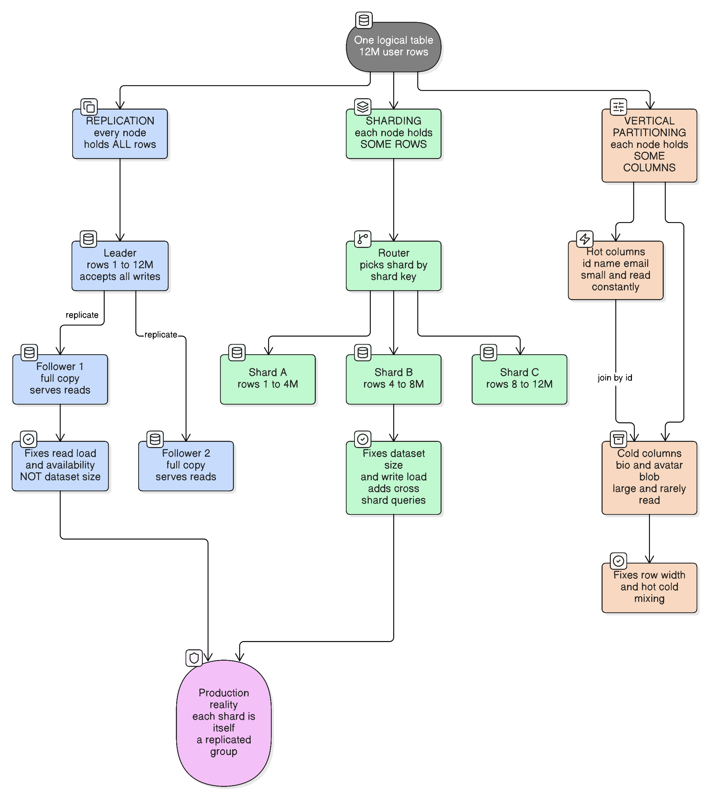
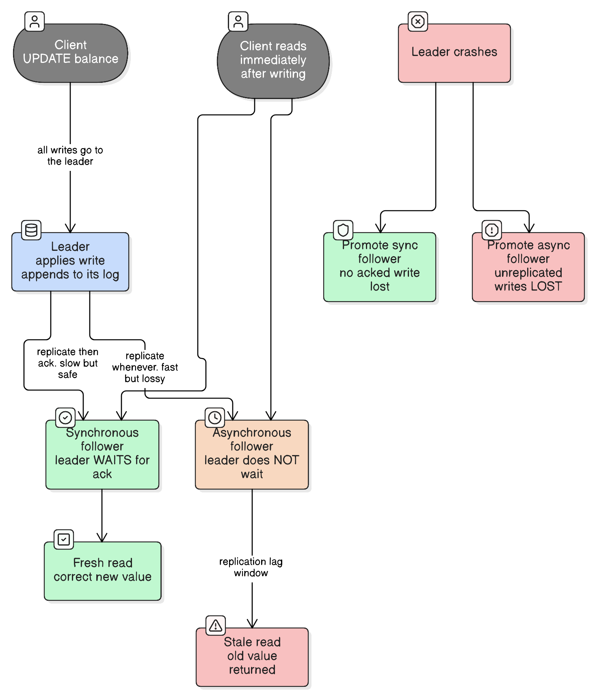
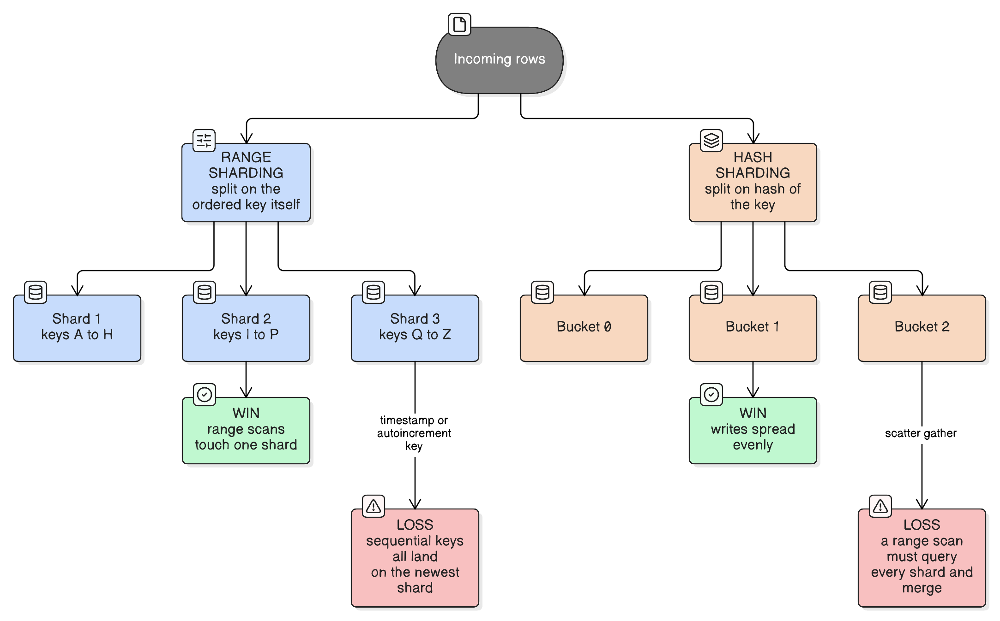

# Database Scaling: Replication, Partitioning and Sharding

> "If you can't split it, you can't scale it."
> — distributed-systems folklore
>
> *And the corollary nobody quotes: once you split it, everything that used to be one `JOIN` away is now a network call.*

Three words that get used interchangeably and mean completely different things:

```
Replication            → every node holds ALL the data
Sharding               → each node holds SOME OF THE ROWS
Vertical partitioning  → each node holds SOME OF THE COLUMNS
```

They solve different problems, and picking the wrong one is how you end up with three copies of a dataset that was already too big for one machine.



[Edit this diagram](https://app.eraser.io/workspace/JLgRjFjapzOnrAqixpQO?diagram=nuKs-wDNrr-hAS6Yt5AI&layout=canvas)

---

## Start here: what are you actually running out of?

Every scaling decision follows from this. Name the bottleneck before naming the technique.

| Running out of | Symptom | What actually helps | What doesn't |
| --- | --- | --- | --- |
| **Read throughput** | CPU pegged on reads, queries queueing | Read replicas, caching | Sharding (adds complexity for nothing) |
| **Write throughput** | Replication lag climbing, write queue growing | Sharding | Read replicas (every replica does *all* the writes) |
| **Dataset size** | Disk full, backups take a day, index no longer fits in RAM | Sharding, archiving, vertical partitioning | Replication (each copy is just as big) |
| **Availability** | One machine dying = outage | Replication + failover | Sharding (more machines = *more* things that can fail) |
| **Latency for distant users** | Users in Sydney hitting a Virginia database | Geo-replication, multi-leader | Sharding by anything other than region |
| **Row width** | A few huge BLOB columns dragging every query | Vertical partitioning, [blobs-and-large-object-storage](blobs-and-large-object-storage.md) | Sharding |

**The single most useful observation:** replication scales reads, sharding scales writes and storage. A read replica does not reduce write load *at all* — every follower applies every write the leader took. If your problem is writes, adding replicas makes it slightly worse.

---

# Part 1 — Replication

## What is it?

Keeping a **complete copy** of the dataset on more than one node. Every replica holds all the rows.

## Why do we need it?

1. **Availability** — a machine dies and something else already has the data.
2. **Read scaling** — N replicas can serve roughly N× the reads.
3. **Latency** — put a copy near the users.
4. **Backups / analytics** — run the expensive nightly report against a replica so it doesn't touch production.

## Real-life analogy

A library chain keeps the same book at three branches (**each replica holds the full dataset**). You can borrow it from whichever branch is nearest (**read from any replica**), which is why the chain handles many more borrowers than one branch could. But only head office publishes new editions (**all writes go to the leader**), and it takes a day for the new edition to reach the branches (**replication lag**) — so for a day, a branch will hand you the old edition while insisting it's current (**a stale read**). Adding a fourth branch doesn't help head office publish faster (**replicas don't scale writes**).

---

## 1.1 Single-leader replication (leader–follower)

The default in Postgres, MySQL, MongoDB replica sets, and most managed cloud databases.

```
       writes
          ↓
      ┌────────┐
      │ LEADER │────── replication log ──────┐
      └────────┘                             │
          │ replicate                        ↓
     ┌────┴────┐                       ┌──────────┐
     ↓         ↓                       │ FOLLOWER │
┌──────────┐ ┌──────────┐              └──────────┘
│ FOLLOWER │ │ FOLLOWER │                    ↑
└──────────┘ └──────────┘                  reads
```

**The rules:** all writes go to the leader; the leader streams its change log to followers; reads may be served by any node. Followers are read-only — that's what makes the model simple, and it's also its ceiling.



[Edit this diagram](https://app.eraser.io/workspace/JLgRjFjapzOnrAqixpQO?diagram=BqEfa8CJ2M9vrfqmezsu&layout=canvas)

### Synchronous vs asynchronous — the durability/latency dial

| | Leader waits for follower? | Write latency | On leader crash | Availability risk |
| --- | --- | --- | --- | --- |
| **Synchronous** | Yes, before acking the client | Slower — bounded by the slowest follower | No acknowledged write lost | If the sync follower is down, writes **block** |
| **Asynchronous** | No, acks immediately | Fast | Writes not yet shipped are **lost** | Leader keeps accepting writes regardless |
| **Semi-synchronous** | Waits for *one* of N | Middle | Safe if that one survives | Best practical compromise |

Fully synchronous replication to *all* followers is almost never used: one slow or dead follower stops the entire database. **Semi-synchronous** — one synchronous follower, the rest async — is the usual production setting, and it's what "durability" means in most managed offerings.

### Replication lag and the three anomalies it causes

Async replication means a window where a follower is behind. That window produces three distinct, named bugs. Each has a specific fix — and knowing which one you're looking at is most of the debugging.

**1. Read-your-writes violation** — a user updates their profile, the read goes to a lagging follower, and they see the old value. They assume the save failed and do it again.

Fixes:
- Read from the leader for a short window after that user writes (simplest, most common).
- Read from the leader for data the user *can* modify; use replicas for everything else.
- Track the write's log position and require the replica to have caught up to it.

```kotlin
// Route reads to the leader briefly after a user writes, so they see their own change.
private val readYourWritesWindow = Duration.ofSeconds(5)

fun profileFor(userId: String): Profile {
    val source = if (writeTracker.wroteWithin(userId, readYourWritesWindow)) leader
                 else replicas.next()
    return source.loadProfile(userId)
}
```

**2. Monotonic reads violation** — the user refreshes and time appears to go *backwards*: the first read hits an up-to-date replica, the second hits a more lagged one, and a comment that existed vanishes.

Fix: **sticky routing** — always send the same user to the same replica (hash the user ID to a replica), so they may be behind but never jump backwards.

**3. Consistent prefix reads violation** — causally related writes are observed out of order. The classic: an observer sees the answer "About ten seconds" before the question "How far into the future can you see?"

Fix: keep causally related writes in the same partition, or track causal dependencies explicitly.

> These are not exotic. Read-your-writes is the single most common production complaint after adding read replicas to an app that previously had one database.

### Failover, and why automatic failover is dangerous

When the leader dies: detect it, choose a new leader, and repoint clients. Every step has a failure mode:

- **Lost writes** — an async follower promoted to leader never received the last writes. They're gone. Worse, if the old leader comes back and its extra writes are discarded, any external system that already saw them (a cache, a search index, an email) is now inconsistent with the database.
- **Split brain** — both old and new leader accept writes. This is the one that corrupts data. Prevented by **fencing** (STONITH) and by requiring a majority quorum to elect a leader.
- **Bad timeout tuning** — too short and a GC pause triggers an unnecessary failover under load, which is exactly when you least want one; too long and you're down.

This is where [cap-theorem](cap-theorem.md) becomes concrete: a minority-side node that can't reach the quorum must choose between refusing writes (CP) and accepting writes it may have to reconcile later (AP).

### How the data actually ships

Worth knowing because it explains several odd restrictions:

| Method | What's shipped | Gotcha |
| --- | --- | --- |
| **Statement-based** | The literal SQL | `NOW()`, `RAND()`, auto-increment produce *different* results on the replica |
| **WAL / physical** | Byte-level changes to storage pages | Tightly coupled to the storage engine version — often blocks a zero-downtime major upgrade |
| **Logical / row-based** | The changed rows themselves | Decoupled from storage format; the basis of CDC and Debezium-style pipelines |

---

## 1.2 Multi-leader replication

More than one node accepts writes, and leaders replicate to each other.

**When it's genuinely justified:**
- **Multi-datacenter** — each region has a local leader, so writes don't pay a cross-ocean round trip.
- **Offline-capable clients** — a calendar app on a phone is a leader for its own local copy; every device syncs on reconnect.
- **Real-time collaborative editing** — every client is effectively a leader.

**The cost: write conflicts.** Two leaders concurrently modify the same row and there is no single authority to serialise them. Resolution strategies, none free:

| Strategy | How | Cost |
| --- | --- | --- |
| **Last write wins (LWW)** | Highest timestamp survives | **Silent data loss**, and clock skew decides your business logic |
| **Conflict-free replicated data types (CRDTs)** | Data structures that merge deterministically | Only works for structures that fit the model (counters, sets, text) |
| **Application-level merge** | You write the merge function | Correct, but you must handle every field |
| **Avoidance** | Route all writes for a given record to one leader | Loses the benefit exactly when a region fails over |

> **Rule of thumb:** multi-leader is a specialist tool. If you're reaching for it to scale writes on a single-region app, you want sharding instead.

## 1.3 Leaderless replication (Dynamo-style)

No leader at all. Clients (or a coordinator) write to several replicas directly. Used by Cassandra, DynamoDB, Riak, ScyllaDB.

**Quorums.** With `N` replicas, `W` write acks required, `R` read responses required:

```
W + R > N   →  a read is guaranteed to see the latest acknowledged write
```

With `N=3, W=2, R=2`: any write reached 2 nodes, any read asks 2, so they must overlap in at least one node that has the newest value. Tuning it changes the trade-off:

- `W=1, R=1` — fastest, weakest. Effectively no consistency guarantee.
- `W=N, R=1` — reads are cheap and always fresh, but any node being down blocks writes.
- `W=2, R=2` on `N=3` — the usual balanced default; tolerates one node down for both reads and writes.

**Supporting machinery:**
- **Read repair** — a read that notices a stale replica writes the fresh value back to it.
- **Anti-entropy** — a background process comparing replicas (often via Merkle trees) and reconciling.
- **Hinted handoff** — while a node is down, another holds its writes and forwards them on recovery.

**The catch:** `W + R > N` is *not* a transaction. Two concurrent writes still conflict, and concurrent-write detection needs version vectors; last-write-wins remains the common default and still silently drops data.

---

# Part 2 — Partitioning and sharding

## The terminology, settled

These words are used loosely; the distinctions that actually matter:

| Term | Splits | Across |
| --- | --- | --- |
| **Vertical partitioning** | Columns | Tables, or machines |
| **Horizontal partitioning** | Rows | Usually within one database instance |
| **Sharding** | Rows | **Across independent machines** |

**Horizontal partitioning vs sharding** is the distinction people get wrong most often. Native table partitioning (Postgres `PARTITION BY RANGE`, MySQL partitions) splits a table into pieces that still live inside **one database instance** managed by **one query planner**:

```sql
CREATE TABLE orders (
    order_id    BIGINT,
    created_at  TIMESTAMP NOT NULL,
    total       NUMERIC(12,2)
) PARTITION BY RANGE (created_at);

CREATE TABLE orders_2026_08 PARTITION OF orders
    FOR VALUES FROM ('2026-08-01') TO ('2026-09-01');
```

You still get real transactions, real joins, real foreign keys, and one connection string. What you gain is **partition pruning** (a query filtered on `created_at` scans one partition), cheap bulk deletion (`DROP TABLE orders_2026_08` instead of a month-long `DELETE`), and smaller per-partition indexes.

**Sharding** puts the pieces on different machines that know nothing about each other. That's where transactions, joins and uniqueness constraints stop working across the boundary.

> **The practical consequence:** native partitioning is a local optimisation you can adopt in an afternoon and revert. Sharding is an architectural commitment. **Always exhaust partitioning first.**

## Vertical partitioning

Split a wide table by column, by access pattern:

```sql
-- Hot: tiny, read on every request
CREATE TABLE users (
    user_id  BIGINT PRIMARY KEY,
    email    VARCHAR(255) NOT NULL,
    name     VARCHAR(255) NOT NULL
);

-- Cold: large, read rarely
CREATE TABLE user_profiles (
    user_id      BIGINT PRIMARY KEY REFERENCES users(user_id),
    bio          TEXT,
    avatar_blob  BYTEA
);
```

**Why it helps:** databases read in pages. A 2 KB `bio` and a 500 KB avatar sitting in the same row mean every `SELECT email FROM users` drags that weight through the buffer pool, evicting rows you needed. Splitting them means the hot table stays small enough to live in memory.

**Real-life analogy:** a hospital keeps a thin front sheet with name and patient number at reception (**hot columns, read constantly**) and the bulky X-ray films in the basement archive (**cold columns, large and rarely read**), linked by patient number (**the join key**). The receptionist doesn't haul films upstairs to check a phone number.

**Cost:** every query needing both halves is now a join, and you've lost atomicity across the two if they end up on separate machines.

---

## Sharding

### The shard key is the whole decision

Everything else is mechanics. The shard key determines whether your queries hit one machine or all of them, and it is **extremely expensive to change** — changing it means moving every row.

**A good shard key:**
1. **High cardinality** — many distinct values. (`country` gives you ~200 possible shards and India will be 20% of them; `user_id` gives you millions.)
2. **Even distribution** — no value is dramatically hotter than others.
3. **Present in your most common queries** — otherwise every read becomes scatter-gather.

That third one is the one people miss. If you shard `orders` by `order_id` but your hottest query is "all orders for this customer", every single one of those queries must ask every shard. Sharding by `customer_id` makes it a single-shard lookup — and makes "find order by ID" the scatter-gather instead. **You are choosing which query gets to be fast.**

### Range vs hash



| | Range sharding | Hash sharding |
| --- | --- | --- |
| Split on | The ordered key itself (`A–H`, `I–P`, `Q–Z`) | `hash(key) mod partitions` |
| Range scans | **One shard** — efficient | **Every shard** — scatter-gather |
| Write distribution | Skewed if keys are sequential | Even |
| Classic failure | Timestamp or auto-increment key → **all writes hit the newest shard**, and the other shards sit idle | "Give me last week's orders" touches every shard |
| Used by | HBase, Bigtable, MongoDB (range mode) | Cassandra, DynamoDB, MongoDB (hashed mode) |

**The compromise most systems land on:** a **compound key** — hash the first component to spread load, range-order within it. Cassandra's `PRIMARY KEY ((user_id), created_at)` puts one user's rows together on one node (**partition key `user_id`, hashed**) and keeps them time-ordered inside that node (**clustering key `created_at`, ranged**), so "this user's last 20 events" is one node and one sequential scan.

### The full menu of sharding techniques

Range and hash are the two *mechanisms*. In practice you're choosing from six named strategies, and the last three are what large SaaS products actually run.

#### 1. Range (dynamic) sharding

Split on the ordered key itself. Shards hold contiguous key ranges, and a shard that grows too big splits in two.

```
Shard 1: customer_id  A00000 → H99999
Shard 2: customer_id  I00000 → P99999
Shard 3: customer_id  Q00000 → Z99999
```

Range scans stay on one shard; sequential keys create a hot shard. Used by HBase, Bigtable, MongoDB in ranged mode.

#### 2. Hash (algorithmic) sharding

Compute the shard from the key. No lookup, no state — every client can work out the answer independently.

```
shard = hash(customer_id) mod partitions
```

Even distribution, cheap routing, but **you cannot move one key without changing the function**, and range scans hit everything. Used by Cassandra, DynamoDB, MongoDB in hashed mode.

#### 3. Consistent hashing

Keys and nodes both hash onto a ring; a key belongs to the next node clockwise. Adding a node reassigns only `~1/N` of keys instead of `mod N`'s ~80%. Virtual nodes (each physical node at many ring positions) even out the distribution.

Best when nodes join and leave *often* — which is why it's the standard for distributed caches and Dynamo-style stores rather than for a fixed fleet of database servers.

Full treatment in [consistent-hashing](consistent-hashing.md) — the ring, virtual nodes, preference lists, and the alternatives worth considering first.

#### 4. Directory (lookup-table) sharding

A small, separately-stored map from key → shard. Routing is a lookup, not a calculation.

```
tenant_id  →  shard
─────────────────────
acme          shard_3
globex        shard_3
initech       shard_7      ← moved here last month; nothing else had to change
bigcorp       shard_9      ← large enough to get a shard to itself
```

| Gains | Costs |
| --- | --- |
| Move **one** tenant without touching anybody else | An extra hop on every request, so the directory must be cached |
| Heterogeneous shards — a huge customer gets dedicated hardware | The directory is a hot path and a single point of failure |
| Rebalance arbitrarily, on your own schedule | Must stay consistent while a move is in flight |
| Isolate a noisy tenant the moment it becomes a problem | One more stateful service to operate |

This is the strategy that wins for **multi-tenant B2B SaaS**, because tenants differ in size by orders of magnitude and an algorithmic function can't express "this one customer needs its own machine".

#### 5. Entity-group (tenant) sharding

Not a routing mechanism but a **modelling decision**: pick the entity that owns everything else, and put its whole object graph on one shard.

```
shard for tenant "acme" holds:
  workspaces, channels, messages, files, memberships, settings … for acme only
```

Everything a request touches is on one shard, so joins and ACID transactions keep working *inside* a tenant — you get sharding's capacity with almost none of its pain. This is why Slack shards by workspace, Salesforce runs org-per-pod, and Shopify runs shop-per-pod. Cross-tenant queries become the hard case, and for these products cross-tenant queries barely exist.

#### 6. Geo (region) sharding

Shard on location, usually for **data residency** rather than performance: EU users' rows must physically live in the EU. Latency improves as a side effect.

The catch is that the shard key is now a property that can change (a user relocates) and that skews heavily — your largest market will dominate — so geo sharding is normally combined with hash sharding *within* each region.

### Choosing between them

| Technique | Routing cost | Rebalancing | Move one key? | Best for |
| --- | --- | --- | --- | --- |
| **Range** | Calculated | Automatic splits | Range boundary shift | Ordered scans, time-series with a hashed prefix |
| **Hash** | Calculated | Painful unless partitions are fixed | **No** | Uniform point-lookup workloads |
| **Consistent hashing** | Calculated | `~1/N` moves | No | Fleets where nodes come and go |
| **Directory** | Lookup + cache | Trivially flexible | **Yes** | Multi-tenant SaaS with uneven tenants |
| **Entity group** | Either | Follows the underlying mechanism | Depends | Anything with a natural ownership boundary |
| **Geo** | Calculated | Rare, and manual | On relocation | Data-residency requirements |

> **The combination most large products land on:** entity-group modelling (decide *what* travels together) + directory routing (decide *where* it lives) + hash sharding inside a region. They're layers, not alternatives.

### Hot spots, and why hashing doesn't fix all of them

Hashing spreads *distinct keys* evenly. It does nothing when a **single key** is hot — the "celebrity problem". Every follower of one enormous account writes to the same partition; hashing put that partition on one node and there it stays.

The reason hashing can't help is that **hashing is a deterministic function of the key** — `hash("post:123")` is one number, so it maps to one partition forever. That determinism is the feature (it's what removes the need for a lookup), and it's exactly why no hash function can split a single key.

#### Key salting: stop having one key

The application-level fix is to turn one logical key into N physical keys by appending a suffix:

```
logical:   likes:post123
physical:  likes:post123:00  …  likes:post123:15
```

Writes pick a bucket at random, so they spread; reads must gather every bucket and combine:

```kotlin
private const val BUCKETS = 16

fun recordLike(postId: String) {
    val bucket = Random.nextInt(BUCKETS)            // one write, now spread over 16 partitions
    db.increment("likes:$postId:%02d".format(bucket))
}

fun likeCount(postId: String): Long =
    (0 until BUCKETS).sumOf { bucket ->             // 16 reads plus a merge
        db.get("likes:$postId:%02d".format(bucket))
    }
```

**It only works when the merge is commutative** — counters sum, sets union, time-ordered feeds merge-sort:

| Data | Merge | Works? |
| --- | --- | --- |
| Counter | Sum the buckets | ✅ |
| Follower set | Union | ✅ |
| Recent-activity feed | Merge-sort | ✅ |
| "Reserve the last unit of stock" | — | ❌ |

That last row is the real limitation: after salting, **the logical total exists nowhere** — it is only ever computed. So there is no atomic conditional update on it. A hard-cap rate limiter or last-unit inventory reservation becomes approximate, because the total moves between reading the buckets and writing one. If you need a hard limit on the logical value, salting is the wrong tool.

Three sizing details that bite:

- **N buckets ≠ N nodes.** The suffixed keys are hashed too, so several can land on the same partition. Size N well above the spread you need.
- **N is effectively permanent.** Going from 16 to 32 leaves old data in the old buckets, so readers must read both. Treat it like a fixed partition count.
- **Salt only the hot keys** — which means the read path has to *know* a key is salted. Either a small hot-key registry, or a rule for a whole class ("every account over 1M followers is salted").

**Real-life analogy:** a stadium shop selling the one souvenir everybody wants. One till is one queue and one bottleneck (**one key, one partition**), so you open 16 tills selling the same item (**16 salted keys for one logical key**) and let each customer pick one at random (**random suffix at write time**). Throughput multiplies — but no single till knows the day's total, so the manager must visit all 16 and add up (**scatter-read and merge**), and can't enforce "stop at exactly 5,000 sold" without a stock-take that's stale before it finishes (**no atomic conditional update on the logical value**).

#### Salting is often not the best fix

| Mitigation | When it beats salting |
| --- | --- |
| **Local aggregation** — buffer in memory, flush one write per second per instance | Very often the best answer: 200k increments/sec across 50 instances becomes 50 writes/sec with **no read fan-out at all**. Cost: whatever is buffered is lost if an instance dies |
| **Cache in front** | When the *reads* are hot rather than the writes |
| **Dedicated shard for that entity** | When one tenant is permanently huge — give it hardware rather than splitting its keys (directory sharding, technique 4 above) |
| **Time bucketing** — suffix a window (`likes:post123:2026-08-31T12`) instead of a random number | When you also want to bound partition size; reads of the current window touch one bucket |
| **Native / CRDT counters** | Cassandra counters accumulate per replica and sum on read — salting implemented inside the database |
| **Approximate structures** (HyperLogLog) | When an exact count was never actually required |

For a counter, **try local aggregation first** — it removes the hot spot rather than redistributing it, and costs nothing on the read path. Reach for salting when each write must be individually durable and immediately visible.

### Rebalancing: why `mod N` is a trap

The obvious approach breaks catastrophically:

```kotlin
// BAD: the shard for almost every key changes when nodeCount changes.
fun shardFor(key: String, nodeCount: Int): Int =
    Math.floorMod(key.hashCode(), nodeCount)
```

Going from 4 nodes to 5 changes the target shard for roughly **80% of all keys** — meaning almost the entire dataset must move at once, while serving traffic.

**Fix 1 — a fixed, large number of logical partitions.** Create far more partitions than nodes, once, and assign partitions to nodes. Adding a node moves whole partitions, not individual keys, and the key→partition mapping never changes:

```kotlin
// Chosen once, at design time, and never changed.
private const val LOGICAL_PARTITIONS = 1024

fun partitionFor(shardKey: String): Int =
    Math.floorMod(hash64(shardKey), LOGICAL_PARTITIONS)

// A separate, mutable mapping — this is what changes when you add capacity.
fun nodeFor(partition: Int): NodeId = partitionMap[partition]
```

Note `hash64` rather than `String.hashCode()`: use an explicit stable hash (murmur3, xxHash). `hashCode()` is only guaranteed stable for `String` within the JVM — for other types it can vary between runs, which would silently reshuffle your data.

This is Elasticsearch's model (shard count fixed at index creation — which is exactly why you can't change it later) and Kafka's (partition count per topic).

**Fix 2 — consistent hashing.** Keys and nodes are both placed on a hash ring; a key belongs to the next node clockwise. Adding a node reassigns only the keys between it and its predecessor — about `1/N` of the data. Virtual nodes (each physical node placed at many ring positions) smooth out the distribution. Used by Cassandra, DynamoDB, and most distributed caches. See [consistent-hashing](consistent-hashing.md).

**Fix 3 — dynamic splitting.** Start with one partition; split it when it exceeds a size threshold, merge when it shrinks. Automatic and adaptive, but rebalancing is a background operation competing with live traffic. Used by HBase, Bigtable, MongoDB.

### Routing: who knows where the data is?

| Approach | How | Examples |
| --- | --- | --- |
| **Client-side** | The client library holds the topology and connects directly | Cassandra drivers, Kafka clients |
| **Proxy / router tier** | A middle tier parses queries and routes them | Vitess, `mongos`, ProxySQL |
| **Any-node coordinator** | Hit any node; it forwards to the right one | Cassandra, Elasticsearch |

All three need a source of truth for the topology (ZooKeeper, etcd, or a gossip protocol) and a story for what happens to in-flight requests while a partition is moving.

### Secondary indexes get hard

You sharded `orders` by `customer_id`. Now: "all orders with `status = SHIPPED`".

| Index type | How it works | Read | Write |
| --- | --- | --- | --- |
| **Local (document-partitioned)** | Each shard indexes only its own rows | **Scatter-gather** — query every shard, merge | Cheap — one shard, one transaction |
| **Global (term-partitioned)** | The index itself is sharded by the indexed term | **One shard** | Expensive — the write must update an index on a *different* shard, so it's a distributed write and usually async |

Local indexes are the common default (Elasticsearch, MongoDB) precisely because global indexes make every write a cross-shard operation. DynamoDB exposes both and prices them differently — which tells you what they actually cost.

### What sharding breaks

This is the honest cost list, and it's why "just shard it" is bad advice:

| What you lose | Detail | Workaround |
| --- | --- | --- |
| **Cross-shard joins** | No shard can join against data it doesn't have | Denormalise; or join in the application; or keep related rows on the same shard |
| **ACID transactions across shards** | Single-shard transactions still work; multi-shard needs 2PC | 2PC (slow, blocking on coordinator failure), or [saga-pattern-compensating-transactions](saga-pattern-compensating-transactions.md) |
| **Global uniqueness** | A `UNIQUE` constraint on `email` only holds within a shard | Shard by the unique column; or a separate uniqueness-registry service |
| **Auto-increment IDs** | Two shards would generate the same ID | UUIDv7 / ULID (sortable, no coordination), or Snowflake IDs, or per-shard offsets |
| **`COUNT` / `SUM` / `ORDER BY` over everything** | Must query all shards and merge | Pre-aggregate; accept approximation; use a separate analytics store |
| **Deep pagination** | Page 50 across 16 shards needs 50 pages from each, merged | Cursor-based pagination on the shard key |
| **Operational simplicity** | Schema migrations, backups and restores now run N times and can partially fail | Automation, and treating the topology as code |

**Co-locating related data is the main mitigation.** Sharding `customers`, `orders` and `order_items` all by `customer_id` keeps a customer's entire object graph on one shard, so the queries you actually run stay single-shard and transactional. This is why "shard by tenant" works so well for B2B SaaS: the tenant boundary is already the transaction boundary.

---

## Worked example: sharding an order service

Concrete numbers, because the decision is only ever as good as the query mix it was chosen for.

### The situation

A single Postgres instance behind an e-commerce checkout:

```
orders table          1.2 TB
peak write rate       8,000 writes/sec
instance              64 vCPU, 256 GB RAM   ← already the large one
working set           no longer fits in RAM; disk reads climbing
nightly backup        9 hours and growing
```

Indexes are in order, N+1s are gone, hot reads are cached, BLOBs already live in object storage, and read replicas already carry the read traffic. **Writes and dataset size are the bottleneck** — so this is a genuine sharding case, not a premature one.

### Step 1 — measure the query mix

This is the step people skip, and it decides everything:

| % of traffic | Query | Candidate keys it would suit |
| --- | --- | --- |
| **71%** | "This customer's orders, newest first" | `customer_id` |
| **22%** | "This one order by ID" | `order_id` |
| 5% | "All orders in status `PROCESSING`" (ops dashboard) | none — it's a secondary-index query |
| 2% | "Revenue by day" (analytics) | `created_at` |

### Step 2 — reject the tempting keys

| Key | Why not |
| --- | --- |
| `order_id` | Kills the 71% query — every customer-orders read becomes scatter-gather |
| `created_at` | Range-sharded on a timestamp means **100% of writes land on the newest shard**. The worst possible choice, and the most commonly proposed one |
| `region` | Cardinality ~6, and one region is 60% of traffic — permanent hot spot |

### Step 3 — the choice

**Hash-shard on `customer_id`, into 1024 fixed logical partitions across 8 nodes.**

```kotlin
private const val LOGICAL_PARTITIONS = 1024   // fixed at design time, never changed

fun partitionFor(customerId: String): Int =
    Math.floorMod(hash64(customerId), LOGICAL_PARTITIONS)

fun nodeFor(partition: Int): NodeId = partitionMap[partition]   // 128 partitions per node today
```

1024 partitions over 8 nodes = 128 each. Growing to 16 nodes later moves whole partitions and never rehashes a key.

### Step 4 — co-locate the entity group

Every table sharded on the **same** `customer_id`:

```
shard N holds, for its customers only:
  orders, order_items, payments, shipping_addresses, order_events
```

The 71% query is one shard. Placing an order — insert order + items + payment row — is a **single-shard ACID transaction**, exactly as before sharding.

### Step 5 — rescue the 22% query

"Fetch order by ID" would be scatter-gather — unless the shard is **encoded into the ID at creation time**:

```kotlin
// customer_id is known when the order is created, so stamp its partition into the ID.
fun newOrderId(customerId: String): String =
    "%04d-%s".format(partitionFor(customerId), Ulid.next())   // "0731-01J9Z3K…"

// Routing a lookup is then pure string parsing — no directory, no fan-out.
fun partitionOf(orderId: String): Int = orderId.substringBefore('-').toInt()
```

That takes **93% of traffic to single-shard** with no lookup service. ULID also solves the auto-increment problem: sortable and unique without coordination.

### Step 6 — handle what's left

| Query | Approach |
| --- | --- |
| Ops dashboard (5%) | Local secondary index + scatter-gather, capped page size, on replicas only. Rare and internal, so fan-out is acceptable |
| Analytics (2%) | Stream changes out via CDC to a warehouse. Analytics should never have been on the transactional store |
| Global unique email | Doesn't hold across shards — a separate uniqueness registry keyed by email |

### The result

```
per node       150 GB, ~1,000 writes/sec      ← comfortably in RAM again
single-shard   93% of queries
scatter-gather 5% (internal dashboards only)
transactions   still ACID within one customer
```

The point of the example: **the answer came out of the query-mix table, not out of a preference for hash over range.** Change the mix — say this were a reporting product where 80% of queries are date ranges — and range sharding on a hashed-prefix time key becomes the right answer instead.

## Part 3 — Combining them

Real systems do both. Sharding gives you capacity; replication gives you durability. Neither substitutes for the other:

```
                    ┌──────── Router ────────┐
                    ↓            ↓           ↓
              ┌─────────┐  ┌─────────┐  ┌─────────┐
              │ Shard A │  │ Shard B │  │ Shard C │
              ├─────────┤  ├─────────┤  ├─────────┤
   leader     │  L      │  │  L      │  │  L      │
   followers  │  F  F   │  │  F  F   │  │  F  F   │
              └─────────┘  └─────────┘  └─────────┘
```

Each shard is an independent replicated group with its own leader and its own failover. A MongoDB sharded cluster is exactly this: shards, each of which is a replica set. So is an Elasticsearch index: primary shards, each with replica shards.

The counting that surprises people: **3 shards × 3 replicas = 9 machines** holding 3 copies of one third of the data each. Your storage bill is 3× the dataset, and you have 9 things that can fail — but any single node loss is invisible.

---

## When NOT to shard

Sharding is the last resort, not a milestone. Work down this ladder and stop as soon as the pain stops — most applications never reach the bottom.

| # | Step | Typical gain | Effort |
| --- | --- | --- | --- |
| 1 | **Add the missing index** | Often 100×+ | Hours |
| 2 | **Fix the queries** — N+1, `SELECT *`, missing pagination | Large | Days |
| 3 | **Cache** — see [caching-fundamentals](caching-fundamentals.md) | Removes most read load | Days |
| 4 | **Vertical scaling** — a bigger machine | Cloud instances go to hundreds of cores and TBs of RAM | Hours, and it's just money |
| 5 | **Read replicas** | Scales reads to N× | Days |
| 6 | **Native table partitioning** | Prunes scans, makes deletes cheap | Days, reversible |
| 7 | **Move the heavy things out** — BLOBs to object storage, search to Elasticsearch, analytics to a warehouse | Often removes the pressure entirely | Weeks |
| 8 | **Shard** | Scales writes and storage without limit | Months, irreversible |

**A modern single Postgres or MySQL instance on good hardware handles far more than most people assume** — tens of thousands of writes per second and multi-terabyte datasets. The honest reasons to shard are: the working set no longer fits in RAM on the largest available machine, single-node write throughput is genuinely saturated, or you need data residency in specific regions.

**Reasons that are not reasons:** "we're building for scale", "big companies shard", "microservices should each have their own shard".

---

## Decision checklists

### Which technique does my bottleneck need?

| Question to ask | → Replication | Real-life example (replication) | → Sharding | Real-life example (sharding) |
| --- | --- | --- | --- | --- |
| Is the pain reads or writes? | Reads | A news site: one write when an article is published, 2M reads | Writes | An IoT platform ingesting 500k sensor readings/second |
| Does the dataset still fit on one machine? | Yes | A 200 GB e-commerce catalogue | No | 40 TB of clickstream events |
| Is downtime of one node acceptable? | No, need failover | A payments ledger | Irrelevant — shard for capacity, replicate for uptime | Any large system does both |
| Are users geographically spread? | Yes, put replicas near them | A SaaS app with EU and US users reading shared reference data | Only if data can be region-partitioned | A platform where EU user data must stay in the EU |

### Synchronous or asynchronous replication?

| Question to ask | → Synchronous | Real-life example (sync) | → Asynchronous | Real-life example (async) |
| --- | --- | --- | --- | --- |
| Is losing the last few seconds of writes acceptable? | No | Bank transfers, order payments, inventory decrements | Yes | Analytics events, activity feeds, view counters |
| Can you afford write latency bounded by the slowest replica? | Yes | Low-volume, high-value writes | No | High-throughput ingestion |
| Are replicas in another region? | Rarely — cross-region sync means every write pays the round trip | Sync within a region, async across | Yes | A DR replica 200 ms away |

### Range or hash shard key?

| Question to ask | → Range | Real-life example (range) | → Hash | Real-life example (hash) |
| --- | --- | --- | --- | --- |
| Do your queries scan ranges of the key? | Yes | "All invoices from last quarter" in a finance system | No, only point lookups | "Fetch session by token" in a session store |
| Is the key sequential (timestamp, auto-increment)? | Only with a hashed prefix | Time-series with a `device_id` prefix | Yes, hash it | Order IDs generated monotonically |
| Is even write distribution critical? | No | Archival data written in bulk | Yes | Live user-facing writes |

### Single-leader, multi-leader or leaderless?

| Question to ask | → Single-leader | Real-life example | → Multi-leader | Real-life example | → Leaderless | Real-life example |
| --- | --- | --- | --- | --- | --- | --- |
| Do you need writes in more than one region with local latency? | No | A single-region SaaS app | Yes | A global collaborative doc editor | Yes, with tunable quorums | A globally distributed activity feed on Cassandra |
| Can you tolerate writing conflict-resolution logic? | Not needed | Standard CRUD app | Yes | Offline-first mobile app syncing on reconnect | Yes | Shopping-cart merges on DynamoDB |
| Do you need strong single-key consistency? | Yes, easy | Order state machine | Hard | — | Only with `W+R>N` and care | Read-after-write on a quorum read |

### Have I earned the right to shard?

Answer honestly; any "no" means fix that first.

```
□ Indexes reviewed and query plans checked
□ N+1s and unbounded queries eliminated
□ A cache layer exists for the hot read paths
□ Already on a large instance (not a default-size one)
□ Read replicas already deployed and used
□ Native table partitioning tried
□ BLOBs, search and analytics already moved off the primary
□ A shard key exists that suits the top 3 query patterns
□ Team has an answer for cross-shard transactions, unique IDs and rebalancing
```

---

## Real systems, for reference

| System | Sharding | Replication |
| --- | --- | --- |
| **Postgres** | None built in (Citus, Vitess-style tooling, or app-level) | Streaming physical or logical; sync/async per standby |
| **MySQL** | None built in (Vitess) | Binlog; semi-sync common |
| **MongoDB** | Native, hashed or ranged, `mongos` router | Replica sets with automatic election |
| **Cassandra** | Consistent hashing ring, partition key | Leaderless, tunable `W`/`R` quorums |
| **DynamoDB** | Partition key, fully managed | Leaderless, multi-AZ; global tables are multi-leader |
| **Elasticsearch** | Fixed primary shard count per index | Replica shards per primary |
| **Kafka** | Topic partitions by key | Per-partition leader + follower replicas, `acks`/`min.insync.replicas` |
| **Redis** | Redis Cluster hash slots (16384) | Async primary/replica — see [redis-persistence-rdb-vs-aof](redis-persistence-rdb-vs-aof.md) |

The pattern worth noticing: **the fixed-partition-count model shows up everywhere** (Elasticsearch shards, Kafka partitions, Redis' 16384 hash slots) because it makes rebalancing a matter of moving partitions rather than rehashing keys.

---

## Common mistakes

| Mistake | What goes wrong |
| --- | --- |
| Adding read replicas to fix a **write** bottleneck | No improvement — every replica applies every write. Lag gets worse |
| Sharding because the dataset is "big" without checking whether one machine fits it | Months of complexity for a problem a bigger instance solved |
| Choosing a shard key that isn't in the hot query | Every read becomes scatter-gather; latency is now the slowest shard |
| Sharding on a low-cardinality field (`country`, `status`) | Permanent, unfixable hot spots |
| Sequential shard key with range sharding | All writes on the newest shard; the rest idle |
| `hash(key) mod nodeCount` for routing | Adding a node moves ~80% of the data |
| Assuming async replicas are current | Read-your-writes bugs that look like "the save didn't work" |
| Automatic failover with aggressive timeouts | Failover storms triggered by GC pauses, exactly under load |
| Last-write-wins without understanding it | Silent data loss decided by clock skew |
| Forgetting global uniqueness after sharding | Two users register the same email on different shards |
| Confusing native partitioning with sharding | Expecting cross-machine scale from a single-instance feature |

---

## Key takeaways

1. **Name the bottleneck first.** Replication scales reads and buys availability; sharding scales writes and storage; vertical partitioning fixes row width. They are not interchangeable.
2. **Replication is a copy; sharding is a split.** Three replicas of a too-big dataset are three too-big datasets.
3. **Async replication means stale reads.** Read-your-writes, monotonic reads and consistent prefix reads each have a specific fix.
4. **The shard key is the architecture.** It decides which queries are fast, and it's the hardest thing to change later.
5. **Never route with `mod N`.** Use a fixed large partition count or consistent hashing.
6. **Sharding breaks joins, cross-shard transactions, global uniqueness and auto-increment IDs.** Plan for all four before starting.
7. **Shard last.** Indexes, queries, caching, a bigger machine, read replicas and native partitioning come first — and usually suffice.

## See also

- [cap-theorem](cap-theorem.md) — what a replicated system must give up when the network splits, which is the theory behind sync-vs-async and failover choices here.
- [choosing-sql-vs-nosql](choosing-sql-vs-nosql.md) — many "NoSQL scales better" claims are really about built-in sharding and leaderless replication.
- [saga-pattern-compensating-transactions](saga-pattern-compensating-transactions.md) — how to get correctness back once a transaction can't span shards.
- [caching-fundamentals](caching-fundamentals.md) — step 3 of the ladder, and usually the cheapest way to avoid sharding.
- [blobs-and-large-object-storage](blobs-and-large-object-storage.md) — why moving large columns off the primary often removes the pressure that looked like a sharding problem.
- [write-ahead-log](write-ahead-log.md) — what the log being shipped in "WAL / physical" replication actually is, and why a follower is really a node permanently stuck in crash recovery.
- [consistent-hashing](consistent-hashing.md) — the ring in depth, including why virtual nodes are mandatory and when a fixed partition count is the better choice.
