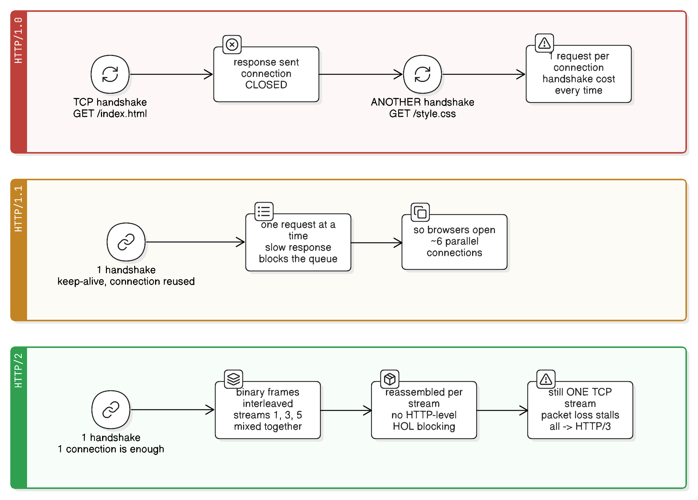

# HTTP Versions: 1.0 vs 1.1 vs 2 (and 3)

> "Be conservative in what you do, be liberal in what you accept from others."
> — Jon Postel, RFC 761 (Postel's Law)
>
> *The principle that let HTTP evolve through four versions without breaking the web.*

Every HTTP version solves the bottleneck the previous one left behind. The request/response *semantics* barely change — `GET /users/1` means the same thing in all of them. What changes is **how bytes get onto the connection**.

| | Year | The one-line idea |
|---|---|---|
| **HTTP/0.9** | 1991 | `GET /page` and nothing else — no headers, no status codes |
| **HTTP/1.0** | 1996 | Headers, status codes, methods — but **one request per TCP connection** |
| **HTTP/1.1** | 1997/1999 | **Reuse the connection** (keep-alive), plus `Host`, chunked streaming, real caching |
| **HTTP/2** | 2015 | **Many requests at once on one connection** (binary frames + streams) |
| **HTTP/3** | 2022 | Same idea over **QUIC/UDP**, so packet loss stops stalling everything |

For how these versions interact with the app server's threads and connections, see [../spring-boot/http-connections-and-tomcat-threading.md](../spring-boot/http-connections-and-tomcat-threading.md). For which version to run on which hop, see [reverse-proxy-protocol-termination.md](reverse-proxy-protocol-termination.md).

## Real-life analogy: the delivery van

- **HTTP/1.0** — a van drives to your house, hands over **one** parcel, and drives back to the depot. Need a second parcel? The van drives out again from scratch. (A new TCP + TLS handshake per request.)
- **HTTP/1.1** — the van **waits at your door** and makes repeat trips. Much better — but it still hands over one parcel at a time, strictly in order, so one slow parcel blocks everything behind it. Delivery companies work around this by sending **6 vans** to the same house.
- **HTTP/2** — **one van**, everything cut into small labelled boxes, all mixed together in the back, and sorted on arrival. A slow parcel no longer blocks the others.
- **HTTP/3** — same van, but on a road where one crashed box doesn't stop the whole convoy.



## HTTP/1.0 (1996): one request, one connection

```
TCP handshake → GET /index.html → response → connection CLOSED
TCP handshake → GET /style.css  → response → connection CLOSED
TCP handshake → GET /logo.png   → response → connection CLOSED
```

**What it introduced** over 0.9: request/response **headers**, **status codes** (200/404/500), methods beyond `GET` (`POST`, `HEAD`), `Content-Type` (so the web could carry images, not just HTML), and basic caching via `Expires`/`Pragma: no-cache`.

**What made it painful:**

- **A handshake per request.** On a 100 ms link that's 100 ms wasted before *every* asset, plus TCP slow-start never getting a chance to ramp up. (`Connection: keep-alive` existed only as a non-standard extension.)
- **No `Host` header.** The server couldn't tell which site you wanted, so **one IP address = one website**. Virtual hosting was impossible.
- **`Content-Length` required.** The server had to know the full response size up front — so no streaming of dynamically generated content.
- **Weak caching**, absolute-timestamp based (`Expires`), with no validators.

## HTTP/1.1 (1997/1999): reuse the connection

The version most of the internet still runs on internally. Key additions:

| Feature | Why it mattered |
|---|---|
| **Persistent connections by default** (`keep-alive`) | One handshake serves many requests; TCP congestion window stays warm |
| **`Host` header (mandatory)** | **Virtual hosting** — many domains on one IP; this is what let shared hosting and CDNs exist, and slowed IPv4 exhaustion |
| **Chunked transfer encoding** | Stream a response without knowing its length up front (dynamic pages, SSE, streamed exports) |
| **Real caching** — `Cache-Control`, `ETag` + `If-None-Match`, `Last-Modified` + `If-Modified-Since` | Conditional requests → `304 Not Modified` instead of resending the body |
| **Range requests** (`Range`, `206 Partial Content`) | Resumable downloads, video seeking |
| **`100 Continue`** | Ask "will you accept this 2 GB upload?" before sending the body |
| **New methods** — `PUT`, `DELETE`, `OPTIONS`, `TRACE`, `CONNECT` | REST as we know it, CORS preflights, HTTPS proxying |
| **`Accept-Encoding`/`Content-Encoding`** | Negotiated gzip compression |

### The bottleneck it left behind: head-of-line blocking

An HTTP/1.1 connection handles **one request/response at a time**. The next request can't start until the current response is fully written:

```
GET /a  ──── slow response (2 s) ────>
GET /b       (waits the whole 2 s, even though it was ready to send)
```

HTTP/1.1 did specify **pipelining** (send several requests without waiting), but responses still had to come back **in request order**, so one slow response stalled the rest — and buggy proxies mangled it. Every major browser disabled it. It's the classic "specified but never usable" feature.

So browsers worked around it by opening **~6 parallel TCP connections per origin** — six handshakes, six congestion windows, six times the server-side memory. And developers piled on more workarounds:

- **Domain sharding** — serve assets from `img1.example.com`, `img2.example.com` to get 6 connections *per shard*
- **Concatenation & sprite sheets** — glue 50 JS files into one, 30 icons into one image, to reduce request count
- **Inlining** — base64 images straight into CSS

All of these are *anti-patterns under HTTP/2*, which is why they quietly vanished from build tooling.

## HTTP/2 (2015): many requests at once, one connection

Grew out of Google's SPDY. Same semantics (methods, status codes, headers all mean the same thing) — a completely different wire format.

**1. Binary framing instead of text.** HTTP/1.x is newline-delimited text a human can read; HTTP/2 is binary frames with a fixed header (length, type, flags, stream ID). Unambiguous and cheap to parse — but you now need `curl --http2 -v` or Wireshark instead of `tcpdump`.

**2. Streams and multiplexing.** Each request/response pair is a **stream** with an ID; frames from many streams interleave on one connection, and the receiver reassembles them per stream:

```
Frame(stream 1) Frame(stream 3) Frame(stream 1) Frame(stream 5) Frame(stream 3) …
```

Application-level head-of-line blocking is gone, and so is the 6-connection ceiling: **one connection, one handshake, dozens of concurrent requests.**

**3. HPACK header compression.** HTTP/1.1 resends the same 800 bytes of `Cookie`/`User-Agent`/`Accept` headers on every single request, uncompressed. HPACK uses a static table of common headers, a dynamic table of ones already seen on this connection (so repeats become a 1-byte index), and Huffman coding for the rest.

**4. Stream prioritization and flow control.** The client can say "the CSS matters more than the below-the-fold image," and each stream has its own receive window.

**5. Server push** — the server could send assets the client hadn't asked for. It sounded great, was hard to do without wasting bandwidth on already-cached files, and **Chrome removed it in 2022**; `103 Early Hints` replaced the use case.

**Practical details that trip people up:**

- Browsers only do HTTP/2 **over TLS** (negotiated via ALPN as `h2`). Cleartext `h2c` exists in the spec but no browser implements it.
- Header names must be **lowercase**; `Host` is replaced by the `:authority` pseudo-header (alongside `:method`, `:path`, `:scheme`).
- **Connection-specific headers are forbidden** — `Connection`, `Keep-Alive`, `Transfer-Encoding: chunked`. Framing handles chunking now, so setting `Connection: keep-alive` in HTTP/2 is meaningless (and a protocol error).
- The HTTP/1.1 `Upgrade` dance doesn't exist, so WebSockets over HTTP/2 needed a separate extension (RFC 8441's extended `CONNECT`).
- **gRPC requires HTTP/2** — that's why it can't run over 1.1 at all.

### What HTTP/2 did *not* fix: TCP-level head-of-line blocking

Multiplexing removed blocking at the *HTTP* layer, but everything now shares **one TCP connection** — and TCP guarantees in-order delivery of *its* byte stream. So one lost packet stalls **every stream** on that connection until it's retransmitted. On a lossy mobile network, HTTP/2 can be *worse* than HTTP/1.1's six independent connections.

That's the whole motivation for **HTTP/3**: run the same stream model over **QUIC** (on UDP), where streams are independent at the transport layer, so loss on one stream doesn't stall the others. It also folds the TLS handshake into the transport (1 RTT, or 0-RTT on resumption) and survives network changes (Wi-Fi → cellular) via connection IDs.

## Side by side

| | HTTP/1.0 | HTTP/1.1 | HTTP/2 |
|---|---|---|---|
| Wire format | Text | Text | **Binary frames** |
| Connection reuse | No (one request per connection) | **Yes**, default keep-alive | Yes, and one connection is enough |
| Concurrent requests per connection | 1 | 1 (pipelining specified but unusable) | **Many (streams)** |
| Browser connections per origin | many, short-lived | ~6 | **1** |
| Head-of-line blocking | Per connection | Per connection | Gone at HTTP level, **remains at TCP level** |
| Header overhead | Full text every request | Full text every request | **HPACK compressed** |
| `Host` header / virtual hosting | Absent | **Required** | `:authority` pseudo-header |
| Streaming a response | Needs `Content-Length` | **Chunked encoding** | Native via frames |
| Caching | `Expires`, `Pragma` | **`Cache-Control`, `ETag`, conditional requests** | Same as 1.1 |
| Prioritization / flow control | No | No | **Yes** |
| Server push | No | No | Yes — but removed by browsers |
| TLS | Optional | Optional | Required in practice (ALPN `h2`) |
| Debuggable with `tcpdump`/telnet | Yes | Yes | **No** (binary; needs h2-aware tools) |
| Front-end workarounds needed | Many | Sharding, concatenation, sprites, inlining | **None — they become anti-patterns** |

## Which version applies where?

| Question | HTTP/1.1 | Real-life example (1.1) | HTTP/2 | Real-life example (HTTP/2) |
|---|---|---|---|---|
| Browser ↔ public internet? | Extra handshakes, 6 connections, uncompressed headers per user | An old site still on 1.1 pays 6 TLS handshakes per visitor | **Default choice** | Any Cloudflare/ALB-fronted site serving a SPA |
| Proxy ↔ app server on a LAN? | **Default** — sub-ms RTT, pooled keep-alive, easy to debug | NGINX → Spring Boot with `proxy_http_version 1.1` and a `keepalive` pool | Little gain, and it hot-spots one instance behind an L4 balancer | Only with per-request L7 balancing (Envoy/Istio) |
| gRPC? | Impossible | N/A | **Required by spec** | Any gRPC service, mesh sidecar |
| Lossy mobile / high-latency network? | Six connections actually hedge against packet loss | A flaky-3G-first app that never adopted h2 | Better, until packet loss stalls all streams → prefer **HTTP/3** | YouTube/Google serving mobile over QUIC |
| Debugging or scripting a call by hand? | **Yes** — `telnet`, `curl -v`, `tcpdump` all readable | Reproducing a webhook payload with raw text over port 80 | Binary frames need h2-aware tooling | Inspecting gRPC with Wireshark's HTTP/2 dissector |
| Page loads 50+ small assets from one origin? | Needs sharding/concatenation hacks | A legacy 1.1 site shipping sprite sheets and `img1/img2` shards | **Multiplexing — drop the hacks** | A modern build shipping many small hashed chunks |

**HTTP/1.0 is not a choice anymore** — it survives only as a fallback in ancient clients, some hardcoded scripts, and (annoyingly) as **NGINX's default when proxying upstream**, which silently disables backend keep-alive unless you set `proxy_http_version 1.1`.

## Key takeaways

- The semantics (`GET /users/1`, `404`, headers) are essentially unchanged across versions — what changes is the transport behaviour.
- **1.0 → 1.1** was about *reusing* the connection (plus `Host` for virtual hosting, chunked streaming, and real caching with `ETag`/`Cache-Control`).
- **1.1 → 2** was about *sharing* the connection: binary frames, multiplexed streams, HPACK header compression — killing both HTTP-level head-of-line blocking and the 6-connections-per-origin workaround.
- HTTP/1.1 pipelining was specified but unusable (in-order responses + broken proxies), so browsers used parallel connections instead.
- HTTP/2 makes the old front-end optimizations (domain sharding, concatenation, sprites, inlining) counterproductive.
- HTTP/2 left **TCP-level** head-of-line blocking untouched — one lost packet stalls every stream, which is exactly what HTTP/3 over QUIC fixes.
- Practical HTTP/2 details: TLS-only in browsers, lowercase headers, `:authority` instead of `Host`, no `Connection`/`Transfer-Encoding` headers, no `Upgrade` handshake, and it's mandatory for gRPC.

## See also

- [../spring-boot/http-connections-and-tomcat-threading.md](../spring-boot/http-connections-and-tomcat-threading.md) — how streams and frames are reassembled by Tomcat's poller threads, and why connections and worker threads are separate resources.
- [reverse-proxy-protocol-termination.md](reverse-proxy-protocol-termination.md) — why HTTP/2 usually stops at the edge and HTTP/1.1 carries on to the app.
- [load-balancing-l4-vs-l7.md](load-balancing-l4-vs-l7.md) — why HTTP/2's single connection needs an L7, per-request balancer.
- [caching-fundamentals.md](caching-fundamentals.md) — what the `Cache-Control`/`ETag` machinery HTTP/1.1 introduced is actually used for.
