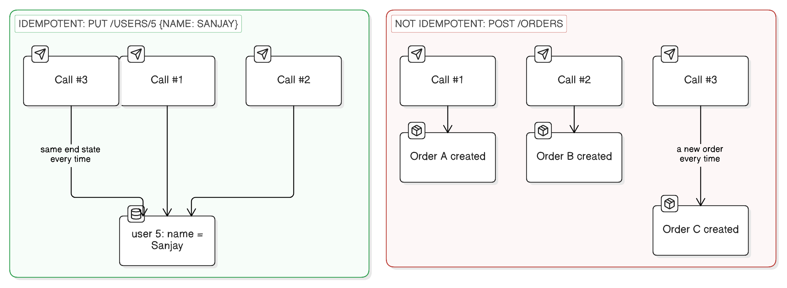

# Idempotency

An operation is **idempotent** if doing it once and doing it many times (with the same input) leave the system in exactly the same end state — repeating it doesn't pile up extra side effects.

Editable version (Eraser.io): [Idempotent PUT vs. Non-Idempotent POST](https://app.eraser.io/workspace/JLgRjFjapzOnrAqixpQO?diagram=uum9gJzK-Rmo7h68XYO5&layout=canvas).

## Real-life analogy

Pressing an elevator call button. Press it once, the elevator is summoned. Pressing it five more times while you wait doesn't summon five elevators — it's already coming, so the extra presses do nothing extra. That's idempotent. Compare that to repeatedly hitting "submit" on a payment form where each click charges your card again — that's not idempotent, and it's exactly the kind of bug idempotency is meant to prevent.

Another version: flipping a light switch to the **ON** position five times leaves it ON — idempotent. *Toggling* a switch five times can leave it either ON or OFF depending on how many times you pressed it — not idempotent, because the result depends on how many times the action ran, not just that it ran.

## Where it shows up in real systems

- **HTTP methods**: `PUT` and `DELETE` are supposed to be idempotent by convention. `PUT /users/5 {name: "Sanjay"}` called once or five times leaves user 5 named "Sanjay" either way. `POST /orders` is classically not idempotent — calling it 3 times creates 3 orders. This is exactly why a network retry of a `POST` is dangerous: the client doesn't know if the first request actually succeeded before the connection dropped, so blindly retrying can double-charge or double-create.
- **Idempotency keys**: the standard fix for that `POST` problem — the client generates a unique key per logical operation (e.g. a UUID) and sends it in a header (`Idempotency-Key: ...`). The server remembers which keys it already processed and, if it sees the same key again, returns the original result instead of re-running the operation.
- **Message/event processing**: message brokers commonly guarantee only *at-least-once* delivery, so the same event can be delivered and processed twice. A handler like "release reserved stock" must not release stock twice for one event — otherwise inventory numbers drift upward every time a duplicate delivery happens. See [saga-pattern-compensating-transactions.md](saga-pattern-compensating-transactions.md) for why compensating actions specifically need this property.

## How to make an operation idempotent

- Prefer "set to X" over "change by X" — `status = CANCELLED` run twice gives the same result both times; `stock -= 1` run twice for the same logical event double-decrements. `SET` is naturally idempotent; `INCR`/`DECR` are not.
- Track a unique ID for each logical operation (an idempotency key, a message ID) and skip processing if that ID was already handled.
- Guard mutations with a state check — "only cancel if not already cancelled" — instead of unconditionally applying the change every time the handler runs.

## The concrete mechanisms

1. **Idempotency keys with a dedup store**: the client generates a unique key per logical attempt and sends it with the request. The server keeps a table of `(idempotency_key → result)`. On each request: look up the key first — if found, return the stored result without re-running any side effects; if not found, run the operation, store its result under that key, then return it. The lookup-then-execute-then-store sequence has to be atomic (usually enforced with a unique DB constraint on the key column), otherwise two near-simultaneous duplicate requests can both slip through the check before either has stored its result.
2. **Design the operation as "set to X," not "change by X"**: compute the target end state and write that directly, rather than expressing the operation as a delta. `UPDATE orders SET status = 'CANCELLED'` is naturally idempotent; `UPDATE inventory SET stock = stock - 1` is not — replaying it corrupts the count.
3. **Unique constraints for dedup at the database level**: a table can have a unique constraint on the natural key of the operation (e.g. `order_id`, or the idempotency key itself). A duplicate insert then fails with a constraint violation, which the app catches and treats as "already done" — returning the existing row instead of creating a second one.
4. **Conditional writes (guard the mutation with a state check)**: `UPDATE orders SET status = 'CANCELLED' WHERE status = 'PENDING'` — if the row is already `CANCELLED`, this affects zero rows. Running the same statement any number of times is a safe no-op, instead of a blind overwrite that might also fire unwanted side effects (like a second refund) every time.
5. **Consumer-side message dedup (the "inbox" pattern)**: for at-least-once message delivery, the consumer keeps a table of message IDs it has already processed. On receiving a message, it checks that table first; if the ID's already there, it skips processing entirely. This is the mirror image of the outbox pattern on the producer side.

**Real-life analogy**: a hotel check-in desk gives you a wristband stamped with a unique code the first time you check in. If you wander back to the desk later and show the same wristband, staff look up the code, see "already checked in," and just wave you through — they don't create a second reservation or charge your card again. The wristband code is the idempotency key; the "have I seen this code before?" lookup is the dedup mechanism.

## Client-generated vs server-issued keys — and a common bug

Idempotency keys are usually generated by the *client* (a random UUID, no round trip needed) — that's what Stripe and most payment APIs do. A valid alternative is *server-issued* keys: the client first asks the server for a key (e.g. when the "add order" page loads), the server generates and stores it, then the client attaches that key to the actual order request. This costs an extra round trip, but lets the server refuse any key it never issued, and lets the key carry server-side context (a reserved slot, a session).

Either way, the server-side check needs **three outcomes, not two** ("exists → process, else discard" is one bug short of correct):

1. **Key exists, unused** → process the request, then atomically mark the key "consumed" and store the resulting response (e.g. the new order ID) against it.
2. **Key exists, already consumed** → don't reprocess — return the *same stored response* from the first time.
3. **Key doesn't exist / expired** → reject.

The bug in "if exists → process, else discard": imagine the order succeeds, but the response is lost on the way back (dropped connection). The client, not knowing it succeeded, resubmits the same request with the same key. If the key still just "exists" with no consumed/unused distinction, the server processes it again — a second order. If instead the fix is to delete the key right after use, the retry now finds "key doesn't exist" and gets discarded — the client thinks the order *failed* and may create a brand-new key and a genuinely duplicate order, the opposite of the goal. Storing the result against the consumed key and replaying it on retries is what actually closes the loop.

The "check, then flip to consumed, then store result" sequence also needs to be atomic against two near-simultaneous duplicate requests (e.g. a double-click) — typically a conditional update like `UPDATE keys SET status = 'CONSUMED' WHERE key = ? AND status = 'UNUSED'`, so only one of two racing requests actually wins and processes the order.
