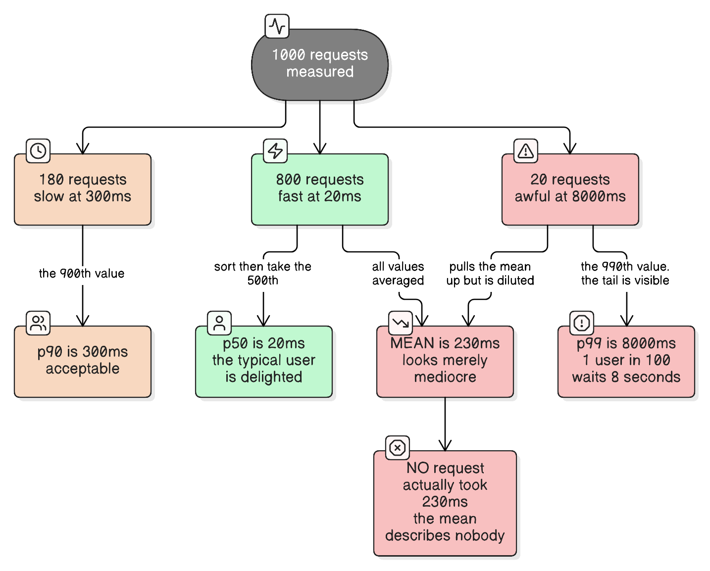
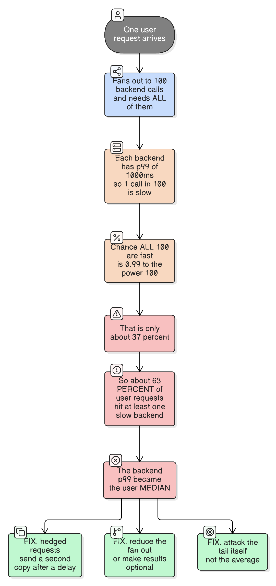

# Latency Percentiles: p50, p90, p95, p99

> "The average is the number that makes everyone happy and no one correct."
>
> *If you report one latency number and it's the mean, you have hidden your worst problem behind arithmetic.*

## What a percentile is

**pN = the value below which N% of measurements fall.** Sort every request's latency, then read off the value at that position.

```
p50  =  50% of requests were faster than this   (the median)
p90  =  90% faster; the slowest 1 in 10 exceed it
p95  =  95% faster; the slowest 1 in 20 exceed it
p99  =  99% faster; the slowest 1 in 100 exceed it
p99.9 = 99.9% faster; the slowest 1 in 1000 exceed it
```

Read `p99 = 800 ms` as: **"99% of requests completed within 800 ms, and 1% took longer than that."** It says nothing about *how much* longer — that's what p99.9 and max are for.

The arithmetic is just indexing into a sorted list (the "nearest-rank" method):

```kotlin
/** pN by nearest rank: the ceil(N% × count)-th value in sorted order. */
fun percentile(latenciesMs: List<Long>, p: Double): Long {
    require(latenciesMs.isNotEmpty())
    val sorted = latenciesMs.sorted()
    val rank = ceil(p / 100.0 * sorted.size).toInt().coerceIn(1, sorted.size)
    return sorted[rank - 1]
}
```

(Other definitions interpolate between neighbouring values, which is why two tools can report slightly different p99s for identical data. The difference is rarely material; the *method* being undocumented sometimes is.)

### Working the rank out by hand

With **exactly 100 requests** sorted ascending, it lands on the round numbers you'd expect: p99 is the 99th item, p95 the 95th, p50 the 50th. That's the arithmetic above with `n = 100`, so `ceil(99/100 × 100) = 99`.

The thing to be careful about is that **the rank scales with your sample count, not with the percentile's digits**:

| Requests (n) | p50 | p90 | p95 | p99 | p99.9 |
| --- | --- | --- | --- | --- | --- |
| 100 | 50th | 90th | 95th | **99th** | 100th |
| 200 | 100th | 180th | 190th | **198th** | 200th |
| 1,000 | 500th | 900th | 950th | **990th** | 1000th |
| 10,000 | 5000th | 9000th | 9500th | **9900th** | 9991st |

So at n = 1000, p99 is the **990th** item — not the 99th. The 99th item there is roughly p10. It's a percentage of the way through the sorted list, which only coincides with the label's number when you happen to have exactly 100 samples.

**And the trap at small n:** with 50 requests, `ceil(0.99 × 50) = 50` — the last item. With 10 requests it's also the last item.

```
n = 50  →  p99 = the 50th of 50 = the MAXIMUM
n = 10  →  p99 = the 10th of 10 = the MAXIMUM
```

**Below ~100 samples, p99 silently degenerates into "the slowest request in the window."** It stops being a percentile and becomes a max — one outlier moves it entirely, which is why a p99 panel over a low-traffic endpoint or a short window swings wildly and pages you for noise. Same reasoning applies further out: p99.9 needs ~1000+ samples in the window before it describes more than a single request.

**One more practical note:** real monitoring systems don't sort anything. Holding every latency value to sort it is impossible at volume, so they accumulate **histogram buckets or sketches** and estimate the percentile from those. The sorted-list definition is the mental model; the section on aggregation below is what actually runs in production.

## Why we need them: the mean lies



Take 1000 real requests:

| Requests | Latency |
| --- | --- |
| 800 | 20 ms |
| 180 | 300 ms |
| 20 | 8000 ms |

| Metric | Value | What it tells you |
| --- | --- | --- |
| **Mean** | **230 ms** | "A bit mediocre." Actively misleading |
| **p50** | 20 ms | The typical user is delighted |
| **p90** | 300 ms | Acceptable |
| **p99** | 8000 ms | **1 user in 100 waits 8 seconds** |

Two things worth pausing on:

1. **No single request took 230 ms.** The mean describes nobody. It's an average of a fast group and a catastrophic group, landing in an empty gap between them.
2. **The mean moved by only ~210 ms** when 20 requests took 8 full seconds — because the mean divides that pain across all 1000. Dilution is exactly what you don't want from a health metric.

Latency distributions are **right-skewed with a long tail**: bounded below (nothing is faster than the work itself) and unbounded above (a retry, a GC pause, a cold cache can add seconds). The mean and standard deviation are tools for symmetric distributions. Applying them here isn't just imprecise, it's the wrong instrument.

**Real-life analogy:** a hospital reporting that the *average* wait is 25 minutes (**the mean**). That single number is consistent with two completely different hospitals: one where everyone waits 25 minutes (**a tight distribution**), and one where 90% are seen in 5 minutes while a handful of patients wait 6 hours in the corridor (**a long tail**). Only the second hospital has a scandal, and only percentiles reveal which one you're in — the median tells you what a typical patient experiences (**p50**), and the 99th percentile tells you how bad it gets for the unlucky ones (**p99**). Averaging the 6-hour waits into everyone else's 5 minutes is how the scandal stays hidden.

## Percentiles are not averageable

**This is the most common technical error in latency reporting.**

You cannot average percentiles, and you cannot take a percentile of percentiles:

```
Server A p99 = 100 ms  (over 1,000,000 requests)
Server B p99 = 900 ms  (over 10 requests)

(100 + 900) / 2 = 500 ms   ← meaningless. Not the fleet p99, not anything.
```

The reason: a percentile is a **position in a distribution**, and positions don't add. To get a true p99 across servers or time windows you need the underlying **distribution** — merge the histograms, then compute the percentile once.

Two consequences in practice:

- **A "p99" panel that averages per-instance p99s is wrong**, often badly, and it's the default in a lot of hand-built dashboards.
- **Prometheus does this correctly** because `histogram_quantile()` runs over merged bucket counters, not over pre-computed quantiles:

```promql
# Correct: merge the histogram buckets across instances first, then take the quantile.
histogram_quantile(0.99, sum(rate(http_request_duration_seconds_bucket[5m])) by (le))
```

That's also why Prometheus **histograms** are aggregatable and **summaries** (which compute quantiles inside each process) are not.

The trade-off worth knowing: histogram-based percentiles are **approximate**, bounded by your bucket boundaries — with buckets at 100 ms and 250 ms, a true p99 of 240 ms is reported somewhere in between by interpolation. If your SLO is 200 ms, you need a bucket edge near 200 ms or the number you're alerting on is an artefact of bucket layout. Sketch structures (HdrHistogram, t-digest, DDSketch) exist to give tight relative error in the tail specifically, and are what you want when the tail is the point.

## Tail amplification: why p99 becomes everyone's problem



"p99 only affects 1% of requests" is the intuition that makes teams ignore the tail. It's wrong twice over.

**First, per-request fan-out.** One user request that needs 100 backend calls, each with a p99 of 1 s:

```
P(all 100 fast) = 0.99¹⁰⁰ ≈ 0.37
```

So **~63% of user-facing requests hit at least one slow backend.** A 1-in-100 backend event became the *majority* case at the front door. The backend's p99 is roughly the user's median. (This is the central result of Dean & Barroso's *The Tail at Scale*, 2013 — the canonical reference here.)

**Second, per-user accumulation.** A user session making 100 requests has that same ~63% chance of meeting the p99 at least once. Over a week, **essentially every user experiences your p99.** It isn't 1% of users — it's 1% of requests, which is a very different population.

Mitigations, roughly in order of how often they're the right answer:

| Approach | Idea |
| --- | --- |
| **Reduce fan-out** | The cheapest fix. Fewer calls, batched calls, or a denormalised read model |
| **Make results optional** | Return the page without the slow widget; degrade rather than wait |
| **Hedged requests** | If a call exceeds p95, send a duplicate to another replica and take the first answer. Costs ~5% extra load to cut the tail dramatically |
| **Tied requests** | Enqueue on two replicas; whichever starts first cancels the other |
| **Fix the tail's cause** | See below — usually queueing, GC, or cold caches |

## Where the tail actually comes from

Percentiles diagnose *that* you have a tail; these are the usual causes:

| Cause | Why it produces a tail rather than uniform slowness |
| --- | --- |
| **Queueing** | Latency explodes non-linearly as utilisation → 100%. At 80% utilisation, queue wait already dominates service time. This is why **p99 collapses long before CPU saturates** ([http-connections-and-tomcat-threading](../spring-boot/http-connections-and-tomcat-threading.md)) |
| **GC pauses** | A stop-the-world pause freezes *whatever request is in flight*, so a few unlucky requests absorb the whole pause |
| **Cold caches** | A cache miss is a different code path with a different cost — see [caching-fundamentals](caching-fundamentals.md) |
| **Retries and timeouts** | A retried request costs its own latency plus the timeout that preceded it |
| **Lock and connection-pool contention** | Most requests get the resource immediately; a few wait behind a slow holder |
| **Noisy neighbours** | Shared CPU, network or disk on multi-tenant infrastructure |
| **Head-of-line blocking** | One large response delays queued ones — the problem HTTP/2 and HTTP/3 address ([http-protocol-versions](http-protocol-versions.md)) |
| **Data skew** | The user with 50,000 orders takes a different amount of work than the one with 3 |

The diagnostic pattern: **if p50 is flat while p99 climbs, you're looking at contention or a minority code path — not at code that got uniformly slower.** A rise in *both* points at something systemic (a bad query plan, a hot dependency, capacity).

## Coordinated omission: the trap that makes benchmarks lie

A load generator sends a request every 10 ms. The server stalls for 1 second. What gets recorded?

- **Naively:** one request that took 1000 ms. The other 99 that *should* have been sent during the stall were never sent, because the generator was blocked waiting.
- **Reality:** a real user population would have produced 100 requests in that window, each experiencing part of that 1-second stall.

That's **coordinated omission** (Gil Tene's term): the measurement pauses in sympathy with the system under test, so the worst moments are systematically under-sampled. It makes reported percentiles far better than the truth — and it's specifically the tail that's understated, which is the part you were trying to measure.

Defences: measure against the **intended** send schedule rather than the actual one (correcting for missed sends), use a tool that does this for you (`wrk2`, HdrHistogram's `recordValueWithExpectedInterval`), and treat any load-test p99 from a blocking, closed-loop generator as optimistic.

## SLIs, SLOs and error budgets

Percentiles are how latency becomes a *target* rather than a vibe:

```
SLI (indicator)  → what you measure:  p99 of request latency
SLO (objective)  → the target:        p99 < 300 ms over 30 days
SLA (agreement)  → the contract:      the same, with money attached
Error budget     → 1% of requests may exceed it; spend it deliberately
```

The error-budget framing is the useful part: a 99% target explicitly **grants** you 1% of requests over budget. Chasing 100% is both impossible (a retry storm or a bad deploy will happen) and wasteful — that engineering effort has better uses. When the budget is consumed, feature work stops and reliability work starts; when it's underspent, you're being too conservative and can ship faster.

Two practical notes:

- **Two-part objectives are clearer than one:** "p99 < 300 ms **and** p99.9 < 2 s" pins both the common tail and the disaster case.
- **The window matters.** A p99 over 24 hours hides a 10-minute incident that a p99 over 5 minutes surfaces immediately. Alert on short windows, report on long ones.

## Instrumenting it

With Micrometer (the Spring Boot default), publish a **histogram** so percentiles can be computed correctly server-side:

```kotlin
@Configuration
class MetricsConfig {

    @Bean
    fun latencyHistogramCustomizer(): MeterFilter = object : MeterFilter {
        override fun configure(id: Meter.Id, config: DistributionStatisticConfig) =
            if (id.name.startsWith("http.server.requests")) {
                DistributionStatisticConfig.builder()
                    // Export buckets so a backend can merge across instances.
                    .percentilesHistogram(true)
                    // Bucket edges near the SLO, or the reported p99 is a bucketing artefact.
                    .serviceLevelObjectives(0.05, 0.1, 0.2, 0.3, 0.5, 1.0, 2.0, 5.0)
                    .build()
                    .merge(config)
            } else {
                config
            }
    }
}
```

```kotlin
// Timing a specific operation.
private val timer = Timer.builder("order.placement")
    .publishPercentileHistogram()      // aggregatable buckets, not per-instance quantiles
    .register(registry)

fun placeOrder(order: Order): Order = timer.recordCallable { orderService.place(order) }!!
```

Two rules that matter more than the code: **tag by endpoint and status** (a fast 401 mixed in with slow searches produces a meaningless aggregate), and **never derive latency from a counter of totals** — you need the distribution.

## How to decide: which percentile should this SLO use?

| Question to ask | → p50 | Real-life example (p50) | → p90 / p95 | Real-life example (p90/p95) | → p99 / p99.9 | Real-life example (p99/p99.9) |
|---|---|---|---|---|---|---|
| What are you trying to learn? | Whether the typical experience changed | Comparing two algorithm versions in a benchmark | Whether most users are fine | An internal admin tool's page-load target | Whether *anyone* is having a terrible time | A checkout API where a stall loses the sale |
| How much fan-out sits behind one user action? | None; it's a single call | A cache lookup | A handful | 3–5 service calls per page | Large | A search page assembling 50+ backend results — the backend must target p99.9 for the page to hit p99 |
| How many requests does one user make per session? | One or two | A webhook receiver | A dozen | A form-based back-office app | Dozens or hundreds | A chat or mapping app where every user meets the tail |
| What's the cost of one slow request? | Negligible | An internal batch trigger | Annoyance | An analytics dashboard | Lost revenue, a timeout cascade, or a paged engineer | A payment authorisation |
| Do you have the traffic to measure it? | Any volume | 100 requests/day | Thousands/day | A mid-size API | High volume — p99.9 needs ≥ ~10k requests in the window to mean anything | A high-traffic public API |

**The rule of thumb:** report **p50 and p99 together** — the pair tells you both the typical experience and the tail, and their *gap* is the health signal. If you're allowed only one number, use p99; if you're allowed two, never make the second one the mean.

**Don't over-reach on the percentile either.** p99.9 over a window containing 500 requests is describing *half a request*: it will swing wildly and page you for noise. Match the percentile to your traffic volume.

## Common mistakes

| Mistake | What goes wrong |
| --- | --- |
| Reporting the mean | A catastrophic tail is diluted into an acceptable-looking number |
| Averaging per-instance p99s | Arithmetically meaningless; typically understates the real p99 |
| Using Prometheus `summary` then trying to aggregate | Quantiles computed per-process can't be merged across instances |
| Buckets not aligned with the SLO | Your alerting threshold measures bucket layout, not latency |
| Assuming p99 affects 1% of users | It affects 1% of *requests*; with fan-out or repeat visits, that's most users |
| Load-testing with a closed-loop generator | Coordinated omission makes the tail look far better than it is |
| Measuring server-side only | Excludes DNS, TLS, queueing at the LB and the client's network — the user's latency is larger than yours |
| Alerting on a 24-hour percentile | A serious 10-minute incident never crosses the threshold |
| Chasing 100% of requests under target | Impossible and wasteful; that's what an error budget is for |
| Mixing endpoints in one aggregate | Health checks and static assets drag the distribution left and hide real regressions |

## Key takeaways

1. **pN is the value N% of requests came in under.** p99 = 800 ms means 1 in 100 took longer, and says nothing about how much longer.
2. **The mean is the wrong tool** for a right-skewed distribution — it can sit in a gap where no request actually landed.
3. **Percentiles can't be averaged.** Merge histograms, then compute once.
4. **Approximation is bucket-bound** — put a bucket edge near your SLO.
5. **Tail amplification is the real argument for caring:** 100 calls at p99 = 1 s means ~63% of user requests are slow.
6. **A flat p50 with a rising p99 means contention or a minority path**, not uniformly slower code.
7. **Coordinated omission makes benchmark tails optimistic.** Fix the measurement before trusting the number.
8. **Report p50 and p99 together**, size the percentile to your traffic, and spend the error budget deliberately.

## See also

- [http-connections-and-tomcat-threading](../spring-boot/http-connections-and-tomcat-threading.md) — why queue wait, not processing time, is what destroys p99 under load, and why adding threads doesn't fix it.
- [caching-fundamentals](caching-fundamentals.md) — a cache miss is a separate, slower code path, which is a direct tail contributor.
- [thundering-herd-problem](thundering-herd-problem.md) — the mechanism that turns a brief tail event into a correlated spike across every request at once.
- [http-protocol-versions](http-protocol-versions.md) — head-of-line blocking as a protocol-level tail cause.
- [database-sharding-partitioning-replication](database-sharding-partitioning-replication.md) — scatter-gather across shards is fan-out, so cross-shard queries inherit the amplification above.
- [load-balancing-algorithms](load-balancing-algorithms.md) — poor balancing is a classic cause of a rising p99 with a flat p50.
