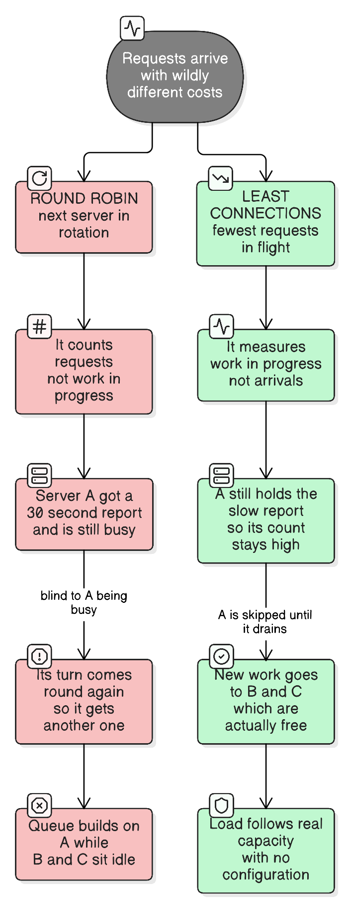
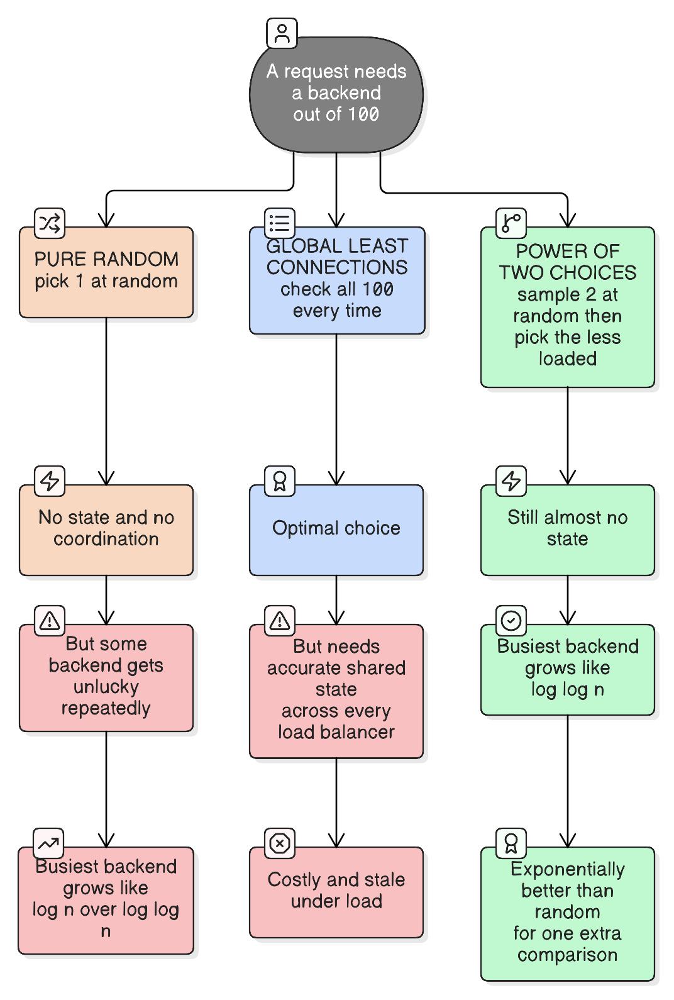

# Load Balancing Algorithms

> "Any load balancer can spread traffic evenly. The hard part is spreading *work* evenly."
>
> *Requests are not interchangeable, servers are not identical, and the balancer knows less than it thinks — every algorithm here is a different bet about which of those three matters most.*

See also: [load-balancing-l4-vs-l7](load-balancing-l4-vs-l7.md) — *where* the balancer sits and what it can see. This file is the deep dive on *how it picks a backend*.

## What the algorithm actually decides

For each incoming request or connection: **which backend gets it?** That single choice determines whether your fleet's capacity is usable or whether one node queues while its neighbours idle.

The whole design space is one trade-off:

```
Better decisions  ←──────────────────────────→  Cheaper decisions
(need information about backend state)          (need nothing)

global least-connections … P2C … least-conn … weighted RR … round robin … random
```

More information means better placement but more state to gather, share and keep fresh — and stale state can be **worse than no state**, because it moves traffic confidently in the wrong direction.

**Real-life analogy:** a supermarket with ten tills. **Round robin** is a greeter sending each shopper to the next till in order, without looking (**no state, ignores queue depth**) — fine until one shopper has three trolleys and the next in that lane waits behind them. **Least connections** is a greeter who glances at how many people are in each queue (**work in progress**) and sends you to the shortest. **Least response time** watches how fast each till is actually clearing (**observed latency**), so it avoids the trainee cashier even when their queue looks short. **Power of two choices** is a greeter who checks just two random tills and picks the shorter — almost as good as checking all ten, at a fraction of the effort (**sampled state**). And **hashing** is "customers with surnames A–M always use till 3" — the point isn't balance, it's that the same person lands at the same till every time (**affinity**).

---

## 1. Round robin

Cycle through backends in order.

```kotlin
class RoundRobin(private val backends: List<Backend>) {
    private val counter = AtomicLong(0)

    // Math.floorMod keeps it correct when the counter eventually overflows to negative.
    fun next(): Backend = backends[Math.floorMod(counter.getAndIncrement(), backends.size.toLong()).toInt()]
}
```

**Assumes:** every request costs about the same, and every backend has about the same capacity.

**When it's fine:** stateless HTTP APIs with uniform, short handlers on identical instances. Genuinely the right default for a lot of services.

**Where it breaks:**

- **Variable request cost.**  A backend handed a 30-second report is still busy when its turn comes round again — round robin counts *arrivals*, not *work in progress*, so it keeps feeding a saturated node while others idle.
- **Long-lived connections.** With WebSockets, gRPC streams or HTTP/2, "next connection" is balanced but connections persist for hours, so *connection* fairness says nothing about *request* fairness. This is the single most common load-balancing failure in modern stacks — see [http-protocol-versions](http-protocol-versions.md).
- **Heterogeneous backends.** A 4-core and a 16-core instance receive identical shares.
- **Restarts.** A just-started JVM with a cold JIT and empty caches gets a full share immediately (see slow start below).

## 2. Weighted round robin

Same rotation, biased by a configured weight.

```
api-1  weight 4     ← 16-core box
api-2  weight 1     ← 4-core box
api-3  weight 1     ← canary at ~14% of traffic
```

**Use it for:** mixed instance sizes, and canary/blue-green traffic shifting.

**The catch:** weights are **static config describing a dynamic world**. They encode what you believed about capacity at deploy time and don't notice a node that's now slow because of a noisy neighbour or a GC storm. Weights are for deliberate, known asymmetry — not for adapting to load.

## 3. Random

Pick uniformly at random.

Better than its reputation: it needs no state, no shared counter, and no coordination between multiple balancers — and with enough requests it converges to an even *count*. It's the honest baseline.

Its flaw is variance. With `n` requests into `n` backends, the busiest backend ends up with about `log n / log log n` requests rather than 1. Some node gets unlucky repeatedly, and you feel it in the tail ([latency-percentiles](latency-percentiles.md)).

## 4. Least connections (least outstanding requests)

Send to the backend with the fewest in-flight requests.

```kotlin
fun leastConnections(backends: List<Backend>): Backend =
    backends.minBy { it.inFlight.get() }        // in-flight count = work in progress, not arrivals
```

**Why it's the best general-purpose default:** in-flight count is a *live measurement of business*, so it self-corrects for everything static config can't predict — variable request cost, a slow node, a cold cache, a noisy neighbour. A backend stuck on slow work simply stops being chosen until it drains, with no configuration at all.

**Watch out for:**

- **The empty-node stampede.** A backend that just started (or just recovered) has zero in-flight requests and looks maximally attractive, so it receives a burst of traffic precisely when it's least ready. Mitigate with slow start.
- **Multiple balancers each seeing only their own connections.** Four balancers each pick "their" least-loaded backend independently; nothing guarantees the aggregate is balanced. This is what makes P2C attractive.
- **A hung backend can look idle** if requests are failing fast rather than queueing — pair it with outlier detection.

**Weighted least connections** divides in-flight count by weight, combining capacity knowledge with live load. A good default when instances genuinely differ.

## 5. Least response time / peak EWMA

Choose using observed latency, not just count — usually an **exponentially weighted moving average** of recent response times, sometimes multiplied by in-flight count.

**Why it's stronger:** two backends with 5 in-flight requests each are not equivalent if one averages 10 ms and the other 400 ms. Latency captures *how well the backend is actually doing*, which count alone misses.

**Why it's not the automatic default:** it's a feedback loop, and feedback loops oscillate. A backend that looks fast attracts traffic, becomes slow, is avoided, becomes fast, attracts traffic again. Implementations damp this with decay windows and by weighting in-flight count alongside latency. Finagle's and Linkerd's *peak EWMA* is the well-known version.

## 6. Power of two choices (P2C)

Sample **two** backends at random; send to whichever has fewer in-flight requests.

```kotlin
fun powerOfTwoChoices(backends: List<Backend>): Backend {
    val a = backends.random()
    val b = backends.random()
    return if (a.inFlight.get() <= b.inFlight.get()) a else b
}
```



This looks like a cheap hack and is actually a striking theoretical result (Azar et al., 1994; popularised by Mitzenmacher):

| Strategy | Busiest backend ends up with |
| --- | --- |
| Pure random | ~`log n / log log n` requests |
| **Two random choices** | ~`log log n` requests |
| Checking all `n` | optimal |

Going from one sample to two is an **exponential** improvement in the worst case. Going from two to three is a marginal one. Almost all the benefit of global knowledge arrives with the second sample.

**Why that matters practically:** it needs no shared state and no global view, so it works when many balancers or many clients each decide independently — exactly the regime where least-connections misbehaves. It's the default in **Envoy** and Finagle, and the standard choice for service meshes and client-side balancing.

## 7. Hash-based: IP hash, ring hash, Maglev

Pick the backend by hashing something about the request — client IP, a header, a cookie, a URL path.

**The purpose is affinity, not balance.** You accept unevenness in exchange for "the same key always goes to the same backend", which buys you:

- **Cache locality.** A CDN or cache tier where each key lands on one node keeps hit rates high; spreading a key over 10 nodes multiplies your cache footprint by 10.
- **Session stickiness** for a stateful app.

| Variant | Notes |
| --- | --- |
| **Source-IP / 5-tuple hash** | L4 stickiness. Uneven behind corporate NAT/CGNAT, where a whole office shares one IP, and broken by mobile clients changing IP |
| **Ring hash (consistent hashing)** | Adding or removing a backend remaps only `~1/N` of keys instead of nearly all — see [consistent-hashing](consistent-hashing.md) |
| **Maglev** | Google's lookup-table hashing: better balance than a ring plus constant-time lookup |
| **Bounded-load consistent hashing** | Caps any node's share and spills the overflow onto the next, fixing hashing's worst weakness |

**The weakness to remember:** hashing balances *keys*, not *load*. One hot key still lands on one backend, and no hash function can split it.

## 8. Locality- and priority-aware routing

Orthogonal to the above, and it usually matters more than the algorithm choice: **prefer backends in the caller's own zone**, falling back to other zones only when local capacity is unhealthy or insufficient.

Two reasons, both concrete: a cross-AZ round trip adds ~1–2 ms to *every* request, and cross-AZ traffic is **billed**. Envoy calls this zone-aware routing; Kubernetes exposes it as topology-aware hints.

The trap is over-restricting: if the local zone has 2 of 10 replicas and takes 50% of the traffic, you've built a hot spot on purpose. Locality preference needs a capacity-aware spill-over rule, not a hard pin.

## The supporting machinery (as important as the algorithm)

An algorithm alone doesn't give you good balancing:

| Mechanism | What it does |
| --- | --- |
| **Health checks** | Active probes (`/health`) remove dead backends. Passive/outlier detection ejects backends that are *failing or slow* while still passing their probe — which is the more common real failure |
| **Slow start / warm-up** | Ramps a newly-added backend's share over ~30 s, so a cold JVM isn't hit at full rate and a restarted node doesn't get stampeded by least-connections |
| **Connection draining** | On shutdown, stop new requests but let in-flight ones finish — this is what makes zero-downtime deploys possible |
| **Circuit breaking / max connections** | Caps concurrent requests per backend, so an overloaded node sheds load instead of queueing to death |
| **Retries with a budget** | A retry to a *different* backend rescues a one-off tail event; unbudgeted retries turn a partial outage into a total one |

**Retry budgets deserve emphasis.** Retrying on failure is how a load balancer papers over a bad backend — and also how a struggling fleet gets 3× its normal traffic at its worst moment. Cap retries as a percentage of total traffic, never as a fixed per-request count alone.

## Real-world defaults

| System | Default | Also available |
| --- | --- | --- |
| **nginx** | Round robin | `least_conn`, `ip_hash`, `hash … consistent`, `random two least_conn` |
| **HAProxy** | Round robin | `leastconn`, `source`, `uri`, `hdr()`, `random` |
| **Envoy** | **Weighted least request (P2C)** | Round robin, ring hash, Maglev, random |
| **AWS ALB** | Round robin | Least outstanding requests |
| **AWS NLB** | 5-tuple flow hash | — |
| **gRPC** | `pick_first` | `round_robin`, `weighted_round_robin`, xDS policies |
| **Spring Cloud LoadBalancer** | Round robin | Random, custom |
| **Linkerd** | Peak EWMA | — |

Notice the split: **general-purpose proxies default to round robin** (safe, predictable, no state), while **service meshes default to P2C** (they expect variable request cost and many independent deciders).

## How to decide

### Which algorithm for this traffic?

| Question to ask | → Round robin | Real-life example (RR) | → Least connections / P2C | Real-life example (LC/P2C) | → Hash | Real-life example (hash) |
|---|---|---|---|---|---|---|
| How uniform is request cost? | Very — same handler, same shape | A token-validation endpoint doing one Redis lookup | Highly variable | A search API where some queries scan far more than others | Irrelevant | A cache tier keyed by object ID |
| Are connections long-lived? | No, short HTTP/1.1 requests | A REST API behind an L7 proxy | Yes — WebSocket, gRPC, HTTP/2 | A chat service where connections last hours, so per-connection fairness is meaningless | Either | Sharded stateful backends |
| Are backends identical? | Yes | An autoscaling group of one instance type | No, or unpredictably degraded | A mixed-instance fleet after a partial migration | Either | — |
| Do you need the same key on the same backend? | No | Stateless API | No | Stateless API | **Yes** | A CDN edge cache, or a stateful game server per match |
| How many independent balancers decide? | Any | One ingress | Many — prefer **P2C** | Sidecars in a mesh, each with a partial view | Any — hashing is consistent by construction | Client-side sharded routing |
| Is one key hot? | — | — | Handles it — the busy node stops being chosen | A viral endpoint spread across the fleet | **Fails** — hashing can't split one key | See key salting in [database-sharding-partitioning-replication](database-sharding-partitioning-replication.md) |

### Which extra mechanism do I need?

| Symptom | Mechanism |
|---|---|
| Restarted nodes get hammered and time out | **Slow start** |
| Deploys drop in-flight requests | **Connection draining** |
| A node passes `/health` but returns errors or is very slow | **Outlier detection** (passive health) |
| One slow dependency takes the whole fleet down | **Circuit breaking + concurrency caps** |
| A small failure becomes a large one | **Retry budgets** |
| Cross-AZ latency and bandwidth cost | **Zone-aware routing with spill-over** |

**A useful rule of thumb:** *round robin for uniform short requests; least-connections or P2C for anything with variable cost or long-lived connections; hashing only when you need affinity — and pair whichever you choose with slow start, draining and outlier detection, which affect real-world balance more than the algorithm does.*

## Common mistakes

| Mistake | What goes wrong |
| --- | --- |
| Round robin with long-lived connections | Connections balance, requests don't. One backend can carry most of the actual work |
| Round robin with highly variable request cost | Slow requests pile onto already-busy nodes |
| Least connections with no slow start | Every restarted node is stampeded because empty looks idle |
| Least connections across many independent balancers | Each optimises its own view; the aggregate is unbalanced. Use P2C |
| Trusting stale load data | Confidently wrong routing is worse than random |
| Static weights as a load-adaptation mechanism | Weights describe intended capacity, not current health |
| Source-IP hash for session affinity | Whole offices behind one NAT land on one backend; mobile IPs change mid-session |
| Expecting hashing to balance load | It balances keys. A hot key still cooks one backend |
| Active health checks only | A backend that's slow-but-alive keeps receiving traffic |
| Unbudgeted retries | A struggling fleet receives multiplied traffic exactly when it can least absorb it |
| Hard-pinning to the local zone | A deliberate hot spot when replica counts per zone are uneven |
| Sticky sessions instead of externalised state | Lumpy deploys and scale-in, and lost sessions — externalise the state instead |

## Key takeaways

1. **The choice is information vs cost.** Better placement needs backend state; stale state is worse than none.
2. **Round robin balances arrivals, least-connections balances work in progress.** The second is what you actually want whenever request cost varies.
3. **Long-lived connections break connection-level balancing entirely** — balance per request, not per connection.
4. **P2C gets almost all the benefit of global knowledge from two random samples**, which is why meshes default to it.
5. **Weights are static; load is dynamic.** Use weights for known asymmetry, not adaptation.
6. **Hashing is for affinity, not balance**, and it cannot split a hot key.
7. **Slow start, draining, outlier detection and retry budgets affect real-world balance more than the algorithm choice does.**

## See also

- [load-balancing-l4-vs-l7](load-balancing-l4-vs-l7.md) — where the balancer sits, and why L4 can only hash flows while L7 can balance per request.
- [consistent-hashing](consistent-hashing.md) — the ring behind ring-hash balancing, virtual nodes, and bounded-load variants.
- [latency-percentiles](latency-percentiles.md) — how to tell whether your balancing is actually working; bad balancing shows up as a rising p99 with a flat p50.
- [http-protocol-versions](http-protocol-versions.md) — why HTTP/2's single long-lived connection forces per-request L7 balancing.
- [thundering-herd-problem](thundering-herd-problem.md) — what an unbudgeted retry storm does to a fleet already under strain.
- [http-connections-and-tomcat-threading](../spring-boot/http-connections-and-tomcat-threading.md) — what happens inside a backend once the balancer has handed it more work than it can take.
- [websockets](websockets.md) — the clearest case of long-lived connections defeating round robin, and what to balance on instead.
