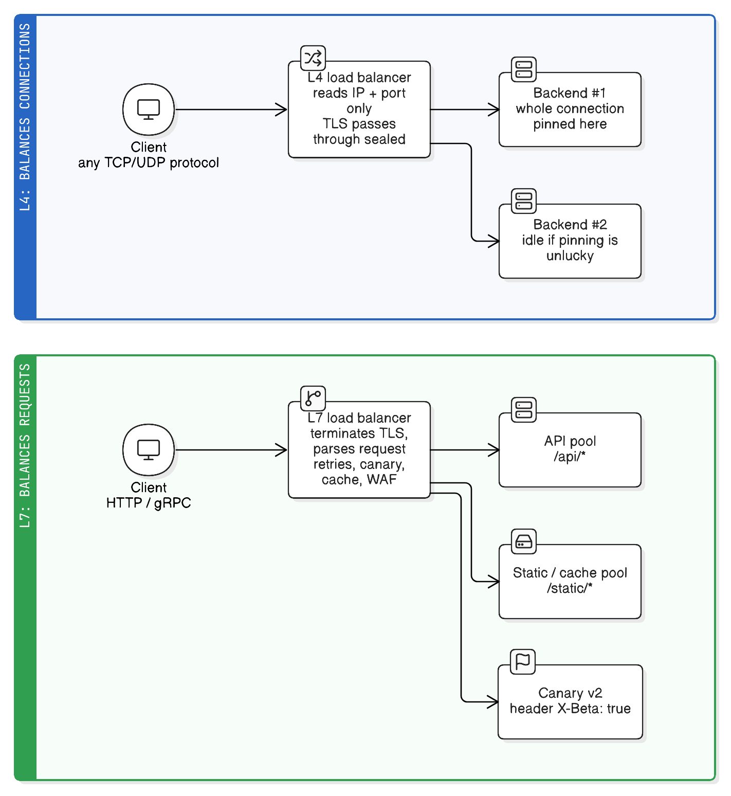

# Load Balancing: L4 vs L7

> "Everything fails all the time."
> — Werner Vogels, CTO, Amazon
>
> *A load balancer is the cheapest way to make that true of one instance instead of your whole service.*

## What a load balancer actually does

One server can only do so much, and any single server eventually dies. A **load balancer (LB)** sits in front of a pool of identical servers and spreads incoming traffic across them, so that:

- **Scale** — 10 servers can serve ~10× the traffic of one, and you add capacity by adding servers rather than buying a bigger one.
- **Availability** — if an instance crashes, the LB stops sending it traffic and nobody notices.
- **Deployability** — you can drain one instance, deploy to it, and put it back, with no downtime.
- **One stable address** — clients talk to `api.example.com`, not to `10.0.1.7`.

The interesting question is *how much of the traffic the LB understands* before deciding where to send it. That's the L4/L7 split.

For where the LB sits relative to protocol termination, see [reverse-proxy-protocol-termination.md](reverse-proxy-protocol-termination.md).

## The layer names, in one line each

The names come from the OSI model — the layer whose information the LB makes decisions on:

| | Layer | Sees | Decides using |
|---|---|---|---|
| **L4** | Transport (TCP/UDP) | Source/destination IP and port; the bytes are opaque | The connection's 5-tuple — nothing about the content |
| **L7** | Application (HTTP, gRPC, WebSocket) | The full parsed request: method, path, host, headers, cookies, body | URL path, `Host`, headers, cookies, JWT claims — anything in the request |

**L4 balances connections. L7 balances requests.** Almost every practical difference follows from that one sentence.



## Real-life analogy: the sorting facility vs. the receptionist

**L4 is a postal sorting facility.** It reads only the address on the *outside* of a sealed envelope and throws it onto the right truck. It has no idea whether the envelope contains an invoice or a birthday card — and it doesn't need to. It's blindingly fast, and it works for *any* kind of letter.

**L7 is a receptionist in a building lobby.** They open the request, read "I'm here about billing," and send you to the right floor — and they can also say "billing is closed, let me send you to the duty desk instead" (retry), stamp your form (add a header), or keep a copy of a common answer (cache). Slower per visitor, and they must be able to read the language you wrote in — but they can make genuinely smart decisions.

Crucially, the sorting facility can route *any* language; the receptionist only routes what they can read.

## L4 load balancing in detail

The LB accepts a connection (or just forwards packets) and picks a backend using the connection's 5-tuple — `(src IP, src port, dst IP, dst port, protocol)` — then all packets of that connection go to the same backend.

**What that gives you:**

- **Protocol-agnostic** — works for anything over TCP/UDP: MySQL, Redis, SMTP, SSH, MQTT, game traffic, DNS, QUIC.
- **Very high throughput, very low latency** — no parsing, no buffering, often no decryption; some implementations forward at kernel level (IPVS/LVS) or use **DSR** (direct server return), where responses skip the LB entirely.
- **TLS passthrough** — the encrypted stream goes untouched to the backend, so end-to-end encryption and **mTLS** are preserved and the LB never holds your certs or private keys.
- **Client IP often preserved** naturally (with DSR, or AWS NLB with IP/instance targets).

**What it can't do:**

- Route by URL path or `Host` (it can't see them).
- Retry a failed request on another backend — it only knows connections, and by the time something failed, the bytes are gone.
- Balance HTTP/2 or gRPC properly: those multiplex *many* requests onto *one* long-lived connection, so a per-connection decision pins all of that traffic to a single backend. One hot instance, the rest idle.
- Compress, cache, rewrite, authenticate, or rate limit per request.

A useful middle case: **SNI-based routing.** The LB peeks at the TLS `ClientHello`'s server name to pick a backend *without decrypting* anything. It's routing on more than IP+port but still not terminating TLS — the practical trick for "route by hostname, keep end-to-end encryption."

## L7 load balancing in detail

The LB terminates the TCP connection (and usually TLS), parses the HTTP request, decides per **request**, and opens/reuses its own connection to a backend.

**What that unlocks:**

- **Content-based routing** — `/api/*` to the API pool, `/static/*` to a cache, `Host: admin.example.com` to the admin pool, `X-Beta: true` to canary instances.
- **Per-request balancing** — fixes exactly the HTTP/2 and gRPC pinning problem L4 has; each request can go to a different backend over the same client connection.
- **Retries, timeouts, circuit breaking, outlier ejection** — a failed idempotent request can be replayed on a healthy backend before the client ever sees an error.
- **Traffic shaping** — weighted/canary releases (99% v1, 1% v2), blue-green shifts, mirroring traffic to a staging pool.
- **Cookie-based sticky sessions** — a real session affinity mechanism instead of hoping IP hashing is stable.
- **HTTP-level extras** — TLS/HTTP2/HTTP3 termination, compression, caching, header rewriting, WAF rules, per-user rate limiting, auth checks, request/response logging with status codes and latencies.

**What it costs:**

- CPU and latency for TLS termination and HTTP parsing; more memory per connection (buffering).
- It must hold your **TLS certificates and keys** (it's a decryption point — an attack-surface and compliance consideration).
- Only works for protocols it understands (HTTP/1.1, HTTP/2, gRPC, WebSocket, sometimes Redis/Kafka-aware proxies).
- One more stateful, tunable component: timeouts, buffer sizes, retry budgets.

## Side by side

| | L4 | L7 |
|---|---|---|
| Balances | Connections/flows | Individual requests |
| Sees | IP + port (opaque payload) | Method, path, host, headers, cookies, body |
| TLS | Passthrough (or SNI peek) | Usually terminated at the LB |
| Works with | Any TCP/UDP protocol | HTTP/1.1, HTTP/2, gRPC, WebSocket… |
| Throughput / latency | Highest / lowest | Lower / higher (parsing + TLS) |
| HTTP/2 & gRPC balancing | Poor (pins a connection to one backend) | Correct (per-request) |
| Retries on failure | No | Yes |
| Path/host routing, canary, rewrite, cache, WAF | No | Yes |
| Health checks | TCP connect / port open | `GET /actuator/health`, expected status/body |
| Sticky sessions | Source-IP hash (fragile behind NAT) | Cookie-based (reliable) |
| Client IP | Often preserved natively | Needs `X-Forwarded-For` |
| Sees your cert keys | No | Yes |
| Examples | AWS NLB, GCP TCP/UDP LB, HAProxy `mode tcp`, NGINX `stream{}`, IPVS/LVS, kube-proxy (Service) | AWS ALB, HAProxy `mode http`, NGINX `http{}`, Envoy, Traefik, Istio sidecars, Cloudflare, k8s Ingress/Gateway API |

## Balancing algorithms (and which layer they fit)

A summary here; the full treatment — how each one behaves, why round robin fails on long-lived connections, the power-of-two-choices result, and the slow-start/draining/outlier-detection machinery that matters more than the algorithm choice — is in [load-balancing-algorithms](load-balancing-algorithms.md).

| Algorithm | How it picks | Notes |
|---|---|---|
| **Round robin** | Next backend in rotation | Fine when requests and servers are uniform; L4 and L7 |
| **Weighted round robin** | Rotation biased by capacity | Mixed instance sizes, or canary weights (L7) |
| **Least connections** | Fewest active connections | Better with long-lived or uneven-duration requests; L4 and L7 |
| **Least request / least outstanding** | Fewest in-flight *requests* | L7 only — the per-request analogue of least-connections |
| **Least response time / EWMA** | Fastest recent latency | L7; automatically steers away from a struggling instance |
| **Power of two choices (P2C)** | Sample 2 backends, pick the better | Near-optimal without global state; Envoy/Finagle default |
| **IP hash / 5-tuple hash** | Hash of client IP or flow | L4 stickiness; uneven behind corporate NAT/CGNAT |
| **Consistent hashing (ring hash, maglev)** | Hash of a key (IP, session, cache key) onto a ring | Keeps most keys on the same backend when the pool changes — for cache locality and sharded state |

## Health checks and draining

- **L4 health check**: "does the TCP port accept a connection?" — an app can be deadlocked, out of DB connections, or throwing 500s on every request and still pass.
- **L7 health check**: `GET /actuator/health` and require `200` (and optionally a body match) — sees real application health, and lets a Spring Boot app report itself as down while its port is still open.
- **Passive/outlier detection** (L7): eject a backend automatically after N consecutive 5xx or timeouts, then probe it back gradually.
- **Connection draining / deregistration delay**: stop sending *new* work but let in-flight requests finish before the instance goes away — this is what makes a zero-downtime deploy actually zero-downtime.

## Sticky sessions (session affinity)

Sending the same user back to the same instance. Both layers can do it, badly and well:

- **L4** — source-IP hash. Breaks when many users share one NAT/CGNAT egress IP (whole offices land on one backend) or a mobile client's IP changes mid-session.
- **L7** — the LB sets its own cookie (`AWSALB`, HAProxy's `cookie` directive) and routes by it. Precise per-user, survives IP changes.

Both are a **workaround for server-side state**. The better fix is usually to make instances stateless — put sessions in Redis and any instance can serve any request (see [redis-single-threaded.md](redis-single-threaded.md)'s session-storage use case). Sticky sessions also make scale-in and deploys lumpy, because you can't move a user without dropping their state.

## Config shape: the same tool, both modes

```haproxy
# L4 — opaque TCP: works for MySQL, Redis, SMTP... but can't see requests
frontend db_in
    bind :3306
    mode tcp
    default_backend db_pool

backend db_pool
    mode tcp
    balance leastconn
    option tcp-check                       # health = "port accepts a connection"
    server db1 10.0.2.10:3306 check
    server db2 10.0.2.11:3306 check

# L7 — parsed HTTP: route by path, retry, real health checks, cookie stickiness
frontend web_in
    bind :443 ssl crt /etc/ssl/site.pem    # TLS terminates here
    mode http
    use_backend static_pool if { path_beg /static/ }
    default_backend api_pool

backend api_pool
    mode http
    balance leastconn
    option httpchk GET /actuator/health    # health = "the app says it's healthy"
    http-request set-header X-Forwarded-Proto https
    retry-on 5xx conn-failure              # replay on another backend
    cookie SRV insert indirect nocache     # cookie-based stickiness
    server app1 10.0.1.10:8080 check cookie a1
    server app2 10.0.1.11:8080 check cookie a2
```

## They're usually layered, not either/or

Real systems use both, in this order:

```
DNS / anycast  →  L4 LB (fast, absorbs floods)  →  L7 proxy fleet  →  App instances
```

- **DNS/anycast** spreads users across regions (crude, TTL-limited, no health awareness at the client).
- **L4** takes the raw flood at line rate, survives SYN floods and volumetric DDoS, and spreads connections across a fleet of L7 proxies.
- **L7** does the smart per-request work: routing, retries, canary, auth, TLS.
- Kubernetes is exactly this shape: a `Service` of type `LoadBalancer` is L4 (kube-proxy/NLB), and an **Ingress/Gateway** controller behind it is L7.

A related fourth option: **client-side load balancing** (gRPC's `round_robin`/`xds`, Spring Cloud LoadBalancer, a service mesh sidecar). The client itself knows all backend addresses and picks one — no extra network hop, and it balances gRPC per request correctly, at the cost of every client needing service-discovery logic.

## Decision checklist: L4 or L7?

| Question | L4 | Real-life example (L4) | L7 | Real-life example (L7) |
|---|---|---|---|---|
| Is the traffic **HTTP-like** (HTTP, gRPC, WebSocket)? | No — it's some other TCP/UDP protocol | Balancing MySQL read replicas, a Redis proxy, or SMTP relays | Yes | A REST API behind an ALB or NGINX |
| Do you need to route by **URL path, host, or header**? | Can't — payload is opaque | A single-purpose service on its own port, nothing to disambiguate | Yes | `/api/*` → API pool, `/static/*` → cache, `admin.example.com` → admin pool |
| Is it **gRPC or HTTP/2** between LB and backends? | Broken — one connection pins all streams to one instance | N/A | Required — balances per request | Envoy/Istio in front of gRPC services |
| Must the payload stay **encrypted end to end** (mTLS, regulatory)? | Yes — passthrough; LB never holds keys | A payments service where only the app may decrypt; SNI routing if you need hostname routing | No — the LB terminates and holds certs | Standard public web app terminating TLS at Cloudflare/ALB |
| Do you need **retries, canary releases, or per-user rate limiting**? | No — no request concept | N/A | Yes | Shipping v2 to 1% of traffic; retrying a failed idempotent `GET` on another pod |
| Is **absolute throughput/latency** the priority (millions of pps, UDP, DDoS absorption)? | Yes — kernel-level forwarding, DSR | A game server fleet or DNS cluster on UDP; NLB fronting an L7 fleet | Costs CPU per request | N/A |
| Do you need **health checks that reflect app health**, not just an open port? | Weak — TCP connect only | A simple TCP daemon where "port open" really is healthy | Yes — HTTP checks | A Spring Boot app reporting `DOWN` from `/actuator/health` while its port is still open |
| Do you need **precise session affinity**? | Fragile — source-IP hash | An internal tool where every user has a distinct IP | Yes — cookie-based | A legacy stateful app that keeps sessions in server memory |

**Default for a web app or API: L7** (ALB, NGINX, Envoy, Ingress) — you almost always want path routing, retries, real health checks, and correct HTTP/2 balancing. **Reach for L4** when the protocol isn't HTTP, when encryption must stay end-to-end, or when you're absorbing raw volume in front of an L7 fleet.

## Gotchas

| Gotcha | Symptom | Fix |
|---|---|---|
| L7 hides the client IP | Rate limits, geo-IP, audit logs all show the LB's IP | `X-Forwarded-For` + `server.forward-headers-strategy` in the app; never trust the header from the open internet |
| L4 also hides it in NAT mode | Same, but no HTTP header to carry it | **PROXY protocol** (v1/v2) — a small preamble carrying the real client address, understood by HAProxy/NGINX/Envoy |
| Idle timeouts mismatched across layers | Random dropped long requests, WebSocket disconnects | Make the app's timeout the *shortest*; align LB read/idle timeouts above it |
| No connection draining on deploy | 502s during every rolling deploy | Deregistration delay + graceful shutdown in the app |
| Health check too aggressive or too lenient | Flapping instances, or traffic sent to a dead app | Tune interval/threshold; use a real readiness endpoint that checks dependencies |
| Sticky sessions plus autoscaling | Sessions lost on scale-in; uneven load | Externalize session state; treat stickiness as a temporary crutch |
| L4 + HTTP/2 to backends | One instance at 100% CPU, others idle | Put an L7 proxy in the path, or use client-side/per-request balancing |
| All instances fail health checks at once | Total outage instead of degraded service | Fail-open modes (e.g. "if all unhealthy, use all") and jittered checks — see [thundering-herd-problem.md](thundering-herd-problem.md) |

## Key takeaways

- L4 balances **connections** using IP + port and never looks inside; L7 balances **requests** after parsing (and usually decrypting) them. Every other difference follows from that.
- L4 is protocol-agnostic, fastest, and keeps traffic encrypted end to end — but can't route by path, can't retry, and pins HTTP/2 and gRPC traffic to one backend.
- L7 unlocks path/host routing, retries, canary releases, caching, WAF, cookie stickiness, and correct per-request balancing — at the cost of CPU, latency, and holding your TLS keys.
- Pick the algorithm to match the traffic: round robin for uniform requests, least-connections/least-request for uneven ones, consistent hashing when a key should keep landing on the same backend.
- L7 health checks (`/actuator/health`) tell you the app is alive; L4 checks only tell you a port is open.
- Sticky sessions are a workaround for server-side state — externalizing session state is the real fix.
- Production stacks usually chain them: DNS/anycast → L4 → L7 → app instances, which is exactly what a Kubernetes `Service` + `Ingress` is.

## See also

- [reverse-proxy-protocol-termination.md](reverse-proxy-protocol-termination.md) — where TLS/HTTP/2 stops, and why HTTP/2 to backends hot-spots one instance behind an L4 balancer.
- [../spring-boot/http-connections-and-tomcat-threading.md](../spring-boot/http-connections-and-tomcat-threading.md) — what one app instance does with the connections a balancer sends it.
- [monolith-vs-microservices.md](monolith-vs-microservices.md) — "a service" is usually several identical instances behind a load balancer.
- [caching-fundamentals.md](caching-fundamentals.md) — an L7 balancer is often also the reverse-proxy cache layer.
- [load-balancing-algorithms](load-balancing-algorithms.md) — the algorithms themselves in depth, plus the health-check, slow-start and retry-budget mechanisms that decide whether balancing actually works.
- [forward-proxy-reverse-proxy-vpn](forward-proxy-reverse-proxy-vpn.md) — the proxy taxonomy around load balancing: forward vs reverse vs VPN, and why client-IP handling behind a proxy is a security decision.
