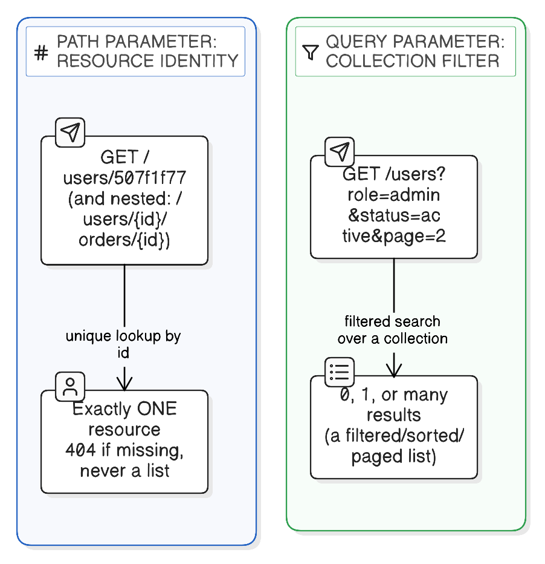

# REST API Design: Path Parameter vs. Query Parameter

## The short answer

`/users/{userId}` (a **path parameter**) is the conventional choice when identifying **one specific resource by its unique identifier**. `/users?userId=xxxx` (a **query parameter**) is conventionally reserved for **filtering/searching a collection**, where the result could reasonably be zero, one, or many items.

Using a query param for a unique-ID lookup isn't broken — it works — but it's a REST convention violation that signals the wrong intent to anyone reading the URL, including caches, API gateways, and other engineers.

## Real-life analogy: postal address vs. delivery instructions

- **Path = the street address.** `123 Main St, Apt 4B` uniquely identifies *one* physical location — there's no such thing as "half of Apt 4B." This is `/users/{userId}` — the path segment *is* the resource's identity.
- **Query params = delivery instructions written on the package.** "Leave at doorstep," "ring twice," "deliver only if signed for" — optional modifiers layered *on top of* a delivery, not the identity of where it's going. This is `/users?role=admin&status=active` — modifiers over a search across many possible addresses.

Writing "deliver to: leave-at-doorstep" as the address itself is exactly what `/users?userId=xxx` does: it puts an *identity* where a *filter* belongs.

## Why `/users?userId=xxxx` reads wrong

- **It semantically implies a filtered collection**, which could return a list — even though in practice a unique ID always returns 0 or 1 results. A path segment communicates "this is the resource"; a query param communicates "this is a search criterion."
- **It breaks resource hierarchy.** Nested ownership reads naturally in a path — `/users/{userId}/orders/{orderId}` — but has no clean query-param equivalent.
- **It's less cache/tooling-friendly.** Reverse proxies, API gateways, and REST tooling (OpenAPI path templates, route matchers) are built around the assumption that resource identity lives in the path, not in an arbitrary query key.



## Decision checklist: path param or query param?

| Question | Path param | Real-life example (path) | Query param | Real-life example (query) |
|---|---|---|---|---|
| Does this identify exactly **one** specific resource by its unique ID? | Yes — use the path | GitHub: `GET /users/{username}` returns exactly one user | No — a filter isn't guaranteed to resolve to one item | Stripe: `GET /v1/charges?customer=cus_123` may return many charges for that customer |
| Could this same value reasonably return 0, 1, or many results? | No — a path segment implies exactly one match | `GET /orders/{orderId}` — 404 if missing, never a list | Yes | GitHub: `GET /search/issues?q=is:open+author:sanjay` — 0 to many issues |
| Is the parameter **optional** (client may omit it)? | No — a path segment can't be optional without becoming a different route | `/users` and `/users/{id}` are two distinct routes, not one route with an optional segment | Yes | GitHub: `GET /issues?state=open` — `state` defaults if omitted |
| Do multiple independent parameters combine in varying ways (filters, sort, pagination)? | No — unwieldy and non-standard in a path | N/A | Yes | `GET /users?role=admin&status=active&page=2&sort=createdAt,desc` |
| Does the resource live inside a natural parent/child hierarchy? | Yes | Stripe: `GET /v1/customers/{id}/sources/{source_id}` — a source belongs to a customer | No — hierarchy doesn't map to flat query params | N/A |

## Code shape

```kotlin
@GetMapping("/users/{userId}")                 // path param — unique resource lookup
fun getUser(@PathVariable userId: Long): UserDetail

@GetMapping("/users")                          // query params — filtered collection
fun searchUsers(
    @RequestParam(required = false) role: String?,
    @RequestParam(required = false) status: String?,
    @RequestParam(defaultValue = "0") page: Int
): Page<User>
```

## The one-line rule

**Path answers "which resource." Query answers "how to filter/sort/shape the result set."**
