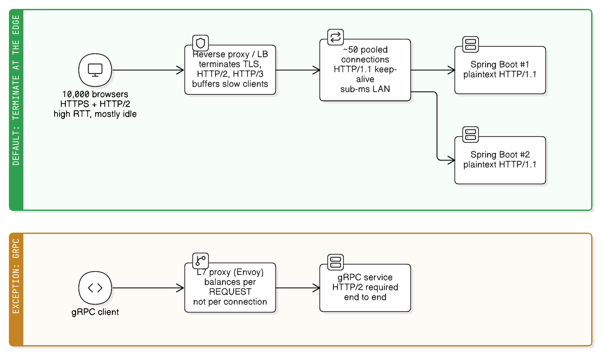

# Reverse Proxy Protocol Termination: HTTP/2 at the Edge, HTTP/1.1 Behind It

> "All problems in computer science can be solved by another level of indirection — except for the problem of too many levels of indirection."
> — David Wheeler (the corollary is usually credited to Kevlin Henney)
>
> *A reverse proxy is that extra level, and it earns its keep by absorbing TLS, HTTP/2, and idle clients.*

The standard production shape for a web application:

```
Browsers ──HTTPS, HTTP/2 (or HTTP/3)──> Reverse proxy / LB ──HTTP/1.1 keep-alive──> App servers
```

The edge speaks the fanciest protocol the internet has to offer; the app server speaks the boring one. This looks like a downgrade, and it is — deliberately. This note explains why that's the right default, when to break it, and the gotchas that bite when you set it up.

This is the expanded version of the "practical default" line in [../spring-boot/http-connections-and-tomcat-threading.md](../spring-boot/http-connections-and-tomcat-threading.md), which covers the connection/thread mechanics this note builds on.

## First: "termination" means two separate connections, not one pipe

The single most important mental correction. A reverse proxy is **not** a pipe that forwards bytes. It is a **server on one side and a client on the other**:

```
                connection #1                                                                connection #2
Browser ──────────> NGINX (server side | client side) ──────────> Spring Boot
  TLS + HTTP/2                                            plaintext HTTP/1.1
```

- The proxy completes the TLS handshake itself, decrypts, and parses HTTP.
- It then makes its **own, unrelated** request to the backend, on its own connection, with its own protocol version, its own keep-alive, its own timeouts.

Because the two sides are independent, the protocol on each side is a **separate decision**. "TLS termination" and "HTTP/2 termination" just mean *this is the hop where that protocol stops.*

### Real-life analogy: an international shipping port

Cargo crosses the ocean in huge sealed containers on one enormous ship — expensive to load, efficient over 10,000 km, and everything is bundled together. At the port, containers are opened, inspected, and the goods go onward on ordinary local trucks — one delivery per truck, on short roads, using the same trucks over and over.

Nobody sails the freighter up the local street, and nobody drives a truck across the Atlantic. **The long, hostile, high-latency leg and the short, friendly, local leg want different vehicles.** The port is the reverse proxy; the sealed container is TLS + HTTP/2 multiplexing; the reused local trucks are the backend keep-alive pool.

## Why HTTP/2 (and TLS) belong at the edge

The public internet leg is where HTTP/2's features actually pay off:

| Edge condition | What HTTP/2 does about it |
|---|---|
| High round-trip time (50–300 ms mobile) | One connection, one handshake — no paying RTTs 6 times over |
| Browser fires 30+ parallel requests | Multiplexed streams instead of HTTP/1.1's 6-connection ceiling and head-of-line blocking |
| Repetitive, bulky headers (cookies, `User-Agent`) on every request | HPACK header compression, which HTTP/1.1 has no equivalent of |
| Lossy, congested networks | Fewer connections → fewer congestion windows fighting each other |
| Thousands of concurrent visitors, most idle | The proxy holds those cheap idle sockets, not your app |
| Slow clients dribbling bytes (mobile, Slowloris) | The proxy buffers the full request and only then talks to the backend |
| TLS certificate management, renewal, ciphers, mTLS, HTTP/3 | One place to configure, not N app instances |

## Why HTTP/1.1 is fine — often better — to the backend

The backend hop has none of those conditions. It's a short, fast, trusted, low-loss link between two machines you own:

- **Latency is sub-millisecond.** Head-of-line blocking on a 0.3 ms link is invisible; the whole problem HTTP/2 solves barely exists here.
- **The connection pool already solves reuse.** The proxy keeps a small pool of warm HTTP/1.1 connections open to each backend. No handshake per request either way.
- **HTTP/2 to the backend can *break* load balancing.** This is the one people don't expect. HTTP/2 puts every request on one long-lived TCP connection — so a connection-level (L4) balancer pins all of that traffic to **one** backend instance. You get a hot instance and idle ones. HTTP/1.1's many short-lived connections spread naturally. (Proper L7 proxies balance per-*request* and avoid this, but it's a real footgun with plain TCP load balancers and naive service meshes.)
- **TCP-level head-of-line blocking gets worse, not better**, when you multiplex everything onto one connection: a single lost packet stalls every stream on it. HTTP/3 fixes this at the edge, but not for your TCP backend hop.
- **Debuggability.** `tcpdump`, `curl -v`, and a plain access log are readable on HTTP/1.1. Binary framing needs HTTP/2-aware tooling.
- **Cleartext HTTP/2 (h2c) is fiddly** to enable in servlet containers, and you'd be adding that operational cost for a benefit measured in microseconds.
- **Fewer moving parts in the app.** No TLS keystore, no cert rotation, no cipher config, no ALPN in the Spring Boot deployment.

Put bluntly: **HTTP/2's advantages are all about surviving a slow, hostile, high-concurrency network. Your data-centre LAN is none of those things.**

## What this means for the app server



The connection counts on the two sides are unrelated, and that's the point:

```
10,000 browser connections  →  Reverse proxy  →  ~50 pooled HTTP/1.1 connections  →  Spring Boot
```

Because those backend connections are reused, Spring Boot never needs one socket per browser. The proxy absorbs TLS handshakes, HTTP/2 framing, idle-connection bookkeeping, and slow clients; Tomcat's worker threads get handed clean, complete, already-buffered requests. Enabling `server.http2.enabled=true` behind such a proxy buys you nothing, because **the browser is not the thing your app is talking to.**

## Gotchas that actually bite

Terminating at the edge means the app no longer sees the real client or the real scheme, and that leaks into behaviour:

| Gotcha | Symptom | Fix |
|---|---|---|
| App sees the proxy's IP as the client IP | Rate limiting, audit logs, geo-IP all show one IP | Proxy sets `X-Forwarded-For`; app trusts it via `server.forward-headers-strategy=framework` (or `native` for Tomcat's `RemoteIpValve`) |
| App thinks the request was plain HTTP | Redirect loops, `http://` links in generated URLs/emails, cookies missing `Secure` | Proxy sets `X-Forwarded-Proto: https`; same `forward-headers-strategy` setting makes Spring honour it |
| **NGINX defaults to HTTP/1.0 upstream** | No backend keep-alive at all — a new TCP connection *per request*, quietly | `proxy_http_version 1.1;` **and** `proxy_set_header Connection "";` plus a `keepalive` count in the `upstream` block |
| Never trust forwarded headers from the internet | Client spoofs `X-Forwarded-For` and bypasses IP rules | Only enable forwarded-header handling when a proxy you control is definitely in front, and have it overwrite (not append to) client-supplied values |
| Two layers of timeouts and body limits | Mysterious 413/504 that don't match the app's config | Align `proxy_read_timeout` / `client_max_body_size` with the app's equivalents |
| WebSocket / SSE | Connection upgrade fails, or SSE arrives in one lump at the end | Forward `Upgrade`/`Connection` headers; disable `proxy_buffering` for SSE |
| HTTP/3 (QUIC/UDP) | Servlet containers have no HTTP/3 support | Edge-only, by definition — nothing to do in the app |

### Config shape

```nginx
server {
    listen 443 ssl;
    http2 on;                     # nginx 1.25.1+; older: `listen 443 ssl http2;`

    location / {
        proxy_pass http://app_upstream;
        proxy_http_version 1.1;           # without this: HTTP/1.0, zero keep-alive
        proxy_set_header Connection "";   # strip the hop-by-hop header so the pool is reused
        proxy_set_header X-Forwarded-For   $proxy_add_x_forwarded_for;
        proxy_set_header X-Forwarded-Proto $scheme;
        proxy_set_header Host             $host;
    }
}

upstream app_upstream {
    server 10.0.1.10:8080;
    server 10.0.1.11:8080;
    keepalive 50;                 # warm HTTP/1.1 connections kept per worker
}
```

```properties
# Spring Boot behind the proxy
server.forward-headers-strategy=framework   # honour X-Forwarded-* (client IP + scheme)
server.tomcat.threads.max=200               # concurrency that matters: worker threads
# server.http2.enabled=true                 # only worth it when clients hit the app directly
```

## Decision checklist: terminate HTTP/2 at the edge, or run it end to end?

| Question | Terminate at the edge (HTTP/1.1 to app) | Real-life example (terminate) | End-to-end HTTP/2 | Real-life example (end-to-end) |
|---|---|---|---|---|
| Is the client a **browser on the public internet**? | Yes — this is the default | A Spring Boot API behind NGINX/CloudFront serving a React SPA | Unnecessary — the browser never sees the backend hop | N/A |
| Are you serving **gRPC**? | Not possible — gRPC requires HTTP/2 all the way | N/A | Required by the spec | An Envoy/Ingress passing gRPC through to a gRPC service |
| Does the backend hop cross a **slow or public network**? | No — LAN, sub-ms RTT, multiplexing gains ≈ 0 | App servers in the same VPC/availability zone as the LB | Yes — treat it like an edge hop | Cross-region call over the internet, or a third-party API you call over HTTPS |
| Is your backend balanced by a **connection-level (L4) balancer**? | Yes — many short connections spread evenly | An AWS NLB or plain `iptables`/DNS round-robin in front of app instances | Dangerous — one long connection pins traffic to one instance | Only with an L7, per-request balancer (Envoy, NGINX, Istio sidecars) |
| Do you need **long-lived streaming** between services? | Awkward — HTTP/1.1 gives you one stream per connection | Ordinary request/response REST calls | Fits well — many concurrent streams per connection | A service mesh streaming telemetry, or bidirectional gRPC streams |
| Who owns **TLS certs and HTTP/3**? | One edge component, centrally rotated | Cloudflare/ALB terminating TLS, certs auto-renewed at the edge | Every app instance needs a keystore and cipher config | Zero-trust/mTLS setups where the backend hop must be encrypted and identity-checked too |
| Do you need to **debug the backend hop with basic tools**? | Yes — plaintext, `curl -v`/`tcpdump` readable | Reproducing a bug by curling the app port directly | Harder — binary frames, needs h2-aware tooling | Teams already tooled for HTTP/2 (Wireshark dissectors, mesh dashboards) |

**Default:** terminate TLS + HTTP/2 (+HTTP/3) at the edge, HTTP/1.1 with keep-alive to the app. **Break it when** the payload *is* HTTP/2 (gRPC), the backend hop isn't a trusted fast LAN, or a service mesh gives you per-request L7 balancing and mTLS anyway.

## Key takeaways

- A reverse proxy is two independent connections, so the protocol on each side is an independent choice — "termination" is just where a protocol stops.
- HTTP/2's wins (one handshake, multiplexing, header compression, absorbing idle/slow clients) all address *public-internet* conditions, which is why they belong at the edge.
- On a sub-millisecond LAN with a warm connection pool, HTTP/1.1 to the backend is simpler, easier to debug, and balances better — HTTP/2 there can even hot-spot one instance behind an L4 balancer.
- Terminating at the edge means the app loses the real client IP and scheme: forward `X-Forwarded-*` and turn on `server.forward-headers-strategy`, and only trust those headers behind a proxy you control.
- In NGINX, forgetting `proxy_http_version 1.1` silently disables backend keep-alive — a new TCP connection per request.
- Run HTTP/2 end-to-end when the protocol is the requirement (gRPC), the hop isn't a trusted LAN, or a mesh handles L7 balancing and mTLS.

## See also

- [../spring-boot/http-connections-and-tomcat-threading.md](../spring-boot/http-connections-and-tomcat-threading.md) — TCP/TLS keep-alive, HTTP/2 streams and frames, and Tomcat's poller/worker thread model behind the proxy.
- [http-protocol-versions.md](http-protocol-versions.md) — what HTTP/1.0, 1.1, 2 and 3 each changed, if you want the protocol detail behind the termination decision.
- [load-balancing-l4-vs-l7.md](load-balancing-l4-vs-l7.md) — what "L4" and "L7" mean in the checklist above, and how each layer balances traffic across app instances.
- [caching-fundamentals.md](caching-fundamentals.md) — the reverse proxy is also a cache layer in the same request path.
- [thundering-herd-problem.md](thundering-herd-problem.md) — `proxy_cache_lock`, the edge's single-flight mechanism.
