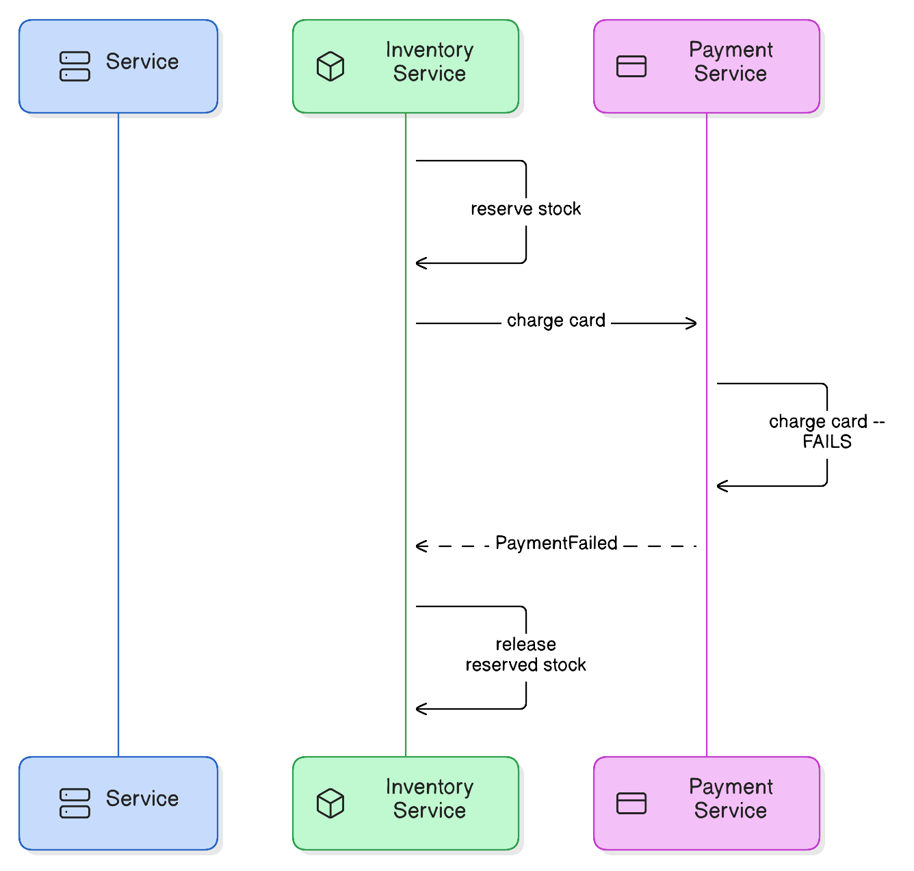
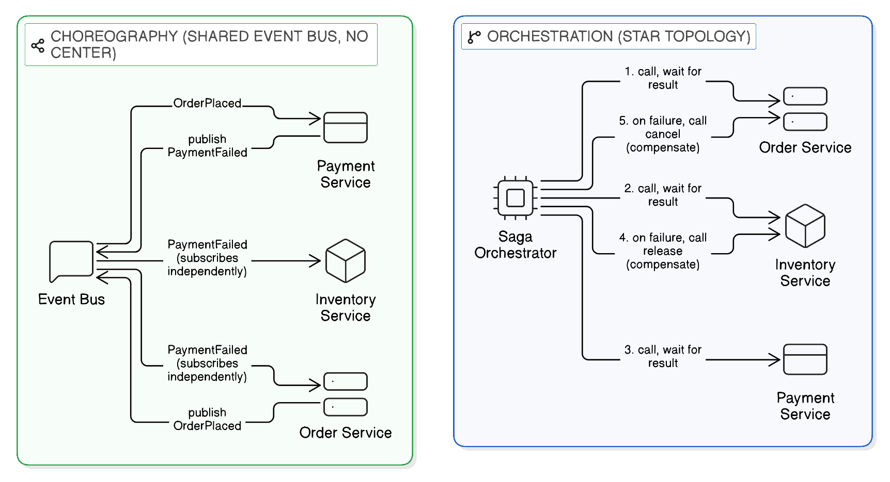

# Saga Pattern: Handling Failures Across a Multi-Step Distributed Transaction

## The core problem

In a single-database monolith, "create order + reserve inventory + charge payment" could be wrapped in one ACID transaction — if payment fails, the whole thing rolls back atomically, as if the order never existed.

In an event-driven/microservices system, each step belongs to a different service with its own database (see [monolith-vs-microservices.md](monolith-vs-microservices.md) for what "service" means here). The order service already committed its own local transaction and returned before payment even ran. There's no single transaction spanning all three services, so there's nothing to roll back — the order is a durable, committed fact in the order service's database by the time payment fails.

## The fix: compensating transactions

Instead of one atomic transaction, the flow is modeled as a chain of local transactions, and every step that can succeed gets a paired "undo" action — a compensating transaction — triggered if a later step fails.



Editable version (Eraser.io): [Saga: Compensating Transactions on Failure](https://app.eraser.io/workspace/JLgRjFjapzOnrAqixpQO?diagram=qXBkFeohDSd-pHKB8rgP&layout=canvas).

1. Order Service creates the order, `status = PENDING` (local commit).
2. Inventory Service reserves stock for the order (local commit). Compensating action: release the reserved stock.
3. Payment Service charges the card — fails.
4. Compensations run in reverse order: Inventory Service releases the reserved stock, then Order Service moves the order to `CANCELLED` / `PAYMENT_FAILED` — not deleted, because analytics, order history, and the user's own app need to know it existed and why it ended. See [async-transaction-confirmation.md](async-transaction-confirmation.md) for how that final status actually reaches the client (polling, WebSocket/SSE push, or a push notification).

## Orchestration vs choreography

Both are ways to run a saga's steps and compensations. The difference is where the "brain" of the workflow lives.



Editable version (Eraser.io): [Orchestration vs. Choreography](https://app.eraser.io/workspace/JLgRjFjapzOnrAqixpQO?diagram=JcjpWd4L-0q0rLs81MWx&layout=canvas).

### Orchestration — one coordinator directs everyone

A dedicated component (the "saga orchestrator") owns the entire sequence explicitly. It calls Order Service, waits for the result, then calls Inventory Service, waits, then calls Payment Service. If Payment fails, the orchestrator itself decides "now call Inventory's release-stock and Order's cancel, in that order" — the whole state machine (what step comes next, what to do on failure) lives in one place, as explicit code or a workflow definition.

- **Pros**: the entire flow is visible in one place — look at the orchestrator to answer "what state is order #123 in, and what happens next?" Easier to add retries, timeouts, or branching logic without touching the participant services. Easier to debug — one component to trace.
- **Cons**: that component now has to know about every step in the workflow (workflow-level coupling, even if the services themselves stay decoupled). It needs its own persistence so an in-flight saga survives a crash/restart.
- **Real tools**: AWS Step Functions, Temporal, Camunda — or a hand-rolled `OrderSagaOrchestrator` service.
- **Analogy**: a wedding planner. They call the caterer, then the venue, then the florist — directly, one by one — and if the florist cancels, the planner is the one who calls the caterer to adjust the headcount. One person holds the entire plan in their head.

The shape of the code — one place explicitly drives every step and its compensation:

```
function placeOrderSaga(order):
    orderService.create(order)
    try:
        inventoryService.reserve(order)
        try:
            paymentService.charge(order)
        except PaymentFailed:
            inventoryService.release(order)   // compensate step 2
            orderService.cancel(order)        // compensate step 1
    except InventoryUnavailable:
        orderService.cancel(order)            // compensate step 1
```

### Choreography — no coordinator, everyone reacts to events

There's no central component. Each service publishes events about what happened to it and subscribes to events it cares about, reacting on its own. Payment Service doesn't call anyone — it just publishes `PaymentFailed`. Inventory Service, independently listening for that event, releases stock because it knows that's its job when it hears that signal. Order Service, also listening, independently marks the order cancelled. The overall workflow isn't written down anywhere — it emerges from everyone's local reactions.

- **Pros**: services are fully decoupled — Payment Service doesn't even know Inventory Service exists. No single point of failure for the control flow. Adding a new participant (e.g. a fraud-check service) just means subscribing to an existing event — no other service needs to change.
- **Cons**: the overall flow is invisible — it's implicit, scattered across every service's event handlers. Debugging "why was this order cancelled?" means tracing a chain of events across several services' logs instead of reading one place. Risk of tangled or even cyclic event chains as the number of steps grows.
- **Analogy**: a relay race, or a bucket brigade fighting a fire. Nobody stands at the side directing the whole race — each runner just waits for the baton and knows their own leg of it. The overall result emerges from everyone doing their local job in response to what just happened next to them, with no one holding the full picture.

The shape of the code — each service only knows its own reaction, with no single place that sees the whole flow:

```
// Inside Payment Service
on OrderPlaced(order):
    result = chargeCard(order)
    if result.failed:
        publish PaymentFailed(order)
    else:
        publish PaymentSucceeded(order)

// Inside Inventory Service — has no idea Payment Service exists
on PaymentFailed(order):
    releaseReservedStock(order)

// Inside Order Service — also has no idea Inventory Service exists
on PaymentFailed(order):
    order.status = CANCELLED
```

### How to decide

| Question | Lean Choreography | Lean Orchestration |
|---|---|---|
| Number of steps in the saga | Few (2-3) | Many (4+) |
| Failure/retry/branching complexity | One simple failure path | Multiple failure paths, need retries/timeouts/conditional branching |
| Need centralized visibility into saga state? | No — no one needs to ask "what state is order #123 in?" from one place | Yes — ops/support need a single place to inspect progress |
| How often do participants change? | Frequently — new participants just subscribe to existing events, no one else changes | Rarely — the workflow is fairly fixed |
| Tooling/infra already in place | Just a pub/sub broker | A workflow engine (Temporal, AWS Step Functions, Camunda) already adopted or worth adopting |
| Team structure | Each service team wants full autonomy, no shared coordinator to maintain together | One team (or a platform team) is already responsible for the end-to-end business process anyway |

Choreography works well for a small number of steps with simple reactions — it stays decoupled without adding a moving part to maintain. As the number of steps or the amount of error/retry/branching logic grows, the implicit workflow gets hard to reason about, and orchestration usually wins because it makes the workflow explicit and inspectable — most teams switch once a saga passes 3-4 steps or has more than one failure path to handle.

A common hybrid: orchestrate the core business transaction (order → inventory → payment, where compensations must fire in a specific order) while letting side effects that don't participate in compensation — analytics logging, sending a marketing email — stay choreographed, just reacting to the same events independently.

**Analogy**: a small garage renovation with three contractors can get away with each one just watching for the previous one to finish and starting their own part — everyone can keep the whole plan in their head (choreography). A large multi-trade building project — electrical, plumbing, structural, inspections, with delays and rescheduling — needs a general contractor explicitly coordinating everyone, because the coordination logic itself has become too complex for anyone to track by just reacting to what they see next to them (orchestration).

## Real-life analogy

Booking a flight and a hotel as a package. You book the flight (reserved), then the hotel booking fails because the card gets declined. You can't roll back the flight booking as a database operation — the airline is a completely separate company with its own separate system. You have to explicitly call and cancel the flight. That cancellation is the compensating transaction — it leaves a trace (a cancelled-booking record, a refund entry) rather than making it look like you never booked at all.

## Idempotency matters

Message brokers typically guarantee at-least-once delivery, so a compensating action like "release stock" or "cancel order" might get triggered more than once for the same event. Running it twice must be a safe no-op — not a double-refund, not a crash, not a double-decrement of inventory back into stock. See [idempotency.md](idempotency.md) for what idempotency means more generally and how to design for it.