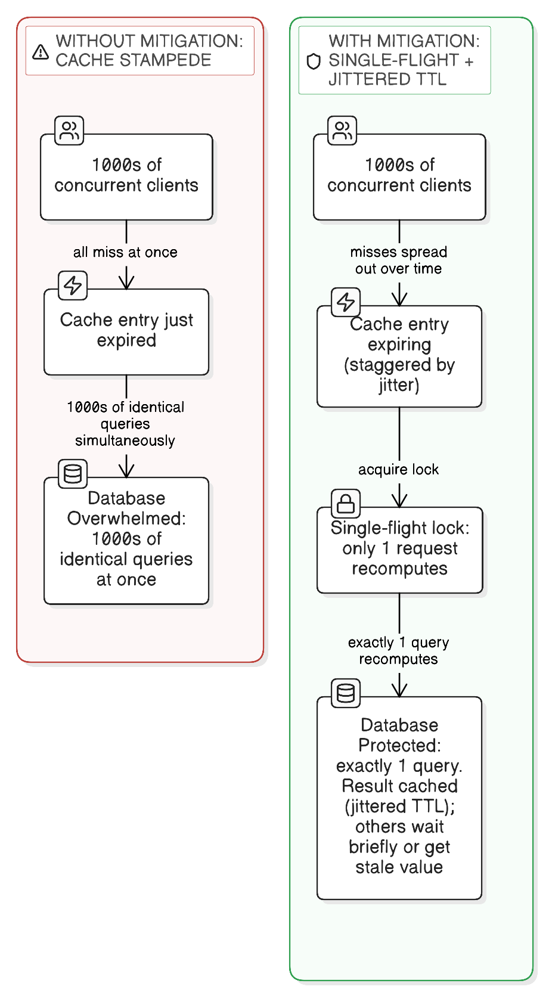
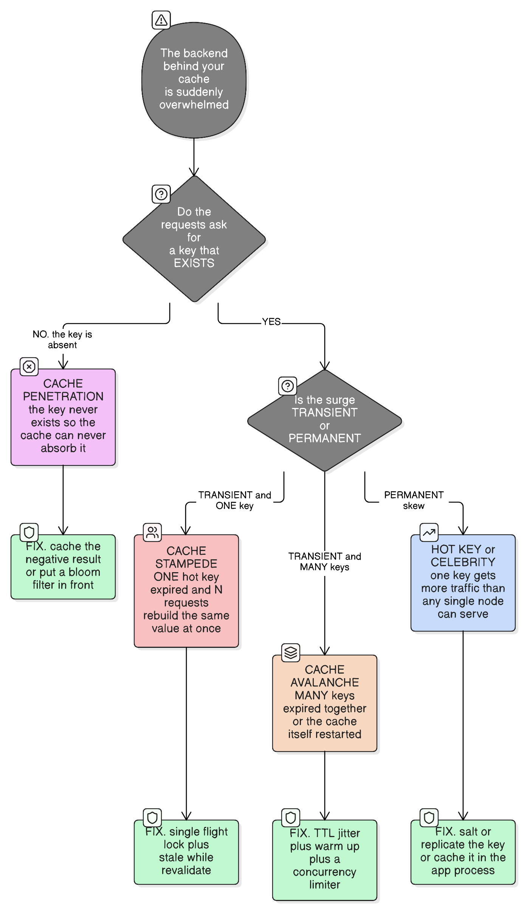

# Thundering Herd Problem (Cache Stampede)

> "Men, it has been well said, think in herds; it will be seen that they go mad in herds, while they only recover their senses slowly, and one by one."
> — Charles Mackay, *Extraordinary Popular Delusions and the Madness of Crowds*

## What it is

The **thundering herd problem** happens when a shared resource that many concurrent requests depend on — most commonly a cache entry — becomes unavailable all at once (it expires, or the cache/server restarts), and *every* one of those waiting requests rushes to regenerate it **simultaneously**, overwhelming the backend the cache was protecting in the first place.

See [caching-fundamentals.md](caching-fundamentals.md) for the broader caching mental model (layers, patterns, eviction, invalidation) this problem is a specific failure mode of.

When the shared resource is specifically a cache entry, this is usually called a **cache stampede** (or *dogpile*) — a strict subset of thundering herd, and the form you'll meet most often. The section below separates it from the **celebrity/hot-key** problem, which shares the symptom but has a different cause and different fixes.

The term originally comes from OS/networking: multiple processes blocked waiting on the same event (e.g. all `accept()`-ing on the same socket) get woken up together when it fires, even though only one of them can actually make progress — the rest just burned CPU for nothing. The caching usage is the same shape, just with a database instead of a socket.

## Real-life analogy: an actual herd stampede

The name is literal: a herd of animals grazing calmly reacts to a single stimulus (a clap of thunder, a predator) and all bolt through the same narrow passage at the exact same instant — trampling each other and jamming a passage that could easily handle them if they trickled through one at a time. Nothing about the passage changed; what changed is that everyone hit it in the same instant instead of being spread out.

## The concrete scenario

1. A hot cache key — a celebrity's profile, a homepage feed — has a 60-second TTL.
2. Traffic is high (viral moment, flash sale). At the exact second the TTL expires, thousands of requests arrive.
3. **All of them miss the cache at the same instant** and go straight to the database (or an expensive computation, or a third-party API) to regenerate the same value — redundantly, thousands of times over.
4. The database, only ever sized to handle occasional cache-refill traffic, gets hit with thousands of *identical* queries at once → connection pool exhaustion → rising latency → timeouts → retries pile on more load → the system can cascade into a full outage. It's effectively a self-inflicted DDoS.



## Where else it shows up

- **Retry storms** — a transient failure causes every client to retry after the same fixed backoff, so they all hammer the server again in sync.
- **Distributed cron** — many servers scheduled to run a job at the exact same wall-clock time, all hitting a shared resource together.
- **DNS TTL expiry** — many clients re-resolving the same record at once when it expires.

## Thundering herd vs cache stampede vs celebrity problem

These three get used interchangeably and they are **not the same problem**. Getting the diagnosis wrong means applying a fix that cannot possibly work, so it's worth separating them properly.



### The one distinction that matters

```
Thundering herd / cache stampede  →  TEMPORAL CORRELATION
                                     many actors act at the SAME INSTANT

Celebrity / hot key               →  DISTRIBUTIONAL SKEW
                                     one key gets more traffic than one node can serve
```

The first is a problem of **timing**; the second is a problem of **popularity**. They need entirely different fixes.

| | **Thundering herd** | **Cache stampede** | **Celebrity / hot key** |
|---|---|---|---|
| Root cause | Many waiters released by one trigger | A cache miss on one key with many concurrent readers | One key is disproportionately popular |
| Needs a cache? | **No** — it's the general mechanism | **Yes**, by definition | **No** |
| Duration | Transient spike | Transient spike | **Permanent**, until traffic changes |
| Requests are for | Whatever they were all waiting on | **The same value**, redundantly | The same key, legitimately |
| What gets overwhelmed | Whatever they all rush to | The origin behind the cache | The single node/partition owning that key |
| Does TTL jitter help? | Yes | Yes | **No** — nothing is synchronised |
| Does single-flight help? | Yes | Yes | **Partly** — collapses duplicate rebuilds, but the key's steady read volume still lands on one node |
| Does key salting help? | No | No | **Yes** — it's the actual fix |
| Fix family | **De-synchronise** | De-synchronise + **collapse duplicates** | **Redistribute or absorb** |

**Relationship:** *cache stampede is thundering herd applied to a cache entry* — a strict subset. Thundering herd is the older, more general term (it comes from OS scheduling, where many processes blocked on one socket are all woken by one connection). The celebrity problem is a different phenomenon that happens to *share the symptom* of "one thing is overloaded".

### Why they're constantly confused: they compound

A celebrity key is, by definition, the key with the **most concurrent readers** — so it's also the key whose expiry produces the largest stampede. The celebrity problem *raises the amplitude* of any stampede on that key. That's why the scenario above uses "a celebrity's profile" as its example, and why in practice you often need both fixes on the same key:

```
single-flight lock  →  stops N duplicate rebuilds when it expires   (the stampede)
key salting/replication  →  spreads its steady read volume          (the celebrity)
```

Fixing only the stampede leaves one node melting under normal traffic. Fixing only the skew leaves every salted bucket stampeding independently on expiry.

### Two more in the same family

Worth knowing because they're routinely listed alongside the others and have completely different remedies:

| Problem | What happens | Fix |
|---|---|---|
| **Cache avalanche** | **Many** keys expire simultaneously (a batch warmed together with identical TTLs), or the cache node restarts and loses everything at once. The whole read volume, not one key's, lands on the database | TTL jitter across keys, staged warm-up, a concurrency limiter in front of the origin |
| **Cache penetration** | Requests for keys that **do not exist**. Every one misses and reaches the database, so the cache provides no protection at all — and it's a cheap attack vector (request random IDs) | Cache the negative result with a short TTL; a bloom filter to reject impossible keys |

Note the difference between **stampede** (one key, many rebuilders) and **avalanche** (many keys, ordinary traffic with no cache in the way). Both are transient; both are fixed by de-synchronising — but jitter *across keys* fixes avalanche, while single-flight *per key* fixes stampede.

### Diagnosing it from the metrics

| What you observe | Most likely |
|---|---|
| A sharp origin-QPS spike at a **round-number interval** (every 60 s), for **one query shape** | Cache stampede |
| An origin spike on **restart or deploy** of the cache tier, across **many query shapes** | Cache avalanche |
| **Sustained** high load on **one** node/partition while its peers idle, with no spike shape | Celebrity / hot key |
| High cache **miss rate** with a **low hit rate that never improves**, on ever-changing keys | Cache penetration |
| Load spikes synchronised to **client retries**, not to your TTLs | Retry storm — a thundering herd not involving the cache at all |

The most useful single signal: **stampede and avalanche are spikes; a celebrity is a plateau.** If a graph of origin load shows a sawtooth aligned to your TTL, it's the former. If it shows one node permanently hotter than its peers, it's the latter.

## Mitigation techniques

| Technique | What it does | Real-life example |
|---|---|---|
| **Single-flight lock (mutex per key)** | Only one request recomputes the value; others wait briefly or get the stale value while it refreshes | Go's `singleflight` package; NGINX's `proxy_cache_lock` |
| **Stale-while-revalidate** | Serve everyone the stale value immediately while exactly one background request refreshes it | HTTP `Cache-Control: stale-while-revalidate`, supported by Cloudflare/Fastly |
| **Jittered TTL** | Add randomness to expiration (`60s ± 10s`) so keys don't all expire at the same instant | Standard cache library option (e.g. Redis client-side TTL jitter) |
| **Probabilistic early expiration** | Recompute *before* actual expiry, with probability rising as expiry nears — spreads refreshes out over time | Facebook's "XFetch" algorithm |
| **Proactive background refresh** | A scheduled job refreshes known hot keys before they'd ever expire under load | Cache-warming jobs for a homepage/trending feed |
| **Exponential backoff + jitter (client side)** | Prevents synchronized retry storms after a transient failure | AWS SDK's default retry policy |

## Does Spring's `@Cacheable` protect against this?

Not by default. Plain `@Cacheable` has no per-key locking — on expiry, every concurrent caller misses independently and hits the underlying method (and therefore the DB) at the same instant.

Spring does offer an opt-in single-flight lock: `@Cacheable(value = "users", key = "#id", sync = true)`. This switches to the cache's `get(key, Callable)` method, which blocks concurrent callers for the *same key* on whichever thread got there first — exactly the single-flight pattern above, built in.

**The catch: it's scoped to one JVM.** `sync = true` fully collapses the herd within a single running instance, but replicas don't coordinate with each other — a fleet of 5 replicas can still produce up to 5 concurrent DB calls for the same key at the same instant. It also can't be combined with multiple cache names or with `unless` (only `condition` is allowed). Eliminating the herd fleet-wide needs an actual distributed lock (e.g. a Redis `SETNX`-based mutex around the load step), not something `@Cacheable` provides on its own. See [caching-fundamentals.md](caching-fundamentals.md#which-pattern-does-springs-caching-abstraction-use) for how `@Cacheable`/`@CachePut`/`@CacheEvict` map to the caching patterns overall.

## Decision: which mitigation fits your system?

| Question | If yes → | Real-life example |
|---|---|---|
| Is briefly-stale data acceptable while refreshing? | Stale-while-revalidate / background refresh | Trending topics shown a few seconds stale is fine |
| Must the value always be exactly fresh? | Single-flight lock (others wait, never served stale) | Bank account balance — staleness unacceptable, but still don't want N duplicate DB hits |
| Is the hot key predictable in advance (known celebrity/campaign)? | Proactive cache warming before expiry | Pre-refreshing a flash-sale product page before the sale starts |
| Is the storm coming from your *clients'* retries, not your own cache? | Exponential backoff + jitter on the client, rate limiting as a backstop on the server | API clients retrying after a 429/503 |
| Just want a cheap, low-effort default with no code complexity? | Jittered TTL | Any cache with per-key TTLs — spreads expiry automatically |

## Code shape: single-flight lock

```
function getValue(key):
    value = cache.get(key)
    if value exists: return value

    if not acquireLock(key):              // someone else is already recomputing
        sleep briefly, then retry cache.get(key)   // or: return stale value if allowed
    else:
        try:
            value = computeExpensiveValue(key)
            cache.set(key, value, ttl = 60 + randomJitter())
            return value
        finally:
            releaseLock(key)
```

See [system-design/rate-limiters.md](rate-limiters.md) for how rate limiting acts as a backstop once a storm is already underway, and [system-design/redis-single-threaded.md](redis-single-threaded.md) for why a cache like Redis being hit with duplicate concurrent queries is itself a bottleneck worth avoiding.

## See also

- [consistent-hashing](consistent-hashing.md) — a `mod N` rehash after adding a cache server invalidates ~80% of keys at once, which is a herd triggered by a capacity increase.
- [latency-percentiles](latency-percentiles.md) — how the resulting latency spike is measured, and why a mean would hide it.
- [load-balancing-algorithms](load-balancing-algorithms.md) — retry budgets, and why unbudgeted load-balancer retries turn a partial failure into a fleet-wide one.
