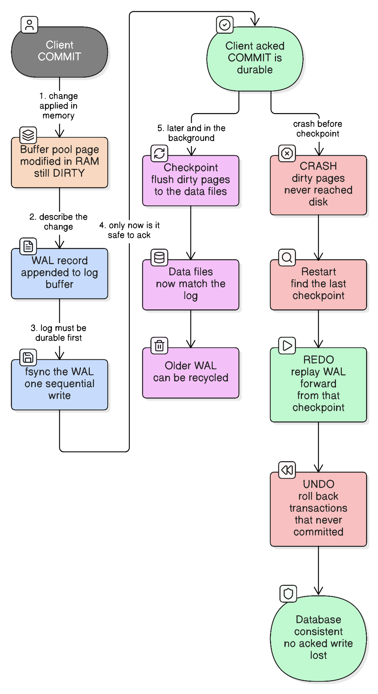
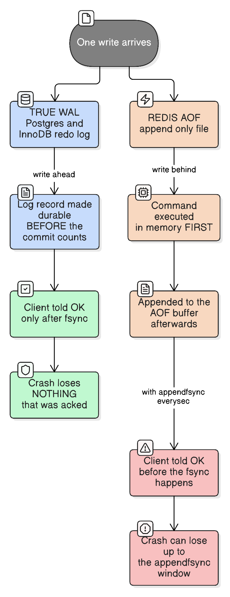

# Write-Ahead Log (WAL): How Databases Survive a Crash

> "The log is the database. Everything else is a cache of the log."
> — Jay Kreps, paraphrasing decades of database design
>
> *Once you believe that sentence, replication, backups, CDC and crash recovery all turn out to be the same feature.*

See also: [redis-persistence-rdb-vs-aof](redis-persistence-rdb-vs-aof.md) — Redis's AOF is one instance of the idea in this file, and section 6 below maps the two onto each other.

## The problem WAL solves

You run this and get a success response:

```sql
UPDATE accounts SET balance = balance - 500 WHERE account_id = 42;
COMMIT;
```

The power fails one millisecond later. When the machine comes back, has that ₹500 moved?

The naive answer is "write the row to disk before acking". That fails for three separate reasons:

1. **Random I/O is slow.** That row lives on one 8 KB page somewhere in a multi-terabyte file. Committing means seeking to that page, and a transaction touching five tables and their indexes means a dozen scattered writes — each an `fsync` — before you can answer the client.
2. **A page write is not atomic.** An 8 KB page spans multiple 512-byte sectors. Lose power mid-write and you get a **torn page**: half old, half new, checksum broken, unrecoverable. You didn't just fail to save the change; you destroyed data that was previously fine.
3. **A transaction spans many pages.** "Debit A, credit B" touches two pages. Crash between them and the money has vanished. There is no way to make N page writes atomic by ordering them.

## The insight

Don't try to make the data files crash-safe. Instead, **write down what you're about to do, in one cheap sequential append, and make that durable first.**

```
Change the page in memory (fast, not durable)
        ↓
Append a record describing the change to the log
        ↓
fsync the log            ← ONE sequential write; this is the commit point
        ↓
Ack the client
        ↓
...much later, flush the dirty pages to the data files (checkpoint)
```

**The WAL rule, stated precisely:** *a modified page may not be written to the data files until the log record describing that modification is durable; and a transaction is committed exactly when its commit record is durable.*

Everything else — recovery, replication, PITR — falls out of that one rule.

## Real-life analogy

A busy pharmacy. Filing each prescription into the right patient folder in the back-room cabinet takes a walk and a search (**a random page write**), and if the lights go out mid-filing you can end up with a half-updated folder (**a torn page**). So the pharmacist keeps a **bound daybook on the counter** and writes one line per transaction in order, never going back (**the append-only log**), and only tells the customer "done" once the line is in ink (**fsync, then ack**). Filing into folders happens in a quiet moment later (**the checkpoint**). If the lights go out, the next morning starts by reading the daybook forward from the last "all filed up to here" note (**replay from the last checkpoint**) and redoing whatever hadn't been filed. The daybook is the truth; the cabinet is a convenient index of it.

---

## 1. The write path, and why more writing is faster



[Edit this diagram](https://app.eraser.io/workspace/JLgRjFjapzOnrAqixpQO?diagram=bG7oatnP58jdc7w4SjpR&layout=canvas)

WAL writes the *same data twice* — once to the log, later to the data files — and is still dramatically faster. Three reasons:

| Reason | Detail |
| --- | --- |
| **Sequential beats random** | The log is one file, appended to. Even on NVMe, sequential writes beat scattered ones; on spinning disks it was 100×. |
| **One `fsync` per commit, not N** | A transaction touching 12 pages still costs one log flush. |
| **Group commit** | Concurrent transactions committing at the same moment share a single `fsync`. Throughput rises with concurrency because the per-commit cost is *amortised* — 50 transactions can commit for the price of one flush. |

Group commit is why a busy database often shows *better* per-transaction latency than an idle one under the same durability setting: there are more transactions to share each flush with.

## 2. `fsync`: where durability is actually won or lost

Every WAL guarantee reduces to one question — **did the bytes reach stable storage?**

```
write()                 → copies into the OS page cache. Returns success. NOT durable.
fsync() / fdatasync()   → asks the OS to push to the device and waits.
disk write cache        → the drive may still buffer it unless it honours a flush barrier.
```

A `write()` returning 0 errors means nothing. This is the layer where "we lost committed data" incidents come from:

- **Consumer SSDs that lie about flushes** to win benchmarks. `fsync` returns, the data is in volatile drive cache, power fails, data gone.
- **`fsync` failing and the error being consumed once.** Historically Linux could report a writeback error to only the *first* caller and then mark the page clean — the famous "fsync gate". Postgres now panics and recovers from WAL rather than continue, because continuing after a failed flush means silently running on data it can't trust.
- **Virtualised/network storage** adding a layer that reorders or buffers.

The practical consequence: **durability is a property of the whole stack**, not of your database config. A correct `synchronous_commit = on` on a drive that ignores flush barriers is not durable.

## 3. Checkpointing

The log can't grow forever, and recovery time is proportional to how much log must be replayed. A **checkpoint** flushes all dirty pages to the data files and records "everything up to LSN X is safely in the data files."

Consequences:
- WAL before that point can be recycled or archived.
- Recovery replays only from the last checkpoint, not from the beginning of time.

The trade-off is a dial, and both ends hurt:

| Checkpoints | Steady-state I/O | Recovery time |
| --- | --- | --- |
| **Frequent** | High — constant page flushing, latency spikes | Short |
| **Rare** | Low | Long — potentially many minutes of replay |

This is why databases spread checkpoint I/O over time (Postgres `checkpoint_completion_target`) instead of flushing everything at once: an unspread checkpoint shows up as a periodic latency cliff.

## 4. Crash recovery: REDO and UNDO

Restart finds the last checkpoint and runs the classic **ARIES** three phases:

| Phase | What it does |
| --- | --- |
| **Analysis** | Scan forward from the checkpoint to find which transactions were in flight and which pages were dirty |
| **REDO** | Replay *all* logged changes forward — including from transactions that never committed — restoring the exact pre-crash memory state |
| **UNDO** | Roll back the transactions that had no commit record, using undo information |

Two details that make this work:

**Replay must be idempotent.** Recovery can itself crash and restart. Each page stores the **LSN** (log sequence number) of the last change applied to it, so replay skips any record whose LSN the page already reflects. Applying the log twice is therefore safe — which is exactly the [idempotency](idempotency.md) property, applied to crash recovery.

**The log tail is expected to be corrupt.** The crash happened *during* a write, so the final record is probably half-written. Every record carries a checksum; recovery replays until the first bad checksum, then truncates there. A torn tail is normal, not an error.

**Redo vs undo:**

```
Redo log  → "the new value was X"        → replay forward to recover committed work
Undo log  → "the old value was Y"        → roll back uncommitted work; also serves MVCC reads
```

Postgres keeps old row versions in the heap itself (hence `VACUUM`); MySQL InnoDB keeps a separate undo log and a redo log. This is also why **InnoDB has two logs that people confuse**: the *redo log* is crash recovery, while the *binlog* is a separate logical log for replication and PITR.

## 5. What the log gives you for free

This is the real reason WAL is everywhere. Once an ordered, durable record of every change exists, several unrelated-seeming features become the same feature:

| Feature | How the log provides it |
| --- | --- |
| **Crash recovery** | Replay from the last checkpoint |
| **Replication** | Ship the log to another node and replay it there — a follower is just continuous recovery ([database-sharding-partitioning-replication](database-sharding-partitioning-replication.md)) |
| **Point-in-time recovery** | Restore a base backup, then replay archived WAL up to a chosen timestamp — "restore to 14:32, just before the bad migration" |
| **Change data capture** | Decode the log into a stream of row changes: Debezium, Postgres logical decoding, MySQL binlog readers |
| **Read replicas / standbys** | A node that replays but never writes |
| **Zero-downtime major upgrades** | Logical (row-level) log shipping decouples the replica's storage format from the leader's |

The step worth internalising: **a replica is not a special mechanism. It is a machine permanently stuck in crash recovery, being fed log records forever.**

---

## 6. Redis AOF as a write-ahead log



Redis's **AOF (Append Only File)** is the same core idea — an append-only record of every mutation, replayed on restart to rebuild state. But two differences matter, and both change what you're allowed to promise a user.

### Difference 1 — AOF is write-*behind*, not write-ahead

```
True WAL (Postgres, InnoDB):
    log record durable  →  commit counts  →  client told OK

Redis AOF:
    command executed in memory  →  appended to AOF buffer  →  client told OK  →  fsync later
```

Redis executes the command first and appends afterwards. With the default `appendfsync everysec`, the client is told "OK" **before** the record is durable, so a crash can lose up to a second of *acknowledged* writes. Setting `appendfsync always` closes that gap (fsync before the next event-loop iteration proceeds) at a large throughput cost — which is exactly the durability/latency dial from section 2, exposed as one config line.

So the name is a little generous: it's an append-only redo log, but it is not "write-ahead" in the strict sense unless you set `always`.

### Difference 2 — AOF logs *commands*, classic WAL logs *changes*

AOF stores the command (`SET foo bar`, `INCR counter`) — logical, statement-level. Postgres WAL stores physical page changes.

That creates the **non-determinism problem**: replaying a command must produce the same result it produced originally. `SPOP` (pop a *random* member) or a relative `EXPIRE 60` would diverge on replay. Redis solves it by rewriting such commands into deterministic equivalents before logging them — `SPOP` becomes `SREM` with the member actually removed, and relative expiries become absolute `PEXPIREAT` timestamps.

This is precisely the failure mode of statement-based replication (`NOW()`, `RAND()`, auto-increment behaving differently on the replica), and the same fix: log the *effect*, not the instruction.

### The concept mapping

| Classic WAL | Redis equivalent | Notes |
| --- | --- | --- |
| WAL / redo log | **AOF** | Append-only record of mutations |
| `fsync` policy (`synchronous_commit`) | **`appendfsync always / everysec / no`** | Same dial, different names |
| Checkpoint | **AOF rewrite** | Compacts the log to the minimum needed to reproduce current state |
| Base backup | **RDB snapshot** | Point-in-time full copy |
| Base backup + WAL archive | **Hybrid AOF (Redis 4+)** | AOF rewrite writes an RDB-format base plus a tail of recent commands — structurally identical to snapshot + log |
| Replay from checkpoint | Replay the AOF on startup | Slower than loading a snapshot, hence the hybrid |
| Log shipping to a replica | Redis replication stream | Redis ships its own command stream, not the AOF file |
| Torn-tail truncation | `aof-load-truncated yes` | Same "the last record is expected to be partial" reasoning |

**The one-line summary:** *AOF is a redo log with statement-level records and a write-behind fsync policy; a database WAL is a redo log with physical records and a write-ahead fsync policy.* Same family, different guarantees — and the guarantee is the part that matters when someone asks "can we lose a payment?"

---

## 7. A toy WAL, to make the ordering concrete

The whole mechanism is about the order of four lines:

```kotlin
class ToyWal(path: Path) {
    private val channel = FileChannel.open(path, CREATE, WRITE, APPEND)

    /** Appends a record and makes it durable. Returns only once the bytes are on the device. */
    fun logAndSync(record: Record) {
        channel.write(record.encodeWithChecksum())   // still only in the page cache
        channel.force(true)                          // fsync — without this the log is a lie
    }
}

fun applyTransfer(from: Account, to: Account, amount: Long) {
    val record = Record.transfer(from.id, to.id, amount)

    wal.logAndSync(record)        // 1. durable intent FIRST
    memory.apply(record)          // 2. then mutate in-memory state
    client.ack()                  // 3. only now is the client told OK
    // 4. dirty state reaches the data files at the next checkpoint
}
```

Moving `client.ack()` above `wal.logAndSync(record)` turns this into AOF-with-`everysec`: faster, and able to lose acknowledged writes.

Recovery, including the expected torn tail:

```kotlin
fun recover(log: Path, memory: State) {
    var lastGoodEnd = 0L

    for (record in readRecords(log)) {
        if (!record.checksumValid()) break   // crash happened mid-write; the tail stops here
        memory.apply(record)                 // idempotent: skip if page LSN >= record LSN
        lastGoodEnd = record.endOffset
    }

    truncate(log, lastGoodEnd)               // discard the partial record so future appends are clean
}
```

---

## 8. How to decide: durability settings

### Which `fsync` policy?

| Question to ask | → Sync on every commit | Real-life example (sync) | → Periodic (~1s) | Real-life example (periodic) | → Never / OS-decides | Real-life example (never) |
| --- | --- | --- | --- | --- | --- | --- |
| Is losing the last second of acknowledged writes acceptable? | No | Payments ledger, order placement, inventory decrement | Yes, and it's rare | Session store, activity feed, view counters | Yes, always | A pure cache, or a rebuildable derived index |
| Can the data be reconstructed from somewhere else? | No, this *is* the source of truth | A bank's transaction table | Partly | A recommendations cache warmed from the primary DB | Yes, entirely | Elasticsearch index rebuilt from Postgres |
| Is write throughput the binding constraint? | No | Low-volume, high-value writes | Yes | 50k events/sec ingestion | Yes, extremely | Metrics scratch space |
| Postgres setting | `synchronous_commit = on` | | `= off` (async commit) | | `fsync = off` — **never in production** | |
| Redis setting | `appendfsync always` | | `appendfsync everysec` (default) | | `appendfsync no` | |

### Log-based or snapshot-based persistence?

| Question to ask | → Log (AOF/WAL) | Real-life example (log) | → Snapshot (RDB/base backup) | Real-life example (snapshot) |
| --- | --- | --- | --- | --- |
| How much loss is tolerable? | Seconds or none | A queue of pending payouts held in Redis | Minutes | A nightly-refreshed product catalogue cache |
| How fast must restart be? | Slower — replay takes time | A small keyspace | Fast — load one file | A 200 GB cache that must be warm quickly |
| Do you need point-in-time recovery? | Yes — the log is what makes "restore to 14:32" possible | Recovering from a bad migration | No | Disaster recovery only |
| Best answer for most systems | **Both** | Snapshot as the base, log for the recent tail — Postgres PITR and Redis hybrid AOF are the same design | | |

### Checkpoint / rewrite frequency

| Question to ask | → More frequent | Real-life example | → Less frequent | Real-life example |
| --- | --- | --- | --- | --- |
| Is a long restart acceptable? | No, recovery must be quick | A trading system with a strict RTO | Yes | An internal analytics store |
| Is the workload latency-sensitive? | No — you can absorb flush I/O | Batch ingestion overnight | Yes — avoid checkpoint spikes | A user-facing API at p99 targets |
| Is disk space for the log constrained? | Yes | A small instance with a 20 GB volume | No | Ample archive storage |

---

## Common mistakes

| Mistake | What goes wrong |
| --- | --- |
| Assuming `write()` returning success means durable | It's in the page cache. A power cut loses it |
| Trusting `fsync` on hardware that ignores flush barriers | Every durability guarantee above it is void |
| Running `fsync = off` / `appendfsync no` on a source of truth | Fast until the first crash, then arbitrary corruption |
| Treating Redis `everysec` as "no data loss" | It is explicitly *up to one second* of acknowledged writes |
| Never archiving WAL, then wanting point-in-time recovery | PITR needs a base backup **plus** the log since it. Without the archive, you have last night's backup and nothing else |
| Letting WAL fill the disk | The database stops accepting writes. Common cause: a replication slot or archiver stuck, so WAL can't be recycled |
| Confusing InnoDB's redo log with the binlog | Different logs, different jobs — crash recovery vs replication/PITR |
| Very rare checkpoints to reduce I/O | Recovery takes many minutes; nobody notices until an outage |
| Expecting AOF replay to be exact for non-deterministic commands | It is, but only because Redis rewrites them — worth knowing when reasoning about custom Lua scripts |

## Key takeaways

1. **Log first, apply later.** A change isn't committed when the page is written; it's committed when the log record is durable.
2. **Writing twice is faster than writing once badly** — one sequential `fsync` beats N random ones, and group commit amortises even that.
3. **`fsync` is the entire durability story**, and it depends on the whole stack, not just the database config.
4. **Checkpoints trade steady-state I/O against recovery time.** Both extremes hurt.
5. **Recovery is REDO then UNDO**, made safe by per-page LSNs (idempotent replay) and per-record checksums (expected torn tail).
6. **Replication, PITR and CDC are all just "read the log"** — a replica is a node permanently in recovery.
7. **Redis AOF is the same idea with two weaker properties**: statement-level records instead of physical ones, and write-behind fsync instead of write-ahead — which is precisely why `everysec` can lose acknowledged writes and `always` costs so much.

## See also

- [redis-persistence-rdb-vs-aof](redis-persistence-rdb-vs-aof.md) — AOF and RDB as Redis configures them, and the hybrid mode that mirrors base-backup-plus-WAL.
- [database-sharding-partitioning-replication](database-sharding-partitioning-replication.md) — log shipping is how followers stay current, and the statement/WAL/logical distinction there is the same one as section 6 here.
- [idempotency](idempotency.md) — why replaying a log twice has to be safe, which is what per-page LSNs buy.
- [cap-theorem](cap-theorem.md) — synchronous log shipping to a quorum is where durability meets availability.
- [async-transaction-confirmation](async-transaction-confirmation.md) — the application-level version of "acknowledge now, make it durable slightly later".
