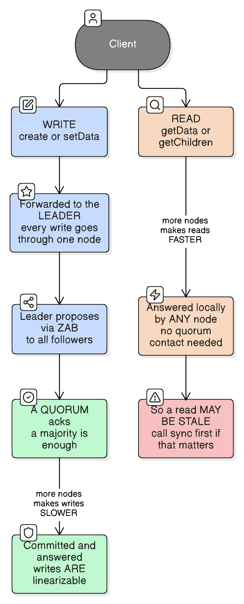
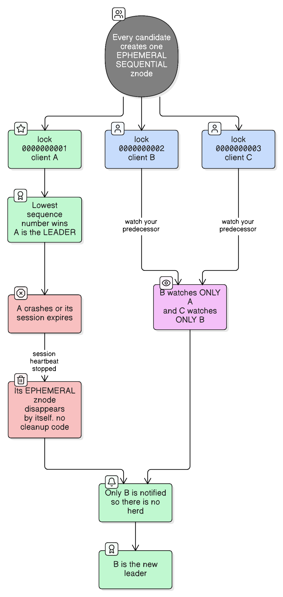

# ZooKeeper and Distributed Coordination

> "The hardest problem in distributed systems is getting several machines to agree on one small fact."
>
> *ZooKeeper's whole pitch is: don't solve that yourself — solve it once, in one service, and let everything else ask.*

## What it is

**Apache ZooKeeper is a small, strongly-consistent, replicated store for coordination metadata.** Not application data — the handful of facts every distributed system needs its nodes to agree on:

```
Who is the leader right now?
Which nodes are alive?
Who currently holds this lock?
What is the current config?
Which node owns which shard?
```

Physically it looks like a tiny filesystem — a tree of paths, each holding a small blob — replicated across an odd number of servers (an **ensemble**) that agree via a consensus protocol.

## What problem it actually solves

Every distributed system needs consensus on those small facts. The naive approach is for each system to build its own: heartbeats, timeouts, a vote, a tiebreak. That code is **notoriously easy to get subtly wrong**, and its failure mode is the worst one there is — **split brain**, where two nodes each believe they're the leader and both start writing.

So ZooKeeper factors it out. Consensus is implemented once, correctly, by people who specialise in it, and everything else becomes a client asking a question. That's the entire value proposition: **it is not a database, it's an agreement service.**

**Real-life analogy:** a building with many meeting rooms and no booking system — people just walk in, and two groups regularly end up in the same room arguing (**split brain**). Instead of every team inventing its own etiquette, the building hires **one receptionist with one whiteboard** (**the coordination service**). Nobody negotiates directly any more; you ask the receptionist who has room 3, and your booking is written on a peg that falls off by itself if you stop checking in every few minutes (**an ephemeral node tied to your session heartbeat**). The receptionist holds almost no information — just names and room numbers, never the contents of your meeting (**coordination metadata, not application data**) — and if the receptionist can't confirm with their two colleagues who also keep the whiteboard, they say "come back in a minute" rather than guess (**a quorum, refusing service rather than risking a double booking**).

---

## The data model: znodes

The tree holds **znodes**, addressed like file paths (`/app/leader`, `/app/workers/node-3`). Each holds a small payload — the default cap is **1 MB**, and in practice you store a few bytes: a hostname, a port, a JSON stub.

Three flavours, and the coordination magic comes from combining them:

| Type | Behaviour |
| --- | --- |
| **Persistent** | Stays until explicitly deleted. Config, static structure |
| **Ephemeral** | **Deleted automatically when the creating client's session ends.** This is the key primitive |
| **Sequential** | ZooKeeper appends a monotonically increasing counter to the name: `lock-0000000001` |

**Ephemeral + sequential together** is what makes leader election and locks work — a node that represents "I am alive and I got here Nth", which cleans itself up when you die. No cleanup code, no reaper job, no stuck locks from a crashed process.

## Sessions: how liveness is detected

A client opens a **session** and heartbeats. Stop heartbeating for longer than the session timeout and ZooKeeper declares the session dead and **deletes every ephemeral node it created**.

This is the whole failure-detection mechanism, and the important consequence is: *your process being alive is not what matters — your session being alive is.* A long GC pause, a network hiccup, or a slow disk can expire your session while your process is perfectly healthy and still believes it holds the lock. (That has a real safety consequence — see fencing tokens below.)

## Watches: notification, not data

A client can set a **watch** on a znode: "tell me when this changes." Three properties that trip people up:

1. **One-shot.** A watch fires once, then you must re-register it.
2. **It tells you *that* something changed, not *what*.** You re-read to find out.
3. **There is a gap** between the notification and your re-read, in which the value can change again. Watches are a hint to go look, not an event log.

## Guarantees: writes are linearizable, reads are not



This asymmetry is the most commonly misunderstood thing about ZooKeeper:

- **Writes** go through the **leader**, are proposed to all followers via **ZAB** (ZooKeeper Atomic Broadcast), and commit once a **quorum** acknowledges. They are linearizable and totally ordered.
- **Reads** are answered **locally by whichever server the client is connected to**, with no quorum contact. They're fast — but they can be **stale**. If you need a read guaranteed to reflect all prior writes, call `sync()` first.

The consequence for capacity planning is counter-intuitive: **adding servers makes reads faster and writes slower**, because every additional node is one more participant the leader waits on. ZooKeeper is built for read-heavy coordination traffic — typically tens of thousands of reads/sec but only thousands of writes/sec. It is not a throughput system.

---

## What people build with it (the "recipes")

| Recipe | Mechanism |
| --- | --- |
| **Leader election** | Ephemeral sequential znodes; lowest sequence wins |
| **Distributed lock** | Same, but the holder does work and deletes its node |
| **Service discovery / membership** | Each instance creates an ephemeral node under `/services/api/`; the list of children *is* the live set |
| **Configuration** | A persistent znode plus a watch, so every node learns of changes |
| **Barriers, queues** | Possible, but generally the wrong tool |

**Use a client library, not the raw API.** Apache **Curator** implements these recipes correctly, including the retry and session-expiry handling that hand-rolled versions get wrong.

### Leader election, concretely



1. Every candidate creates an **ephemeral sequential** znode under `/election/`.
2. Whoever holds the **lowest sequence number** is the leader.
3. Everyone else watches **only their immediate predecessor** — not the parent.
4. When the leader dies, its session ends, its ephemeral znode disappears **by itself**, and only the next-in-line is notified.

Step 3 matters: watching the parent means all N−1 followers wake at once on every change — the **herd effect**. Watching only your predecessor wakes exactly one client.

```kotlin
// Leader election via Curator — the library handles sessions, retries and reconnection.
val latch = LeaderLatch(curatorClient, "/election/scheduler", instanceId)

latch.addListener(object : LeaderLatchListener {
    override fun isLeader() {
        // Became leader. Everything here must be safe to stop abruptly:
        // losing the ZooKeeper session revokes leadership without warning.
        scheduler.start()
    }

    override fun notLeader() {
        // Lost leadership — possibly only because our session expired while we were fine.
        // Stop immediately; another instance may already be leading.
        scheduler.stop()
    }
})

latch.start()
```

---

## During a network partition: which node writes, and who is the leader?

This is the question ZooKeeper exists to answer, and the mechanism is **majority quorum**.

### The rule

An ensemble of `N` servers requires **more than N/2** to agree. So:

| Ensemble size | Quorum | Failures tolerated |
| --- | --- | --- |
| 3 | 2 | 1 |
| 5 | 3 | 2 |
| 7 | 4 | 3 |

Because a majority is required, **at most one side of any partition can have one** — two disjoint groups cannot both hold more than half. That single fact is what makes split brain impossible.

### What each side does

Suppose a 5-node ensemble splits 3 / 2:

```
Majority side (3 nodes)          Minority side (2 nodes)
├── has quorum                   ├── no quorum
├── elects or keeps a leader     ├── cannot elect a leader
├── accepts writes               ├── REFUSES writes
└── sessions stay alive          └── sessions EXPIRE
```

The minority side doesn't guess, and doesn't serve stale leadership — it **stops**. This is CP in [cap-theorem](cap-theorem.md) made concrete: consistency preserved, availability sacrificed on the losing side.

### So how does an application decide where to write?

**It doesn't decide — it asks, and it is told.** The pattern:

1. Every candidate application node runs leader election in ZooKeeper.
2. The winner writes its address into a well-known znode (`/app/leader`).
3. Other nodes (and routers) **watch** that znode and send traffic to whoever it names.
4. On the minority side of a partition, the old leader's **session expires**, so it must **stop acting as leader** — it can no longer confirm it still holds the role.

The critical discipline is step 4: **losing your session means losing leadership, immediately, whether or not your process is healthy.** An application that keeps writing because "nothing seems wrong locally" is exactly how split brain gets recreated on top of a system designed to prevent it.

### The part almost everyone gets wrong: fencing tokens

A distributed lock alone is **not** sufficient for safety. The classic failure:

```
1. Node A acquires the lock.
2. Node A hits a 30-second GC pause.
3. A's session expires; ZooKeeper releases the lock.
4. Node B acquires the lock and starts writing.
5. Node A wakes up, still believing it holds the lock, and writes too.
```

Both wrote. The lock service did nothing wrong — A was simply frozen and couldn't know. The fix is a **fencing token**: every lock acquisition hands out a monotonically increasing number (ZooKeeper's `zxid` or a znode version works), the writer includes it with every write, and **the resource rejects any write carrying a token lower than the highest it has seen.**

```kotlin
// The token makes a stale leader harmless at the point of writing.
val token = lock.acquire()          // monotonically increasing; never reused

storage.write(data, fencingToken = token)
// The storage layer rejects this if it has already accepted a higher token,
// so a leader that was paused and superseded cannot corrupt anything.
```

Without fencing, a lock is a strong hint. With fencing, it's a guarantee. If the resource you're protecting can't check a token, then a paused leader can always cause damage — no coordination service can prevent that from the outside.

---

## What ZooKeeper is *not*

| Not | Because |
| --- | --- |
| A database | ~1 MB per znode, thousands of writes/sec, whole dataset in memory on every node |
| A message queue | Recipes exist, but polling/watch semantics make it a poor one |
| A cache | Wrong performance profile entirely |
| Highly available under partition | Deliberately CP — the minority side stops |
| Something to put on the request path | If ZooKeeper is down, your app should degrade, not stop |

The last one is a design principle worth taking seriously: use it to *decide* things occasionally (who leads, what the config is), then cache the answer and keep serving. Systems that consult ZooKeeper on every request inherit its availability as a hard ceiling.

## Where it's used, and what replaced it

| System | Use |
| --- | --- |
| **Kafka** (pre-2.8) | Broker membership, controller election, topic metadata |
| **HBase** | Master election, region-server membership |
| **Hadoop / YARN** | NameNode and ResourceManager HA |
| **Solr, Druid, Flink, Vitess** | Cluster topology and coordination |

**Worth knowing:** Kafka has moved *off* ZooKeeper to **KRaft**, its own built-in Raft quorum, removing the external dependency entirely. That's the modern trend — systems embedding a consensus module rather than operating a separate ensemble.

### Alternatives

| Option | Consensus | Notes |
| --- | --- | --- |
| **ZooKeeper** | ZAB | Mature, JVM, hierarchical model, Curator recipes |
| **etcd** | Raft | gRPC + HTTP, simple KV with leases, **what Kubernetes stores everything in** |
| **Consul** | Raft | Coordination plus service discovery, health checks and DNS |
| **Embedded Raft** (KRaft, Atomix) | Raft | No separate cluster to run; the trend for new systems |

## How to decide

### Do I need a coordination service at all?

| Question | → Yes, use one | Real-life example | → No | Real-life example |
|---|---|---|---|---|
| Would two nodes doing the same job simultaneously cause damage? | Yes | Two schedulers both firing the nightly billing run, double-charging customers | No, the work is idempotent or partitioned | Stateless API servers behind a load balancer |
| Do nodes need to agree on one changing fact? | Yes | Which instance owns shard 7 right now | No, the assignment is static config | A fixed list of workers in a deploy manifest |
| Does your database already provide it? | No | A system spanning several stores with no shared transaction | Yes — use it | A Postgres advisory lock, or a unique-constraint insert, for a single-DB app |
| Is the fact small and rarely changing? | Yes | Leader identity, config version | No, it's high-volume application data | Per-request state — that belongs in your datastore |

**The most common mistake is reaching for one too early.** If everything already shares one database, a row lock or a unique constraint gives you mutual exclusion with no new infrastructure.

### Which one?

| Question | → ZooKeeper | Real-life example | → etcd | Real-life example | → Consul | Real-life example |
|---|---|---|---|---|---|---|
| What does your stack already run? | JVM ecosystem tools | An HBase/Solr/Flink platform where it's already deployed | Kubernetes-native | A k8s operator needing leader election — etcd is already there | Multi-datacenter service mesh | Service discovery across VMs and datacenters |
| Do you need service discovery with health checks and DNS? | Build it from recipes | Ephemeral nodes under `/services` | Basic, via leases | Simple registration | Yes, built in | Registering services with health-check endpoints |
| Do you want to run a separate cluster at all? | Accepted | An existing ensemble with ops experience | Accepted | Managed by the platform | Accepted | — |
| Building a **new** distributed system? | Probably not | — | Maybe | — | Maybe | Or embed Raft directly, as Kafka did with KRaft |

## Common mistakes

| Mistake | What goes wrong |
| --- | --- |
| Using it as a datastore | Memory exhaustion and terrible write throughput — it holds everything in RAM on every node |
| Assuming reads are fresh | Reads are served locally and can be stale; use `sync()` when it matters |
| Watching the parent znode in an election | Herd effect — every client wakes on every change |
| Ignoring session expiry | The single biggest source of split brain *on top of* ZooKeeper: a node keeps acting as leader after losing its session |
| Locking without fencing tokens | A GC-paused holder wakes up and writes after another node took over |
| An even number of servers | 4 nodes tolerate the same single failure as 3, while making writes slower |
| Putting it on the request path | Your app's availability now can't exceed ZooKeeper's |
| Hand-rolling the recipes | Use Curator; correct retry and reconnection handling is harder than it looks |
| Spreading an ensemble across regions | Every write pays a cross-region round trip, and a WAN blip costs you quorum |

## Key takeaways

1. **It's an agreement service, not a database.** Small facts, agreed reliably.
2. **Ephemeral + sequential znodes** are the primitive that makes elections, locks and membership work — and self-clean when a client dies.
3. **Writes are linearizable through the leader; reads are local and may be stale.** More servers = faster reads, slower writes.
4. **Majority quorum is why split brain is impossible** — two disjoint groups can't both hold more than half.
5. **During a partition, the minority side refuses writes and expires sessions.** That's CP, deliberately.
6. **An application must treat session loss as immediate loss of leadership**, no matter how healthy it feels.
7. **A lock without a fencing token isn't a safety guarantee** — the resource must reject stale tokens.
8. **Don't put it on the request path**, and don't reach for it when a single database already gives you the lock you need.

## See also

- [cap-theorem](cap-theorem.md) — ZooKeeper is the canonical CP system; the quorum rule above is what "choose C over A" looks like in code.
- [database-sharding-partitioning-replication](database-sharding-partitioning-replication.md) — the shard topology and leader-failover decisions that a coordination service usually arbitrates.
- [consistent-hashing](consistent-hashing.md) — the ring removes the per-key directory but still needs an agreed node list, which is exactly what ZooKeeper provides.
- [idempotency](idempotency.md) — why fencing tokens and retry-safe operations are the same underlying concern.
- [saga-pattern-compensating-transactions](saga-pattern-compensating-transactions.md) — coordinating work across services when a lock isn't enough.
